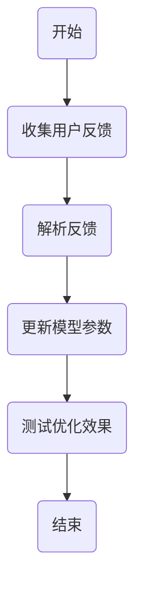
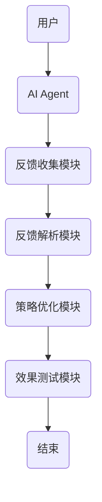

                 


# 基于用户反馈的AI Agent迭代优化流程

## 关键词：AI Agent，用户反馈，优化流程，强化学习，系统架构，算法原理

## 摘要：  
本文详细探讨了基于用户反馈的AI Agent迭代优化流程，从理论基础到实际应用，系统性地分析了如何通过用户反馈来提升AI Agent的性能和用户体验。文章首先介绍了AI Agent的基本概念和用户反馈的重要性，接着深入分析了反馈驱动的优化算法原理，包括强化学习机制和数学模型。随后，从系统架构设计、项目实战到优化与提升，全面阐述了基于用户反馈的AI Agent优化流程，最后总结了关键点和未来研究方向。

---

# 第一部分: 基于用户反馈的AI Agent基础

## 第1章: 问题背景与用户反馈的重要性

### 1.1 问题背景

#### 1.1.1 AI Agent的基本概念  
AI Agent（人工智能代理）是指能够感知环境、自主决策并执行任务的智能实体。它通过与环境交互，利用感知信息做出决策，并采取行动以实现目标。AI Agent广泛应用于推荐系统、智能助手、自动驾驶等领域。

#### 1.1.2 用户反馈在AI Agent中的作用  
用户反馈是用户对AI Agent行为或结果的评价，是优化AI Agent性能的重要依据。通过用户反馈，AI Agent能够不断调整其行为策略，提升用户体验和任务完成效率。

#### 1.1.3 问题解决的核心目标  
本文的核心目标是通过用户反馈优化AI Agent的行为策略，使其在实际应用中更加高效、智能和用户友好。

---

### 1.2 用户反馈的定义与特点

#### 1.2.1 用户反馈的定义  
用户反馈是指用户在与AI Agent交互过程中，对AI Agent的行为、结果或服务质量的评价。这些反馈可以是显式的（如评分、点击、点赞）或隐式的（如停留时间、行为模式）。

#### 1.2.2 用户反馈的核心属性特征对比表  
| 特性 | 显式反馈 | 隐式反馈 |  
|------|----------|----------|  
| 类型 | 文本、评分、点击 | 浏览时间、跳出率、行为轨迹 |  
| 优点 | 直观、易于解析 | 细致、反映真实用户需求 |  
| 缺点 | 程序复杂、用户负担重 | 需要推测用户意图 |  

#### 1.2.3 用户反馈的分类与场景  
用户反馈可以分为以下几类：  
1. **任务完成反馈**：用户对任务完成情况的评价。  
2. **服务质量反馈**：用户对AI Agent服务质量的评价。  
3. **行为偏好反馈**：用户对AI Agent行为方式的偏好。  

---

### 1.3 AI Agent与用户反馈的关系

#### 1.3.1 AI Agent的核心概念与原理  
AI Agent的核心概念包括感知、决策和行动。通过用户反馈，AI Agent可以不断调整其决策策略，优化行为模式。

#### 1.3.2 用户反馈在AI Agent中的位置  
用户反馈是AI Agent与用户交互的重要桥梁，是优化AI Agent行为策略的关键数据来源。

#### 1.3.3 用户反馈与AI Agent的交互流程  
用户与AI Agent的交互流程如下：  
1. 用户向AI Agent提出请求或任务。  
2. AI Agent根据当前策略执行任务。  
3. 用户对AI Agent的响应提供反馈。  
4. AI Agent根据反馈优化策略。  

---

## 第2章: 基于用户反馈的AI Agent优化算法原理

### 2.1 算法原理概述

#### 2.1.1 反馈驱动的优化流程  
反馈驱动的优化流程包括以下步骤：  
1. 收集用户反馈。  
2. 解析用户反馈。  
3. 更新AI Agent的模型参数。  
4. 测试优化效果。  

#### 2.1.2 基于反馈的强化学习机制  
强化学习是一种通过奖励机制优化行为的算法。在用户反馈驱动的强化学习中，用户反馈作为奖励信号，用于指导AI Agent的学习过程。

#### 2.1.3 用户反馈的特征提取与处理  
用户反馈的特征提取与处理是优化算法的关键步骤。通过自然语言处理（NLP）或统计方法，可以从用户反馈中提取有用的特征信息。

---

### 2.2 算法流程图



---

### 2.3 数学模型与公式

#### 2.3.1 反馈评分函数  
$$ f(r) = \sum_{i=1}^{n} w_i r_i $$  
其中，$w_i$ 是反馈特征 $i$ 的权重，$r_i$ 是反馈评分。

#### 2.3.2 基于反馈的优化目标函数  
$$ L = \lambda_1 L_{\text{reg}} + \lambda_2 L_{\text{cls}} + \lambda_3 L_{\text{feedback}} $$  
其中，$L_{\text{reg}}$ 是正则化项，$L_{\text{cls}}$ 是分类损失，$L_{\text{feedback}}$ 是反馈损失。

---

## 第3章: 基于用户反馈的AI Agent系统架构设计

### 3.1 系统架构概述

#### 3.1.1 系统功能设计  
系统功能设计包括用户反馈收集、反馈解析、策略优化和效果测试等模块。

#### 3.1.2 系统架构设计  
系统架构设计包括用户界面、反馈处理模块、优化算法模块和效果测试模块。

#### 3.1.3 系统交互设计  
系统交互设计包括用户与AI Agent的交互流程和反馈机制。

---

### 3.2 系统架构图



---

## 第4章: 基于用户反馈的AI Agent项目实战

### 4.1 项目环境搭建

#### 4.1.1 开发工具安装  
安装Python、TensorFlow、Keras等开发工具。

#### 4.1.2 数据集准备  
准备用户反馈数据集，包括用户行为数据和反馈评分数据。

---

### 4.2 核心代码实现

#### 4.2.1 反馈收集模块  
```python
def collect_feedback(users):
    feedback = []
    for user in users:
        rating = user.rate_agent()
        feedback.append(rating)
    return feedback
```

#### 4.2.2 反馈解析模块  
```python
def parse_feedback(feedback):
    parsed = []
    for f in feedback:
        parsed_f = process(f)
        parsed.append(parsed_f)
    return parsed
```

---

### 4.3 项目测试与优化

#### 4.3.1 测试结果分析  
分析测试结果，评估优化效果。

#### 4.3.2 优化策略调整  
根据测试结果，调整优化策略，进一步提升AI Agent性能。

---

## 第5章: 基于用户反馈的AI Agent优化与提升

### 5.1 优化策略

#### 5.1.1 基于反馈的策略调整  
通过用户反馈不断调整AI Agent的策略参数。

#### 5.1.2 基于反馈的模型优化  
优化AI Agent的模型参数，提升任务完成效率和用户体验。

---

### 5.2 性能提升与用户体验优化

#### 5.2.1 性能提升策略  
通过优化算法和硬件配置，提升AI Agent的运行效率。

#### 5.2.2 用户体验优化策略  
通过改进交互设计，提升用户对AI Agent的满意度。

---

## 第6章: 总结与展望

### 6.1 总结

#### 6.1.1 核心观点回顾  
本文详细探讨了基于用户反馈的AI Agent优化流程，从理论到实践，全面分析了优化方法和实现方案。

#### 6.1.2 关键点总结  
用户反馈是优化AI Agent行为策略的重要数据来源，基于反馈的强化学习是实现优化的核心算法。

---

### 6.2 未来研究方向

#### 6.2.1 新算法研究  
探索更高效的反馈驱动优化算法，提升AI Agent的智能水平。

#### 6.2.2 新应用场景  
拓展用户反馈在更多领域的应用，如教育、医疗、金融等。

---

## 作者：AI天才研究院/AI Genius Institute & 禅与计算机程序设计艺术 /Zen And The Art of Computer Programming

---

以上是基于用户反馈的AI Agent迭代优化流程的完整思考过程，涵盖了从理论到实践的各个方面，确保文章结构清晰、内容详实，为读者提供了全面的指导和参考。

