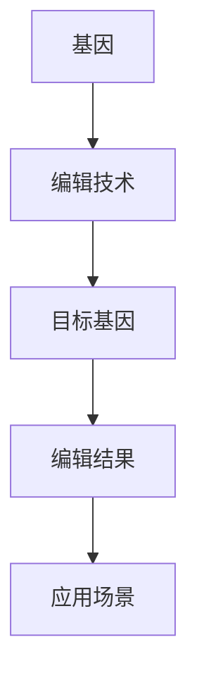
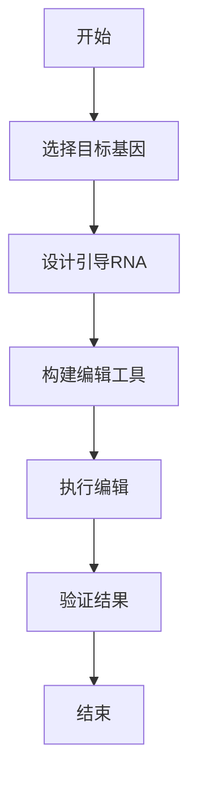

                 

# 基因编辑技术的伦理争议与投资风险

> 关键词：基因编辑技术，伦理争议，投资风险，CRISPR-Cas9，基因治疗，伦理审查

> 摘要：基因编辑技术作为一种革命性的生物技术，正在改变医学、农业和工业等多个领域。然而，其发展也引发了广泛的伦理争议和投资风险。本文将从技术原理、伦理问题、投资风险等方面进行系统分析，探讨基因编辑技术在实际应用中的伦理挑战和投资机遇。

---

## 第1章: 基因编辑技术的背景介绍

### 1.1 基因编辑技术的基本概念

#### 1.1.1 基因编辑技术的定义
基因编辑技术是指通过人工手段对生物体的基因组进行精确修改、删除或添加特定基因片段的技术。它利用分子工具对DNA序列进行操作，以实现对基因功能的调控或修复。

#### 1.1.2 基因编辑技术的核心要素
- **目标基因**：需要编辑的特定基因。
- **编辑工具**：如CRISPR-Cas9、TALENs等。
- **编辑结果**：对基因功能的影响，可能包括基因修复、增强或敲除。

#### 1.1.3 基因编辑技术的演进历程
从传统基因敲除技术到CRISPR-Cas9的出现，基因编辑技术经历了从低效到高效、从复杂到简单的演变，极大地推动了生物技术的发展。

---

### 1.2 基因编辑技术的应用领域

#### 1.2.1 医疗健康领域的应用
- **基因治疗**：用于治疗遗传性疾病，如镰刀型贫血症。
- **癌症治疗**：通过编辑免疫细胞基因，增强其识别癌细胞的能力。

#### 1.2.2 农业领域的应用
- **作物改良**：通过编辑植物基因，提高抗病性和产量。
- **动物改良**：用于改良畜牧业中的动物品种。

#### 1.2.3 工业领域的应用
- **工业微生物**：通过编辑微生物基因，提高其生产效率。

---

### 1.3 基因编辑技术的伦理问题

#### 1.3.1 伦理问题的背景
基因编辑技术的快速发展引发了伦理学家和社会对技术使用的广泛讨论，尤其是涉及人类基因编辑时。

#### 1.3.2 伦理争议的核心问题
- **人类基因编辑的伦理问题**：基因编辑可能导致人类基因的不可逆改变，引发“设计婴儿”等伦理争议。
- **公平性问题**：基因编辑技术可能加剧社会不平等，只有富裕阶层能够负担得起。

#### 1.3.3 伦理问题的边界与外延
- **治疗性编辑**：用于治疗疾病。
- **增强性编辑**：用于增强人体功能，引发伦理争议。

---

### 1.4 基因编辑技术的投资背景

#### 1.4.1 投资市场的现状
基因编辑技术吸引了大量投资，特别是在医疗健康和农业领域。

#### 1.4.2 投资风险的初步分析
- **技术风险**：基因编辑可能引发意外的副作用。
- **法律风险**：不同国家对基因编辑的法律规制不同。

#### 1.4.3 投资机会的潜力
基因编辑技术在医疗和农业领域的巨大潜力吸引了投资者。

---

## 第2章: 基因编辑技术的核心概念与联系

### 2.1 核心概念的原理分析

#### 2.1.1 基因编辑技术的原理
基因编辑技术通过特定的酶（如Cas9）和引导RNA（gRNA）结合，精准定位目标基因，并对其进行剪切或修复。

#### 2.1.2 基因编辑技术的关键步骤
1. 设计引导RNA。
2. 构建基因编辑工具。
3. 实施基因编辑。

#### 2.1.3 基因编辑技术的数学模型
基因编辑的效率可以用以下公式表示：
$$ \text{编辑效率} = \frac{\text{成功编辑的细胞数}}{\text{总细胞数}} \times 100\% $$

---

### 2.2 核心概念的属性特征对比

#### 2.2.1 不同基因编辑技术的对比
| 技术名称 | 编辑效率 | 精准度 | 操作复杂度 |
|----------|----------|--------|------------|
| CRISPR-Cas9 | 高 | 中 | 中 |
| TALENs | 中 | 高 | 高 |

#### 2.2.2 技术属性的特征分析
- **高效性**：CRISPR-Cas9操作简单，效率高。
- **精准性**：TALENs具有更高的精准度。

#### 2.2.3 技术效果的对比表格
| 技术效果 | CRISPR-Cas9 | TALENs |
|----------|-------------|--------|
| 基因敲除 | 高效 | 中等 |
| 基因修复 | 中等 | 高效 |

---

### 2.3 ER实体关系图架构

---

## 第3章: 基因编辑技术的算法原理讲解

### 3.1 算法原理的数学模型

#### 3.1.1 基因编辑的数学模型
$$ f(x) = \begin{cases} 
1 & \text{if } x \text{ 满足编辑条件} \\
0 & \text{otherwise}
\end{cases} $$

#### 3.1.2 基因编辑的流程图

---

## 第4章: 基因编辑技术的投资风险分析

### 4.1 投资风险的系统分析

#### 4.1.1 市场风险
- **技术不确定性**：基因编辑技术可能存在意外副作用。
- **市场需求**：市场需求的不确定性可能影响投资回报。

#### 4.1.2 财务风险
- **研发成本**：基因编辑技术的研发投入巨大。
- **收益周期**：技术转化周期长，回报不确定。

#### 4.1.3 法律风险
- **法律不确定性**：不同国家对基因编辑的法律规制不同。
- **专利纠纷**：基因编辑技术涉及复杂的专利问题。

#### 4.1.4 退出机制
- **上市退出**：通过将技术转化为产品并上市。
- **并购退出**：通过被大型企业并购退出。

---

## 第5章: 基因编辑技术的法律与监管

### 5.1 国际法规与伦理审查

#### 5.1.1 国际法规
- **欧盟**：对基因编辑技术实施严格的监管。
- **美国**：实行较为宽松的监管政策。

#### 5.1.2 伦理审查
- **伦理委员会**：对基因编辑项目进行伦理审查。
- **透明度**：要求公开基因编辑技术的应用情况。

---

## 第6章: 基因编辑技术的社会影响

### 6.1 社会接受度

#### 6.1.1 公众认知
- **知识普及**：公众对基因编辑技术的认知程度。
- **信任度**：公众对基因编辑技术的信任程度。

#### 6.1.2 媒体报道
- **媒体报道的影响**：正面或负面报道对公众认知的影响。

#### 6.1.3 文化差异
- **东西方差异**：不同文化对基因编辑技术的接受程度不同。

---

## 第7章: 基因编辑技术的未来展望

### 7.1 技术趋势

#### 7.1.1 技术优化
- **提高精准度**：进一步优化基因编辑技术的精准度。
- **减少副作用**：降低基因编辑的副作用。

#### 7.1.2 基因编辑与人工智能的结合
- **AI辅助设计**：利用人工智能辅助基因编辑工具的设计。
- **大数据分析**：通过大数据分析优化基因编辑效果。

---

## 第8章: 总结与建议

### 8.1 总结
基因编辑技术的快速发展带来了巨大的潜力，但也伴随着伦理和投资风险。未来，我们需要在技术创新与伦理约束之间找到平衡点。

### 8.2 建议
- **加强伦理审查**：确保基因编辑技术的使用符合伦理规范。
- **注重技术研发**：加大对基因编辑技术的研发投入。
- **关注法律问题**：关注基因编辑技术的法律规制，降低投资风险。

---

**作者：AI天才研究院/AI Genius Institute & 禅与计算机程序设计艺术 /Zen And The Art of Computer Programming**

---

通过以上目录大纲，我们可以看到基因编辑技术的伦理争议与投资风险涉及多个方面，需要从技术、伦理、法律等多个角度进行综合分析。

