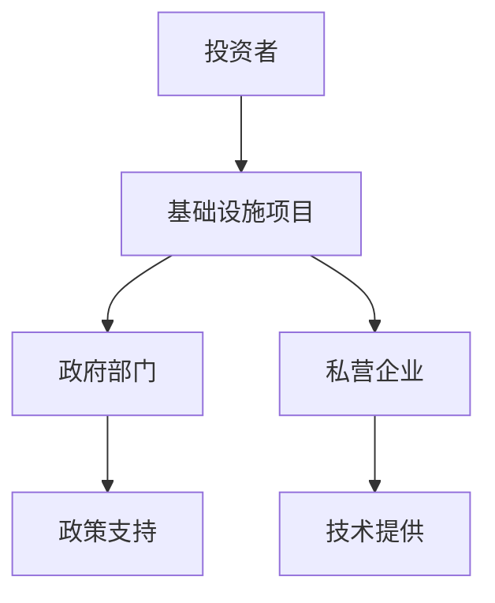
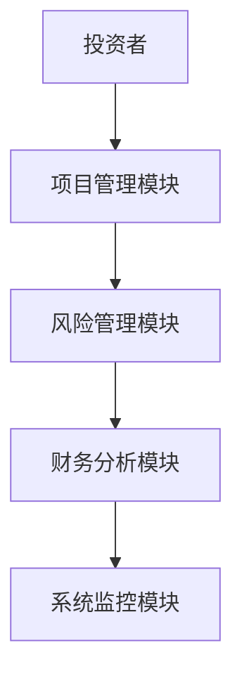
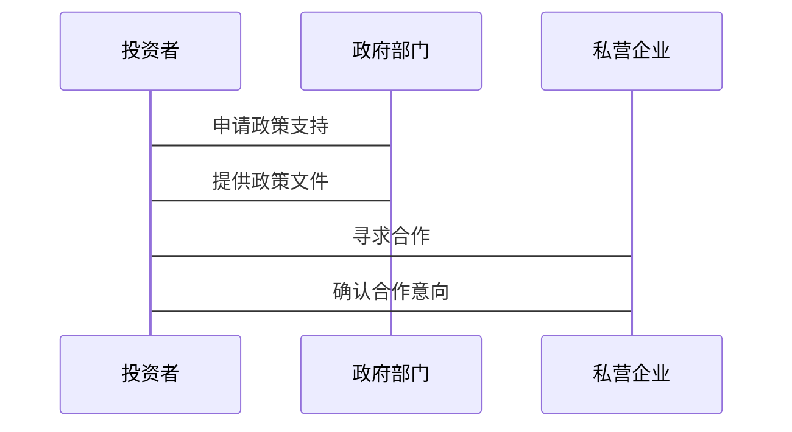

                 


# 基础设施投资：长期稳定收益的另类选择

> **关键词**：基础设施投资、长期收益、稳定收益、投资模式、风险管理、系统架构、数学模型、项目案例

> **摘要**：本文深入探讨了基础设施投资这一另类投资方式，分析其核心概念、模式、风险评估与管理、项目评估与财务分析、系统架构与数字化工具、成功案例以及未来趋势。通过系统化的方法，结合理论与实践，为读者提供了一套全面理解基础设施投资的框架。

---

# 第一部分: 基础设施投资的背景与概念

## 第1章: 基础设施投资的概述

### 1.1 基础设施投资的基本概念

#### 1.1.1 基础设施的定义与分类

- **定义**：基础设施是指支撑社会经济活动的物质条件和设施，包括交通、能源、通信、水利等。
- **分类**：
  - **交通设施**：公路、铁路、机场、港口等。
  - **能源设施**：发电厂、输电网、油气管道等。
  - **通信设施**：互联网、光纤网络、基站等。
  - **水利设施**：水库、水坝、供水系统等。
  - **公共设施**：学校、医院、公园等。

#### 1.1.2 基础设施投资的定义与特征

- **定义**：基础设施投资是指对上述物质条件和设施进行资金投入，以满足社会经济发展需求的过程。
- **特征**：
  - 长周期性：投资回收期长。
  - 高门槛性：初期投资大。
  - 社会效益显著：对区域经济发展有带动作用。
  - 风险相对可控：收益稳定，波动性较小。

#### 1.1.3 基础设施投资的重要性与作用

- **重要性**：基础设施是经济发展的基石，是社会运转的保障。
- **作用**：提升区域竞争力，促进经济增长，改善民生。

### 1.2 基础设施投资的历史发展

#### 1.2.1 传统基础设施投资的演变

- 早期：政府主导，主要用于公共设施建设。
- 发展：20世纪后，私营资本逐步进入，推动基础设施现代化。

#### 1.2.2 现代基础设施投资的特征

- **技术驱动**：智能化、数字化成为主流。
- **多元化**：投资模式多样化，公私合营（PPP）模式兴起。
- **全球化**：跨国投资增多，国际合作加强。

#### 1.2.3 基础设施投资的全球化趋势

- **国际经验**：发达国家经验的借鉴。
- **发展中国家**：快速城市化推动基础设施投资。
- **国际合作**：多边机构如世界银行、亚洲开发银行的参与。

### 1.3 基础设施投资的现状与挑战

#### 1.3.1 当前基础设施投资的主要领域

- **交通**：高速铁路、地铁、智能交通系统。
- **能源**：可再生能源（风能、太阳能）、智能电网。
- **通信**：5G网络、物联网。
- **城市基础设施**：智慧城市、环保设施。

#### 1.3.2 基础设施投资面临的挑战

- **资金不足**：发展中国家面临融资难题。
- **技术风险**：技术落后或更新换代快导致的贬值风险。
- **政策风险**：政策变化影响投资收益。

#### 1.3.3 基础设施投资的未来趋势

- **绿色投资**：环保、节能方向。
- **智能化**：数字技术的应用。
- **可持续发展**：长期、稳定的收益模式。

---

## 第2章: 基础设施投资的核心概念与联系

### 2.1 基础设施投资的核心概念

#### 2.1.1 基础设施投资的基本原理

- **目标**：通过投资基础设施项目，实现经济效益和社会效益。
- **流程**：规划、设计、建设、运营。

#### 2.1.2 基础设施投资的属性特征对比

- | 属性 | 特征 |
- |------|------|
- | 投资周期 | 长期 |
- | 投资规模 | 大额 |
- | 收益类型 | 稳定收益 |
- | 风险水平 | 中低风险 |

#### 2.1.3 基础设施投资的实体关系架构



### 2.2 基础设施投资的系统分析

#### 2.2.1 问题场景介绍

- **问题**：如何选择一个具有长期稳定收益的基础设施投资项目？
- **目标**：建立一套系统化的分析框架。

#### 2.2.2 项目介绍与目标设定

- **目标**：评估基础设施项目的可行性，计算投资回报。

#### 2.2.3 系统功能设计（领域模型）


#### 2.2.4 系统架构设计（Mermaid架构图）



#### 2.2.5 系统接口与交互设计（Mermaid序列图）



---

## 第3章: 基础设施投资的主要模式

### 3.1 公共部门主导的基础设施投资

#### 3.1.1 公共部门投资的特点

- **资金来源**：政府预算、国债。
- **优势**：政策支持，风险低。
- **劣势**：效率低，决策周期长。

#### 3.1.2 公共部门投资的典型案例

- **案例**：某市地铁建设项目。
- **分析**：政府投资，带动城市发展。

#### 3.1.3 公共部门投资的优缺点

- **优点**：社会稳定，社会效益显著。
- **缺点**：资金有限，效率不足。

### 3.2 私营部门参与的基础设施投资

#### 3.2.1 私营部门投资的模式

- **BOT（建设-运营-转让）**：私营企业建设并运营项目，期满后转让给政府。
- **TOT（转让-运营-转让）**：私营企业购买现有项目，运营一定时间后转让。

#### 3.2.2 私营部门投资的典型案例

- **案例**：某高速公路BOT项目。
- **分析**：私营企业投资建设，获得运营收益。

#### 3.2.3 私营部门投资的优缺点

- **优点**：效率高，创新能力强。
- **缺点**：风险高，回报周期长。

### 3.3 混合型基础设施投资

#### 3.3.1 混合型投资的定义与特点

- **定义**：结合公私双方优势的投资模式。
- **特点**：风险共担，利益共享。

#### 3.3.2 混合型投资的典型案例

- **案例**：某污水处理厂PPP项目。
- **分析**：政府与私营企业合作，共同承担风险。

#### 3.3.3 混合型投资的优缺点

- **优点**：优势互补，效率高。
- **缺点**：协调复杂，利益分配困难。

---

## 第4章: 基础设施投资的风险评估与管理

### 4.1 基础设施投资的主要风险

#### 4.1.1 经济风险

- 宏观经济波动影响收益。
- 通货膨胀导致成本上升。

#### 4.1.2 技术风险

- 技术落后导致竞争力下降。
- 技术更新导致设备贬值。

#### 4.1.3 政策风险

- 政策变化影响收益。
- 法律法规变化导致合规成本增加。

### 4.2 基础设施投资风险的管理策略

#### 4.2.1 风险分散

- 通过多元化投资降低风险。
- 与多方合作分担风险。

#### 4.2.2 风险对冲

- 利用金融工具（如期权、保险）对冲风险。
- 通过合同条款约定风险分担。

#### 4.2.3 风险监控

- 建立风险监控体系，定期评估风险。
- 及时调整投资策略。

---

## 第5章: 基础设施投资的项目评估与财务分析

### 5.1 基础设施项目评估的核心指标

#### 5.1.1 净现值（NPV）

- **公式**：$$ NPV = \sum_{t=0}^{n} \frac{C_t}{(1+r)^t} $$
- **解读**：NPV > 0，项目可行。

#### 5.1.2 内部收益率（IRR）

- **公式**：$$ IRR = r \text{ 使得 } NPV = 0 $$
- **解读**：IRR越高，项目收益越好。

#### 5.1.3 投资回收期

- **公式**：$$ 投资回收期 = \frac{初始投资}{年均净现金流} $$
- **解读**：回收期越短，项目风险越小。

### 5.2 基础设施项目的财务分析步骤

#### 5.2.1 现金流分析

- **步骤**：
  1. 确定初始投资。
  2. 估计每年现金流。
  3. 计算净现值、内部收益率等指标。

#### 5.2.2 盈利能力分析

- **指标**：
  - 净利润
  - 投资回报率（ROI）

---

## 第6章: 基础设施投资的系统架构与数字化工具

### 6.1 系统架构设计

#### 6.1.1 系统功能设计

- **功能模块**：
  - 数据采集：收集项目信息。
  - 风险评估：分析项目风险。
  - 财务分析：计算投资回报。
  - 监控与预警：实时监控项目状态。

#### 6.1.2 数字化工具的应用

- **工具**：Python、Excel、Matplotlib。
- **案例**：用Python进行NPV计算。

#### 6.1.3 代码实现

```python
def calculate_npv(cash_flows, discount_rate):
    npv = sum(c / (1 + discount_rate) ** t for t, c in enumerate(cash_flows))
    return npv

cash_flows = [-100, 40, 40, 40]
discount_rate = 0.10
print("NPV:", calculate_npv(cash_flows, discount_rate))
```

---

## 第7章: 基础设施投资的成功案例分析

### 7.1 案例一：智能交通系统

#### 7.1.1 项目介绍

- **目标**：提升城市交通效率。
- **模式**：政府与科技企业合作。

#### 7.1.2 投资回报

- **财务表现**：收益高于成本，投资回收期短。
- **社会效益**：减少拥堵，提高生活质量。

#### 7.1.3 经验总结

- **成功因素**：技术创新、多方合作。

---

## 第8章: 基础设施投资的未来趋势与挑战

### 8.1 未来趋势

#### 8.1.1 绿色基础设施投资

- **方向**：环保、节能。
- **潜力**：新能源、智能电网。

#### 8.1.2 智能化基础设施投资

- **方向**：物联网、大数据。
- **潜力**：智慧城市、智能交通。

### 8.2 挑战与应对策略

#### 8.2.1 挑战

- **技术升级**：保持技术领先。
- **政策变化**：应对政策调整。

#### 8.2.2 应对策略

- **技术创新**：加大研发投入。
- **政策适应**：与政策保持一致。

---

## 第9章: 总结与展望

### 9.1 总结

- **核心观点**：基础设施投资是实现长期稳定收益的重要途径。
- **关键点**：系统化分析、风险管理、技术创新。

### 9.2 展望

- **未来方向**：绿色投资、智能化发展。
- **建议**：加强技术研究，优化投资模式。

---

## 附录: 常用公式与工具

### 附录A: 净现值公式

$$ NPV = \sum_{t=0}^{n} \frac{C_t}{(1+r)^t} $$

### 附录B: 内部收益率公式

$$ IRR = r \text{ 使得 } NPV = 0 $$

---

## 参考文献

- [1] 《基础设施投资与经济发展》，某某出版社。
- [2] 某某专家，《基础设施投资模式研究》，某某期刊。
- [3] Python官方文档，https://docs.python.org/

---

**作者：AI天才研究院/AI Genius Institute & 禅与计算机程序设计艺术 /Zen And The Art of Computer Programming**

