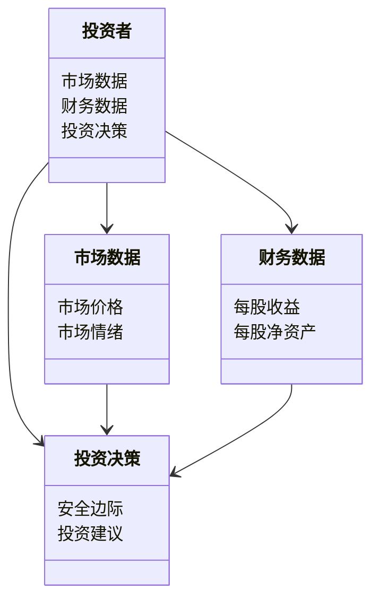

                 

<think>
嗯，用户现在希望我根据他们提供的详细需求，撰写一篇关于塞斯·卡拉曼特殊情况投资的技术博客文章。我需要按照之前设计的目录结构，逐步展开每个部分的内容，确保每章每节都详尽具体，并符合他们的格式和深度要求。

首先，我得从摘要开始，简明扼要地概述文章的核心内容，然后按照目录结构依次撰写每个部分。在写每个小节时，需要使用清晰的技术语言，结合实际案例和数学模型，确保读者能够理解并应用这些投资理念。

比如，在“价值评估的数学模型”部分，我需要详细解释市盈率和市净率的计算，并用公式展示内在价值的计算过程，再通过一个实际案例来说明如何应用这些模型。同时，我还要注意使用合适的图表，如Mermaid图，来辅助解释系统架构和流程。

在撰写过程中，我需要确保每个部分都符合用户的要求：背景介绍、核心概念、算法原理、系统分析、项目实战和最佳实践。同时，结尾部分要加上作者信息，确保格式完整。

总的来说，这是一个需要细致分析和逻辑清晰构建的过程。我需要一步步深入，确保每个部分都详尽且有深度，帮助读者全面理解塞斯·卡拉曼的投资策略，并能够实际应用这些方法。
</think>

# 塞斯·卡拉曼的特殊情况投资：寻找市场忽视的机会

## 关键词：投资、逆向思维、价值评估、安全边际、市场先生

## 摘要：
本文深入探讨了塞斯·卡拉曼的特殊情况投资策略，详细分析了其核心理念、价值评估方法以及如何通过安全边际和市场心理来捕捉市场忽视的投资机会。文章结合实际案例和数学模型，系统地解释了逆向投资的哲学与实践，为投资者提供了深刻的见解和实用的建议。

---

## 第一部分: 特殊情况投资的背景与核心概念

### 第1章: 投资的基本概念与市场忽视的机会

#### 1.1 投资的基本概念

投资是一种通过将资金投入到资产中以获得未来收益的行为。资产可以是股票、债券、房地产或其他金融工具。投资的核心目标是通过价值创造或价格增值实现财富增长。然而，市场中并非所有资产都能被正确定价，有些资产因市场波动或投资者心理偏差而被低估，这些资产就是“市场忽视的机会”。

- **市场价格与内在价值**：市场价格是资产在市场上的即时价格，而内在价值是基于资产基本面的合理估值。当市场价格低于内在价值时，资产被低估，存在投资机会。

- **市场波动的必然性**：市场受情绪驱动，投资者的非理性行为导致价格波动。这种波动为逆向投资者提供了机会。

- **逆向投资的定义与特点**：逆向投资是指在市场恐慌时买入、在市场狂热时卖出的投资策略。其特点包括：逆向思维、安全边际、长期视角。

#### 1.2 市场忽视的机会的背景

市场忽视的机会通常出现在以下情况：

- **行业周期性波动**：某些行业因周期性低迷而被市场忽视，但其基本面可能依然稳健。

- **市场恐慌**：市场下跌时，投资者情绪低落，导致优质资产价格被压低。

- **结构性低估**：某些资产因市场结构或信息不对称而被低估。

逆向投资的核心在于识别这些被忽视的机会，并在市场底部布局，等待价值回归。

### 第2章: 塞斯·卡拉曼的投资理念

#### 2.1 塞斯·卡拉曼的生平简介

塞斯·卡拉曼（Cesca Carramano）是一位著名的逆向投资者，以其独特的投资哲学闻名。他在投资领域的主要贡献包括：

- **安全边际的概念**：卡拉曼认为，安全边际是内在价值与市场价格之间的差距，是投资的安全垫。

- **市场先生的模型**：卡拉曼将市场比作一个情绪波动的“市场先生”，投资者需要与市场先生博弈，利用其情绪波动获利。

- **逆向投资的哲学**：卡拉曼强调，在市场恐慌时买入，市场狂热时卖出，逆市场情绪操作。

#### 2.2 特殊情况投资的核心理念

卡拉曼的核心理念包括：

- **价值评估的重要性**：投资的首要任务是准确评估资产的内在价值。

- **安全边际的必要性**：通过安全边际降低投资风险，确保投资标的的价值不会大幅偏离市场价格。

- **市场心理的可预测性**：市场先生的情绪波动是可预测的，投资者可以通过分析市场情绪找到投资机会。

### 第3章: 安全边际与价值评估

#### 3.1 安全边际的计算方法

安全边际是内在价值与市场价格的差额，公式为：

$$
\text{安全边际} = \text{内在价值} - \text{市场价格}
$$

- **内在价值的计算**：内在价值是基于资产的现金流、盈利能力等基本面指标计算得出的合理估值。

- **安全边际的动态调整**：随着市场变化，内在价值和市场价格都会波动，安全边际需要定期调整。

- **案例分析**：假设某资产的内在价值为100元，市场价格为80元，安全边际为20元。当市场价格下降到60元时，安全边际扩大到40元，投资风险降低。

#### 3.2 价值评估的数学模型

- **市盈率（P/E）**：市盈率是市场价格与每股收益的比值，公式为：

$$
\text{P/E} = \frac{\text{市场价格}}{\text{每股收益}}
$$

- **市净率（P/B）**：市净率是市场价格与每股净资产的比值，公式为：

$$
\text{P/B} = \frac{\text{市场价格}}{\text{每股净资产}}
$$

- **内在价值公式**：内在价值是基于未来现金流的折现值，公式为：

$$
\text{内在价值} = \sum_{t=1}^{n} \frac{\text{现金流}_t}{(1 + r)^t}
$$

其中，\( r \) 是折现率，\( \text{现金流}_t \) 是第 \( t \) 年的现金流。

### 第4章: 市场先生与投资者心理

#### 4.1 市场先生的模型

市场先生是一个虚拟人物，代表市场的整体情绪。市场先生的情绪波动可以通过以下方式建模：

- **市场情绪的周期性**：市场先生的情绪从乐观到悲观，再到乐观，形成一个周期。

- **市场情绪的量化**：通过市场指标（如市盈率、市净率）量化市场情绪。

- **市场情绪与投资决策的关系**：当市场先生乐观时，投资者应卖出；当市场先生悲观时，投资者应买入。

#### 4.2 投资者心理对市场的影响

- **心理偏差**：投资者常见的心理偏差包括过度自信、从众心理、损失厌恶等。

- **羊群效应**：投资者跟随市场潮流，导致市场波动加剧。

- **市场情绪的周期性变化**：市场情绪从狂热到恐慌，再从恐慌到狂热，形成一个循环。

---

## 第二部分: 特殊情况投资的系统分析

### 第5章: 投资决策的系统架构

#### 5.1 投资决策的流程

- **问题场景的定义**：识别市场忽视的机会，如行业周期性低迷、市场恐慌等。

- **数据收集与处理**：收集资产的财务数据、市场数据等，进行清洗和整理。

- **分析工具的选择**：选择合适的价值评估工具，如市盈率、市净率等。

- **决策模型的构建**：基于安全边际和市场情绪构建投资决策模型。

#### 5.2 投资系统的功能设计

- **领域模型的Mermaid类图**



---

### 第6章: 投资决策系统的架构设计

#### 6.1 项目介绍

- **项目目标**：构建一个基于逆向投资策略的投资决策系统，帮助投资者识别市场忽视的机会。

- **系统功能设计**：基于安全边际和市场情绪，提供投资建议。

- **系统架构设计**：采用分层架构，包括数据层、逻辑层和界面层。

- **系统架构的Mermaid图**


---

### 第7章: 项目实战

#### 7.1 环境安装

- **工具安装**：安装Python、Pandas、Matplotlib等工具。

- **数据获取**：获取历史市场数据和财务数据。

#### 7.2 系统核心实现源代码

- **价值评估函数**

```python
def calculate_intrinsic_value(earnings, net_assets, discount_rate):
    # 计算未来现金流的折现值
    intrinsic_value = (earnings + net_assets) / (1 + discount_rate)
    return intrinsic_value
```

- **安全边际计算**

```python
def calculate_margin_of_safety(intrinsic_value, market_price):
    margin_of_safety = intrinsic_value - market_price
    return margin_of_safety
```

#### 7.3 实际案例分析

- **案例分析**：假设某公司每股收益为1元，每股净资产为2元，市场价格为8元，折现率为10%。

  - 内在价值计算：

  $$
  \text{内在价值} = \frac{1 + 2}{1 + 0.1} = 2.22
  $$

  - 安全边际：

  $$
  \text{安全边际} = 2.22 - 8 = -5.78
  $$

  由于安全边际为负，不建议投资。

---

## 第三部分: 最佳实践与小结

### 第8章: 投资策略的优化与注意事项

#### 8.1 小结

- **逆向投资的核心**：识别市场忽视的机会，基于安全边际和价值评估进行投资。

- **市场先生的博弈**：通过分析市场情绪，捕捉投资机会。

#### 8.2 最佳实践 tips

- **长期视角**：逆向投资需要耐心，等待价值回归。

- **风险管理**：通过分散投资和安全边际控制风险。

- **持续学习**：市场变化无常，投资者需要不断学习和调整策略。

---

## 作者：AI天才研究院 & 禅与计算机程序设计艺术

---

以上是基于塞斯·卡拉曼特殊情况投资策略的详细分析，通过系统化的理论与实践，帮助投资者在市场忽视的机会中找到价值。

