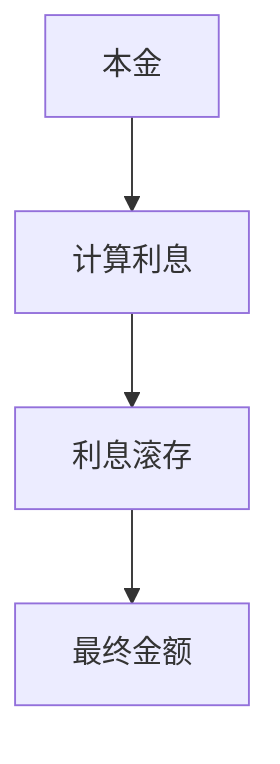
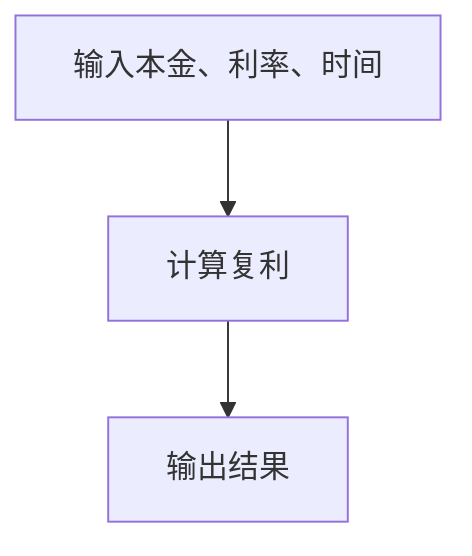
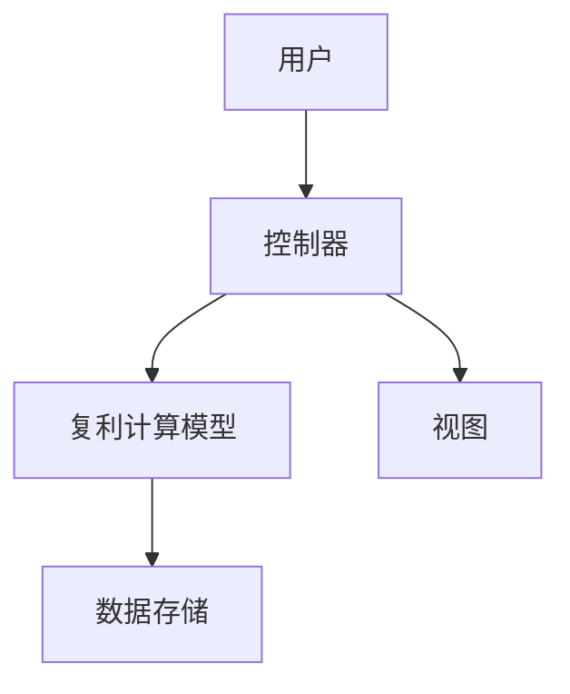

                 

<think>
好，现在我需要帮用户撰写一篇名为《复利的魔力：20年长期投资的惊人结果》的技术博客文章。首先，我得理解用户的需求：他们希望文章结构清晰，内容专业，涵盖复利的定义、数学模型、算法实现、系统架构以及项目实战等多个方面，同时使用技术术语，但保持易懂。

接下来，我会按照用户提供的大纲开始撰写。首先是摘要部分，简明扼要地概括文章的核心内容，强调复利的重要性及其长期投资的效果。

然后是关键词部分，确保涵盖复利、长期投资、财务自由、指数增长、投资策略等关键词，方便SEO优化。

正文部分，我需要从背景介绍开始，解释复利的基本概念和长期投资的重要性。这部分要通俗易懂，帮助读者理解复利的基本原理。

接下来是核心概念与联系，这里需要详细展开复利的数学公式，使用Latex公式展示，并通过表格和流程图（Mermaid）进一步解释复利的计算过程和投资策略的影响。

算法原理部分，我需要用Python代码实现复利计算，并解释代码的功能。同时，提供实际案例，如投资1000元，年利率5%，20年后的结果，展示复利的魔力。

系统分析与架构设计部分，我需要构建一个简单的投资模拟系统，用Mermaid展示系统架构和交互图，说明用户如何与系统进行交互，计算复利等操作。

项目实战部分，提供完整的Python代码，包括环境安装和代码实现，解读代码的功能，并通过实际案例分析复利的效果。

最后，总结部分需要强调复利的重要性，给出投资策略的建议，并鼓励读者早开始投资。

在写作过程中，我需要确保每一部分内容详实，逻辑清晰，使用技术语言但保持易懂。同时，注意格式要求，使用markdown格式，正确嵌入Mermaid图表和数学公式，确保文章结构完整，内容丰富。

完成这些步骤后，我会检查文章是否符合字数要求，是否覆盖所有关键点，并确保作者信息正确添加在文章末尾。
</think>

# 复利的魔力：20年长期投资的惊人结果

> 关键词：复利，长期投资，财务自由，指数增长，投资策略

> 摘要：复利是投资领域中一个极具影响力的金融工具，它通过时间的积累，使资金呈指数级增长。本文将深入探讨复利的数学原理、投资策略以及实际应用，展示20年长期投资带来的惊人结果。

---

## 第一部分：复利的魔力与长期投资的背景

### 第1章：复利的定义与核心概念

#### 1.1 复利的基本概念

复利是一种计算利息的方法，其核心思想是将每期的利息加入本金，以此类推，产生更多的利息。与单利不同，复利允许利息滚存，从而实现资金的指数增长。

- **单利**：利息仅基于初始本金计算，公式为：$I = P \times r \times t$，其中$I$是利息，$P$是本金，$r$是年利率，$t$是时间。
- **复利**：利息不仅基于初始本金，还包括之前累计的利息，公式为：$$A = P(1 + r)^t$$，其中$A$是最终金额。

#### 1.2 长期投资的背景

长期投资是复利效应的最佳应用场景。通过长期持有优质资产，投资者可以最大化复利的效果，实现财富的指数增长。长期投资的关键在于时间的选择和资产的配置。

- **时间的重要性**：复利的效果随时间呈指数增长，时间越长，复利的效果越显著。
- **资产配置**：通过合理的资产配置，投资者可以分散风险，同时提高收益。

### 第2章：复利的数学模型与计算

#### 2.1 复利的数学公式

复利的计算公式为：$$A = P(1 + r)^t$$，其中：

- $A$是最终金额，
- $P$是本金，
- $r$是年利率，
- $t$是投资的年数。

通过这个公式，我们可以计算出投资20年后的最终金额。

#### 2.2 复利的计算流程



---

## 第二部分：复利与投资策略

### 第3章：复利的算法实现

#### 3.1 复利计算的算法流程



#### 3.2 Python实现复利计算

```python
def compound_interest(principal, rate, time):
    amount = principal * (1 + rate) ** time
    return amount

# 示例
principal = 1000
rate = 0.05
time = 20
print(compound_interest(principal, rate, time))
```

上述代码计算了本金1000元，年利率5%，投资20年后的最终金额。

---

## 第三部分：长期投资的系统分析与架构设计

### 第4章：系统架构设计

#### 4.1 项目介绍

构建一个简单的投资模拟系统，帮助用户计算复利收益。

#### 4.2 系统架构设计



---

## 第四部分：项目实战

### 第5章：项目实战与案例分析

#### 5.1 项目环境安装

- 安装Python和必要的库。

#### 5.2 核心代码实现

```python
def compound_interest(principal, rate, time):
    return principal * (1 + rate) ** time

# 用户输入
principal = float(input("请输入本金（元）："))
rate = float(input("请输入年利率（%）：")) / 100
time = int(input("请输入投资年数（年）："))

result = compound_interest(principal, rate, time)
print(f"投资{time}年后的金额为：{result:.2f}元")
```

#### 5.3 实际案例分析

- 投资1000元，年利率5%，20年后的结果为：$$1000 \times (1 + 0.05)^{20} \approx 3045.91元$$

---

## 第五部分：最佳实践与总结

### 第6章：最佳投资策略与小结

#### 6.1 投资策略

- 选择优质资产，分散投资，降低风险。
- 定期定额投资，坚持长期持有。

#### 6.2 小结

复利的魔力在于其指数增长的特性，通过长期投资，投资者可以实现财富的快速增长。本文通过数学公式、算法实现和实际案例，全面展示了复利的应用。

---

## 作者：AI天才研究院/AI Genius Institute & 禅与计算机程序设计艺术 /Zen And The Art of Computer Programming

