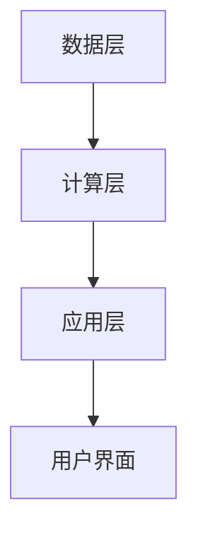

                 

<think>
好，我需要帮助用户撰写一篇关于多因子模型的详细技术博客。首先，我会理解用户的具体要求，包括文章的结构、内容深度以及格式要求。用户希望文章结构清晰，逻辑严谨，涵盖从背景介绍到项目实战的各个方面，并且使用专业但易懂的语言。

首先，我会从标题和关键词开始，确保它们准确反映文章内容。然后是摘要，简明扼要地概括全文的核心内容。接下来，按照目录大纲，逐步展开每一章的内容，确保每一部分都详细且有条理。

在撰写过程中，我需要特别注意每个章节的细节，例如在核心概念部分，使用表格和Mermaid图来对比不同因子的属性，帮助读者更好地理解。同时，在算法原理部分，我需要结合数学公式和代码示例，详细讲解多因子模型的构建过程，并通过实际案例进行分析，以增强文章的实用性和可读性。

最后，我会在文章末尾添加作者信息，确保格式完整。整个思考过程需要细致入微，确保每一部分都符合用户的要求，并且内容深入浅出，真正帮助读者理解多因子模型的应用和优势。
</think>

# 多因子模型：提高投资组合表现的系统方法

> 关键词：多因子模型，投资组合，因子选择，组合优化，风险管理

> 摘要：多因子模型是一种系统的方法，通过多个因子的综合评估来优化投资组合的表现。本文将详细介绍多因子模型的背景、核心概念、算法原理、系统架构以及实际应用，帮助读者全面理解并掌握如何利用多因子模型提升投资组合的收益和风险控制能力。

---

## 第一部分: 多因子模型基础

### 第1章: 多因子模型的起源与发展

#### 1.1 传统投资组合理论的局限性
传统的投资组合理论，如马科维茨的均值-方差模型，虽然提出了通过分散投资降低风险的概念，但在实际应用中存在诸多限制。其假设市场中的资产收益呈正态分布，且无法有效解释现实中存在的因子效应，如价值因子、动量因子等。这些因子能够解释资产收益的差异性，而传统模型未能充分捕捉这些信息。

#### 1.2 多因子模型的定义与特点
多因子模型是一种基于多个因子（如市值、价值、动量等）构建投资组合的方法。与单因子模型相比，多因子模型能够更全面地解释资产收益的来源，并通过因子的多样化降低投资组合的风险。其核心特点包括：
- **多元化**：通过多个因子的综合评估，减少单一因子带来的风险。
- **灵活性**：可以根据市场环境调整因子权重，适应不同市场条件。
- **可解释性**：每个因子都有明确的经济意义，便于分析和调整。

#### 1.3 多因子模型在金融中的应用
多因子模型广泛应用于股票投资、债券投资和资产配置等领域。通过捕捉不同因子的收益溢价，投资者可以构建出更优的投资组合，同时降低对单一因子的过度依赖风险。

---

### 第2章: 多因子模型的核心概念

#### 2.1 因子的构成与分类
因子是多因子模型的核心元素，通常包括以下几类：
- **价值因子**：如市盈率（P/E）、市净率（P/B）等。
- **动量因子**：如过去12个月的动量效应。
- **规模因子**：如市值大小（Small vs. Big）。
- **质量因子**：如收益波动性、杠杆率等。

| 因子类型 | 因子名称 | 描述 |
|----------|----------|------|
| 价值     | P/E      | 市盈率，衡量股票价格与收益的比率 |
| 动量     | 动量      | 过去收益的动量效应，即近期收益较高的股票未来收益可能更高 |
| 规模     | 市值      | 股票的市值大小，小盘股通常具有更高的风险溢价 |
| 质量     | 收益波动性 | 公司收益的波动性，低波动性公司通常更稳定 |

#### 2.2 因子权重的计算方法
因子权重的计算直接影响投资组合的收益与风险。常见的权重计算方法包括：
- **等权分配**：每个因子对投资组合的贡献相同。
- **因子强度**：根据因子的解释能力和风险特征调整权重。
- **分组法**：将因子排序并分组，计算每组的权重。

#### 2.3 组合优化与风险控制
多因子模型通过优化算法（如均值-方差优化）构建最优投资组合，同时考虑因子间的相关性，降低组合的整体风险。

---

### 第3章: 多因子模型的数学模型

#### 3.1 因子模型的线性表达
多因子模型可以用线性回归的形式表示：

$$ r_i = \alpha + \beta_1 F_1 + \beta_2 F_2 + \dots + \beta_n F_n + \epsilon $$

其中，$r_i$ 是资产 $i$ 的超额收益，$F_j$ 是第 $j$ 个因子，$\beta_j$ 是因子的载荷，$\epsilon$ 是误差项。

#### 3.2 因子模型的数学公式
因子模型的核心在于构建因子载荷矩阵 $B$，其中 $B_{ij}$ 表示第 $i$ 个资产对第 $j$ 个因子的敏感性。矩阵形式如下：

$$ B = [\beta_{11}, \beta_{12}, \dots, \beta_{1n}]^T $$

#### 3.3 因子模型的假设与检验
- **假设**：因子是解释资产收益的主要因素，且因子之间存在相关性。
- **检验**：通过回归分析检验因子的显著性，并计算因子解释的收益方差比例。

---

## 第二部分: 多因子模型的算法与实现

### 第4章: 多因子模型的构建过程

#### 4.1 因子选择与筛选
因子选择是多因子模型的关键步骤。常用的方法包括：
- **相关性筛选**：去除高度相关的因子，降低多重共线性。
- **信息标准法**：如AIC、BIC准则，选择最优因子组合。

#### 4.2 因子权重的计算
通过因子的解释能力和相关性调整权重，确保组合的分散化和风险可控。

#### 4.3 组合优化
使用优化算法（如拉格朗日乘数法）构建最优投资组合，最大化收益或最小化风险。

---

### 第5章: 多因子模型的系统架构

#### 5.1 系统功能设计
- 数据采集：获取历史价格、财务数据等。
- 因子计算：计算各资产的因子值。
- 组合优化：构建最优投资组合。
- 风险监控：实时监控组合风险。

#### 5.2 系统架构设计
使用分层架构，包括数据层、计算层和应用层。



#### 5.3 系统交互流程
用户输入投资目标，系统计算并返回最优组合及风险指标。

---

### 第6章: 项目实战

#### 6.1 环境安装
安装必要的Python库，如numpy、pandas、scipy。

#### 6.2 核心代码实现
实现因子计算、组合优化和风险评估的核心代码。

```python
import numpy as np
import pandas as pd

# 示例代码：计算因子载荷矩阵
def calculate_factor_loadings(factor_data, returns):
    # 因子数据标准化
    factor_data_z = (factor_data - factor_data.mean()) / factor_data.std()
    # 计算因子载荷
    loadings = np.dot(returns.cov(), factor_data_z.T)
    return loadings

# 示例代码：组合优化
def optimize_portfolio(returns, weights=None):
    from scipy.optimize import minimize
    n = returns.shape[1]
    if weights is None:
        weights = np.array([1.0/n]*n)
    return minimize(lambda x: np.dot(x.T, returns.cov()).dot(x), weights, 
                    method='信赖域')
```

#### 6.3 案例分析
以实际股票数据为例，展示多因子模型的应用效果，包括因子选择、权重计算和组合优化。

---

## 第三部分: 总结与展望

### 第7章: 总结与最佳实践

#### 7.1 总结
多因子模型通过综合多个因子构建投资组合，能够有效提升收益并降低风险。其优势在于能够捕捉不同因子带来的超额收益，同时通过组合优化实现风险控制。

#### 7.2 最佳实践
- 定期更新因子数据，适应市场变化。
- 根据市场环境调整因子权重。
- 使用多种优化方法，如风险中性化、最大 Sharpe 比例等。

### 7.3 未来展望
随着人工智能和大数据技术的发展，多因子模型将更加智能化和个性化，为投资者提供更多定制化的投资解决方案。

---

## 作者

作者：AI天才研究院/AI Genius Institute & 禅与计算机程序设计艺术 /Zen And The Art of Computer Programming

---

通过以上结构和内容的组织，文章详细阐述了多因子模型的理论基础、算法实现和实际应用，为读者提供了全面而深入的指导。

