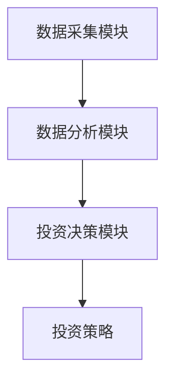

                 

<think>
好的，我现在需要帮助用户设计一个关于多时间框架分析的详细目录大纲。用户希望这本技术博客文章能够结合短期、中期和长期的视角来制定投资决策，并且要求结构紧凑、逻辑清晰，同时包含背景介绍、理论基础、算法、系统设计和实战等内容。

首先，我会从背景介绍开始。第一章应该涵盖多时间框架分析的基本概念和重要性，帮助读者理解为什么需要这种分析方法。接着，我需要详细讲解每个时间框架的特点，包括短期、中期和长期的分析要素和驱动因素。

接下来，理论基础部分应该包括技术分析和基本面分析，这两个是多时间框架分析的重要支柱。我需要解释这些分析方法在不同时间框架中的应用，并说明如何将它们结合起来制定投资策略。

然后，算法和数学模型是关键部分。我需要介绍时间序列分析（如ARIMA模型）和蒙特卡洛模拟，详细讲解它们的原理、步骤和应用场景。同时，使用mermaid图表和latex公式来增强内容的可视化和数学严谨性。

系统分析与架构设计部分，我需要构建一个多时间框架分析的系统，包括领域模型和架构图，展示系统的组成部分和交互流程。这部分可能需要使用mermaid的类图和序列图来清晰表达。

项目实战部分，我需要提供具体的代码实现和案例分析，让读者能够实际操作并理解如何在不同时间框架下制定投资策略。最后，总结部分要回顾整个内容，给出最佳实践建议和注意事项。

在写作过程中，我需要确保每个章节都有足够的细节，细化到三级目录，确保内容全面且逻辑清晰。同时，使用mermaid图表和latex公式来增强内容的可读性和专业性，使读者能够更好地理解和应用多时间框架分析的方法。

现在，我将根据以上思考，为用户提供一个详细的目录大纲，涵盖所有必要的部分，确保内容丰富且结构合理。
</think>

# 多时间框架分析：结合短中长期视角制定投资决策

> 关键词：多时间框架分析，投资决策，短中长期视角，技术分析，基本面分析，投资策略

> 摘要：本文深入探讨了多时间框架分析在投资决策中的应用，结合短期、中期和长期的视角，分析了不同时间框架的特点及其相互关系，提出了结合技术分析和基本面分析的综合投资策略，并通过具体案例展示了如何在实际投资中应用这些方法。

---

# 第一部分：多时间框架分析的背景与概念

## 第1章：多时间框架分析概述

### 1.1 多时间框架分析的背景
#### 1.1.1 投资决策中的时间维度
在投资决策中，时间是一个至关重要的因素。不同的时间框架（短期、中期、长期）会影响投资者的策略选择和风险承受能力。例如，短期投资者关注市场的短期波动，而长期投资者更关注资产的长期增长潜力。

#### 1.1.2 多时间框架分析的必要性
传统的单一时间框架分析往往难以捕捉市场的全貌。通过结合多个时间框架，投资者可以更全面地理解市场的动态，制定更为稳健的投资策略。

#### 1.1.3 多时间框架分析的核心概念
- **时间框架**：指分析的时期长度，通常分为短期（如1-3个月）、中期（3-12个月）和长期（1年以上）。
- **多时间框架分析**：通过综合分析不同时间框架的数据，得出更为全面的投资决策。

### 1.2 多时间框架分析的定义与特点
#### 1.2.1 定义
多时间框架分析是一种结合短期、中期和长期视角的投资分析方法，旨在通过不同时间维度的数据，帮助投资者制定更为科学的投资策略。

#### 1.2.2 核心特点
- **全面性**：综合考虑不同时间框架的信息，避免单一视角的局限性。
- **动态性**：能够适应市场的短期波动和长期趋势的变化。
- **灵活性**：根据不同市场环境和投资目标，灵活调整分析重点。

### 1.3 多时间框架分析的理论基础
#### 1.3.1 技术分析基础
技术分析通过研究价格走势和成交量等市场数据，预测未来的价格变化。常用的技术指标包括移动平均线、相对强弱指数（RSI）等。

#### 1.3.2 基本面分析基础
基本面分析关注公司的财务状况、行业地位和宏观经济环境等因素，帮助投资者评估资产的内在价值。

#### 1.3.3 组合分析基础
通过将不同时间框架的分析结果结合起来，构建一个多元化投资组合，分散风险并提高收益。

### 1.4 多时间框架分析的适用场景
#### 1.4.1 个人投资者的应用
个人投资者可以根据自身的风险承受能力和投资目标，灵活选择适合的时间框架进行分析。

#### 1.4.2 机构投资者的应用
机构投资者通常需要考虑更长期的市场趋势和宏观经济因素，多时间框架分析可以帮助其制定更为稳健的投资策略。

#### 1.4.3 不同市场环境下的应用
在市场波动剧烈或经济周期变化时，多时间框架分析能够帮助投资者及时调整策略，应对复杂市场环境。

### 1.5 本章小结
本章介绍了多时间框架分析的背景、定义、特点和理论基础，并探讨了其在不同场景下的应用。

---

# 第二部分：短、中、长期时间框架的特点

## 第2章：短、中、长期时间框架的特点

### 2.1 短期时间框架
#### 2.1.1 短期分析的核心要素
- **价格波动**：短期市场波动主要受情绪和市场参与者的短期行为影响。
- **技术指标**：如移动平均线、RSI等，用于预测短期价格变化。

#### 2.1.2 短期波动的驱动因素
- **市场情绪**：投资者情绪的变化会影响短期价格波动。
- **新闻事件**：突发新闻或公告可能引发短期市场波动。

#### 2.1.3 短期决策的策略
- **高频交易**：利用短期价格波动进行高频交易。
- **短期套利**：在短期价格波动中寻找套利机会。

### 2.2 中期时间框架
#### 2.2.1 中期分析的核心要素
- **趋势分析**：中期趋势主要受市场供需关系和行业趋势影响。
- **基本面指标**：如公司财务状况、行业竞争格局等。

#### 2.2.2 中期波动的驱动因素
- **行业动态**：行业内的新产品发布、政策变化等可能引发中期波动。
- **宏观经济因素**：如GDP增长率、利率变化等。

#### 2.2.3 中期决策的策略
- **趋势投资**：基于中期趋势进行投资，抓住行业发展的红利。
- **周期性投资**：根据经济周期的变化调整投资策略。

### 2.3 长期时间框架
#### 2.3.1 长期分析的核心要素
- **资产配置**：长期投资需要考虑资产的多元化配置，分散风险。
- **公司长期价值**：关注公司的长期盈利能力和市场地位。

#### 2.3.2 长期波动的驱动因素
- **宏观经济环境**：如长期经济增长趋势、通货膨胀率等。
- **政策环境**：如政府政策、法律法规的变化等。

#### 2.3.3 长期决策的策略
- **价值投资**：寻找具有长期增长潜力的优质资产进行投资。
- **分散投资**：通过投资不同资产类别和行业，降低长期投资风险。

### 2.4 不同时间框架的相互关系
#### 2.4.1 短期、中期和长期的关系
- 短期波动是中期趋势的基础，中期趋势是长期趋势的表现。
- 长期趋势为中期和短期决策提供方向性指导。

#### 2.4.2 时间框架的相互影响
- 短期波动可能影响中期趋势，而中期趋势又会影响长期趋势。
- 长期趋势的变化通常需要较长时间的积累，而短期波动则可能迅速变化。

#### 2.4.3 综合运用时间框架的策略
- 在短期波动中寻找交易机会，同时关注中期趋势的变化，把握长期投资方向。

### 2.5 本章小结
本章详细分析了短、中、长期时间框架的特点及其相互关系，为后续的多时间框架分析奠定了基础。

---

# 第三部分：多时间框架分析的理论基础

## 第3章：技术分析与多时间框架

### 3.1 技术分析基础
#### 3.1.1 技术分析的定义
技术分析是通过研究市场数据（如价格和成交量）来预测未来价格变化的方法。

#### 3.1.2 技术分析的主要工具
- **移动平均线（MA）**：用于识别价格趋势和支撑阻力位。
- **相对强弱指数（RSI）**：用于衡量资产的超买或超卖状态。
- **MACD指标**：用于识别价格趋势和趋势强度。

#### 3.1.3 技术分析的假设
- 市场行为反映所有信息。
- 价格走势具有可预测性。
- 历史模式会重复出现。

### 3.2 技术分析在不同时间框架中的应用
#### 3.2.1 短期技术分析
- 短期技术分析主要关注价格的短期波动，适用于高频交易和短期套利。

#### 3.2.2 中期技术分析
- 中期技术分析关注价格的趋势和中期波动，适用于趋势投资和周期性投资。

#### 3.2.3 长期技术分析
- 长期技术分析关注价格的长期趋势，适用于价值投资和资产配置。

### 3.3 技术分析与多时间框架的结合
#### 3.3.1 结合短期和中期的技术分析
- 通过短期技术指标（如RSI）和中期趋势（如MA）结合，制定更为稳健的投资策略。

#### 3.3.2 结合中期和长期的技术分析
- 中期趋势和长期趋势的结合，可以帮助投资者把握市场的主要方向。

#### 3.3.3 综合运用技术分析的策略
- 在不同时间框架下，灵活运用技术指标，制定动态投资策略。

### 3.4 本章小结
本章探讨了技术分析在多时间框架中的应用，强调了技术分析在短期、中期和长期投资中的不同作用。

---

## 第4章：基本面分析与多时间框架

### 4.1 基本面分析基础
#### 4.1.1 基本面分析的定义
基本面分析是通过研究公司的财务状况、行业地位和宏观经济环境等因素，评估资产的内在价值。

#### 4.1.2 基本面分析的主要指标
- **市盈率（P/E）**：用于评估股票的估值。
- **市净率（P/B）**：用于评估股票相对于账面价值的高低。
- **股息率**：用于评估股票的分红能力。

#### 4.1.3 基本面分析的假设
- 公司的财务状况能够反映其长期发展潜力。
- 宏观经济环境对公司的经营有重要影响。

### 4.2 基本面分析在不同时间框架中的应用
#### 4.2.1 短期基本面分析
- 短期基本面分析关注公司的短期财务数据，如季度报告，用于评估短期投资机会。

#### 4.2.2 中期基本面分析
- 中期基本面分析关注公司的中期财务数据和行业趋势，用于评估中期投资机会。

#### 4.2.3 长期基本面分析
- 长期基本面分析关注公司的长期财务数据和宏观经济环境，用于评估长期投资机会。

### 4.3 基本面分析与多时间框架的结合
#### 4.3.1 结合短期和中期的基本面分析
- 通过短期财务数据和中期行业趋势的结合，制定短期和中期投资策略。

#### 4.3.2 结合中期和长期的基本面分析
- 中期行业趋势和长期宏观经济环境的结合，用于制定中期和长期投资策略。

#### 4.3.3 综合运用基本面分析的策略
- 在不同时间框架下，灵活运用基本面分析，制定动态投资策略。

### 4.4 本章小结
本章探讨了基本面分析在多时间框架中的应用，强调了基本面分析在短期、中期和长期投资中的不同作用。

---

# 第四部分：多时间框架分析的策略与实践

## 第5章：多时间框架分析的算法与数学模型

### 5.1 时间序列分析
#### 5.1.1 时间序列分析的定义
时间序列分析是通过研究时间序列数据的变化规律，预测未来趋势的方法。

#### 5.1.2 时间序列分析的常用方法
- **移动平均法（MA）**：用于平滑时间序列数据，识别趋势。
- **指数平滑法（ES）**：用于预测未来趋势，适用于短期预测。
- **ARIMA模型**：用于建模时间序列数据，预测未来趋势。

#### 5.1.3 时间序列分析的数学模型
- **ARIMA模型**：$$ ARIMA(p, d, q) $$
  - p：自回归阶数
  - d：差分阶数
  - q：移动平均阶数

#### 5.1.4 时间序列分析的应用
- 短期预测：适用于高频交易和短期套利。
- 中期预测：适用于趋势投资和周期性投资。
- 长期预测：适用于资产配置和价值投资。

### 5.2 蒙特卡洛模拟
#### 5.2.1 蒙特卡洛模拟的定义
蒙特卡洛模拟是一种通过随机采样方法，模拟各种可能结果的统计方法。

#### 5.2.2 蒙特卡洛模拟的步骤
1. 确定模拟的变量和参数。
2. 生成随机数。
3. 计算模拟结果。
4. 分析模拟结果。

#### 5.2.3 蒙特卡洛模拟的应用
- 风险评估：通过模拟不同市场环境下的投资收益，评估投资风险。
- 投资组合优化：通过模拟不同资产组合的收益和风险，优化投资组合。

### 5.3 时间序列分析与蒙特卡洛模拟的结合
#### 5.3.1 时间序列分析用于模拟市场数据
- 使用ARIMA模型模拟市场数据，生成模拟数据序列。

#### 5.3.2 蒙特卡洛模拟用于评估投资策略
- 通过模拟不同市场环境下的投资策略，评估策略的有效性和风险。

### 5.4 本章小结
本章介绍了时间序列分析和蒙特卡洛模拟的算法和数学模型，并探讨了它们在多时间框架分析中的应用。

---

## 第6章：多时间框架分析的系统设计与实现

### 6.1 系统功能设计
#### 6.1.1 系统功能概述
- 数据采集：从多个数据源采集实时市场数据。
- 数据分析：通过技术分析和基本面分析，生成多时间框架的分析结果。
- 投资决策：根据分析结果，制定投资策略。

#### 6.1.2 系统功能模块
- 数据采集模块：负责从数据源获取实时数据。
- 数据分析模块：负责对数据进行技术分析和基本面分析。
- 投资决策模块：根据分析结果，生成投资策略。

### 6.2 系统架构设计
#### 6.2.1 系统架构概述
- 数据采集模块：通过API接口获取实时市场数据。
- 数据分析模块：使用技术分析和基本面分析工具，生成分析结果。
- 投资决策模块：根据分析结果，生成投资策略。

#### 6.2.2 系统架构图


### 6.3 系统接口设计
#### 6.3.1 数据接口
- 数据采集接口：从数据源获取实时市场数据。
- 数据分析接口：调用技术分析和基本面分析工具。

#### 6.3.2 投资决策接口
- 投资策略生成接口：根据分析结果，生成投资策略。

### 6.4 系统交互设计
#### 6.4.1 用户界面设计
- 数据可视化界面：展示市场数据和技术分析结果。
- 投资策略界面：展示投资策略和风险评估。

#### 6.4.2 系统交互流程
1. 用户输入投资目标和时间框架。
2. 系统根据输入，生成相应的分析结果。
3. 系统根据分析结果，生成投资策略。
4. 用户查看分析结果和投资策略。

### 6.5 本章小结
本章详细介绍了多时间框架分析系统的功能设计、架构设计和交互设计。

---

## 第7章：多时间框架分析的项目实战

### 7.1 项目背景
#### 7.1.1 项目目标
通过多时间框架分析，制定一个综合性的投资策略，实现稳健的投资收益。

#### 7.1.2 项目范围
- 数据范围：股票市场数据。
- 时间范围：1年内的市场数据。

### 7.2 项目核心实现
#### 7.2.1 数据采集
- 从股票交易平台获取实时市场数据。

#### 7.2.2 数据分析
- 使用技术分析工具（如移动平均线、RSI）和基本面分析工具（如市盈率、市净率）进行分析。

#### 7.2.3 投资决策
- 根据分析结果，制定短期、中期和长期的投资策略。

### 7.3 项目实现代码
#### 7.3.1 数据采集代码
```python
import pandas as pd
from pandas_datareader import DataReader

# 获取股票数据
data = DataReader('AAPL', 'yahoo', start='2020-01-01', end='2023-12-31')
```

#### 7.3.2 技术分析代码
```python
import pandas as pd
import numpy as np

# 计算移动平均线
data['MA5'] = data['Close'].rolling(5).mean()
data['MA10'] = data['Close'].rolling(10).mean()

# 计算相对强弱指数
def calculate_rsi(data, period=14):
    delta = data['Close'].diff(1)
    up = delta.where(delta > 0, 0)
    down = delta.where(delta < 0, 0)
    rm_up = up.rolling(period).mean()
    rm_down = down.rolling(period).mean()
    rsi = 100 - (100 - (rm_up / rm_down))
    return rsi

data['RSI'] = calculate_rsi(data)
```

#### 7.3.3 基本面分析代码
```python
import pandas as pd
import yfinance as yf

# 获取公司基本面数据
company_info = yf.Ticker('AAPL').info
print(company_info)
```

### 7.4 项目实战案例
#### 7.4.1 案例分析
以苹果公司（AAPL）为例，通过多时间框架分析，制定一个综合性的投资策略。

#### 7.4.2 实施步骤
1. 采集苹果公司的市场数据。
2. 进行技术分析和基本面分析。
3. 根据分析结果，制定短期、中期和长期的投资策略。

### 7.5 项目小结
本章通过一个具体的项目实战，展示了多时间框架分析在实际投资中的应用。

---

## 第8章：多时间框架分析的总结与展望

### 8.1 本章总结
#### 8.1.1 核心内容回顾
- 多时间框架分析的基本概念和理论基础。
- 短、中、长期时间框架的特点和应用。
- 技术分析和基本面分析在多时间框架中的应用。
- 多时间框架分析的算法和数学模型。
- 多时间框架分析的系统设计和项目实战。

### 8.2 未来展望
#### 8.2.1 研究方向
- 结合人工智能技术，提升多时间框架分析的精度和效率。
- 研究多时间框架分析在其他领域的应用。

#### 8.2.2 技术发展
- 开发更加智能化的投资决策系统，结合多时间框架分析和人工智能技术，提供更加精准的投资建议。

### 8.3 最佳实践 tips
- 在实际投资中，灵活运用多时间框架分析的方法，根据市场环境和投资目标，调整分析重点。
- 结合技术分析和基本面分析，制定综合性的投资策略。
- 定期回顾和调整投资策略，确保投资目标的实现。

### 8.4 本章小结
本章总结了多时间框架分析的核心内容，并展望了未来的研究方向和技术发展。

---

# 作者：AI天才研究院/AI Genius Institute & 禅与计算机程序设计艺术/Zen And The Art of Computer Programming

