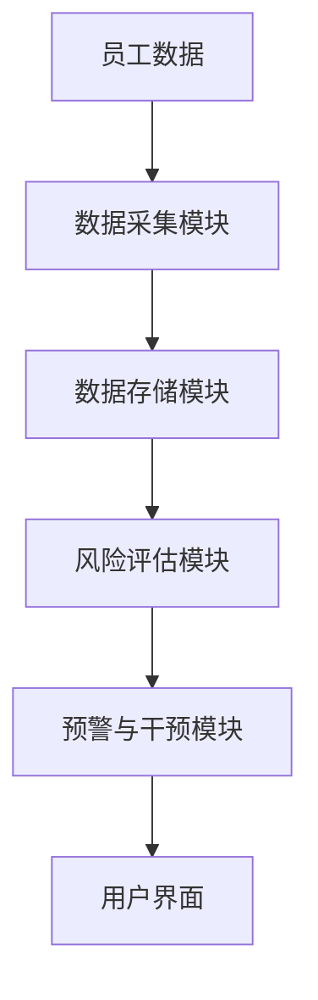
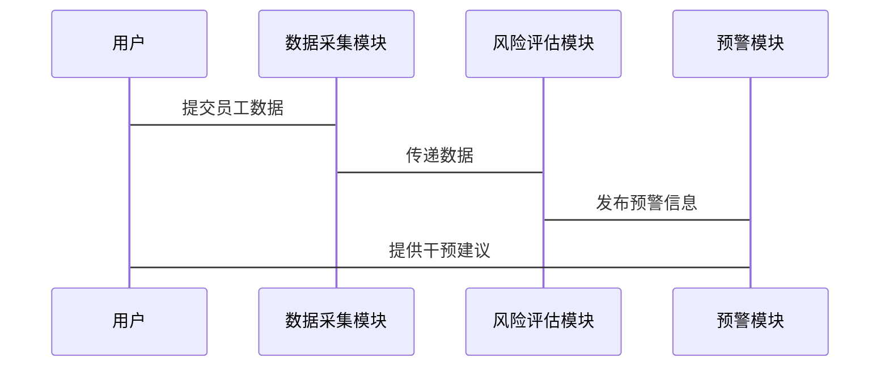

                 

<think>
好的，我现在需要帮用户撰写一篇关于《多智能体系统在公司人才流失风险评估中的应用》的技术博客文章。首先，我需要理解用户的需求，他是一位技术专家，希望得到一篇结构清晰、内容详实的专业博客，涵盖从基础到应用的各个方面。

首先，我会考虑文章的结构。用户已经提供了一个大纲，包括摘要、关键词和目录。我需要确保每一章都有足够的细节，并且涵盖用户提到的所有要素：背景介绍、核心概念、算法原理、数学模型、系统架构、项目实战、最佳实践等。

接下来，我会从第一章开始，详细阐述多智能体系统的基本概念。这里需要包括定义、特征以及与单智能体系统的区别。然后，我会介绍人才流失风险评估的重要性，包括其定义、必要性和对企业的具体影响。

第二章的核心是多智能体系统的技术细节。我需要解释智能体的结构和通信机制，以及系统中的协调与冲突解决方法。这部分可能需要使用图表来辅助说明，例如用Mermaid绘制智能体结构图。

第三章是数学模型与算法部分。我会介绍评估模型，如概率模型和机器学习模型，并详细讲解公式，例如流失概率的计算。这里需要使用Mermaid流程图展示算法步骤，并提供Python代码实现，以便读者实际操作。

第四章是系统分析与架构设计。我需要从问题场景出发，设计系统功能，如数据采集和预警模块。然后用Mermaid图展示类图、架构图和序列图，帮助读者理解系统结构。

第五章是项目实战，环境安装、代码实现和案例分析。这部分需要详细指导读者如何实际应用，包括数据预处理和模型训练的具体步骤。

最后，我会在第六章总结最佳实践和注意事项，帮助读者巩固知识，并提供未来研究方向的建议。附录部分包括数据集和工具包的信息，方便读者进一步学习。

在写作过程中，我需要确保每一章都有足够的细节，比如在数学模型中，不仅要解释公式，还要用例子说明。同时，系统架构部分需要清晰的图表，帮助读者理解复杂的系统结构。项目实战部分要提供可运行的代码，让读者能够动手实践。

最后，我会检查整个目录是否覆盖了所有要素，并确保结构清晰，逻辑连贯。这样，读者可以轻松理解并应用多智能体系统在人才流失风险评估中的应用。
</think>

# 多智能体系统在公司人才流失风险评估中的应用

> 关键词：多智能体系统，人才流失风险，风险评估，系统架构，机器学习

> 摘要：本文详细探讨了多智能体系统在公司人才流失风险评估中的应用。通过分析多智能体系统的核心原理、数学模型、系统架构以及实际项目案例，展示了如何利用多智能体系统进行高效的人才流失风险评估。文章从背景介绍、核心概念、算法原理、系统设计到项目实战，全面阐述了多智能体系统在该领域的应用，并给出了最佳实践和小结。

---

## 第一部分: 多智能体系统与人才流失风险评估概述

### 第1章: 多智能体系统与人才流失风险评估概述

#### 1.1 多智能体系统的基本概念
##### 1.1.1 多智能体系统的定义
多智能体系统（Multi-Agent System, MAS）是由多个智能体（Agent）组成的分布式系统，这些智能体能够通过自主决策和协作完成特定任务。智能体是具有感知环境、做出决策和采取行动能力的实体。

##### 1.1.2 多智能体系统的特征
- **自主性**：智能体能够自主决策，无需外部干预。
- **反应性**：智能体能够实时感知环境并做出反应。
- **协作性**：多个智能体能够协同工作，共同完成任务。
- **分布性**：智能体分布在整个系统中，不存在集中控制节点。

##### 1.1.3 多智能体系统与单智能体系统的区别
| 特性 | 多智能体系统 | 单智能体系统 |
|------|--------------|--------------|
| 结构  | 分布式       | 集中式       |
| 决策  | 分权式       | 集权式       |
| 协作   | 强           | 弱           |
| 灵活性 | 高           | 低           |

#### 1.2 人才流失风险评估的定义与重要性
##### 1.2.1 人才流失的定义
人才流失是指公司员工因各种原因离开公司，导致公司人才储备减少的现象。

##### 1.2.2 人才流失风险评估的必要性
- **降低招聘成本**：提前识别高风险员工，减少因流失导致的招聘成本。
- **提升团队稳定性**：通过评估和干预，保持团队的稳定性。
- **优化员工管理**：通过数据分析，优化员工管理策略。

##### 1.2.3 人才流失对企业的影响
- **生产力下降**：员工流失会导致工作交接中断，影响生产力。
- **团队士气受损**：频繁的人才流失会影响团队士气。
- **成本增加**：招聘和培训新员工需要大量资源。

#### 1.3 多智能体系统在人才流失风险评估中的应用背景
##### 1.3.1 传统人才流失评估方法的局限性
- **数据单一**：传统方法通常基于简单的统计分析，缺乏深度。
- **静态评估**：无法实时跟踪员工状态。
- **缺乏协作**：各部门之间缺乏协作，导致评估结果片面。

##### 1.3.2 多智能体系统的优势
- **数据丰富性**：多智能体系统可以整合来自不同部门的数据。
- **动态评估**：系统能够实时更新评估结果，提供动态反馈。
- **协作性**：多个智能体可以协同工作，提供更全面的评估。

##### 1.3.3 应用场景与目标
- **员工行为分析**：通过多智能体系统分析员工的行为模式，预测流失风险。
- **实时监控**：实时监控员工的工作状态，及时发现潜在问题。
- **个性化干预**：根据员工的特征提供个性化的管理策略。

---

## 第二部分: 多智能体系统的核心原理与技术

### 第2章: 多智能体系统的核心原理与技术

#### 2.1 多智能体系统的组成与结构
##### 2.1.1 智能体的基本结构
智能体通常由以下部分组成：
- **感知器**：用于感知环境。
- **决策器**：用于做出决策。
- **行动器**：用于执行动作。
- **知识库**：存储智能体的知识和经验。

##### 2.1.2 多智能体系统的层次结构
- **物理层**：智能体的物理实体。
- **逻辑层**：智能体的行为逻辑。
- **通信层**：智能体之间的通信机制。
- **协调层**：智能体之间的协调与协作。

##### 2.1.3 多智能体系统的通信机制
- **直接通信**：智能体之间直接交换信息。
- **间接通信**：通过中间媒介传递信息。
- **广播通信**：所有智能体都接收相同的信息。

#### 2.2 多智能体系统中的协调与冲突解决
##### 2.2.1 协调机制
- **协商机制**：智能体之间通过协商解决冲突。
- **仲裁机制**：通过仲裁者解决冲突。
- **规则机制**：根据预设规则自动解决冲突。

##### 2.2.2 冲突检测与解决方法
- **检测冲突**：通过监测系统状态发现冲突。
- **解决冲突**：根据优先级或规则选择最优解决方案。

##### 2.2.3 分布式决策算法
- **分布式计算**：智能体独立做出决策。
- **集中式决策**：通过集中控制节点做出决策。
- **混合式决策**：结合分布式和集中式的方法。

---

## 第三部分: 多智能体系统的数学模型与算法

### 第3章: 多智能体系统的数学模型与算法

#### 3.1 多智能体系统中的数学模型
##### 3.1.1 智能体行为模型
智能体的行为可以通过以下模型表示：
$$
P(\text{行为}|s) = \frac{1}{n} \sum_{i=1}^{n} \text{行为}_i
$$
其中，$s$ 表示当前状态，$n$ 表示可能的行为数量。

##### 3.1.2 多智能体系统的状态空间模型
状态空间可以表示为：
$$
S = \{s_1, s_2, \dots, s_n\}
$$
其中，$s_i$ 表示第 $i$ 个状态。

##### 3.1.3 多智能体系统的动态模型
系统的动态变化可以通过以下方程表示：
$$
s_{t+1} = f(s_t, a_t)
$$
其中，$s_t$ 表示第 $t$ 时刻的状态，$a_t$ 表示第 $t$ 时刻的动作，$f$ 表示状态转移函数。

#### 3.2 人才流失风险评估的算法原理
##### 3.2.1 基于概率的流失风险模型
流失概率可以通过以下公式计算：
$$
P(\text{流失}|x) = \frac{\sum_{i=1}^{n} w_i x_i}{\sum_{i=1}^{n} w_i}
$$
其中，$w_i$ 表示第 $i$ 个特征的权重，$x_i$ 表示第 $i$ 个特征的值。

##### 3.2.2 基于机器学习的流失预测算法
机器学习模型可以通过以下步骤实现：
1. 数据预处理：对员工数据进行清洗和归一化。
2. 特征选择：选择影响流失的关键特征。
3. 模型训练：使用监督学习算法（如随机森林、XGBoost）训练模型。
4. 模型评估：通过交叉验证评估模型性能。
5. 模型部署：将模型部署到生产环境，实时预测流失风险。

##### 3.2.3 基于多智能体的协同评估方法
多智能体协同评估可以通过以下步骤实现：
1. 智能体分工：将任务分配给不同的智能体。
2. 数据收集：智能体收集相关数据。
3. 数据分析：智能体分析数据，生成评估结果。
4. 结果汇总：将各智能体的结果汇总，得到最终的评估结果。

---

## 第四部分: 系统分析与架构设计方案

### 第4章: 系统分析与架构设计方案

#### 4.1 问题场景与需求分析
##### 4.1.1 人才流失风险评估的典型问题
- **数据分散**：员工数据分散在不同部门，难以整合。
- **实时性要求高**：需要实时评估员工的流失风险。
- **个性化需求**：不同员工的需求不同，需要个性化评估。

##### 4.1.2 系统目标与功能需求
- **目标**：建立一个实时、动态的人才流失风险评估系统。
- **功能需求**：
  - 数据采集：从HR系统、绩效系统等获取员工数据。
  - 风险评估：基于多智能体系统评估员工的流失风险。
  - 预警与干预：根据评估结果，提供预警和干预建议。

##### 4.1.3 约束条件与边界条件
- **约束条件**：
  - 系统必须保证数据安全。
  - 系统必须支持高并发访问。
- **边界条件**：
  - 系统仅评估员工流失风险，不涉及员工的招聘和培训。

#### 4.2 系统功能设计
##### 4.2.1 数据采集模块
- **功能**：从不同数据源采集员工数据。
- **关键点**：数据清洗、数据归一化。

##### 4.2.2 风险评估模块
- **功能**：基于多智能体系统评估员工的流失风险。
- **关键点**：特征选择、模型训练、结果解释。

##### 4.2.3 预警与干预模块
- **功能**：根据评估结果，提供预警和干预建议。
- **关键点**：预警级别设置、干预策略制定。

#### 4.3 系统架构设计
##### 4.3.1 系统架构图


##### 4.3.2 系统交互图


---

## 第五部分: 项目实战与案例分析

### 第5章: 项目实战与案例分析

#### 5.1 环境安装与配置
##### 5.1.1 环境要求
- 操作系统：Linux/Windows/MacOS
- Python版本：3.6+
- 依赖库：pandas, scikit-learn, matplotlib

##### 5.1.2 安装步骤
1. 安装Python和依赖库：
   ```bash
   pip install pandas scikit-learn matplotlib
   ```

2. 下载数据集：
   ```bash
   wget https://example.com/hr_data.csv
   ```

#### 5.2 核心实现代码
##### 5.2.1 数据预处理代码
```python
import pandas as pd

# 读取数据
data = pd.read_csv('hr_data.csv')

# 数据清洗
data.dropna(inplace=True)

# 数据归一化
from sklearn.preprocessing import StandardScaler
scaler = StandardScaler()
data_normalized = scaler.fit_transform(data)
```

##### 5.2.2 模型训练代码
```python
from sklearn.ensemble import RandomForestClassifier
from sklearn.metrics import accuracy_score

# 训练模型
model = RandomForestClassifier()
model.fit(data_normalized, target)

# 模型评估
预测 = model.predict(data_normalized)
准确率 = accuracy_score(target, 预测)
print(准确率)
```

##### 5.2.3 系统实现代码
```python
class EmployeeRiskAssessment:
    def __init__(self, data):
        self.data = data
        self.model = self.训练模型()
    
    def 训练模型(self):
        # 训练模型的代码
        pass
    
    def 评估风险(self, 员工ID):
        # 评估员工风险的代码
        pass

# 创建实例
assessment = EmployeeRiskAssessment(data)
# 评估员工风险
风险 = assessment.评估风险(员工ID)
```

#### 5.3 案例分析与结果解读
##### 5.3.1 案例分析
假设我们有一个员工数据集，包含以下特征：
- 工作年限
- 绩效评分
- 工资水平
- 职位晋升次数

通过多智能体系统，我们可以实时评估每个员工的流失风险。

##### 5.3.2 结果解读
- **低风险**：员工流失概率低于30%。
- **中风险**：员工流失概率在30%-70%之间。
- **高风险**：员工流失概率高于70%。

#### 5.4 项目小结
通过实际项目案例，我们可以看到多智能体系统在人才流失风险评估中的巨大潜力。通过实时数据采集、动态评估和个性化干预，企业可以有效降低人才流失风险。

---

## 第六部分: 最佳实践与小结

### 第6章: 最佳实践与小结

#### 6.1 最佳实践
##### 6.1.1 数据质量
- 确保数据的准确性和完整性。
- 定期更新数据，保持数据的实时性。

##### 6.1.2 模型优化
- 定期重新训练模型，保持模型的准确性。
- 引入新的特征，提高模型的预测能力。

##### 6.1.3 系统维护
- 定期检查系统性能，确保系统的稳定运行。
- 及时修复系统漏洞，确保数据安全。

#### 6.2 小结
本文详细探讨了多智能体系统在公司人才流失风险评估中的应用。通过分析多智能体系统的核心原理、数学模型、系统架构以及实际项目案例，展示了如何利用多智能体系统进行高效的人才流失风险评估。希望本文能够为相关领域的研究和实践提供有价值的参考。

#### 6.3 注意事项
- 在实际应用中，需要注意数据隐私和员工隐私保护。
- 系统的实时性和稳定性是保证评估结果准确性的关键。

#### 6.4 拓展阅读
- 多智能体系统在其他领域的应用。
- 机器学习在人才管理中的其他应用。

---

## 附录

### 附录A: 数据集描述
- 数据来源：公司HR系统、绩效管理系统等。
- 数据格式：CSV格式，包含员工ID、工作年限、绩效评分、工资水平等特征。

### 附录B: 工具包
- Python库：pandas, scikit-learn, matplotlib。
- 开发工具：Jupyter Notebook, VS Code。

### 附录C: 参考文献
- 多智能体系统相关文献。
- 机器学习相关文献。

---

## 作者：AI天才研究院/AI Genius Institute & 禅与计算机程序设计艺术 /Zen And The Art of Computer Programming

