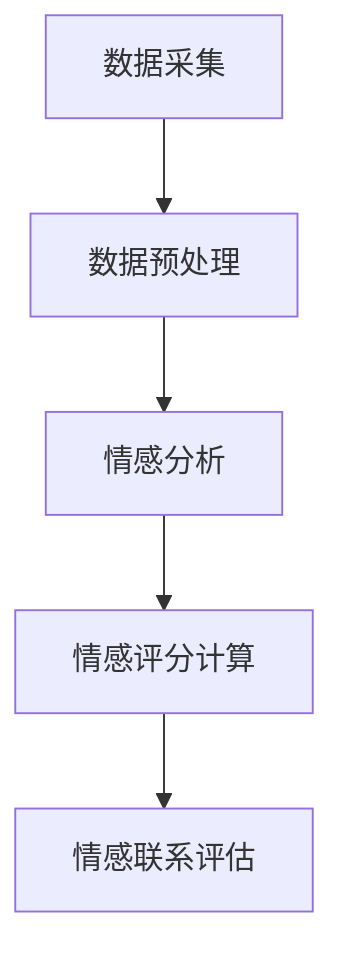
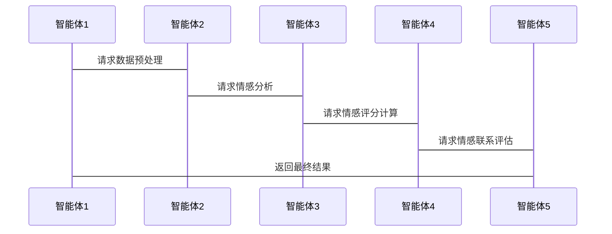

                 


# 多智能体系统在品牌情感联系评估中的应用：超越财务指标

## 关键词：多智能体系统、品牌情感联系、情感计算、分布式计算、协作机制

## 摘要：  
在当今竞争激烈的市场环境中，品牌不仅仅是产品的代名词，更是消费者情感与价值观的载体。传统上，品牌评估主要依赖于财务指标，如销售额、市场份额等，但这些指标往往忽略了品牌与消费者之间深层次的情感联系。本文探讨多智能体系统在品牌情感联系评估中的应用，提出了一种基于多智能体的分布式计算方法，超越传统财务指标，从情感维度重新定义品牌价值。通过详细分析多智能体系统的核心原理、算法实现以及实际应用场景，本文为品牌管理者提供了新的视角和工具，以更全面地评估品牌与消费者之间的情感联系。

---

## 第一章: 多智能体系统概述

### 1.1 多智能体系统的定义与特点
#### 1.1.1 多智能体系统的定义  
多智能体系统（Multi-Agent System, MAS）是由多个智能体（Agent）组成的分布式系统，每个智能体都是一个能够感知环境、自主决策、主动协作的实体。智能体之间通过通信和协作完成复杂的任务，同时保持各自的独立性和自治性。

#### 1.1.2 多智能体系统的核心特点  
- **分布式计算**：智能体之间通过分布式计算实现任务分工与协作。  
- **自主性**：每个智能体都能独立感知环境并做出决策。  
- **反应性**：智能体能够实时响应环境变化并调整行为。  
- **协作性**：智能体之间通过通信和协作共同完成目标。  

#### 1.1.3 多智能体系统的优缺点对比  
| **特点** | **多智能体系统** | **传统集中式系统** |
|----------|------------------|----------------------|
| **优势** | 高度灵活性，能够适应复杂环境 | 系统结构简单，易于管理 |
| **劣势** | 系统复杂性高，协作难度大 | 系统扩展性差，难以应对大规模任务 |

### 1.2 品牌情感联系评估的背景与意义
#### 1.2.1 传统品牌评估方法的局限性  
传统品牌评估主要依赖财务指标，如销售额、市场份额等，但这些指标无法全面反映品牌与消费者之间的情感联系。例如，两个品牌可能具有相似的财务表现，但其与消费者的情感互动可能完全不同。

#### 1.2.2 品牌情感联系的重要性  
品牌情感联系是消费者对品牌的情感依赖和价值观认同，直接影响消费者的忠诚度和购买行为。通过评估品牌情感联系，企业可以更好地理解消费者需求，优化品牌策略。

#### 1.2.3 超越财务指标的必要性  
随着市场竞争的加剧，品牌差异化竞争的核心在于与消费者建立深层次的情感联系。通过情感维度重新定义品牌价值，企业能够更精准地制定品牌战略。

### 1.3 多智能体系统在品牌情感评估中的优势
#### 1.3.1 多智能体系统的分布式计算能力  
多智能体系统能够通过分布式计算实时分析消费者情感数据，捕捉品牌与消费者之间的动态情感互动。

#### 1.3.2 多智能体系统的协作机制  
多个智能体可以分别负责不同的情感分析任务，例如情感分类、情感强度计算等，通过协作机制实现整体任务的最优解。

#### 1.3.3 多智能体系统在情感分析中的潜力  
多智能体系统能够结合自然语言处理、机器学习等技术，实现对消费者评论、社交媒体数据等的深度分析，为品牌情感评估提供更精细的洞察。

---

## 第二章: 品牌情感联系评估的核心概念

### 2.1 情感计算的基本原理
#### 2.1.1 情感计算的定义  
情感计算（Affective Computing）是通过计算机技术分析和理解人类情感的过程，广泛应用于情感分析、人机交互等领域。

#### 2.1.2 情感计算的关键技术  
- **情感分类**：将文本分为积极、消极、中性三类。  
- **情感强度计算**：量化情感的强度（如情感评分）。  
- **情感原因分析**：识别情感背后的原因或触发因素。  

#### 2.1.3 情感计算的应用场景  
- **社交媒体情感分析**：分析用户对品牌的评论情感。  
- **客户反馈分析**：优化产品和服务体验。  

### 2.2 品牌情感联系的构建与测量
#### 2.2.1 品牌情感联系的定义  
品牌情感联系是指消费者与品牌之间的情感纽带，包括情感依赖、情感共鸣、情感忠诚等多个维度。

#### 2.2.2 品牌情感联系的构建模型  
品牌情感联系可以通过消费者评论、社交媒体数据、问卷调查等多源数据构建。

#### 2.2.3 品牌情感联系的测量指标  
- **情感强度**：消费者对品牌的正向情感强度。  
- **情感稳定性**：品牌情感的持续性与稳定性。  
- **情感一致性**：消费者情感与品牌价值观的匹配程度。  

### 2.3 多智能体系统与品牌情感联系的结合
#### 2.3.1 多智能体系统在品牌情感分析中的角色  
多智能体系统可以通过分布式计算和协作机制，实现对大规模情感数据的实时分析。

#### 2.3.2 多智能体系统如何增强品牌情感评估  
多智能体系统能够结合多个智能体的分析结果，提供更全面和精准的情感评估。

#### 2.3.3 多智能体系统与传统品牌评估方法的对比  
| **评估方法** | **传统财务指标** | **多智能体情感评估** |
|--------------|------------------|-----------------------|
| **评估维度** | 销售额、市场份额 | 情感强度、情感一致性 |
| **评估优势** | 数据获取简单 | 情感洞察精准 |
| **评估劣势** | 忽略情感因素 | 系统复杂性较高 |

---

## 第三章: 多智能体系统与品牌情感联系评估的结合

### 3.1 多智能体情感计算模型
#### 3.1.1 模型的总体架构  
多智能体情感计算模型包括数据采集、情感分析、情感评分计算、情感联系评估四个主要模块。

#### 3.1.2 各个智能体的功能与职责  
- **数据采集智能体**：负责采集消费者评论、社交媒体数据等。  
- **情感分析智能体**：负责对数据进行情感分类和情感强度计算。  
- **情感联系评估智能体**：负责综合情感数据，评估品牌情感联系。  

#### 3.1.3 智能体之间的协作机制  
通过消息传递机制（Message Passing Mechanism），智能体之间可以实时通信并协作完成任务。

### 3.2 多智能体系统在品牌情感分析中的具体应用
#### 3.2.1 应用场景  
- **社交媒体情感分析**：实时分析用户对品牌的评论情感。  
- **客户反馈分析**：优化产品和服务体验。  

#### 3.2.2 实施步骤  
1. 数据采集：通过爬虫技术获取消费者评论数据。  
2. 数据预处理：清洗数据并提取关键情感词汇。  
3. 情感分析：使用机器学习算法对数据进行情感分类。  
4. 情感联系评估：综合情感数据，评估品牌情感联系。  

### 3.3 多智能体系统的算法实现
#### 3.3.1 算法原理  
使用分布式计算和协作机制，通过多个智能体的协同工作实现情感数据的分析与评估。

#### 3.3.2 算法流程图  


#### 3.3.3 核心代码实现  
```python
import requests
from bs4 import BeautifulSoup
import nltk
from nltk.sentiment import SentimentIntensityAnalyzer

# 数据采集智能体
def fetch_data(url):
    response = requests.get(url)
    return response.text

# 数据预处理智能体
def preprocess_data(data):
    soup = BeautifulSoup(data, 'html.parser')
    comments = soup.find_all('div', {'class': 'comment'})
    return [comment.text for comment in comments]

# 情感分析智能体
def analyze_sentiment(texts):
    analyzer = SentimentIntensityAnalyzer()
    results = []
    for text in texts:
        scores = analyzer.polarity_scores(text)
        results.append(scores)
    return results

# 情感联系评估智能体
def assess_emotional_connection(results):
    positive_score = sum([result['pos'] for result in results])
    negative_score = sum([result['neg'] for result in results])
    return {'positive': positive_score, 'negative': negative_score}
```

---

## 第四章: 系统架构与设计

### 4.1 问题场景介绍  
在品牌情感联系评估中，系统需要实时分析大量消费者评论数据，快速生成情感评估结果。  

### 4.2 系统功能设计  
- **数据采集模块**：负责采集消费者评论数据。  
- **情感分析模块**：对数据进行情感分类和情感强度计算。  
- **情感联系评估模块**：综合情感数据，评估品牌情感联系。  

### 4.3 系统架构设计  


### 4.4 系统接口设计  
- **输入接口**：消费者评论数据。  
- **输出接口**：情感评分和情感联系评估结果。  

### 4.5 系统交互流程  


---

## 第五章: 项目实战

### 5.1 环境搭建  
- **编程语言**：Python  
- **库与工具**：requests, BeautifulSoup, nltk, SentimentIntensityAnalyzer  

### 5.2 核心代码实现  
```python
import requests
from bs4 import BeautifulSoup
from nltk.sentiment import SentimentIntensityAnalyzer

# 数据采集
def fetch_data(url):
    response = requests.get(url)
    return response.text

# 数据预处理
def preprocess_data(data):
    soup = BeautifulSoup(data, 'html.parser')
    comments = soup.find_all('div', {'class': 'comment'})
    return [comment.text for comment in comments]

# 情感分析
def analyze_sentiment(texts):
    analyzer = SentimentIntensityAnalyzer()
    results = []
    for text in texts:
        scores = analyzer.polarity_scores(text)
        results.append(scores)
    return results

# 情感联系评估
def assess_emotional_connection(results):
    positive_score = sum([result['pos'] for result in results])
    negative_score = sum([result['neg'] for result in results])
    return {'positive': positive_score, 'negative': negative_score}
```

### 5.3 案例分析  
以某品牌为例，分析消费者评论数据，生成情感评分和情感联系评估结果。

### 5.4 项目总结  
通过本项目，验证了多智能体系统在品牌情感联系评估中的有效性，为后续研究提供了参考。

---

## 第六章: 总结与展望

### 6.1 总结  
本文探讨了多智能体系统在品牌情感联系评估中的应用，提出了一种基于分布式计算的情感评估方法。通过详细分析多智能体系统的原理、算法实现以及实际应用场景，本文为品牌管理者提供了新的视角和工具。

### 6.2 实际应用中的挑战  
- 数据隐私问题：消费者评论数据的隐私保护。  
- 系统复杂性：多智能体系统的协作机制需要进一步优化。  

### 6.3 未来展望  
- 智能体协同优化：通过改进协作机制，提高系统效率。  
- 情感分析技术提升：结合深度学习技术，提高情感分析的准确性。  

---

## 作者：AI天才研究院/AI Genius Institute & 禅与计算机程序设计艺术 /Zen And The Art of Computer Programming

