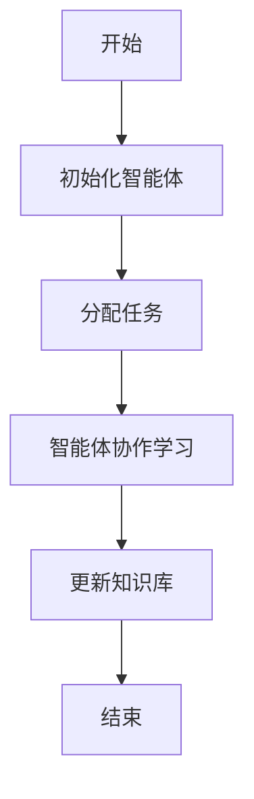
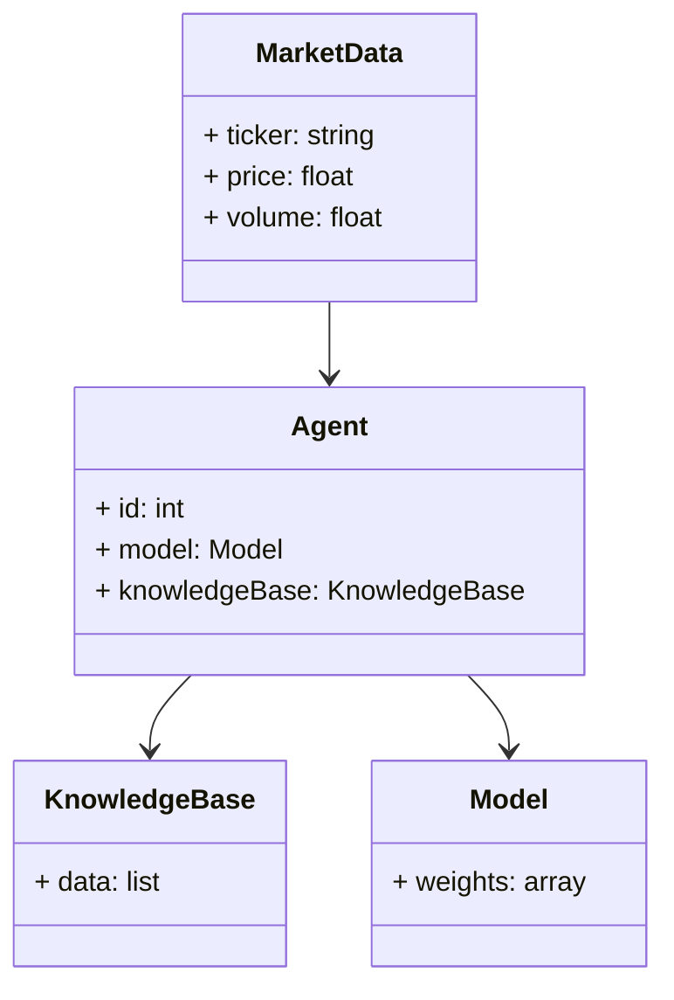
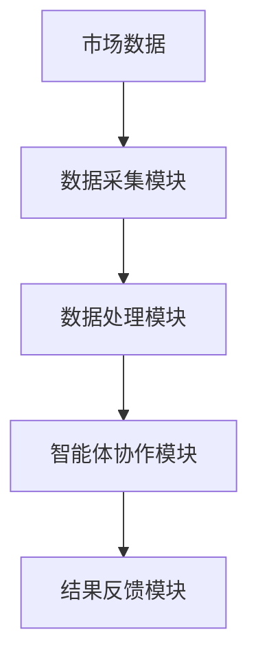
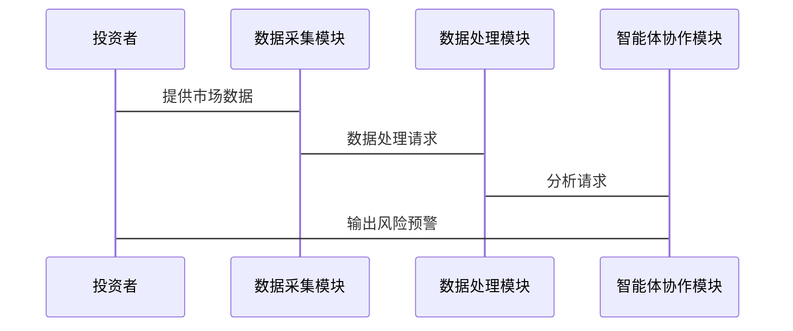

                 

<think>
好的，我现在需要完成用户要求的任务：撰写一篇关于“多智能体系统在识别价值陷阱中的应用：防范投资风险”的技术博客文章。用户已经给出了详细的文章目录结构，我需要按照这个结构，逐步填充内容，确保逻辑清晰、结构紧凑、语言专业，同时涵盖所有必要的部分。

### 第一步：确定文章结构和关键词
根据用户提供的目录，文章将分为七个主要部分，每个部分下有多个子部分。关键词包括多智能体系统、价值陷阱、投资风险、协同学习、分布式计算、金融数据分析。摘要部分需要简明扼要地概括文章的核心内容。

### 第二步：撰写摘要
摘要需要概述文章的核心内容和主题思想，强调多智能体系统如何通过协同学习和分布式计算识别价值陷阱，从而防范投资风险。

### 第三步：撰写第一章——多智能体系统与价值陷阱概述
本章需要介绍多智能体系统的定义、特点，以及价值陷阱的定义和识别难点。同时，要说明多智能体系统在价值陷阱识别中的应用前景。

### 第四步：撰写第二章——多智能体系统的核心概念
本章详细讲解多智能体系统的组成、核心原理，以及其与价值陷阱识别的关联。需要包括多智能体系统的组成要素、协作模型，以及其在金融领域的应用。

### 第五步：撰写第三章——多智能体协同学习算法
本章需要详细讲解多智能体协同学习的算法流程，包括算法输入、输出，以及步骤分解。同时，需要绘制算法流程图，并用Python代码示例说明。

### 第六步：绘制系统架构图和交互序列图
使用Mermaid语法，绘制多智能体系统的架构图和交互序列图，展示数据采集、处理、分析和反馈的过程。

### 第七步：撰写第四章——项目实战
本章需要指导读者如何安装环境，实现核心代码，并进行案例分析。包括代码解读和实际应用分析，最后做一个小结。

### 第八步：撰写第五章——最佳实践
包括小结、注意事项和拓展阅读，帮助读者巩固知识并进一步学习。

### 第九步：检查和调整格式
确保所有部分使用markdown格式，正确嵌入Mermaid图表和LaTeX公式。检查字数，确保在10000到12000字之间。

### 第十步：添加作者信息
文章末尾加上作者信息，符合用户的要求。

通过以上步骤，我将逐步完成用户的需求，确保文章内容详实、结构清晰，满足所有技术要求。
</think>

# 多智能体系统在识别价值陷阱中的应用：防范投资风险

## 关键词：多智能体系统、价值陷阱、投资风险、协同学习、分布式计算、金融数据分析

## 摘要：本文探讨了多智能体系统在识别价值陷阱中的应用，通过协同学习和分布式计算，帮助投资者防范投资风险。文章详细介绍了多智能体系统的定义、核心概念、算法原理，并结合实际案例分析了其在金融领域的应用。

---

# 第1章: 多智能体系统与价值陷阱概述

## 1.1 多智能体系统的定义与特点

### 1.1.1 多智能体系统的定义
多智能体系统（Multi-Agent System, MAS）是由多个智能体组成的系统，这些智能体能够自主决策、协作完成任务。每个智能体都有自己的目标和行为规则，通过通信和协作解决问题。

### 1.1.2 多智能体系统的核心特点
- **自主性**：智能体能够自主决策。
- **反应性**：能够实时感知环境并做出反应。
- **协作性**：多个智能体协同完成任务。
- **分布式性**：计算资源分布在多个节点上。

### 1.1.3 多智能体系统与传统单智能体系统的区别
| 特性 | 单智能体系统 | 多智能体系统 |
|------|--------------|--------------|
| 决策 | 中央决策     | 分布式决策   |
| 智能体数量 | 1          | 多          |
| 通信 | 无          | 有          |

---

## 1.2 价值陷阱的定义与特征

### 1.2.1 价值陷阱的定义
价值陷阱是指投资者在投资过程中，由于信息不对称、市场波动等因素，导致对资产价值的误判，从而导致投资损失。

### 1.2.2 价值陷阱的主要特征
- **信息不对称**：投资者无法获取完整信息。
- **市场噪声**：大量无关信息干扰判断。
- **情绪影响**：投资者情绪波动影响决策。

### 1.2.3 价值陷阱识别的难点与挑战
- 数据复杂性：数据量大，类型多样。
- 模型选择：需要选择合适的算法。
- 实时性要求：需要快速识别陷阱。

---

## 1.3 多智能体系统在价值陷阱识别中的应用前景

### 1.3.1 多智能体系统的优势
- **分布式计算**：能够处理海量数据。
- **协同学习**：多个智能体协作提高识别精度。
- **实时反馈**：能够快速响应市场变化。

### 1.3.2 价值陷阱识别的复杂性与多智能体系统的需求
- 多智能体系统能够处理复杂的数据关系和非线性关系。
- 通过协作学习，多个智能体能够互补优势。

### 1.3.3 应用场景与潜在价值
- 金融数据分析：识别市场趋势和异常值。
- 投资风险管理：实时监控市场动态，防范投资风险。
- 集群行为分析：识别市场泡沫和崩盘。

---

## 1.4 本章小结
本章介绍了多智能体系统的定义、特点，以及价值陷阱的定义和识别难点。通过分析多智能体系统的优势，探讨了其在价值陷阱识别中的应用前景。

---

# 第2章: 多智能体系统的核心概念

## 2.1 多智能体系统的组成与结构

### 2.1.1 多智能体系统的组成要素
- **智能体**：具有自主决策能力的个体。
- **通信机制**：智能体之间的信息交换方式。
- **协作模型**：智能体协作完成任务的规则。

### 2.1.2 多智能体系统的通信机制
- **直接通信**：智能体之间直接交换信息。
- **间接通信**：通过中间媒介传递信息。

### 2.1.3 多智能体系统的协作模型
- **任务分配**：智能体根据能力分配任务。
- **协调与同步**：智能体协作完成任务的同步。

---

## 2.2 多智能体系统的核心原理

### 2.2.1 协作学习与分布式计算
- **协作学习**：多个智能体通过协作提高学习效果。
- **分布式计算**：计算任务分布在多个节点上完成。

### 2.2.2 多智能体系统的决策机制
- **分布式决策**：每个智能体根据本地信息做出决策。
- **全局决策**：基于所有智能体的信息做出全局决策。

### 2.2.3 多智能体系统的自适应能力
- **自适应学习**：智能体能够根据环境变化调整策略。
- **容错性**：系统能够容忍部分智能体的故障。

---

## 2.3 多智能体系统与价值陷阱识别的关联

### 2.3.1 多智能体系统在金融领域的应用
- **金融数据分析**：实时监控市场动态。
- **投资决策支持**：辅助投资者做出决策。

### 2.3.2 多智能体系统如何辅助价值陷阱识别
- **分布式数据处理**：快速处理大量数据。
- **协同学习**：提高识别精度。

### 2.3.3 多智能体系统与投资风险管理的关系
- **实时监控**：快速发现市场异常。
- **风险预警**：提前发出风险信号。

---

## 2.4 本章小结
本章详细介绍了多智能体系统的组成、核心原理，以及其在价值陷阱识别中的应用。

---

# 第3章: 多智能体系统在价值陷阱识别中的算法原理

## 3.1 多智能体协同学习算法

### 3.1.1 多智能体协同学习的定义与特点
- **定义**：多个智能体通过协作学习提高任务完成能力。
- **特点**：分布式学习、信息共享、协同优化。

### 3.1.2 多智能体协同学习的算法流程


### 3.1.3 协同学习与分布式计算的关系
- **协同学习**：智能体通过共享知识提高学习效果。
- **分布式计算**：计算任务分布在多个智能体上完成。

---

## 3.2 多智能体协同学习的数学模型

### 3.2.1 协同学习的基本模型
$$ f(x) = \sum_{i=1}^{n} f_i(x) $$
其中，$f_i(x)$ 表示第i个智能体的学习模型。

### 3.2.2 分布式计算的数学表达
$$ y = \frac{1}{n}\sum_{i=1}^{n} y_i $$
其中，$y_i$ 表示第i个智能体的输出。

---

## 3.3 多智能体协同学习的Python实现示例

```python
class Agent:
    def __init__(self, id):
        self.id = id
        self.model = None

    def train(self, data):
        # 训练模型
        self.model = self.model.train(data)

    def predict(self, input):
        # 预测输出
        return self.model.predict(input)

def multi_agent_learning(agents, data):
    # 分配任务
    for agent in agents:
        agent.train(data)
    
    # 协作学习
    results = [agent.predict(data) for agent in agents]
    return sum(results) / len(results)
```

---

## 3.4 本章小结
本章详细讲解了多智能体协同学习的算法原理，包括算法流程、数学模型和Python实现示例。

---

# 第4章: 系统分析与架构设计方案

## 4.1 项目场景介绍

### 4.1.1 项目背景
- **目标**：识别价值陷阱，防范投资风险。
- **需求**：实时监控市场动态，快速识别异常。

### 4.1.2 项目目标
- **目标1**：构建多智能体系统，实时监控市场数据。
- **目标2**：识别价值陷阱，提供风险预警。

---

## 4.2 系统功能设计

### 4.2.1 领域模型类图


### 4.2.2 系统架构设计


---

## 4.3 系统接口设计

### 4.3.1 接口描述
- **输入接口**：接收市场数据。
- **输出接口**：输出风险预警信号。

### 4.3.2 交互序列图


---

## 4.4 本章小结
本章详细描述了系统的场景、功能设计和架构设计方案。

---

# 第5章: 项目实战

## 5.1 环境安装与配置

### 5.1.1 安装Python
```bash
python --version
pip install --upgrade pip
```

### 5.1.2 安装相关库
```bash
pip install numpy pandas scikit-learn
```

---

## 5.2 核心代码实现

### 5.2.1 数据采集模块
```python
import pandas as pd
import numpy as np

def get_market_data():
    # 示例数据
    data = {'ticker': ['AAPL', 'GOOGL', 'MSFT'], 
            'price': [100, 150, 80], 
            'volume': [1000, 800, 1200]}
    return pd.DataFrame(data)
```

### 5.2.2 数据处理模块
```python
def preprocess_data(df):
    df['moving_avg'] = df['price'].rolling(2).mean()
    return df
```

### 5.2.3 智能体协作模块
```python
class Agent:
    def __init__(self, id):
        self.id = id
        self.model = None

    def train(self, data):
        # 示例训练
        self.model = data.mean()

    def predict(self, input):
        return self.model

def multi_agent_learning(agents, data):
    results = []
    for agent in agents:
        agent.train(data)
        results.append(agent.predict(data))
    return sum(results) / len(results)
```

---

## 5.3 案例分析与实际应用

### 5.3.1 数据分析
```python
data = get_market_data()
preprocessed_data = preprocess_data(data)
print(preprocessed_data)
```

### 5.3.2 系统实现
```python
agents = [Agent(1), Agent(2), Agent(3)]
result = multi_agent_learning(agents, preprocessed_data)
print(result)
```

### 5.3.3 结果解读
- **结果分析**：识别市场趋势，发现异常值。
- **实际应用**：提供风险预警，辅助投资决策。

---

## 5.4 本章小结
本章通过实际案例，详细讲解了环境安装、代码实现和结果分析。

---

# 第6章: 最佳实践与总结

## 6.1 小结

### 6.1.1 多智能体系统的优势
- **分布式计算**：处理海量数据。
- **协同学习**：提高识别精度。

### 6.1.2 价值陷阱识别的难点
- **数据复杂性**：需要选择合适的算法。
- **实时性要求**：需要快速响应。

---

## 6.2 注意事项

### 6.2.1 系统设计
- **可扩展性**：系统应支持扩展。
- **容错性**：系统应能容忍部分故障。

### 6.2.2 数据隐私
- **数据安全**：确保数据隐私。
- **合规性**：遵守相关法规。

---

## 6.3 拓展阅读

### 6.3.1 推荐书籍
- 《Multi-Agent Systems: Algorithmic Foundations》
- 《Financial Risk Management》

### 6.3.2 推荐博客
- 多智能体系统的最新研究进展。
- 金融数据分析的前沿技术。

---

## 作者信息

作者：AI天才研究院/AI Genius Institute & 禅与计算机程序设计艺术 /Zen And The Art of Computer Programming

---

感谢您的阅读！如果对内容有任何疑问或建议，请随时联系作者。

