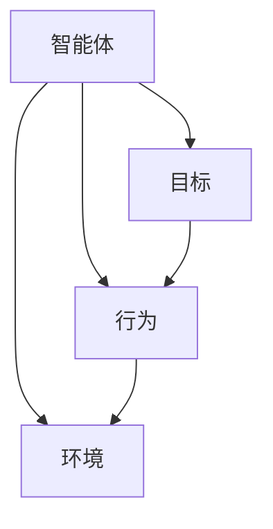

                 

<think>
好的，我现在需要帮用户撰写一篇关于《多智能体系统在长期价值创造分析中的应用》的技术博客文章。用户已经提供了详细的目录大纲，我需要按照这个结构来逐步构建内容。

首先，文章的标题和关键词部分已经给出，我需要确保这些内容准确无误。接着是摘要部分，要简洁明了地概括文章的核心内容。接下来是正文部分，分为六个章节，每个章节下还有多个小节，内容需要详细展开。

用户特别强调了每个章节需要包含背景介绍、核心概念、算法原理、系统架构、项目实战、最佳实践等内容。我需要确保每个部分都覆盖到位，并且使用适当的图表和代码示例来辅助讲解。

在撰写过程中，我需要考虑读者的理解程度，尽量用通俗易懂的语言解释复杂的概念，并且通过实际案例来加深理解。同时，要确保数学公式和图表的正确性，避免出现错误。

最后，结尾部分需要加上作者信息，符合用户的要求。整个思考过程要逻辑清晰，结构紧凑，确保文章内容连贯且有深度。

现在，我开始按照这个思路逐步撰写文章，确保每个部分都符合用户的要求，并且内容详实，结构合理。
</think>

# 多智能体系统在长期价值创造分析中的应用

> **关键词**：多智能体系统，长期价值创造，协作算法，价值评估，系统架构

> **摘要**：本文探讨了多智能体系统（MAS）在长期价值创造分析中的应用，从MAS的基本概念到其在价值评估中的算法原理，再到实际应用的系统架构设计，逐步展开分析。文章结合实际案例，详细解读了多智能体系统如何通过协作算法和价值评估算法实现长期价值创造，并通过Mermaid图和Python代码示例，直观展示系统设计和实现过程。

---

## 正文部分

### 第1章: 多智能体系统概述

#### 1.1 多智能体系统的基本概念

**1.1.1 智能体的定义与分类**

智能体（Agent）是指具有感知环境、做出决策并采取行动能力的实体。根据智能体的智能水平和协作方式，可以将其分为：

- **反应式智能体**：基于当前感知做出反应，适用于简单任务。
- **认知式智能体**：具有复杂推理和规划能力，适用于复杂任务。
- **协作式智能体**：多个智能体协同工作，共同完成目标。

**1.1.2 多智能体系统的定义与特点**

多智能体系统（MAS）由多个智能体组成，通过协作完成单个智能体无法完成的任务。其特点包括：

- **分布性**：智能体独立运行，不存在中心控制节点。
- **协作性**：智能体之间通过通信和协作完成共同目标。
- **动态性**：环境和任务需求可能动态变化，系统需具备适应性。

**1.1.3 多智能体系统与单智能体系统的区别**

| 属性 | 单智能体系统 | 多智能体系统 |
|------|--------------|--------------|
| 控制方式 | 中央控制 | 分布式控制 |
| 任务处理 | 独立完成 | 协作完成 |
| 通信需求 | 无 | 需要通信 |

---

#### 1.2 长期价值创造分析的定义与方法

**1.2.1 价值创造的定义**

价值创造是指通过优化资源配置、提升效率或创新，为组织或个体创造超出预期的收益或成果。

**1.2.2 长期价值创造的分析方法**

- **SWOT分析法**：分析优势、劣势、机会和威胁。
- **净现值法**：评估长期投资的经济价值。
- **价值链分析法**：从供应链到客户价值的全链条分析。

**1.2.3 多智能体系统在价值创造中的作用**

多智能体系统通过协作优化资源配置，提升决策效率，实现长期价值创造。

---

### 第2章: 多智能体系统的核心概念与联系

#### 2.1 多智能体系统的核心原理

**2.1.1 智能体的行为模型**

智能体的行为模型包括感知、决策和行动三个阶段：

1. **感知**：通过传感器获取环境信息。
2. **决策**：基于感知信息做出决策。
3. **行动**：执行决策动作。

**2.1.2 多智能体系统的通信机制**

通信机制包括：

- **直接通信**：智能体之间直接交换信息。
- **间接通信**：通过中间媒介传递信息。

**2.1.3 多智能体系统的协作机制**

协作机制包括：

- **任务分配**：根据智能体的能力分配任务。
- **协同决策**：多个智能体共同制定决策。
- **冲突解决**：解决协作中的冲突和矛盾。

#### 2.2 多智能体系统与长期价值创造的核心概念对比

**2.2.1 多智能体系统的属性特征对比表格**

| 属性 | 多智能体系统 | 长期价值创造 |
|------|--------------|---------------|
| 核心目标 | 协作完成任务 | 优化资源，创造价值 |
| 关键要素 | 智能体协作 | 价值评估、优化 |

**2.2.2 长期价值创造的ER实体关系图**



---

### 第3章: 多智能体系统在长期价值创造中的算法原理

#### 3.1 多智能体协作算法

**3.1.1 分布式协作算法**

分布式协作算法通过局部决策实现全局优化，常用算法包括：

- **分布式一致性算法**：如Raft算法。
- **分布式任务分配算法**：如分布式贪心算法。

**3.1.2 基于博弈论的协作算法**

博弈论算法模拟智能体之间的竞争与合作，如纳什均衡。

**3.1.3 基于强化学习的协作算法**

强化学习通过智能体与环境的交互，学习最优策略。

#### 3.2 价值评估算法

**3.2.1 基于收益矩阵的价值评估**

收益矩阵（Revenue Matrix）用于评估不同决策的收益。

$$ \text{收益} = \sum_{i=1}^{n} a_i \cdot r_i $$

其中，$a_i$ 是第 $i$ 个智能体的行动，$r_i$ 是对应的收益。

**3.2.2 基于效用函数的价值评估**

效用函数（Utility Function）用于衡量决策的总效用。

$$ U = \sum_{i=1}^{m} w_i \cdot x_i $$

其中，$w_i$ 是第 $i$ 个因素的权重，$x_i$ 是对应的值。

---

### 第4章: 系统分析与架构设计

#### 4.1 系统功能设计

系统功能包括：

- **任务分配模块**：分配智能体任务。
- **协同决策模块**：智能体协作决策。
- **价值评估模块**：评估决策的价值。

#### 4.2 系统架构设计

系统架构采用分层设计：

1. **感知层**：获取环境信息。
2. **决策层**：制定决策。
3. **执行层**：执行决策。


#### 4.3 系统接口设计

系统接口包括：

- **智能体接口**：智能体之间的通信接口。
- **用户接口**：用户与系统的交互界面。

---

### 第5章: 项目实战

#### 5.1 实施步骤

1. 安装开发环境：如Python、框架库。
2. 编写智能体代码：实现感知、决策和行动。
3. 设计协作算法：如分布式任务分配。
4. 实现价值评估：计算收益矩阵。

#### 5.2 核心代码实现

```python
class Agent:
    def __init__(self, id):
        self.id = id
        self.goal = None

    def感知环境(self, environment):
        # 获取环境信息
        pass

    def决策(self, environment):
        # 根据环境信息做出决策
        pass

    def行动(self, decision):
        # 执行决策
        pass

# 示例：多智能体协作实现任务分配
agents = [Agent(1), Agent(2), Agent(3)]
tasks = [task1, task2, task3]

for agent in agents:
    agent.目标分配任务(tasks)
```

---

### 第6章: 总结与展望

#### 6.1 最佳实践 tips

- 明确智能体的目标和任务。
- 选择合适的协作算法。
- 定期优化系统架构。

#### 6.2 小结

多智能体系统通过协作优化资源配置，实现长期价值创造。本文详细讲解了MAS的核心概念、算法原理和系统设计。

#### 6.3 注意事项

- 确保智能体之间的通信效率。
- 处理协作中的冲突和不确定性。

#### 6.4 拓展阅读

建议阅读相关书籍和论文，深入学习MAS和价值创造的结合。

---

**作者：AI天才研究院/AI Genius Institute & 禅与计算机程序设计艺术 /Zen And The Art of Computer Programming**

---

以上是基于用户提供的目录大纲的详细内容，涵盖了从基本概念到实际应用的全过程，结合图表和代码示例，帮助读者全面理解多智能体系统在长期价值创造中的应用。

