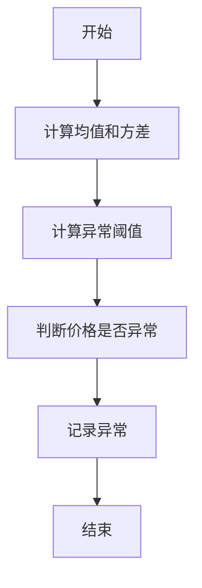
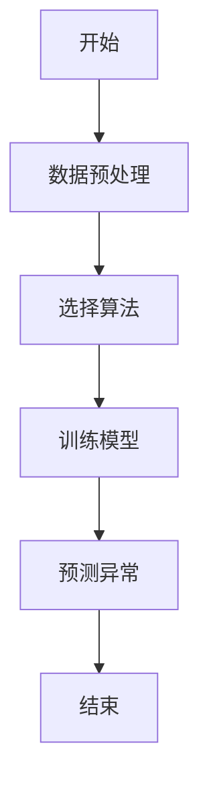
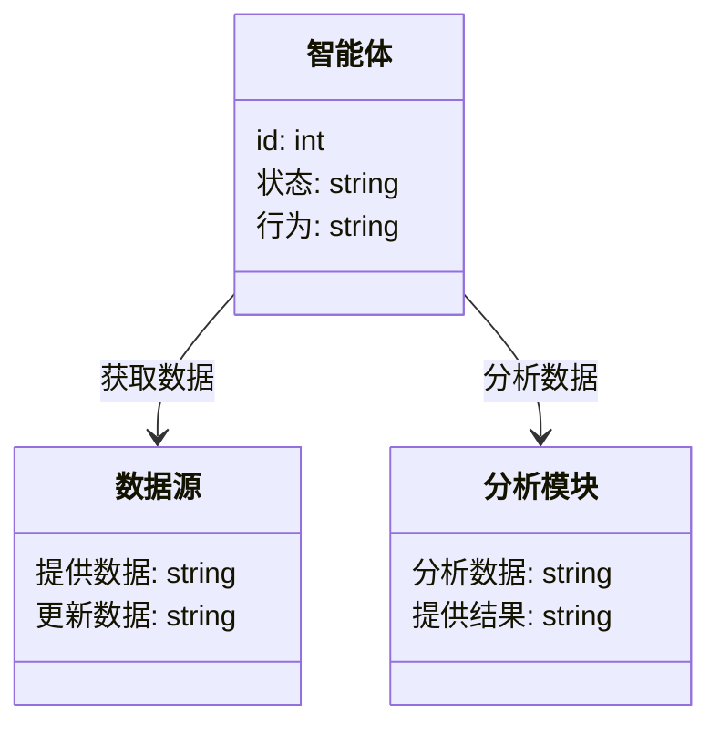

                 


# 多智能体系统增强价值投资的市场微观结构异常检测

---

## 关键词：
多智能体系统, 价值投资, 市场微观结构, 异常检测, 机器学习

---

## 摘要：
本文探讨了多智能体系统在价值投资中的应用，特别是在检测市场微观结构异常方面的创新方法。通过分析多智能体系统的协作机制，结合统计学和机器学习算法，提出了一种有效的异常检测框架，为投资者提供了更精准的决策支持。

---

## 正文：

---

### 第1章: 多智能体系统与价值投资的背景介绍

#### 1.1 多智能体系统的基本概念

##### 1.1.1 多智能体系统的定义
多智能体系统（Multi-Agent System, MAS）是由多个智能体（Agent）组成的分布式系统，这些智能体能够通过协作完成复杂的任务。每个智能体都有一定的自主性，能够感知环境、做出决策并采取行动。

##### 1.1.2 多智能体系统的核心特征
- **自主性**：智能体能够自主决策。
- **反应性**：能够实时感知环境并做出反应。
- **协作性**：多个智能体通过协作完成任务。
- **分布式性**：系统中的智能体分布在不同的位置，不依赖于中央控制。

##### 1.1.3 多智能体系统与传统单智能体系统的区别
| 特性             | 单智能体系统            | 多智能体系统            |
|------------------|-------------------------|-------------------------|
| 控制中心         | 单一控制中心           | 分布式控制，无中心      |
| 决策方式         | 集中的决策过程         | 分散的决策过程         |
| 任务处理         | 单一任务处理           | 多任务协作处理         |
| 效率             | 可能受限于单点瓶颈     | 更高的并行处理能力     |

#### 1.2 价值投资的基本原理

##### 1.2.1 价值投资的定义
价值投资是一种投资策略，强调以低于其内在价值的价格购买优质股票。其核心思想是寻找市场低估的资产。

##### 1.2.2 价值投资的核心理念
- **安全边际**：购买价格远低于内在价值。
- **长期视角**：关注企业的长期盈利能力。
- **基本面分析**：基于财务数据和行业趋势进行分析。

##### 1.2.3 价值投资在金融市场中的应用
价值投资通过分析公司财务状况、行业地位和竞争优势，识别被市场低估的投资标的。传统方法依赖人工分析，耗时且容易受主观因素影响。

#### 1.3 问题背景与研究意义

##### 1.3.1 金融市场中的异常检测问题
金融市场中存在多种异常行为，如市场操纵、虚假交易和突发事件引发的异常波动。这些异常行为会影响市场公平性和投资者利益。

##### 1.3.2 多智能体系统在金融领域的应用潜力
多智能体系统能够通过分布式协作和实时数据分析，有效识别和预测市场异常。其自主性和反应性使其在复杂金融市场中具有独特优势。

##### 1.3.3 研究的价值与意义
- 提高异常检测的效率和准确性。
- 增强价值投资的科学性和决策能力。
- 推动多智能体系统在金融领域的应用创新。

---

### 第2章: 多智能体系统与价值投资的核心概念

#### 2.1 多智能体系统的组成与功能

##### 2.1.1 实体关系图（ER图）
```mermaid
erDiagram
    actor 投资者 {
        <name>
        <投资目标>
        <投资策略>
    }
    actor 市场监管机构 {
        <监管规则>
        <市场数据>
    }
    entity 交易行为 {
        <交易时间>
        <交易金额>
        <交易类型>
    }
    entity 市场参与者 {
        <参与者类型>
        <参与者身份>
    }
    entity 市场数据 {
        <股票代码>
        <价格>
        <交易量>
    }
    投资者 --> 交易行为
    市场参与者 --> 交易行为
    市场监管机构 --> 市场数据
```

##### 2.1.2 多智能体系统的核心功能模块
- **数据采集模块**：收集市场数据和交易行为。
- **分析模块**：基于多智能体协作进行数据分析。
- **决策模块**：根据分析结果做出投资决策。
- **反馈模块**：根据市场反馈调整策略。

#### 2.2 价值投资与市场微观结构的关系

##### 2.2.1 价值投资与市场微观结构的联系
价值投资依赖于对市场微观结构的深入分析，包括交易量、价格波动和市场参与者的行为。通过分析微观结构，投资者可以识别市场异常和投资机会。

##### 2.2.2 微观结构异常对价值投资的影响
异常交易行为会影响市场价格，导致价值投资的决策失误。因此，识别和预测这些异常行为对价值投资至关重要。

#### 2.3 多智能体系统在价值投资中的作用

##### 2.3.1 多智能体系统的协作机制
多智能体系统通过协作实现信息共享和决策优化。每个智能体负责不同的任务，共同完成复杂的投资决策。

##### 2.3.2 多智能体系统如何增强价值投资决策
通过实时数据分析和多角度分析，多智能体系统能够发现传统方法难以察觉的市场异常，从而提高投资决策的准确性和及时性。

---

### 第3章: 市场微观结构分析

#### 3.1 市场微观结构的基本要素

##### 3.1.1 市场参与者
- **投资者**：包括机构投资者和个人投资者。
- **交易员**：负责执行交易指令。
- **市场监管机构**：监督市场运行。

##### 3.1.2 交易行为
- **买入行为**：投资者购买股票。
- **卖出行为**：投资者出售股票。
- **高频交易**：短时间内大量交易。

##### 3.1.3 价格形成机制
价格由市场供求关系决定，受多种因素影响，包括市场参与者的行为和市场信息。

#### 3.2 微观结构异常的表现形式

##### 3.2.1 市场操纵
- **拉高出货**：通过虚假拉升股价吸引投资者，随后高位抛售。
- **打压股价**：通过散布负面信息打压股价，低位吸筹。

##### 3.2.2 虚假交易
- **虚假买卖**：通过大量买卖行为制造交易量假象。
- **对敲交易**：交易双方相互交易，制造价格波动。

##### 3.2.3 突发事件影响
- **突发事件**：如公司公告、政策变化等。
- **市场反应**：投资者情绪波动导致价格异常波动。

#### 3.3 异常检测的基本原理

##### 3.3.1 统计方法
- **均值-方差分析**：通过统计指标判断数据是否异常。
- **马尔可夫链模型**：分析交易行为的连续性，发现异常模式。

##### 3.3.2 基于机器学习的异常检测
- **聚类分析**：识别交易行为中的异常群体。
- **深度学习模型**：如LSTM用于时间序列分析，预测异常行为。

##### 3.3.3 多智能体协作的异常检测
- **分布式检测**：多个智能体分别负责不同数据源的检测，协作完成异常识别。
- **实时反馈**：智能体通过实时反馈调整检测策略。

---

### 第4章: 多智能体系统与异常检测的算法原理

#### 4.1 基于统计的异常检测算法

##### 4.1.1 基于均值-方差的异常检测
假设某段时间内股票价格的均值为 $\mu$，方差为 $\sigma^2$。如果某时刻的价格 $p$ 满足 $|p - \mu| > 3\sigma$，则认为该价格异常。

##### 4.1.2 基于马尔可夫链的异常检测
使用马尔可夫链模型分析交易行为的连续性。如果当前状态与前一状态的转移概率显著低于正常水平，则认为存在异常。

##### 4.1.3 算法流程图


#### 4.2 基于机器学习的异常检测算法

##### 4.2.1 基于聚类的异常检测
使用K-Means算法将交易行为聚类，识别与大多数交易行为不同的异常集群。

##### 4.2.2 基于深度学习的异常检测
使用LSTM网络分析时间序列数据，预测未来价格并识别异常波动。

##### 4.2.3 算法流程图


---

### 第5章: 多智能体系统的架构设计

#### 5.1 系统功能设计

##### 5.1.1 领域模型（类图）


#### 5.2 系统架构设计

##### 5.2.1 系统架构图
```mermaid
archi
    title 系统架构图
    actor 投资者
    participant 市场数据源
    participant 分析模块
    participant 决策模块
   投资者 --> 市场数据源
    市场数据源 --> 分析模块
    分析模块 --> 决策模块
    决策模块 --> 投资者
```

---

### 第6章: 项目实战

#### 6.1 环境搭建
- **工具安装**：安装Python、TensorFlow、Keras等。
- **数据获取**：获取股票数据和交易数据。

#### 6.2 核心实现

##### 6.2.1 数据预处理
```python
import pandas as pd

# 读取数据
data = pd.read_csv('stock_data.csv')

# 数据清洗
data.dropna(inplace=True)
```

##### 6.2.2 模型训练
```python
import tensorflow as tf

# 构建模型
model = tf.keras.Sequential([
    tf.keras.layers.Dense(64, activation='relu'),
    tf.keras.layers.Dense(1, activation='sigmoid')
])

# 编译模型
model.compile(optimizer='adam', loss='binary_crossentropy')
```

##### 6.2.3 异常检测
```python
# 预测异常
threshold = 0.5
predicted_anomalies = model.predict(data) > threshold
```

#### 6.3 案例分析
分析某次市场操纵事件，展示模型如何识别异常交易行为。

#### 6.4 项目小结
总结项目成果，分析存在的问题和改进方向。

---

### 第7章: 总结与展望

#### 7.1 总结
本文探讨了多智能体系统在价值投资中的应用，提出了一种基于多智能体的市场微观结构异常检测方法。通过统计和机器学习算法，实现了高效准确的异常检测。

#### 7.2 展望
未来的研究方向包括优化算法、扩展应用场景和提升系统的实时性。多智能体系统在金融领域的应用前景广阔，值得进一步深入研究。

---

### 作者信息：
作者：AI天才研究院 & 禅与计算机程序设计艺术

---

以上是文章的详细内容，涵盖了多智能体系统与价值投资的各个方面，从理论到实践，为读者提供了全面的指导和深入的分析。

