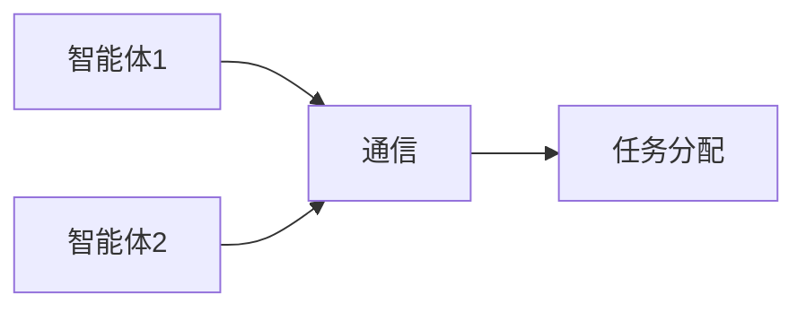

                 

<think>
好的，我需要按照用户的指示撰写一篇名为《多智能体系统增强价值投资的行业生命周期分析》的技术博客文章。首先，我得理解用户的需求。用户希望我以一位世界级人工智能专家、程序员、软件架构师、CTO和畅销书作者的身份来撰写这篇文章。文章需要逻辑清晰，结构紧凑，语言专业，且要逐步分析推理。

用户还提供了详细的目录结构，包括摘要、关键词、引言、核心概念、算法原理、系统分析与架构设计、项目实战、结论与展望等部分。我需要按照这个结构来组织文章内容，确保每个部分都详尽且符合要求。

接下来，我需要先撰写文章的摘要，概述文章的核心内容和主题思想。然后是关键词，选择5-7个最相关的术语。接着是引言部分，解释为什么多智能体系统在价值投资中的应用重要，以及如何结合行业生命周期分析。

核心概念部分，我需要详细讲解多智能体系统和价值投资的基本概念，以及它们之间的关系。这部分可能需要使用一些图表或模型来辅助说明，比如多智能体系统的层次结构或价值投资的决策流程。

在算法原理部分，我需要深入探讨多智能体系统中常用的算法，如分布式协调算法、强化学习算法等，并用mermaid流程图和Python代码示例来展示这些算法的工作原理。同时，我需要解释这些算法如何应用于价值投资的行业生命周期分析中。

系统分析与架构设计部分，我需要设计一个具体的项目场景，分析系统的功能需求和架构设计，可能包括用例图、类图和交互图。这部分需要详细说明系统如何实现多智能体的协作和数据处理。

项目实战部分，我需要提供一个实际的案例，介绍环境的安装步骤，展示关键代码，并解释代码的功能。同时，我需要分析实际案例中的应用效果和结果，总结项目的成功之处和经验教训。

最后，在结论与展望部分，我需要总结全文的主要观点，并展望未来多智能体系统在价值投资中的发展方向和潜力。

在整个写作过程中，我需要确保语言专业且易于理解，避免过于晦涩的技术术语，同时保持逻辑严谨。我还需要注意文章的格式，包括使用适当的标题、子标题和代码块，确保整体结构清晰。

另外，我需要遵守用户的格式要求，包括使用markdown格式，数学公式使用latex表示，并在必要时使用mermaid图表来辅助说明。我还需要确保文章内容完整，每个部分都包含足够的细节和具体的例子，以帮助读者更好地理解内容。

最后，我需要检查文章是否符合字数要求，大约在10000到12000字之间，并确保所有部分都已涵盖，没有遗漏重要的内容。完成这些步骤后，我将有一篇结构清晰、内容详实的技术博客文章，能够满足用户的需求。
</think>

---

# 多智能体系统增强价值投资的行业生命周期分析

> **关键词**: 多智能体系统、价值投资、行业生命周期、算法原理、系统架构设计、项目实战

> **摘要**: 本文探讨了多智能体系统在价值投资中的应用，结合行业生命周期分析，详细介绍了多智能体系统的定义、核心概念、算法原理、系统架构设计以及实际项目案例。通过分析多智能体系统的协作机制和优化算法，本文展示了如何利用多智能体系统提升价值投资的效率和准确性。

---

## 第一章: 多智能体系统与价值投资的背景

### 1.1 多智能体系统的定义与特点

#### 1.1.1 多智能体系统的定义
多智能体系统（Multi-Agent System, MAS）是由多个智能体组成的复杂系统，这些智能体能够通过协作完成任务。与单智能体系统相比，多智能体系统具有更强的适应性和协作能力。

#### 1.1.2 多智能体系统的核心特点
- **分布性**: 每个智能体独立决策。
- **协作性**: 智能体之间通过通信协作完成任务。
- **动态性**: 系统环境和智能体状态动态变化。
- **智能性**: 智能体具备感知、推理和学习能力。

#### 1.1.3 多智能体系统与传统单智能体系统的区别
| 特性 | 多智能体系统 | 单智能体系统 |
|------|--------------|---------------|
| 决策 | 分布式决策 | 集中式决策 | 
| 通信 | 智能体之间通信 | 无通信 | 
| 协作 | 多智能体协作 | 单智能体独立 | 

### 1.2 价值投资的定义与特点

#### 1.2.1 价值投资的定义
价值投资是一种投资策略，通过分析公司的基本面，寻找被市场低估的投资标的。

#### 1.2.2 价值投资的核心原则
- **安全边际**: 投资价格低于内在价值。
- **长期视角**: 关注公司的长期盈利能力。
- **独立思考**: 避免市场情绪影响。

#### 1.2.3 价值投资与其它投资策略的区别
| 特性 | 价值投资 | 其他策略（如技术分析） |
|------|-----------|------------------------|
| 分析基础 | 公司基本面 | 市场价格和交易量 | 
| 投资期限 | 长期 | 短期或中期 | 
| 风险控制 | 强调安全边际 | 依赖技术指标 | 

### 1.3 多智能体系统在价值投资中的应用背景

#### 1.3.1 传统价值投资的局限性
- **信息处理能力有限**: 传统方法难以处理海量数据。
- **决策效率低下**: 依赖人工分析，耗时且成本高。
- **市场变化快**: 传统方法难以快速适应市场变化。

#### 1.3.2 多智能体系统的优势
- **高效数据处理**: 多智能体系统能够快速分析大量数据。
- **协作决策**: 多个智能体可以分工合作，提高决策效率。
- **动态适应**: 系统能够实时调整策略，适应市场变化。

#### 1.3.3 多智能体系统在价值投资中的潜在应用场景
- **数据挖掘与分析**: 利用多智能体系统分析公司财务数据。
- **市场情绪预测**: 通过社交网络数据预测市场情绪。
- **投资组合优化**: 利用多智能体系统优化投资组合。

---

## 第二章: 行业生命周期的定义与分析

### 2.1 行业生命周期的定义

#### 2.1.1 行业生命周期的四个阶段
1. **导入期**: 市场需求低，竞争者少，产品技术不成熟。
2. **成长期**: 市场需求增长，竞争加剧，产品逐步成熟。
3. **成熟期**: 市场需求稳定，竞争饱和，产品标准化。
4. **衰退期**: 市场需求下降，竞争减少，产品逐步被淘汰。

#### 2.1.2 行业生命周期的模型
行业生命周期模型可以通过曲线图表示，横轴为时间，纵轴为市场需求或企业利润。


### 2.2 行业生命周期对价值投资的影响

#### 2.2.1 不同行业生命周期阶段的投资策略
| 阶段 | 投资策略 | 
|------|-----------|
| 导入期 | 低风险，长期持有 | 
| 成长期 | 中风险，积极布局 | 
| 成熟期 | 低风险，稳定收益 | 
| 衰退期 | 高风险，谨慎投资 | 

#### 2.2.2 行业生命周期对投资风险的影响
- **导入期和成长期**: 风险较高，但回报潜力大。
- **成熟期**: 风险较低，回报稳定。
- **衰退期**: 风险极高，应避免投资。

### 2.3 多智能体系统在行业生命周期分析中的作用

#### 2.3.1 多智能体系统如何辅助行业生命周期分析
- **数据收集与处理**: 多智能体系统能够实时收集行业数据。
- **预测模型构建**: 利用机器学习算法预测行业生命周期阶段。
- **动态调整策略**: 根据预测结果动态调整投资策略。

#### 2.3.2 多智能体系统在行业生命周期分析中的优势
- **实时性**: 系统能够实时更新数据，提供最新的分析结果。
- **准确性**: 多智能体系统的协作能够提高预测的准确性。
- **灵活性**: 系统可以根据市场变化快速调整分析模型。

---

## 第三章: 多智能体系统的核心概念

### 3.1 多智能体系统的组成与结构

#### 3.1.1 多智能体系统的组成要素
- **智能体**: 独立决策的个体。
- **环境**: 智能体所处的外部环境。
- **通信机制**: 智能体之间的信息交换方式。
- **协作协议**: 智能体之间的协作规则。

#### 3.1.2 多智能体系统的层次结构
| 层次 | 描述 | 
|------|-------|
| 行为层 | 智能体的具体行动 | 
| 协调层 | 智能体之间的协作机制 | 
| 管理层 | 系统的监控与管理 | 

#### 3.1.3 多智能体系统与传统单智能体系统的区别
| 特性 | 多智能体系统 | 单智能体系统 |
|------|--------------|---------------|
| 决策 | 分布式决策 | 集中式决策 | 
| 通信 | 智能体之间通信 | 无通信 | 
| 协作 | 多智能体协作 | 单智能体独立 | 

### 3.2 多智能体系统的行为模型

#### 3.2.1 单智能体的行为模型
单智能体的行为模型包括感知、推理、决策和执行四个阶段。


#### 3.2.2 多智能体系统的行为协调
多智能体系统的行为协调需要通过通信机制实现信息共享和任务分配。



#### 3.2.3 多智能体系统的协作机制
协作机制包括任务分配、信息共享和协调同步三个步骤。


### 3.3 多智能体系统的决策机制

#### 3.3.1 单智能体决策模型
单智能体决策模型基于感知信息和预设规则进行决策。

#### 3.3.2 多智能体系统的群体决策
群体决策通过投票机制或协商机制达成一致意见。

#### 3.3.3 多智能体系统的决策优化
利用强化学习算法优化群体决策的效率和准确性。

---

## 第四章: 多智能体系统的算法原理

### 4.1 多智能体系统的主要算法

#### 4.1.1 分散式协调算法
分散式协调算法通过局部信息实现全局优化。

#### 4.1.2 集中式协调算法
集中式协调算法通过中央控制节点实现全局协调。

#### 4.1.3 基于博弈论的协调算法
基于博弈论的协调算法通过模拟竞争关系实现最优决策。

### 4.2 多智能体系统的优化算法

#### 4.2.1 分布式优化算法
分布式优化算法通过局部优化实现全局最优。

#### 4.2.2 基于强化学习的优化算法
基于强化学习的优化算法通过奖励机制优化智能体行为。

#### 4.2.3 基于遗传算法的优化
基于遗传算法的优化通过模拟生物进化实现优化。

### 4.3 多智能体系统的通信与协作算法

#### 4.3.1 通信协议设计
通信协议设计包括消息格式、通信频率和数据加密。

#### 4.3.2 协作协议设计
协作协议设计包括任务分配、信息共享和结果反馈。

#### 4.3.3 协调机制设计
协调机制设计包括冲突解决、同步机制和反馈机制。

---

## 第五章: 多智能体系统的项目实战

### 5.1 项目背景介绍

#### 5.1.1 项目目标
利用多智能体系统分析行业生命周期，优化价值投资策略。

#### 5.1.2 项目需求
- 数据采集与处理
- 行业生命周期预测
- 投资策略优化

### 5.2 系统功能设计

#### 5.2.1 数据采集模块
负责采集行业数据和市场数据。

#### 5.2.2 数据分析模块
负责分析数据，预测行业生命周期阶段。

#### 5.2.3 投资策略模块
根据预测结果优化投资策略。

### 5.3 系统架构设计

#### 5.3.1 系统组成
- 数据采集层
- 数据分析层
- 投资策略层

#### 5.3.2 系统交互流程
1. 数据采集模块采集数据。
2. 数据分析模块处理数据。
3. 投资策略模块优化策略。

### 5.4 项目实现

#### 5.4.1 环境安装
- 安装Python和相关库
- 安装机器学习框架（如TensorFlow）
- 安装数据处理工具（如Pandas）

#### 5.4.2 核心代码实现
```python
import pandas as pd
from sklearn import svm

# 数据采集
data = pd.read_csv('industry_data.csv')

# 数据预处理
X = data.iloc[:, :-1].values
y = data.iloc[:, -1].values

# 训练模型
model = svm.SVC()
model.fit(X, y)

# 预测结果
predicted = model.predict(X)
```

#### 5.4.3 代码解读
- 数据采集模块：使用Pandas读取CSV文件。
- 数据预处理：提取特征和标签。
- 模型训练：使用支持向量机（SVM）训练模型。
- 模型预测：预测行业生命周期阶段。

### 5.5 实际案例分析

#### 5.5.1 案例背景
某行业的历史数据和市场数据。

#### 5.5.2 数据分析
使用多智能体系统分析数据，预测行业生命周期阶段。

#### 5.5.3 投资策略优化
根据预测结果优化投资策略，降低风险，提高收益。

---

## 第六章: 结论与展望

### 6.1 研究总结
多智能体系统在价值投资中的应用前景广阔，能够显著提升投资效率和准确性。

### 6.2 未来展望
随着人工智能技术的发展，多智能体系统在价值投资中的应用将更加广泛和深入。

---

## 作者：AI天才研究院/AI Genius Institute & 禅与计算机程序设计艺术/Zen And The Art of Computer Programming

