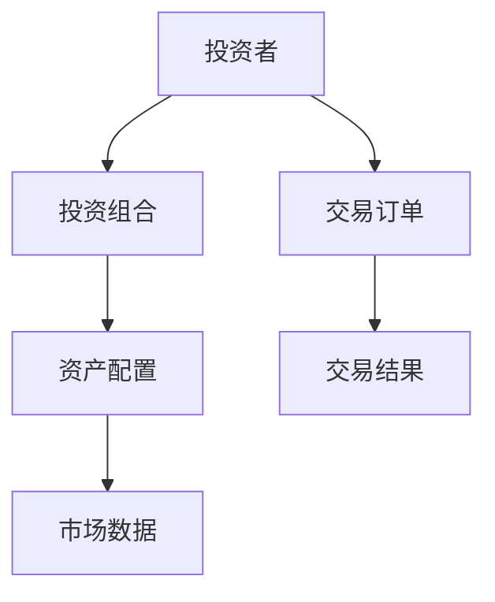
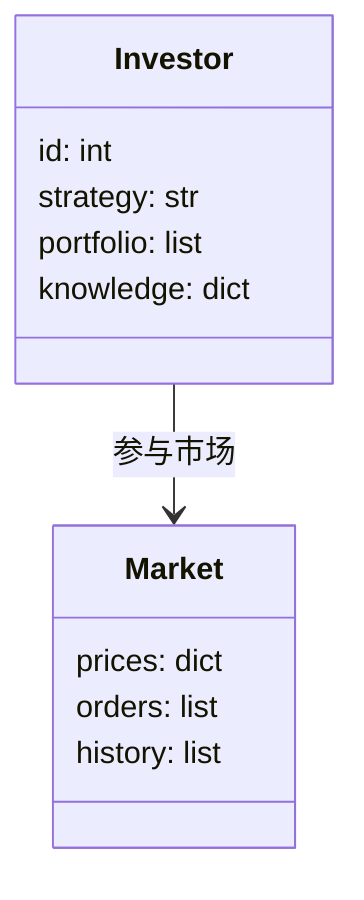
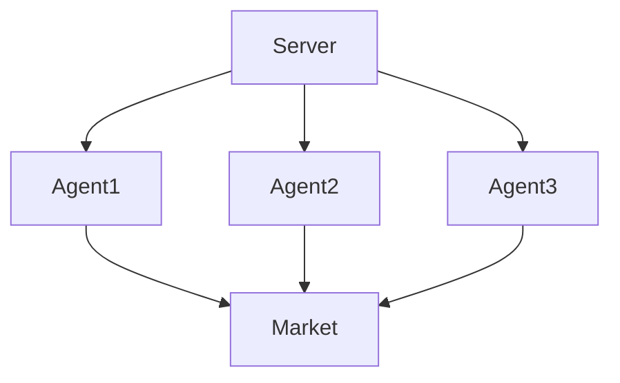
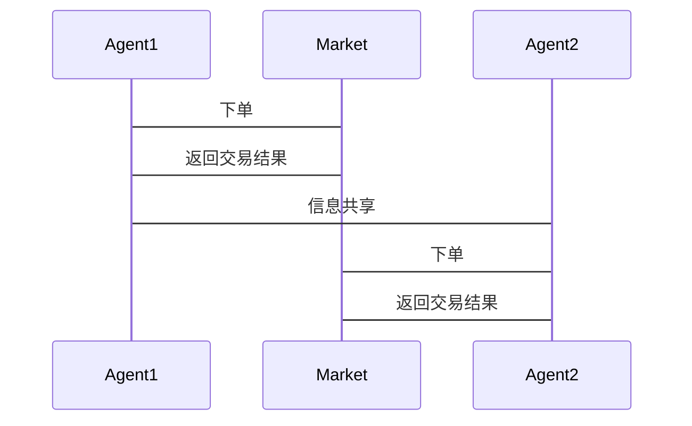

                 


# 多智能体系统模拟机构投资行为

> 关键词：多智能体系统，机构投资行为，金融建模，分布式计算，人工智能

> 摘要：本文探讨如何利用多智能体系统模拟机构投资行为。通过分析多智能体系统的原理、机构投资行为的特征，结合算法设计和系统架构，构建一个能够模拟机构投资者决策过程的系统。文章内容涵盖背景介绍、核心概念、算法原理、系统架构设计、项目实战及最佳实践，为读者提供全面的指导。

---

## 目录

1. [背景介绍](#背景介绍)
2. [核心概念与联系](#核心概念与联系)
3. [算法原理讲解](#算法原理讲解)
4. [系统分析与架构设计](#系统分析与架构设计)
5. [项目实战](#项目实战)
6. [最佳实践](#最佳实践)

---

## 第一部分: 背景介绍

### 1.1 多智能体系统概述

#### 1.1.1 多智能体系统的定义与特点
多智能体系统（Multi-Agent System, MAS）由多个智能体组成，这些智能体通过协作完成复杂任务。其特点包括：
- **自主性**：智能体能够自主决策。
- **反应性**：能感知环境并做出实时反应。
- **协作性**：通过通信和协作完成共同目标。
- **分布性**：智能体分布在网络中，不存在中心控制点。

#### 1.1.2 多智能体系统的组成与结构
多智能体系统由以下部分组成：
- **智能体**：具有感知、决策和执行能力的实体。
- **环境**：智能体所处的外部世界，包括物理环境和信息环境。
- **通信机制**：智能体之间交换信息的方式。
- **协作协议**：定义智能体协作规则的协议。

#### 1.1.3 多智能体系统的金融应用
在金融领域，多智能体系统可用于模拟市场行为、优化投资组合和风险管理。机构投资者的行为复杂，涉及多个决策者和策略，适合用多智能体系统进行建模。

### 1.2 机构投资行为概述

#### 1.2.1 机构投资行为的定义
机构投资行为指机构投资者（如基金、保险公司）在金融市场中的投资决策和交易行为。这些行为受组织结构、投资策略和市场环境影响。

#### 1.2.2 机构投资行为的特点
- **理性决策**：基于数据分析和模型预测。
- **团队协作**：涉及多个决策者和部门。
- **风险控制**：注重资产配置和风险管理。
- **动态调整**：根据市场变化实时调整投资策略。

#### 1.2.3 机构投资行为的分类
机构投资行为可分类为：
1. **被动型**：跟踪指数，低频交易。
2. **主动型**：主动选股，高频交易。
3. **量化型**：基于算法和数据进行交易。

---

## 第二部分: 多智能体系统模拟机构投资行为的背景与意义

### 2.1 问题背景

#### 2.1.1 传统金融建模的局限性
传统金融建模通常假设市场参与者理性且同质化，但实际情况中，机构投资者行为多样且复杂。传统模型难以捕捉个体差异和非理性行为。

#### 2.1.2 多智能体系统的优势
多智能体系统能够模拟个体差异和交互，适合分析复杂系统的动态行为。通过模拟多个智能体的协作与竞争，可以更真实地反映金融市场。

#### 2.1.3 机构投资行为模拟的必要性
机构投资者在金融市场中占据重要地位，其行为影响市场波动。模拟机构投资行为有助于理解市场动态，优化投资策略。

### 2.2 问题描述

#### 2.2.1 机构投资行为的复杂性
机构投资者涉及多个决策者，其行为受内部政策、市场信息和外部环境影响。行为具有异质性和动态性。

#### 2.2.2 多智能体系统在模拟中的作用
多智能体系统可以建模多个机构投资者，每个机构智能体具有独特的决策规则和目标。通过模拟这些智能体的交互，可以观察市场行为。

#### 2.2.3 模拟的目标与边界
目标：模拟机构投资者的行为，分析市场动态。边界：不考虑散户和非机构投资者，专注于机构行为。

---

## 第三部分: 多智能体系统的核心概念与联系

### 3.1 多智能体系统的核心概念

#### 3.1.1 智能体的定义与属性
智能体是具有感知、决策和执行能力的实体。属性包括：
- **知识库**：存储领域知识和历史数据。
- **决策模型**：基于知识库生成决策。
- **通信接口**：与其他智能体交换信息。

#### 3.1.2 智能体的协作机制
协作机制包括：
- **任务分配**：智能体根据自身能力分配任务。
- **信息共享**：通过通信机制交换信息。
- **协调同步**：确保协作过程一致。

#### 3.1.3 智能体的通信与信息共享
通信机制包括：
- **消息传递**：通过消息队列或WebSocket进行通信。
- **信息共享**：使用共享数据库或事件总线同步信息。

### 3.2 机构投资行为的核心要素

#### 3.2.1 机构投资者的决策机制
机构投资者的决策涉及：
- **数据采集**：收集市场数据和内部信息。
- **决策模型**：基于数据分析生成投资策略。
- **执行决策**：下单交易或调整投资组合。

#### 3.2.2 机构投资行为的理性与非理性
机构投资者在理性决策中使用量化模型，在非理性行为中受情绪和市场环境影响。多智能体系统可以模拟这两种行为。

#### 3.2.3 机构投资行为的异质性
不同机构投资者的决策规则和目标不同，导致行为异质性。多智能体系统需要建模这些差异。

### 3.3 多智能体系统与机构投资行为的联系

#### 3.3.1 智能体的属性特征对比
| 特征    | 机构投资者智能体 |
|---------|-----------------|
| 知识库  | 投资策略、市场数据 |
| 决策模型 | 风险评估、收益预测 |
| 行为模式 | 被动型、主动型、量化型 |

#### 3.3.2 实体关系分析
使用ER图分析机构投资行为的实体关系：



---

## 第四部分: 算法原理讲解

### 4.1 算法选择与原理

#### 4.1.1 分布式计算算法
- **算法原理**：分布式计算将任务分配给多个智能体，每个智能体处理部分数据。
- **流程图**：
  ```mermaid
  graph TD
      Start --> 分配任务
      分配任务 --> 处理任务
      处理任务 --> 合并结果
      合并结果 --> 输出结果
  ```

#### 4.1.2 一致性算法
- **算法原理**：一致性算法确保分布式系统中的数据一致性。
- **数学模型**：
  $$ \text{一致性} = \sum_{i=1}^{n} |a_i - a_{i+1}| $$
  其中，$a_i$ 表示各智能体的值。

#### 4.1.3 博弈论模型
- **算法原理**：博弈论模型模拟智能体之间的竞争与合作。
- **公式示例**：
  $$ \text{收益} = \sum_{i=1}^{m} p_i \times q_i $$
  其中，$p_i$ 表示策略概率，$q_i$ 表示收益权重。

### 4.2 算法实现

#### 4.2.1 分布式计算实现
```python
import threading

def distribute_task(tasks, agents):
    for task in tasks:
        agent = agents[task % len(agents)]
        agent.start_task(task)

class Agent(threading.Thread):
    def start_task(self, task):
        # 处理任务
        pass
```

#### 4.2.2 一致性算法实现
```python
def consistency_algorithm(values):
    avg = sum(values) / len(values)
    for i in range(len(values)):
        values[i] = avg
    return values
```

#### 4.2.3 博弈论模型实现
```python
def game_theory_model(agents):
    payoff = {}
    for agent in agents:
        payoff[agent] = agent.strategy * agent.rewards
    return payoff
```

---

## 第五部分: 系统分析与架构设计

### 5.1 系统分析

#### 5.1.1 问题场景
模拟多个机构投资者在股票市场中的交易行为，分析市场波动。

#### 5.1.2 项目介绍
构建一个基于多智能体系统的机构投资行为模拟平台。

### 5.2 系统功能设计

#### 5.2.1 领域模型设计


### 5.3 系统架构设计

#### 5.3.1 系统架构


#### 5.3.2 系统接口设计
- **投资者接口**：发送交易订单，接收市场数据。
- **市场接口**：处理订单，更新市场数据。

### 5.4 系统交互设计

#### 5.4.1 智能体交互流程


---

## 第六部分: 项目实战

### 6.1 环境安装

#### 6.1.1 安装Python
```bash
python --version
pip install --upgrade pip
```

#### 6.1.2 安装依赖
```bash
pip install numpy pandas matplotlib
```

### 6.2 系统核心实现

#### 6.2.1 核心代码实现
```python
class InvestorAgent:
    def __init__(self, id, strategy):
        self.id = id
        self.strategy = strategy
        self.portfolio = []
    
    def decide_trade(self, market_data):
        # 根据策略生成决策
        pass
    
    def execute_trade(self, order):
        # 执行交易
        pass
```

#### 6.2.2 代码功能解读
- **InvestorAgent**：机构投资者智能体，根据市场数据生成决策并执行交易。
- **Market**：市场模块，处理订单和更新价格。

### 6.3 实际案例分析

#### 6.3.1 案例分析
模拟三个机构投资者在股票市场中的交易行为，分析市场波动。

#### 6.3.2 代码实现
```python
import numpy as np

class Market:
    def __init__(self, assets):
        self.assets = assets
        self.prices = {asset: 100 for asset in assets}
    
    def update_prices(self, orders):
        for asset in self.prices:
            self.prices[asset] += np.random.normal(0, 0.01)
        return self.prices

# 初始化市场
market = Market(['AAPL', 'GOOGL', 'MSFT'])

# 初始化投资者
agents = [
    InvestorAgent(1, 'mean_reversion'),
    InvestorAgent(2, 'momentum'),
    InvestorAgent(3, 'value')
]

# 模拟交易
orders = []
for agent in agents:
    data = agent.decide_trade(market.prices)
    order = agent.execute_trade(data)
    orders.append(order)

# 更新市场
market.update_prices(orders)
```

### 6.4 项目小结
通过项目实战，我们成功构建了一个多智能体系统的机构投资行为模拟平台。通过代码实现和案例分析，验证了系统的可行性和有效性。

---

## 第七部分: 最佳实践

### 7.1 小结
多智能体系统能够有效模拟机构投资行为，但实现过程中需要注意系统性能和智能体协作机制的设计。

### 7.2 注意事项
- **系统性能**：优化通信机制，减少延迟。
- **代码可维护性**：模块化设计，便于扩展。
- **数据安全**：保护机构投资者的隐私数据。

### 7.3 拓展阅读
- 《Multi-Agent Systems: Algorithm and Applications》
- 《Financial Modeling with Python》

---

## 作者信息
作者：AI天才研究院 & 禅与计算机程序设计艺术

---

通过以上步骤，我们详细讲解了多智能体系统模拟机构投资行为的背景、核心概念、算法原理、系统架构设计、项目实战及最佳实践。希望本文能为读者提供有价值的参考和指导。

