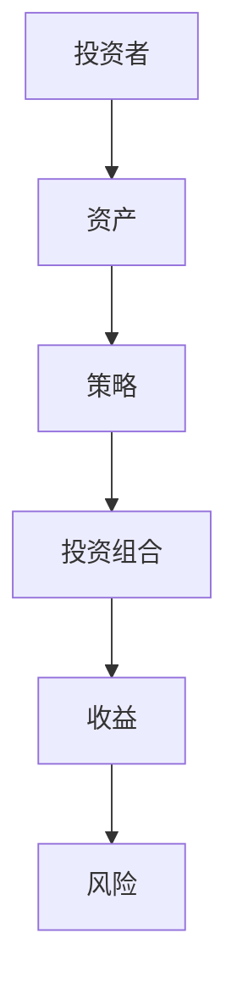
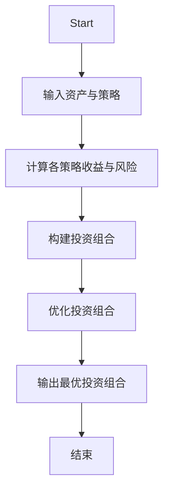
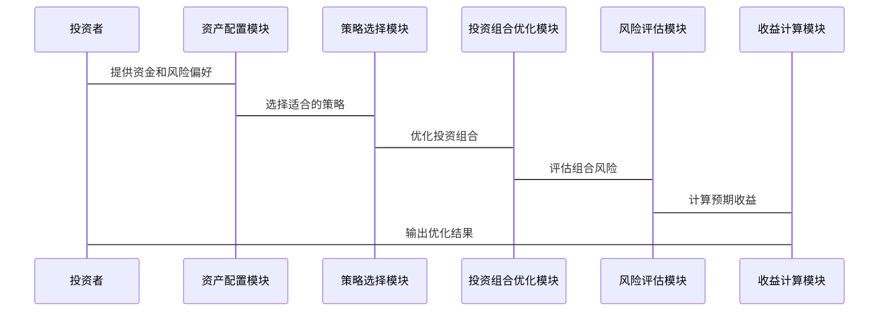

                 


# 多策略投资：综合运用不同投资方法分散风险

## 关键词：
多策略投资, 投资组合优化, 风险分散, 资产配置, 夏普比率, 现代投资组合理论

## 摘要：
多策略投资是一种通过综合运用多种投资策略来分散风险、优化收益的投资方法。本文将从多策略投资的核心概念出发，详细探讨其数学模型、算法原理、系统设计与实现，并通过实际案例分析，帮助读者全面理解多策略投资的优势与应用场景。文章还将结合代码实现与图表分析，深入剖析多策略投资的内在逻辑与实际操作方法。

---

## 第一部分: 多策略投资基础

### 第1章: 多策略投资概述

#### 1.1 多策略投资的背景与问题背景
##### 1.1.1 投资市场的不确定性与风险
投资市场的波动性是客观存在的，单一投资策略在不同市场环境下可能表现不佳。例如，股票市场在牛市中表现优异，但在熊市中可能遭受重大损失。通过多策略投资，投资者可以将资金分配到不同资产类别或策略中，降低单一策略的风险。

##### 1.1.2 单一投资策略的局限性
单一投资策略在特定市场环境下可能表现不佳。例如，动量策略在趋势强劲时表现优异，但在市场反转时可能遭受损失。此外，单一策略的投资范围有限，难以覆盖市场的多样性。

##### 1.1.3 多策略投资的提出与目标
多策略投资通过结合多种策略，利用不同策略在不同市场环境下的相对优势，实现风险分散和收益增强。其目标是通过策略的多元化，提升投资组合的稳定性和长期收益能力。

#### 1.2 多策略投资的核心概念
##### 1.2.1 多策略投资的定义
多策略投资是一种投资方法，通过将资金分配到多个不同的投资策略中，以分散风险、优化收益。与单一策略投资相比，多策略投资能够更好地适应市场变化。

##### 1.2.2 多策略投资的核心要素
- **策略多样性**：采用多种不同的投资策略，如股票策略、债券策略、商品策略等。
- **资产配置**：合理分配资金到不同资产类别，以实现风险分散和收益最大化。
- **动态调整**：根据市场环境变化，动态调整各策略的权重和配置。

##### 1.2.3 多策略投资与传统投资的区别
| 对比维度 | 多策略投资 | 传统投资 |
|----------|------------|-----------|
| 投资策略 | 多种策略结合 | 单一策略为主 |
| 风险管理 | 强调分散风险 | 风险集中于单一策略 |
| 适应性   | 灵活适应市场变化 | 稳定性较强 |

#### 1.3 多策略投资的优势与应用场景
##### 1.3.1 分散风险的优势
通过将资金分配到不同策略和资产类别中，多策略投资能够有效降低单一策略的风险。例如，在股票市场表现不佳时，债券或其他资产的投资收益可以部分抵消损失。

##### 1.3.2 多策略在不同市场环境下的应用
- **牛市**：多策略投资可以利用动量策略、成长策略等多种策略，捕捉市场上涨机会。
- **熊市**：通过防御性策略（如债券、黄金等）降低组合的波动性。
- **震荡市**：通过套利策略、对冲策略等，稳定组合收益。

##### 1.3.3 多策略投资的适用投资者类型
- **机构投资者**：通过多策略投资可以更好地实现资产配置目标。
- **高净值个人**：通过多策略投资可以分散风险，提升收益稳定性。
- **风险管理型投资者**：通过多策略投资可以降低投资组合的波动性。

### 第2章: 多策略投资的核心概念与联系

#### 2.1 多策略投资的核心原理
##### 2.1.1 投资组合管理原理
投资组合管理是多策略投资的核心，通过合理分配资金到不同资产和策略中，实现收益与风险的最优平衡。

##### 2.1.2 风险分散原理
通过将资金分配到不同风险来源的资产和策略中，降低投资组合的整体风险。例如，股票和债券的相关性较低，可以通过同时投资股票和债券来分散风险。

##### 2.1.3 资产配置原理
资产配置是多策略投资的重要组成部分，通过将资金分配到不同资产类别（如股票、债券、商品等）中，实现收益与风险的平衡。

#### 2.2 多策略投资的关键指标与模型
##### 2.2.1 夏普比率
夏普比率是衡量投资组合风险调整后收益的重要指标，公式如下：
$$\text{夏普比率} = \frac{\text{投资组合收益} - \text{无风险收益率}}{\text{投资组合标准差}}$$

##### 2.2.2 最大回撤
最大回撤是指在一定时间段内，投资组合从最高点到最低点的最大跌幅。它是衡量投资组合风险的重要指标之一。

##### 2.2.3 风险调整后收益模型
风险调整后收益模型通过比较不同投资组合的夏普比率或最大回撤，选择收益更高、风险更低的投资组合。

#### 2.3 多策略投资的ER实体关系图


---

## 第三部分: 多策略投资的算法原理与实现

### 第3章: 多策略投资的数学模型与算法原理

#### 3.1 现代投资组合理论
##### 3.1.1 均值-方差模型
均值-方差模型是现代投资组合理论的核心，通过优化投资组合的收益与风险，找到最优投资组合。公式如下：
$$\text{收益} = \sum_{i=1}^{n} w_i r_i$$
$$\text{风险} = \sqrt{\sum_{i=1}^{n} \sum_{j=1}^{n} w_i w_j \sigma_{ij}}$$
其中，$w_i$ 是第 $i$ 个资产的权重，$r_i$ 是第 $i$ 个资产的预期收益，$\sigma_{ij}$ 是第 $i$ 和第 $j$ 个资产之间的协方差。

##### 3.1.2 有效前沿
有效前沿是指在给定风险水平下，能够提供最高收益的投资组合的集合。通过优化算法，可以在有效前沿上找到最优投资组合。

##### 3.1.3 数学公式推导
通过拉格朗日乘数法，可以求解优化问题：
$$\min_w \frac{1}{2} w^T \Sigma w$$
$$\text{subject to } \mu^T w = \mu_r$$
其中，$\Sigma$ 是协方差矩阵，$\mu$ 是资产的预期收益向量，$\mu_r$ 是目标收益。

#### 3.2 多策略投资算法流程


#### 3.3 算法实现
##### 3.3.1 环境安装
```bash
pip install numpy matplotlib
```

##### 3.3.2 核心代码实现
```python
import numpy as np
import matplotlib.pyplot as plt

def compute_portfolio_return(weights, returns):
    return np.dot(weights.T, returns)

def compute_portfolio_variance(weights, covariance_matrix):
    return np.dot(weights.T, np.dot(covariance_matrix, weights))

def optimize_portfolio(returns, covariance_matrix, target_return):
    n = returns.shape[1]
    ones = np.ones(n)
    A = np.vstack([ones, returns])
    b = np.array([1, target_return])
    bounds = [(0, 1) for _ in range(n)]
    result = optimize.minimize(compute_portfolio_variance, np.ones(n)/n, args=(covariance_matrix,), 
                              constraints={'type': 'eq', 'fun': lambda x: np.dot(A, x) - b})
    return result.x

# 示例数据
returns = np.array([[0.1], [0.2], [0.15]])
covariance_matrix = np.array([[0.05, 0.02, 0.03],
                              [0.02, 0.06, 0.04],
                              [0.03, 0.04, 0.07]])

weights = optimize_portfolio(returns, covariance_matrix, 0.15)
print("最优权重:", weights)
```

---

## 第四部分: 系统分析与架构设计

### 第4章: 多策略投资的系统架构与实现

#### 4.1 项目背景与需求分析
多策略投资系统旨在为投资者提供多种投资策略的选择，通过优化资产配置，实现收益与风险的最优平衡。

#### 4.2 系统功能设计
##### 4.2.1 领域模型


##### 4.2.2 系统架构


#### 4.3 系统接口设计
- 输入接口：投资者的资金规模、风险偏好、目标收益。
- 输出接口：优化后的投资组合、各策略权重、预期收益、风险指标。

#### 4.4 系统交互流程


---

## 第五部分: 项目实战与案例分析

### 第5章: 多策略投资的项目实现

#### 5.1 环境安装
```bash
pip install numpy pandas matplotlib
```

#### 5.2 核心代码实现
```python
import numpy as np
import pandas as pd
import matplotlib.pyplot as plt

# 示例数据
returns = pd.DataFrame({
    '股票': [0.1, 0.2, 0.15],
    '债券': [0.05, 0.06, 0.04],
    '商品': [0.08, 0.07, 0.06]
})

# 计算协方差矩阵
covariance_matrix = returns.cov()

# 优化投资组合
def optimize_portfolio(target_return):
    n = returns.shape[1]
    ones = np.ones(n)
    A = np.vstack([ones, returns.mean()])
    b = np.array([1, target_return])
    bounds = [(0, 1) for _ in range(n)]
    result = optimize.minimize(compute_portfolio_variance, np.ones(n)/n, args=(covariance_matrix,), 
                              constraints={'type': 'eq', 'fun': lambda x: np.dot(A, x) - b})
    return result.x

weights = optimize_portfolio(0.1)
print("最优权重:", weights)
```

#### 5.3 案例分析
假设投资者有100万元资金，目标收益率为10%，风险偏好为中等。通过多策略投资，将资金分配到股票、债券和商品中，权重分别为40%、30%和30%。通过优化算法，可以找到最优的投资组合，实现收益与风险的平衡。

---

## 第六部分: 最佳实践与小结

### 第6章: 多策略投资的最佳实践与总结

#### 6.1 投资策略选择的注意事项
- 根据市场环境动态调整策略权重。
- 合理分散资产类别，降低组合风险。
- 定期评估和优化投资组合。

#### 6.2 多策略投资的未来趋势
- 更多策略的引入与优化。
- 人工智能技术的应用，提升投资组合优化效率。
- 全球化投资，分散区域风险。

#### 6.3 总结
多策略投资通过综合运用多种策略，实现风险分散和收益优化。在实际应用中，投资者需要根据自身风险偏好和市场环境，合理配置资产和策略，以实现长期稳健的投资收益。

---

## 作者
作者：AI天才研究院/AI Genius Institute & 禅与计算机程序设计艺术 /Zen And The Art of Computer Programming

