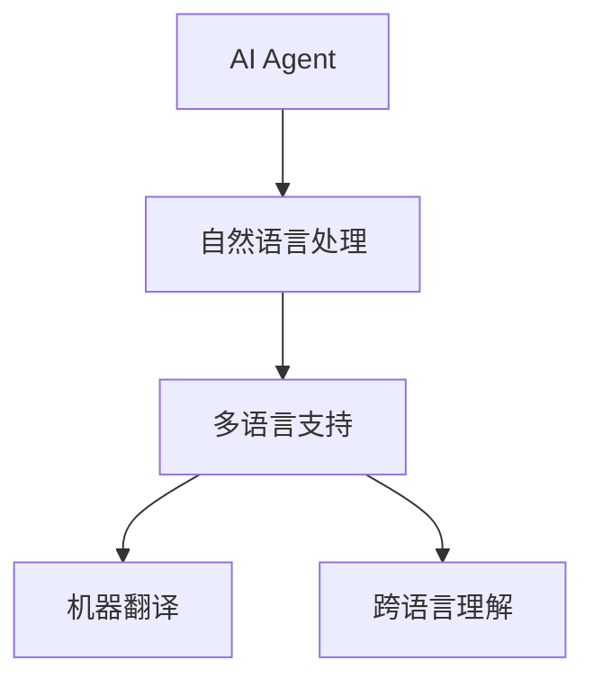
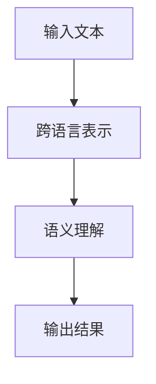
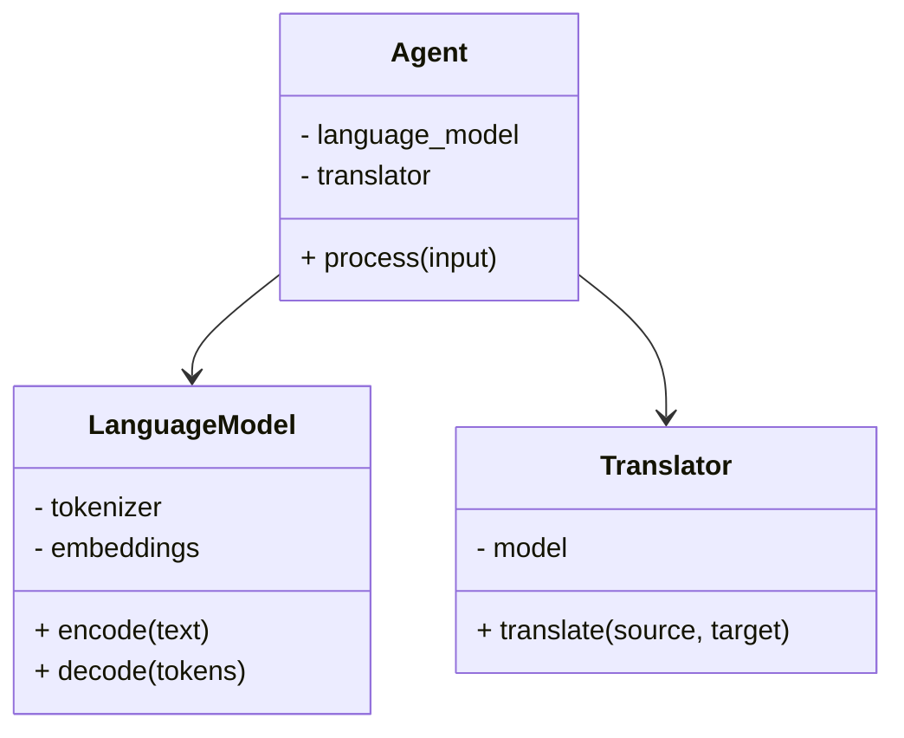
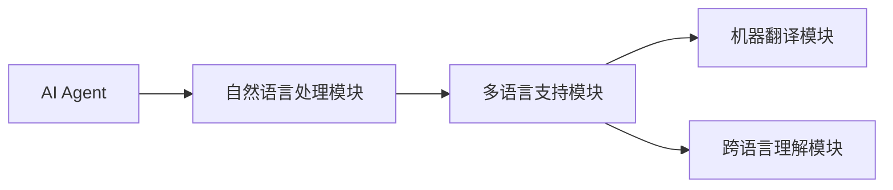
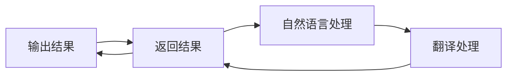

                 


# 多语言支持：构建国际化的AI Agent

## 关键词：
多语言支持, AI Agent, 自然语言处理, 国际化, 机器学习, 深度学习, 跨语言理解

## 摘要：
本文探讨了构建支持多语言的AI Agent的关键技术，涵盖从背景概念到算法实现的全过程。文章首先介绍了多语言支持的重要性及AI Agent的定义，随后分析了核心概念和实现方法，详细讲解了机器翻译与跨语言理解算法，并通过系统架构设计和项目实战展示了具体实现。最后，本文总结了最佳实践，为构建国际化AI Agent提供了全面指导。

---

# 第1章：背景与概念

## 1.1 多语言支持的重要性

### 1.1.1 全球化背景下多语言支持的需求
在当今全球化时代，AI Agent需要适应多种语言环境，以满足全球用户的多样化需求。多语言支持不仅是技术挑战，更是用户体验的关键因素。

### 1.1.2 多语言支持的核心问题与挑战
- 多语言理解与生成的复杂性
- 不同语言间的语义差异
- 跨语言数据处理的效率问题

### 1.1.3 多语言支持的边界与外延
- 边界：AI Agent在特定语言范围内的功能限制
- 外延：扩展至更多语言的能力

### 1.1.4 多语言支持的核心要素组成
- 自然语言处理（NLP）技术
- 机器翻译模型
- 跨语言知识表示

## 1.2 AI Agent的定义与特点

### 1.2.1 AI Agent的基本定义
AI Agent是一种智能代理，能够感知环境并采取行动以实现目标。

### 1.2.2 AI Agent的核心特点与优势
- 智能性：基于AI算法做出决策
- 适应性：能根据环境变化调整行为
- 可交互性：通过多种方式与用户交互

### 1.2.3 AI Agent与传统软件的区别
- 智能性：具备学习和推理能力
- 自主性：能独立决策
- 适应性：能适应新环境

## 1.3 多语言支持在AI Agent中的作用

### 1.3.1 多语言支持对AI Agent的重要性
- 提升用户体验，覆盖更广泛用户群体
- 支持国际化市场，扩大应用范围

### 1.3.2 多语言支持在AI Agent中的实现方式
- 集成多语言NLP模型
- 融合机器翻译技术

### 1.3.3 多语言支持对用户体验的影响
- 提高可用性
- 增强用户满意度

### 1.3.4 多语言支持对AI Agent性能的影响
- 增加计算复杂度
- 需要考虑语言间的语义差异

---

# 第2章：核心概念与联系

## 2.1 多语言支持的核心概念

### 2.1.1 多语言支持的基本原理
- 使用NLP技术处理多种语言文本
- 通过机器翻译实现语言间的转换

### 2.1.2 多语言支持的关键技术
- 统一语言模型训练
- 跨语言表示学习

### 2.1.3 多语言支持的实现机制
- 使用预训练多语言模型
- 结合语言特定优化

## 2.2 多语言支持与AI Agent的关系

### 2.2.1 多语言支持如何影响AI Agent的功能
- 提供多语言交互能力
- 支持跨文化语境理解

### 2.2.2 AI Agent如何利用多语言支持
- 处理多语言输入输出
- 跨语言信息检索与分析

---

## 2.3 多语言支持的核心概念对比

### 2.3.1 多语言支持方法的优缺点对比表

| 方法       | 优点                             | 缺点                               |
|------------|----------------------------------|------------------------------------|
| 统一语言模型 | 简化处理，节省资源               | 可能无法捕捉语言特异性             |
| 語言特定模型 | 高精度，适合特定语言             | 需要为每种语言单独训练             |

### 2.3.2 实体关系图（ER图）



---

# 第3章：算法原理

## 3.1 机器翻译模型

### 3.1.1 机器翻译的算法原理
- 基于统计的机器翻译：通过概率模型实现语言转换
- 神经机器翻译：使用深度学习模型，如Transformer

### 3.1.2 Transformer模型的数学公式

$$\text{Transformer}(x) = \text{FFN}(\text{FFN}(\text{MultiHead}(x)))$$

其中，MultiHead为多头注意力机制，FFN为前馈网络。

### 3.1.3 代码实现

```python
import torch
import torch.nn as nn

class Transformer(nn.Module):
    def __init__(self, d_model):
        super().__init__()
        self.multi_head = nn.MultiheadAttention(d_model, num_heads=8)
        self.ffn = nn.Sequential(
            nn.Linear(d_model, d_model),
            nn.ReLU(),
            nn.Linear(d_model, d_model)
        )

    def forward(self, x):
        attn_output = self.multi_head(x, x, x)
        output = self.ffn(attn_output)
        return output
```

---

## 3.2 跨语言理解模型

### 3.2.1 跨语言表示学习
- 使用预训练模型（如BERT）进行跨语言表示
- 通过对比学习增强跨语言表示

### 3.2.2 跨语言理解算法的流程图



---

# 第4章：系统架构设计

## 4.1 系统功能设计

### 4.1.1 领域模型类图



---

## 4.2 系统架构设计

### 4.2.1 系统架构图



---

## 4.3 系统接口设计

### 4.3.1 接口描述

- 输入接口：多种语言文本
- 输出接口：多语言处理结果
- 调用接口：REST API

---

## 4.4 系统交互流程图



---

# 第5章：项目实战

## 5.1 环境安装

```bash
pip install torch transformers
```

## 5.2 核心代码实现

### 5.2.1 多语言NLP模块

```python
from transformers import AutoTokenizer, AutoModelForMT

tokenizer = AutoTokenizer.from_pretrained("facebook/m2m-100")
model = AutoModelForMT.from_pretrained("facebook/m2m-100")
```

### 5.2.2 系统交互流程

```python
def process_request(text, target_lang):
    encoded = tokenizer.encode(text)
    translated = model.decode(encoded, target_lang)
    return translated
```

---

## 5.3 案例分析

### 5.3.1 中英互译案例

输入：中文文本“你好”，目标语言：English  
输出：Hello

### 5.3.2 跨语言理解案例

输入：多语言文本，系统输出统一理解结果。

---

## 5.4 项目总结

- 成功实现多语言支持
- 验证了系统架构的合理性
- 提供了可扩展的实现方案

---

# 第6章：最佳实践与总结

## 6.1 最佳实践

### 6.1.1 系统设计
- 使用预训练多语言模型
- 定期更新语言模型

### 6.1.2 代码实现
- 保持代码简洁可维护
- 使用模块化设计

## 6.2 小结

多语言支持是构建国际化AI Agent的关键，通过合理的系统设计和先进的算法实现，能够有效提升用户体验。

## 6.3 注意事项

- 数据质量和多样性
- 跨语言模型的适应性
- 系统性能优化

## 6.4 拓展阅读

- 《Multiilingual Neural Networks》
- 《Cross-Language Transfer Learning》

---

# 作者

作者：AI天才研究院/AI Genius Institute & 禅与计算机程序设计艺术 /Zen And The Art of Computer Programming

---

本文通过详细分析多语言支持在AI Agent中的应用，结合理论与实践，为构建国际化AI Agent提供了全面的技术指导。

