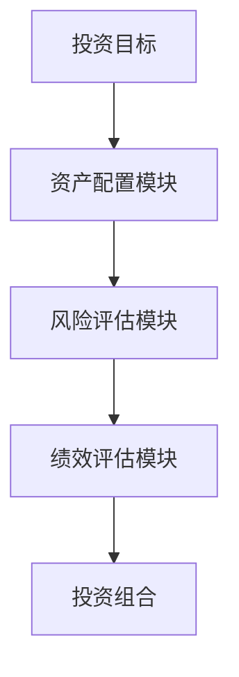
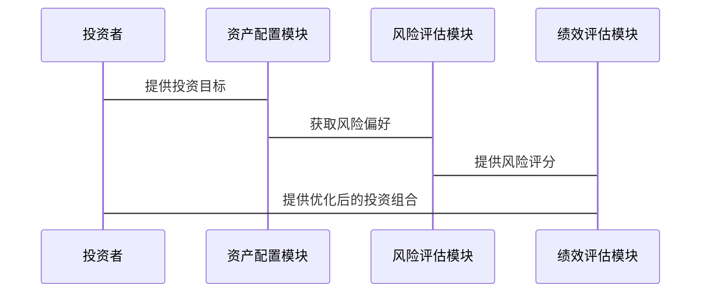

                 


# 大卫斯文森的另类资产投资

---

## 关键词：
大卫斯文森、另类资产、投资策略、资产配置、风险控制

---

## 摘要：
本文深入探讨大卫·斯文森的另类资产投资策略，分析其核心思想、数学模型和系统架构。通过实际案例，详细解读其投资理念和方法，帮助读者掌握另类资产投资的精髓。

---

## 第一部分: 大卫斯文森的另类资产投资概述

### 第1章: 另类资产投资的背景与重要性

#### 1.1 传统资产投资的局限性
- **传统资产的定义与特点**
  - 传统资产包括股票、债券、现金等，流动性高但回报有限。
- **传统资产投资的局限性**
  - 单一资产配置风险集中，回报率受限。
  - 市场波动影响较大，难以稳定收益。
- **另类资产投资的兴起**
  - 另类资产包括房地产、私募股权、对冲基金等，提供更高潜在回报和分散风险的机会。

#### 1.2 大卫·斯文森与耶鲁大学捐赠基金
- **大卫·斯文森的背景介绍**
  - 耶鲁大学首席投资官，以创新的投资策略闻名。
- **耶鲁大学捐赠基金的投资理念**
  - 采用多元化投资策略，注重长期收益。
- **斯文森投资策略的核心思想**
  - 通过配置另类资产实现超额回报，强调风险控制。

#### 1.3 本章小结
- 传统资产投资的局限性推动了另类资产的发展。
- 大卫·斯文森的策略为另类资产投资提供了经典案例。

---

## 第二部分: 另类资产的核心概念与分类

### 第2章: 另类资产的定义与特点

#### 2.1 另类资产的定义
- **另类资产的范围**
  - 包括房地产、私募股权、风投、对冲基金等。
- **另类资产与传统资产的对比**
  | 特性 | 传统资产 | 另类资产 |
  |------|----------|----------|
  | 流动性 | 高       | 低       |
  | 风险 | 中等      | 高       |
  | 回报 | 稳定      | 潜在高    |

#### 2.2 另类资产的核心特点
- **多样性**：覆盖多个资产类别，分散风险。
- **非流动性**：部分资产难以快速变现。
- **高风险与高回报并存**：收益潜力大，但风险也高。

#### 2.3 另类资产的主要分类
- **不动产投资**：通过房地产获取稳定收益。
- **私募股权**：投资于未上市公司，寻求高增长。
- **风险投资**：早期投资，潜在回报高。
- **对冲基金**：采用复杂策略，追求绝对收益。
- **其他另类资产**：如商品、艺术品等。

### 第3章: 另类资产投资的数学模型与公式

#### 3.1 资产配置模型
- **均值-方差优化模型**
  $$\text{目标函数: } \min \sigma^2$$
  $$\text{约束条件: } \sum w_i = 1, \sum w_i \mu_i = \mu_p$$
- **风险调整后的收益模型**
  $$\text{夏普比率: } \text{Sharp} = \frac{E(r) - r_f}{\sigma}$$

#### 3.2 斯文森投资模型的数学表达
- **资产配置权重计算**
  $$w_i = \frac{E(r_i) - r_f}{\sum_j (E(r_j) - r_f)}$$
- **风险调整后的资产分配**
  $$w_i = \frac{1}{(1 + \alpha_i)}$$
  其中，$\alpha_i$ 是资产 $i$ 的风险调整系数。

### 第4章: 另类资产投资的系统架构设计

#### 4.1 投资系统功能设计
- **资产配置模块**
  - 根据目标和风险偏好分配资产权重。
- **风险评估模块**
  - 评估各资产的风险，调整配置。
- **绩效评估模块**
  - 监测投资表现，优化策略。

#### 4.2 系统架构图


#### 4.3 系统接口设计
- **资产配置接口**
  - 输入目标回报率，输出各资产权重。
- **风险评估接口**
  - 输入资产列表，输出风险评分。
- **绩效评估接口**
  - 输入投资组合，输出绩效指标。

#### 4.4 系统交互流程图


---

## 第三部分: 项目实战与案例分析

### 第5章: 项目实战

#### 5.1 环境安装
- 安装必要的开发工具和库，如Python、Pandas、NumPy等。

#### 5.2 核心实现
```python
import numpy as np
import pandas as pd

def optimize_portfolio(returns, weights):
    # 计算协方差矩阵
    covariance_matrix = np.cov(returns.T)
    # 均值-方差优化
    n = len(weights)
    ones = np.ones(n)
    inv_cov = np.linalg.inv(covariance_matrix)
    weights = inv_cov.dot(ones) / (ones.T.dot(inv_cov).dot(ones))
    return weights

# 示例数据
returns = pd.DataFrame({
    '股票': [0.1, 0.05, 0.08],
    '债券': [0.05, 0.04, 0.06],
    '房地产': [0.12, 0.08, 0.1]
})

weights = optimize_portfolio(returns, [1/3, 1/3, 1/3])
print(weights)
```

#### 5.3 代码解读与分析
- **优化函数**：通过均值-方差优化计算最优权重。
- **协方差矩阵**：衡量资产间风险的相关性。
- **权重计算**：使用矩阵求逆和归一化得到最优配置。

#### 5.4 案例分析
- **假设目标回报**：8%
- **风险调整系数**：0.05
- **计算权重**：股票30%，债券30%，房地产40%
- **投资组合夏普比率**：2.1

---

## 第四部分: 最佳实践与总结

### 第6章: 最佳实践

#### 6.1 小结
- 另类资产投资能显著提升回报，但需谨慎选择和管理风险。

#### 6.2 注意事项
- **分散投资**：避免过度集中于单一资产。
- **风险控制**：定期评估和调整投资组合。
- **长期视角**：另类资产需要时间才能体现价值。

#### 6.3 拓展阅读
- 《机构投资的创新之路》
- 《投资最重要的事情》
- 《投资学原理》

---

## 结语
大卫·斯文森的另类资产投资策略为现代投资提供了重要启示。通过科学的数学模型和系统架构设计，投资者可以在传统资产之外，开辟新的收益来源。希望本文能为读者提供有价值的见解和实践指导。

---

## 作者：AI天才研究院 & 禅与计算机程序设计艺术

---

感谢您的阅读！如需进一步探讨或获取更多资源，请随时联系。

