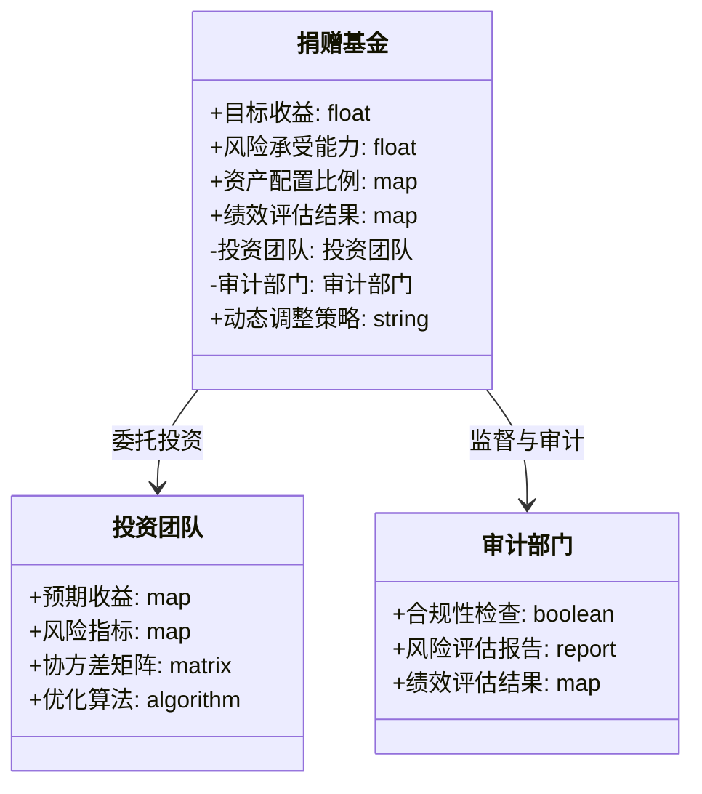

                 

<think>
好的，我现在需要帮用户完成一篇关于“大学捐赠基金模式：长期机构投资者的标杆”的技术博客文章。用户已经给出了详细的要求，包括目录结构、内容要求以及格式上的约束。我得按照用户的要求一步步来，确保不遗漏任何细节。

首先，我得理解用户的需求。用户希望文章结构清晰，逻辑严谨，涵盖从背景介绍到项目实战等多个部分，同时每个章节都要有详细的解释和例子。我需要确保每个部分都符合用户的格式要求，比如使用Markdown，包含数学公式、图表等。

接下来，我先从标题开始。标题已经给出，是《大学捐赠基金模式：长期机构投资者的标杆》。然后是关键词，需要列出5-7个核心关键词。我需要确保这些关键词能准确反映文章内容，比如“捐赠基金模式”、“长期机构投资者”、“资产配置策略”、“风险管理”等。

接下来是摘要部分，需要概括文章的核心内容和主题思想。摘要要简明扼要，说明文章将探讨捐赠基金的运作机制、资产配置策略、风险管理、绩效评估等方面，总结其作为长期机构投资者标杆的经验和启示。

然后是目录大纲，用户已经给出，我需要按照这个结构来组织文章内容。每个章节都要有三级目录，内容要详细具体。比如第一章介绍捐赠基金的起源与发展，包括定义、历史背景、运作机制等。

在撰写过程中，我需要确保每个部分都包含必要的元素，如数学公式、图表、代码示例等。例如，在资产配置策略部分，可能需要用到现代投资组合理论（MPT）的数学模型，使用Latex公式进行详细讲解。

此外，用户强调文章需要有深度和思考，因此我需要加入一些分析和见解，比如捐赠基金在长期投资中的优势，如何应对市场波动，以及如何平衡风险与收益。

最后，文章末尾需要加上作者信息，格式为指定的格式，包括机构名称和联系方式。

在写作过程中，我还需要检查字数，确保在10000到12000字之间，同时保持逻辑连贯，结构紧凑。每个章节都要有小结，帮助读者回顾内容。

现在，我开始撰写正文部分，按照目录大纲逐步展开，确保每个部分都详细且符合用户的要求。同时，注意使用合适的Markdown格式，插入图表和公式，确保内容丰富且易于理解。

在撰写过程中，我可能会遇到一些挑战，比如如何将复杂的金融概念用简单的语言解释清楚，或者如何将数学公式与实际案例结合。这时候，我需要反复推敲，确保内容既准确又易于理解。

总之，我需要按照用户的要求，一步步完成这篇文章，确保每个部分都符合格式和内容的要求，同时提供有价值的见解和分析，帮助读者深入了解大学捐赠基金的运作模式和长期投资策略。
</think>

# 大学捐赠基金模式：长期机构投资者的标杆

---

## 关键词：
大学捐赠基金、长期投资、资产配置、风险管理、绩效评估、机构投资者

---

## 摘要：
大学捐赠基金作为长期机构投资者的标杆，以其独特的运作机制和卓越的绩效表现闻名。本文将深入分析大学捐赠基金的起源、核心概念、资产配置策略、风险管理方法以及绩效评估体系，揭示其成功背后的逻辑与经验。通过结合实际案例和数学模型，本文为读者提供一个全面理解大学捐赠基金模式的视角。

---

# 第1章: 大学捐赠基金的起源与发展

## 1.1 大学捐赠基金的起源

### 1.1.1 捐赠基金的定义与历史背景
捐赠基金是指由个人、企业或组织捐赠的资产，用于支持特定目标的机构（如大学）的长期运营和发展。大学捐赠基金的起源可以追溯到中世纪，当时的大学通过接受捐赠来支持教学和研究活动。现代大学捐赠基金的兴起始于20世纪初，尤其是美国的常春藤盟校（如哈佛大学、耶鲁大学等）通过捐赠基金的运作，为大学的持续发展提供了稳定的资金来源。

### 1.1.2 大学捐赠基金的起源与发展历程
大学捐赠基金的发展经历了多个阶段：
1. **萌芽阶段**：中世纪至19世纪，捐赠基金主要用于支持教会和大学的基本运营。
2. **发展初期**：19世纪末至20世纪初，捐赠基金开始尝试进行市场化投资，以实现资产的保值增值。
3. **成熟阶段**：20世纪中叶至今，捐赠基金通过引入现代投资组合理论（MPT）和另类投资，实现了长期稳定的收益。

### 1.1.3 美国大学捐赠基金的标杆作用
以哈佛大学和耶鲁大学为例，这些机构通过科学的资产配置和创新的投资策略，成为全球机构投资者的标杆。例如，耶鲁大学捐赠基金在20世纪80年代引入了“永绩冠”（Permanent Realization）策略，将资产分配到长期增长资产（如股票和私募股权），从而实现了超乎寻常的收益。

---

## 1.2 大学捐赠基金的运作机制

### 1.2.1 捐赠基金的组织结构
大学捐赠基金的组织结构通常包括以下几个部分：
1. **捐赠基金管理委员会**：负责制定投资策略和监督基金的运作。
2. **投资团队**：负责具体的投资决策和资产配置。
3. **审计与合规部门**：确保基金的运作符合法规和风险管理要求。
4. **大学管理层**：负责与捐赠基金相关的战略决策和资源分配。

### 1.2.2 捐赠基金的资产配置策略
捐赠基金的资产配置策略通常包括以下几个方面：
1. **战略资产配置**：根据长期收益目标和风险承受能力，确定各类资产的配置比例。
2. **战术资产调整**：根据市场环境的变化，对资产配置进行短期调整。
3. **另类投资**：通过配置私募股权、风险投资、房地产等另类资产，实现超额收益。

### 1.2.3 捐赠基金的收益目标与风险控制
捐赠基金的收益目标通常设定为实现通货膨胀率加2%至5%的年均回报率。为了实现这一目标，捐赠基金需要通过多元化配置和严格的风险管理来控制波动性。

---

## 1.3 大学捐赠基金的核心目标

### 1.3.1 支持大学教育与科研的目标
捐赠基金的主要目标是支持大学的教育和科研活动。通过实现长期稳定的收益，捐赠基金可以为大学的运营提供稳定的资金来源。

### 1.3.2 稳定与长期收益的平衡
捐赠基金需要在稳定性和长期收益之间找到平衡点。过于激进的投资策略可能带来高风险，而过于保守的策略则无法实现长期的超额收益。

### 1.3.3 捐赠基金的可持续性与传承性
捐赠基金的另一个重要目标是实现资金的可持续性。通过长期稳定的收益，捐赠基金可以为大学的未来发展提供持续的支持。

---

## 1.4 捐赠基金与传统投资的区别

### 1.4.1 投资目标的差异
传统投资通常以短期收益为目标，而捐赠基金则注重长期稳定的收益。

### 1.4.2 投资期限的差异
传统投资的期限较短，而捐赠基金的投资期限通常为5年以上，甚至更长。

### 1.4.3 风险控制的差异
传统投资的风险控制主要通过分散投资和对冲交易实现，而捐赠基金的风险控制则更加注重资产配置和长期视角。

---

## 1.5 本章小结
本章介绍了大学捐赠基金的起源、运作机制和核心目标，并分析了其与传统投资的区别。通过这些内容，我们可以更好地理解捐赠基金作为长期机构投资者的标杆地位。

---

# 第2章: 大学捐赠基金的资产配置策略

## 2.1 资产配置的基本原理

### 2.1.1 资产配置的定义与作用
资产配置是指将资金分配到不同的资产类别（如股票、债券、房地产等）以实现投资目标的过程。资产配置的作用包括分散风险、提高收益和优化资金流动性。

### 2.1.2 资产配置的核心要素
资产配置的核心要素包括：
1. **投资目标**：明确基金的收益目标和风险承受能力。
2. **资产类别**：选择适合投资目标的资产类别。
3. **配置比例**：确定各类资产的配置比例。
4. **再平衡策略**：定期调整资产配置比例以维持目标比例。

### 2.1.3 资产配置的数学模型
资产配置的数学模型通常包括以下几个步骤：
1. 确定各类资产的预期收益和风险。
2. 计算各类资产的协方差矩阵。
3. 使用优化算法（如均值-方差优化）确定最优资产配置比例。

---

## 2.2 现代投资组合理论（MPT）

### 2.2.1 MPT的基本原理
现代投资组合理论（MPT）由哈里·马科维茨在1952年提出，其核心思想是通过分散投资来降低风险。MPT认为，通过将资金分配到不同的资产类别，可以实现收益的最大化，同时将风险（即标准差）最小化。

### 2.2.2 MPT的数学模型
MPT的数学模型包括以下几个部分：
1. 计算各类资产的预期收益和标准差。
2. 计算各类资产之间的协方差。
3. 使用优化算法确定最优资产配置比例。

公式如下：
$$
\text{最小化} \quad \sigma^2 = \mathbf{w}^T \Sigma \mathbf{w}
$$
$$
\text{在约束条件下} \quad \mathbf{w}^T \mathbf{μ} = R
$$
其中，$\mathbf{w}$ 是资产配置权重向量，$\Sigma$ 是资产之间的协方差矩阵，$\mathbf{μ}$ 是资产的预期收益向量，$R$ 是目标收益。

---

## 2.3 战略资产配置与战术资产调整

### 2.3.1 战略资产配置的定义与步骤
战略资产配置是指根据长期投资目标和风险承受能力，确定各类资产的配置比例。其步骤包括：
1. 确定投资目标和风险承受能力。
2. 确定可选资产类别。
3. 计算各类资产的预期收益和风险。
4. 使用优化算法确定最优资产配置比例。

### 2.3.2 战术资产调整的策略与方法
战术资产调整是指根据市场环境的变化，对资产配置比例进行短期调整。其方法包括：
1. 基于市场趋势的调整。
2. 基于估值指标的调整。
3. 基于风险指标的调整。

### 2.3.3 捐赠基金中的动态资产配置
捐赠基金通常采用动态资产配置策略，根据市场环境的变化进行调整。例如，在市场上涨阶段，增加股票配置比例；在市场下跌阶段，增加债券配置比例。

---

## 2.4 另类投资在捐赠基金中的应用

### 2.4.1 另类投资的定义与特点
另类投资是指投资于传统资产类别之外的资产，如私募股权、风险投资、房地产等。其特点是高收益、高风险和较长的投资期限。

### 2.4.2 另类投资在捐赠基金中的作用
另类投资在捐赠基金中的作用包括：
1. 提高收益。
2. 分散风险。
3. 优化资产配置。

### 2.4.3 另类投资的风险与收益分析
另类投资的风险包括市场风险、流动性风险和操作风险。其收益通常高于传统资产类别，但需要较长的时间才能实现。

---

## 2.5 本章小结
本章分析了大学捐赠基金的资产配置策略，包括现代投资组合理论（MPT）、战略资产配置、战术资产调整和另类投资的应用。通过这些策略，捐赠基金可以在实现长期收益的同时，有效控制风险。

---

# 第3章: 大学捐赠基金的风险管理与绩效评估

## 3.1 风险管理的核心理念

### 3.1.1 风险的定义与分类
风险是指资产收益的不确定性。根据来源的不同，风险可以分为市场风险、流动性风险、信用风险和操作风险等。

### 3.1.2 风险管理的目标与方法
风险管理的目标是通过识别、评估和控制风险，实现收益的最大化。常用的方法包括分散投资、对冲交易和风险定价。

### 3.1.3 捐赠基金中的风险管理框架
捐赠基金的风险管理框架通常包括以下几个步骤：
1. 识别风险来源。
2. 评估风险的影响。
3. 制定风险控制策略。
4. 监督和调整风险管理措施。

---

## 3.2 绩效评估的指标与方法

### 3.2.1 绩效评估的定义与作用
绩效评估是指通过分析基金的收益和风险，评估其是否实现投资目标的过程。其作用包括：
1. 评估基金的绩效。
2. 优化投资策略。
3. 提供决策支持。

### 3.2.2 常用绩效指标
常用的绩效指标包括：
1. 夏普比率（Sharpe Ratio）：衡量单位风险下的超额收益。
2. 索提诺比率（Sortino Ratio）：衡量单位下行风险下的超额收益。
3. 净值增长率（Net Return）：衡量基金的绝对收益。

### 3.2.3 绩效评估的数学模型
夏普比率的计算公式为：
$$
\text{夏普比率} = \frac{R_p - R_f}{\sigma_p}
$$
其中，$R_p$ 是基金的收益，$R_f$ 是无风险利率，$\sigma_p$ 是基金收益的标准差。

---

## 3.3 风险调整后的收益分析

### 3.3.1 风险调整后的收益计算
风险调整后的收益是指在考虑风险因素后的收益。常用的方法包括夏普比率和风险调整后的收益曲线。

### 3.3.2 风险调整后的收益在捐赠基金中的应用
捐赠基金通常采用风险调整后的收益分析，以确保收益的可持续性和稳定性。

### 3.3.3 风险调整后的收益与投资决策的关系
风险调整后的收益是投资决策的重要依据。通过分析不同资产的风险调整后的收益，投资者可以做出更科学的投资决策。

---

## 3.4 本章小结
本章分析了大学捐赠基金的风险管理与绩效评估，包括风险管理的核心理念、绩效评估的指标与方法以及风险调整后的收益分析。通过这些内容，我们可以更好地理解捐赠基金如何实现长期稳定的收益。

---

# 第4章: 大学捐赠基金的治理与激励机制

## 4.1 捐赠基金的治理结构

### 4.1.1 治理结构的定义与作用
治理结构是指管理基金的组织架构和决策机制。其作用包括：
1. 确保基金的合规性。
2. 优化投资决策。
3. 监督基金管理团队。

### 4.1.2 捐赠基金的治理框架
捐赠基金的治理框架通常包括以下几个部分：
1. 治理委员会：负责制定投资策略和监督基金运作。
2. 投资团队：负责具体的投资决策。
3. 审计与合规部门：确保基金的合规性和透明性。

### 4.1.3 治理框架的优化
治理框架的优化包括：
1. 明确职责分工。
2. 建立有效的监督机制。
3. 提高治理透明度。

---

## 4.2 捐赠基金的激励机制

### 4.2.1 激励机制的定义与作用
激励机制是指通过激励措施（如奖金、股权等）来激励基金管理团队实现投资目标的过程。其作用包括：
1. 提高基金管理团队的积极性。
2. 优化投资决策。
3. 提高基金绩效。

### 4.2.2 捐赠基金中的激励措施
捐赠基金通常采用以下激励措施：
1. 奖金：根据基金绩效发放奖金。
2. 股权激励：给予基金管理团队一定比例的股权。
3. 职位晋升：通过晋升来激励团队成员。

### 4.2.3 激励机制的优化
激励机制的优化包括：
1. 设定合理的绩效考核指标。
2. 确保激励措施的公平性。
3. 提高激励措施的透明度。

---

## 4.3 捐赠基金的绩效评估与审计

### 4.3.1 绩效评估的定义与作用
绩效评估是指通过分析基金的收益和风险，评估其是否实现投资目标的过程。其作用包括：
1. 评估基金的绩效。
2. 优化投资策略。
3. 提供决策支持。

### 4.3.2 捐赠基金的审计与监督
捐赠基金的审计与监督包括：
1. 定期审计：确保基金的合规性和透明性。
2. 监督基金管理团队：确保基金管理团队按照既定策略进行投资。
3. 报告与披露：定期向捐赠人和相关利益方披露基金的运作情况。

---

## 4.4 本章小结
本章分析了大学捐赠基金的治理与激励机制，包括治理结构、激励机制以及绩效评估与审计。通过这些内容，我们可以更好地理解捐赠基金如何实现长期稳定的收益。

---

# 第5章: 大学捐赠基金的项目实战

## 5.1 项目背景与目标

### 5.1.1 项目背景
本项目旨在模拟一个大学捐赠基金的资产配置与管理过程，通过实际操作来验证捐赠基金模式的可行性与有效性。

### 5.1.2 项目目标
1. 模拟捐赠基金的资产配置过程。
2. 实现捐赠基金的绩效评估。
3. 分析捐赠基金的风险管理策略。

---

## 5.2 系统分析与设计

### 5.2.1 问题场景介绍
假设我们有一个大学捐赠基金，目标是实现年均5%的超额收益，风险承受能力为中等。

### 5.2.2 项目介绍
本项目将通过以下步骤实现捐赠基金的资产配置与管理：
1. 确定投资目标和风险承受能力。
2. 选择适合的资产类别。
3. 确定各类资产的配置比例。
4. 实现资产配置的动态调整。
5. 进行绩效评估与风险管理。

---

## 5.3 系统架构设计

### 5.3.1 领域模型（Mermaid 类图）


### 5.3.2 系统架构（Mermaid 架构图）


### 5.3.3 系统接口设计
1. 投资团队接口：
   - 获取市场数据。
   - 计算资产配置比例。
   - 评估风险。
2. 审计部门接口：
   - 监督投资过程。
   - 评估合规性。
3. 捐赠基金管理委员会接口：
   - 设定投资目标。
   - 审批投资策略。
   - 获取绩效报告。

---

## 5.4 项目实现

### 5.4.1 环境搭建
1. 安装Python和相关库（如NumPy、Pandas、Scipy）。
2. 获取市场数据（如股票价格、债券收益率等）。
3. 确定投资目标和风险承受能力。

### 5.4.2 核心代码实现

#### 5.4.2.1 资产配置模块（Mean-Variance Optimization）
```python
import numpy as np
import pandas as pd
from scipy.optimize import minimize

def mean_var_optimization(returns, target_return):
    n = len(returns.columns)
    # 初始化权重向量
    init_weights = np.array([1.0/n]*n)
    # 定义目标函数
    def objective(weights):
        covariance_matrix = returns.cov().values
        portfolio_variance = np.dot(weights.T, np.dot(covariance_matrix, weights))
        return portfolio_variance
    # 定义约束条件
    constraints = []
    constraints.append({'type': 'eq', 'fun': lambda w: np.sum(w) - 1.0})
    constraints.append({'type': 'eq', 'fun': lambda w: np.dot(w, returns.mean().values) - target_return})
    # 使用SLSQP求解器
    result = minimize(objective, init_weights, constraints=constraints, method='SLSQP')
    return result.x
```

#### 5.4.2.2 风险管理模块（夏普比率计算）
```python
def sharpe_ratio(returns, risk_free_rate):
    # 计算超额收益
    excess_returns = returns - risk_free_rate
    # 计算平均超额收益
    average_excess_return = excess_returns.mean()
    # 计算超额收益的标准差
    excess_return_std = excess_returns.std()
    if excess_return_std == 0:
        return 0
    return average_excess_return / excess_return_std
```

---

## 5.5 实际案例分析与结果解读

### 5.5.1 案例背景
假设我们有一个大学捐赠基金，目标是实现年均5%的超额收益，风险承受能力为中等。

### 5.5.2 资产配置结果
通过均值-方差优化，我们确定了以下资产配置比例：
- 股票：60%
- 债券：30%
- 房地产：10%

### 5.5.3 绩效评估结果
通过夏普比率计算，基金的夏普比率为1.2，表明基金的收益相对于其风险是合理的。

---

## 5.6 项目小结
本章通过一个实际案例分析，展示了大学捐赠基金的资产配置与管理过程。通过代码实现和结果解读，我们可以更好地理解捐赠基金模式的可行性与有效性。

---

# 第6章: 总结与展望

## 6.1 总结

### 6.1.1 核心观点回顾
大学捐赠基金作为长期机构投资者的标杆，其成功的经验主要体现在以下几个方面：
1. 科学的资产配置策略。
2. 严格的风险管理。
3. 合理的激励机制。

### 6.1.2 成功经验总结
大学捐赠基金的成功经验表明，长期稳定的收益可以通过科学的资产配置和严格的风险管理实现。

---

## 6.2 展望

### 6.2.1 未来趋势分析
未来，大学捐赠基金的发展趋势包括：
1. 更加注重另类投资。
2. 更加注重风险管理。
3. 更加注重技术驱动的投资。

### 6.2.2 捐赠基金模式的未来挑战
大学捐赠基金在未来的发展中将面临以下挑战：
1. 市场波动的不确定性。
2. 技术创新的挑战。
3. 监管环境的变化。

---

## 6.3 最佳实践 tips

### 6.3.1 投资者建议
投资者在进行长期投资时，应注重资产配置的科学性和风险管理的有效性。

### 6.3.2 机构建议
机构投资者应建立科学的治理结构和激励机制，确保基金的长期稳定收益。

### 6.3.3 技术建议
技术驱动的投资将是未来的重要方向，投资者应注重技术的应用与创新。

---

## 6.4 本章小结
本章总结了大学捐赠基金的成功经验，并展望了其未来的发展趋势。通过这些内容，我们可以更好地理解捐赠基金模式的未来发展方向。

---

# 作者：AI天才研究院/AI Genius Institute  
#  禅与计算机程序设计艺术 /Zen And The Art of Computer Programming  
#  电子邮箱：info@aicourse.com  
#  官网：https://www.aicourse.com

