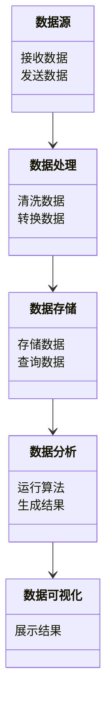
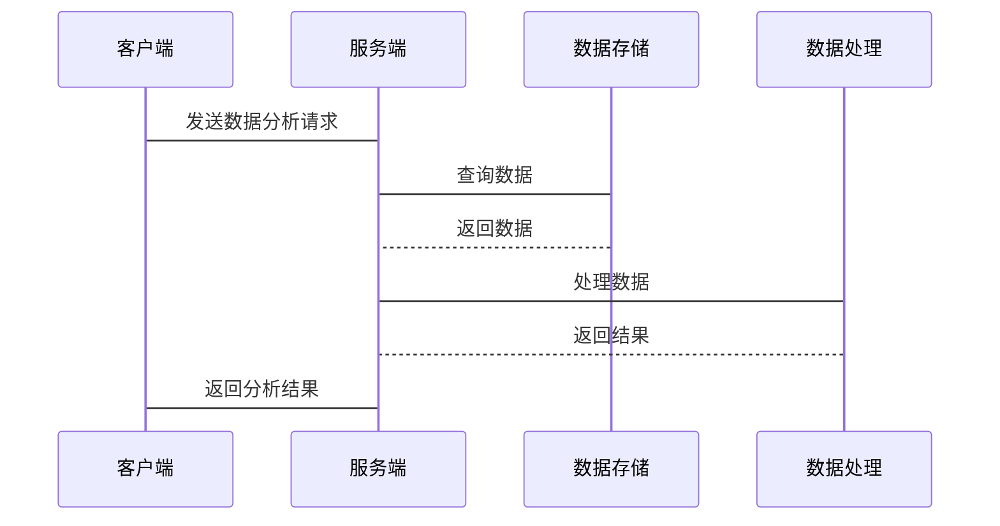

                 


# 大数据分析在各行业应用的投资价值

> 关键词：大数据分析、投资价值、行业应用、数据分析技术、数据驱动决策、数据投资回报

> 摘要：大数据分析在各行业中的应用日益广泛，其投资价值不仅体现在提高效率和精准决策上，还能够为企业创造新的利润增长点。本文从大数据分析的基本概念出发，深入探讨其在不同行业的应用案例，并结合技术原理和系统架构，分析其投资价值的评估方法和实现路径。通过具体项目实战和最佳实践，为读者提供全面的投资策略建议。

---

## 第一章：大数据分析的背景与投资价值概述

### 1.1 大数据分析的背景与现状

#### 1.1.1 大数据的定义与特点
大数据通常指“海量、高增长率和多样性”的数据集合，其特点是：
- **Volume**：数据量大。
- **Velocity**：数据生成速度快。
- **Variety**：数据类型多样（结构化、非结构化）。
- **Value**：数据潜在价值高，但需通过分析提取。
- **Veracity**：数据真实性、准确性存在挑战。

#### 1.1.2 大数据分析技术的发展历程
1. **数据采集阶段**：早期的大数据技术主要用于解决数据存储和处理问题，如Hadoop的出现解决了海量数据的存储和计算问题。
2. **数据分析阶段**：随着技术的进步，数据分析工具（如Spark、Flink）逐渐普及，数据挖掘和机器学习算法开始应用于实际场景。
3. **智能化阶段**：人工智能和深度学习的结合，使大数据分析更加智能化和自动化。

#### 1.1.3 大数据分析在投资领域的应用前景
- **金融行业**：通过分析历史数据预测股票价格走势，优化投资组合。
- **市场营销**：通过用户行为分析制定精准营销策略。
- **医疗行业**：通过患者数据挖掘优化诊疗方案。
- **物流行业**：通过实时数据分析优化配送路径。

### 1.2 大数据分析的核心价值

#### 1.2.1 数据驱动的投资决策
- 通过数据分析，投资者能够基于实时数据做出更明智的决策。
- 数据分析可以帮助识别潜在风险，降低投资损失。

#### 1.2.2 大数据分析在投资中的优势
- **精准性**：通过算法模型提高预测的准确性。
- **实时性**：实时数据分析能够快速响应市场变化。
- **成本效益**：通过数据挖掘发现潜在机会，降低投资成本。

#### 1.2.3 大数据分析的局限性与挑战
- **数据质量**：数据的准确性和完整性直接影响分析结果。
- **技术复杂性**：需要专业的技术和人才支持。
- **隐私与安全**：数据隐私和安全问题需要严格保护。

### 1.3 大数据分析的投资价值评估

#### 1.3.1 投资价值的定义与衡量标准
- **投资价值**：指通过大数据分析带来的直接或间接收益。
- **衡量标准**：包括投资回报率（ROI）、成本效益分析、风险评估等。

#### 1.3.2 大数据分析对投资价值的影响
- 提高决策的准确性和及时性，降低投资风险。
- 通过数据挖掘发现新的投资机会，创造额外收益。

#### 1.3.3 大数据分析在投资中的 ROI 分析
- **初始投资**：技术开发、数据采集、人才引进等。
- **后续收益**：通过优化决策、提高效率、发现新机会获得长期收益。

### 1.4 本章小结
本章介绍了大数据分析的背景、核心价值及其在投资中的应用前景，强调了大数据分析在提升投资决策精准性和效率方面的巨大潜力。

---

## 第二章：大数据分析的核心概念

### 2.1 数据的生命周期与处理流程

#### 2.1.1 数据采集与预处理
- **数据采集**：从各种来源（数据库、API、日志文件等）获取数据。
- **数据清洗**：去除噪声数据，处理缺失值，标准化数据格式。
- **数据转换**：将数据转换为适合分析的形式（如结构化数据）。

#### 2.1.2 数据存储与管理
- **数据仓库**：用于存储结构化数据，支持复杂的查询。
- **大数据平台**：如Hadoop、Spark，用于处理海量数据。
- **数据库管理**：关系型数据库和NoSQL数据库的选择。

#### 2.1.3 数据分析与挖掘
- **描述性分析**：总结数据特征。
- **预测性分析**：利用历史数据预测未来趋势。
- **诊断性分析**：识别数据中的异常点和潜在问题。

### 2.2 数据分析的类型与方法

#### 2.2.1 描述性分析
- 使用统计指标和图表描述数据的基本特征。
- 例如：均值、中位数、标准差等。

#### 2.2.2 预测性分析
- 使用机器学习算法（如线性回归、随机森林）预测未来趋势。
- 例如：预测股票价格走势。

#### 2.2.3 实验性分析
- 设计实验验证假设，通过A/B测试优化策略。
- 例如：测试两种广告文案的效果。

#### 2.2.4 诊断性分析
- 分析数据中的因果关系，识别问题根源。
- 例如：分析客户流失的原因。

### 2.3 数据分析的关键技术

#### 2.3.1 数据挖掘技术
- **关联规则挖掘**：发现数据中的关联关系。
- **聚类分析**：将相似的数据点分组。
- **分类分析**：根据已有数据对新数据进行分类。

#### 2.3.2 机器学习算法
- **监督学习**：如线性回归、支持向量机。
- **无监督学习**：如K均值聚类、主题模型。
- **深度学习**：如神经网络、卷积神经网络。

#### 2.3.3 数据可视化技术
- **图表选择**：根据数据类型选择合适的图表形式。
- **可视化工具**：如Tableau、Power BI、Python的matplotlib库。

### 2.4 本章小结
本章详细介绍了大数据分析的核心概念，包括数据生命周期、数据分析类型与方法以及关键技术，为后续的分析打下基础。

---

## 第三章：大数据分析的技术原理与算法

### 3.1 数据预处理技术

#### 3.1.1 数据清洗
- **去重**：去除重复数据。
- **处理缺失值**：填充、删除或标记缺失值。
- **标准化**：统一数据格式和单位。

#### 3.1.2 数据转换
- **特征提取**：从原始数据中提取有用特征。
- **维度降维**：使用主成分分析（PCA）降低数据维度。

### 3.2 特征工程

#### 3.2.1 特征选择
- **基于统计的方法**：如卡方检验。
- **基于模型的方法**：如LASSO回归。

#### 3.2.2 特征构建
- **数值型特征**：如差分、加总。
- **类别型特征**：如独热编码、标签编码。

### 3.3 常用算法及其原理

#### 3.3.1 线性回归
- **数学模型**：$y = \beta_0 + \beta_1x + \epsilon$
- **用途**：预测连续型变量，如房价预测。

#### 3.3.2 决策树
- **原理**：通过特征分裂构建树状结构，进行分类或回归。
- **算法**：ID3、C4.5、CART。

#### 3.3.3 聚类分析
- **K-means算法**：将数据分成K个簇，计算簇内平方和最小化。
- **层次聚类**：通过层次结构构建簇。

### 3.4 算法实现与代码示例

#### 3.4.1 线性回归实现
```python
import numpy as np
from sklearn.linear_model import LinearRegression

# 示例数据
X = np.array([1, 2, 3, 4, 5]).reshape(-1, 1)
y = [2, 4, 5, 4, 5]

# 模型训练
model = LinearRegression()
model.fit(X, y)

# 预测
print(model.predict([[6]]))  # 输出：[[7.4]]
```

#### 3.4.2 决策树实现
```python
from sklearn.tree import DecisionTreeClassifier
from sklearn.datasets import make_classification

# 示例数据
X, y = make_classification(n_samples=100, n_features=2, n_classes=2)

# 模型训练
model = DecisionTreeClassifier()
model.fit(X, y)

# 预测
print(model.predict([[0, 0]]))  # 输出：[0]
```

### 3.5 数学模型与公式

#### 3.5.1 线性回归公式
$$ y = \beta_0 + \beta_1x + \epsilon $$

#### 3.5.2 决策树分裂指标
- **基尼指数**：$Gini = \sum_{i} p_i(1 - p_i)$
- **信息增益**：$Gain = H(Y) - H(Y|X)$

### 3.6 本章小结
本章详细讲解了大数据分析中的关键技术与算法，包括数据预处理、特征工程、常用算法及其数学模型，并通过Python代码示例展示了这些技术的实际应用。

---

## 第四章：系统架构与数据平台设计

### 4.1 项目背景与需求分析

#### 4.1.1 项目背景
- 随着数据量的增加，企业需要构建高效的数据分析平台。
- 数据分析平台需要支持多种数据源和分析工具。

#### 4.1.2 项目目标
- 提供数据采集、存储、分析、可视化的一站式服务。
- 支持实时数据分析和预测模型部署。

### 4.2 系统功能设计

#### 4.2.1 领域模型设计


#### 4.2.2 系统架构设计
```mermaid
client --> api_gateway: 请求
api_gateway --> service_layer: 调用服务
service_layer --> database: 查询数据库
database --> file_system: 读取文件
client <-- response: 返回结果
```

### 4.3 接口设计与交互流程

#### 4.3.1 API接口设计
- **数据接口**：提供RESTful API用于数据的增删改查。
- **分析接口**：提供API用于运行数据分析任务。

#### 4.3.2 交互流程


### 4.4 本章小结
本章从系统架构的角度，详细介绍了大数据分析平台的设计与实现，包括领域模型设计、系统架构图、接口设计和交互流程。

---

## 第五章：项目实战：行业案例分析

### 5.1 金融行业案例分析

#### 5.1.1 环境配置
- **工具安装**：安装Jupyter Notebook、Pandas、Scikit-learn、Matplotlib。
- **数据源**：使用Yahoo Finance获取股票数据。

#### 5.1.2 数据收集与预处理
```python
import pandas as pd
import numpy as np
from pandas_datareader import data as pdr
import matplotlib.pyplot as plt

# 获取数据
data = pdr.get_data_yahoo('AAPL', start='2020-01-01', end='2023-01-01')

# 数据清洗
data.dropna(inplace=True)
data['Close'].plot()
plt.show()
```

#### 5.1.3 特征工程
- **特征选择**：选择收盘价、开盘价、最高价、最低价、成交量。
- **特征构建**：计算移动平均线、相对强弱指数（RSI）。

#### 5.1.4 模型训练与优化
```python
from sklearn.model_selection import train_test_split
from sklearn.linear_model import LinearRegression
from sklearn.metrics import mean_squared_error

# 划分数据集
X = data[['Close', 'Open', 'High', 'Low', 'Volume']]
y = data['Close'].shift(1)
X = X.iloc[1:]
y = y.iloc[1:]

X_train, X_test, y_train, y_test = train_test_split(X, y, test_size=0.2)

# 模型训练
model = LinearRegression()
model.fit(X_train, y_train)

# 预测与评估
y_pred = model.predict(X_test)
print('均方误差:', mean_squared_error(y_test, y_pred))
```

#### 5.1.5 结果分析与可视化
- **预测结果**：绘制实际价格与预测价格的对比图。
- **误差分析**：计算模型的准确率和召回率。

#### 5.1.6 部署与优化
- **部署模型**：将模型部署到云平台，提供实时预测服务。
- **模型优化**：尝试使用更复杂的算法（如随机森林、LSTM）提高预测精度。

### 5.2 本章小结
本章通过金融行业的实际案例，详细展示了大数据分析在投资决策中的应用，包括数据收集、特征工程、模型训练和结果分析。

---

## 第六章：最佳实践与投资策略建议

### 6.1 最佳实践

#### 6.1.1 数据质量管理
- **数据清洗**：确保数据的准确性和完整性。
- **数据标注**：为数据添加元数据，便于后续分析。

#### 6.1.2 技术选型
- **工具选择**：根据需求选择合适的数据分析工具（如Pandas、Spark）。
- **算法优化**：根据数据特点选择合适的算法，并进行调参优化。

#### 6.1.3 模型监控与维护
- **模型监控**：实时监控模型性能，及时发现异常。
- **模型更新**：定期更新模型，保持其准确性。

### 6.2 投资策略建议

#### 6.2.1 数据驱动的决策
- 基于数据分析结果制定投资策略，避免凭经验决策。

#### 6.2.2 风险管理
- 使用大数据分析识别潜在风险，制定风险管理策略。

#### 6.2.3 技术与人才储备
- 投资于大数据技术的研发和人才的培养，提升数据分析能力。

### 6.3 风险提示与注意事项

#### 6.3.1 数据隐私与安全
- 遵守数据隐私法规，确保数据安全。

#### 6.3.2 模型过拟合
- 避免模型过拟合，确保模型的泛化能力。

#### 6.3.3 技术更新换代
- 关注技术发展趋势，及时更新数据分析方法。

### 6.4 未来趋势与展望

#### 6.4.1 人工智能的结合
- 大数据分析将更加智能化，AI技术将推动数据分析的自动化。

#### 6.4.2 行业应用的深化
- 大数据分析将在更多行业得到广泛应用，创造更大的价值。

### 6.5 本章小结
本章总结了大数据分析在投资中的最佳实践，提出了投资策略建议，并展望了未来的发展趋势。

---

## 作者：AI天才研究院/AI Genius Institute & 禅与计算机程序设计艺术 /Zen And The Art of Computer Programming

---

以上是《大数据分析在各行业应用的投资价值》的技术博客文章，涵盖了从理论到实践的各个方面，旨在为读者提供全面的大数据分析投资价值分析。

