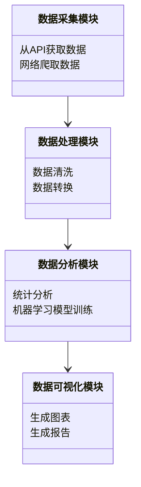
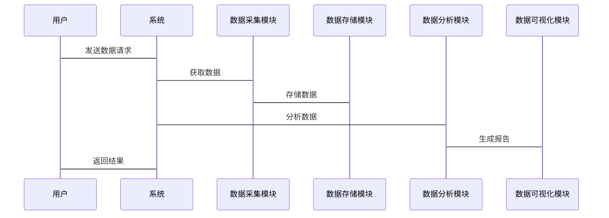

                 

<think>
好，我现在要写一篇关于《大数据分析在投资研究中的应用》的技术博客文章。首先，我需要理解这个主题的核心内容，包括大数据在投资中的具体应用、相关技术、方法和工具。

首先，我应该从背景介绍开始，解释为什么大数据在投资研究中变得重要。接下来，我需要讨论大数据分析的核心技术，如数据采集、存储、处理和分析方法。然后，详细分析投资研究中的各种方法，如技术分析、基本面分析和量化投资策略，并展示这些方法如何与大数据结合。

接下来，我需要解释数据驱动的投资决策模型，包括其框架和预测模型。在算法部分，我会选择几种常用的算法，如回归分析和聚类分析，并用Mermaid流程图展示它们的原理，同时提供Python代码示例。

然后，我会设计一个大数据投资分析系统的架构，包括数据采集、处理、分析和可视化的模块，并用类图展示。接口设计部分，我会描述系统如何与外部数据源和用户交互，并用序列图展示流程。

在项目实战部分，我需要指导读者如何安装必要的工具和环境，如Hadoop和Python库，并提供具体的代码实现，包括数据清洗、特征工程和模型训练。案例分析部分，我将使用实际的股票数据，展示如何预测价格，并讨论结果的意义和优化方法。

最后，我会总结大数据分析在投资中的优势和挑战，给出一些最佳实践的建议，如数据质量的重要性、模型过拟合的风险以及如何保持对市场的敏感性。同时，我会推荐一些进一步学习的资源，帮助读者深入研究。

在整个写作过程中，我需要确保每个章节内容丰富、详细，并且逻辑清晰。同时，使用专业的技术语言，但保持易懂，适合技术背景的读者理解。最后，加上作者信息，使文章更具权威性。

现在，我需要按照目录大纲一步步展开每个部分，确保覆盖所有关键点，并结合实际案例和代码示例，让读者能够真正理解大数据在投资中的应用。
</think>

# 大数据分析在投资研究中的应用

> 关键词：大数据分析、投资研究、数据驱动、量化投资、机器学习

> 摘要：本文详细探讨了大数据分析在投资研究中的应用，从背景、核心技术到实际案例，全面解析了如何利用大数据提升投资决策的准确性和效率。文章结合技术原理、算法实现和系统架构，为读者提供了系统的知识框架和实践指导。

---

## 第一部分: 大数据分析在投资研究中的应用概述

### 第1章: 大数据分析与投资研究的背景

#### 1.1 大数据时代的投资研究
##### 1.1.1 大数据时代的背景
在金融领域，数据量的爆炸式增长催生了大数据分析的需求。投资研究从传统的经验驱动转向数据驱动，利用海量数据寻找投资机会。

##### 1.1.2 大数据分析在投资研究中的重要性
大数据分析能够帮助投资者识别市场趋势、评估风险并优化投资组合，提升决策的科学性和准确性。

##### 1.1.3 投资研究中的数据特征
- 数据量大：涵盖股票、债券、经济指标等多维度数据。
- 数据类型多样：包括结构化数据和非结构化数据。
- 数据实时性：高频交易需要实时数据处理。

#### 1.2 大数据分析的基本概念
##### 1.2.1 大数据的定义与特征
大数据通常指“4V”特征：Volume（大量）、Variety（多样性）、Velocity（高速）和Veracity（真实性）。

##### 1.2.2 大数据分析的核心技术
- 数据采集：从多源数据中抓取信息。
- 数据存储：使用分布式存储系统。
- 数据处理：清洗、转换和集成数据。
- 数据分析：应用统计、机器学习等方法。

##### 1.2.3 投资研究中的大数据应用现状
目前，大数据分析广泛应用于量化投资、风险控制和市场预测等领域，但面临数据质量、计算能力等挑战。

#### 1.3 大数据分析在投资研究中的应用前景
##### 1.3.1 大数据分析的投资机会
通过挖掘非传统数据（如社交媒体情绪）获取超额收益。

##### 1.3.2 大数据分析的挑战与风险
数据隐私、模型过拟合和市场变化带来的不确定性。

---

### 第2章: 大数据分析的核心技术与工具

#### 2.1 数据采集与处理
##### 2.1.1 数据采集方法
- API接口：从金融数据供应商获取实时数据。
- 网络爬取：抓取社交媒体、新闻等非结构化数据。

##### 2.1.2 数据清洗与预处理
- 去除缺失值、异常值。
- 数据标准化和归一化处理。

##### 2.1.3 数据存储与管理
- 使用Hadoop、分布式数据库存储海量数据。
- 数据仓库技术支持高效查询。

#### 2.2 数据分析与挖掘
##### 2.2.1 数据分析方法
- 描述性分析：总结数据特征。
- 预测性分析：利用回归、分类模型预测市场走势。
- 可解释性分析：帮助理解数据背后的原因。

##### 2.2.2 数据挖掘算法
- 聚类分析：识别股票相似性。
- 关联规则挖掘：发现市场中的关联模式。

##### 2.2.3 数据可视化技术
- 使用Matplotlib、Plotly等工具绘制图表，直观展示数据。

#### 2.3 大数据工具与平台
##### 2.3.1 Hadoop与Spark
- Hadoop：适合海量数据存储和处理。
- Spark：支持快速迭代和计算。

##### 2.3.2 数据库与分布式计算
- 关系型数据库：存储结构化数据。
- NoSQL数据库：处理非结构化数据。

##### 2.3.3 数据可视化工具
- Tableau：生成交互式仪表盘。
- Power BI：提供丰富的数据可视化功能。

---

### 第3章: 投资研究中的数据分析方法

#### 3.1 技术分析与大数据
##### 3.1.1 技术分析的基本原理
通过分析历史价格和成交量预测未来走势。

##### 3.1.2 大数据在技术分析中的应用
- 计算技术指标：如RSI、MACD。
- 识别形态：利用图像识别技术检测K线图模式。

##### 3.1.3 常用技术指标的大数据分析
- 使用机器学习模型预测超买超卖信号。

#### 3.2 基本面分析与大数据
##### 3.2.1 基本面分析的核心要素
分析公司财务报表、行业地位和宏观经济指标。

##### 3.2.2 大数据在基本面分析中的应用
- 爬取公司新闻、社交媒体数据。
- 分析财务报表数据预测公司业绩。

##### 3.2.3 公司财务数据的深度分析
- 利用聚类分析识别财务异常。

#### 3.3 量化投资策略与大数据
##### 3.3.1 量化投资的基本原理
基于数学模型进行投资决策。

##### 3.3.2 大数据在量化投资中的应用
- 量化因子模型：筛选具备alpha因子的股票。
- 预测市场波动：利用时间序列分析。

##### 3.3.3 常用量化指标与算法
- 使用回归分析优化投资组合。

---

### 第4章: 数据驱动的投资决策模型

#### 4.1 数据驱动的投资决策框架
##### 4.1.1 数据驱动决策的基本流程
1. 数据采集与清洗。
2. 数据分析与建模。
3. 模型验证与优化。
4. 投资决策与执行。

##### 4.1.2 投资决策模型的设计原则
- 数据驱动：基于大量历史数据。
- 可解释性：便于投资者理解。
- 实时性：适应快速变化的市场环境。

#### 4.2 基于大数据的预测模型
##### 4.2.1 预测模型的设计
- 使用LSTM进行时间序列预测。

##### 4.2.2 模型验证与优化
- 利用回测和风险指标评估模型性能。

---

## 第二部分: 大数据分析的系统架构与实战

### 第5章: 系统分析与架构设计

#### 5.1 系统功能设计
##### 5.1.1 领域模型


#### 5.2 系统架构设计
```mermaid
archi
    title 投资数据分析系统架构
    client --> api-gateway: HTTP 请求
    api-gateway --> data-collect: 数据采集
    data-collect --> data-storage: 数据存储
    data-storage --> data-process: 数据处理
    data-process --> data-analyze: 数据分析
    data-analyze --> data-visual: 数据可视化
    data-visual --> client: 返回结果
```

#### 5.3 系统接口设计
##### 5.3.1 接口描述
- 数据接口：从API获取实时数据。
- 分析接口：调用机器学习模型进行预测。

##### 5.3.2 接口交互流程


---

### 第6章: 项目实战

#### 6.1 环境安装
- 安装Hadoop和Spark用于大数据处理。
- 安装Python库：pandas、numpy、scikit-learn。

#### 6.2 核心代码实现
##### 6.2.1 数据清洗
```python
import pandas as pd

# 读取数据
data = pd.read_csv('stock_data.csv')

# 删除缺失值
data.dropna(inplace=True)

# 填充缺失值
data.fillna(method='ffill', inplace=True)
```

##### 6.2.2 特征工程
```python
from sklearn.preprocessing import StandardScaler

# 标准化处理
scaler = StandardScaler()
data_scaled = scaler.fit_transform(data)
```

##### 6.2.3 模型训练
```python
from sklearn.linear_model import LinearRegression
from sklearn.metrics import mean_squared_error

# 训练模型
model = LinearRegression()
model.fit(X_train, y_train)

# 预测
y_pred = model.predict(X_test)
```

#### 6.3 案例分析
##### 6.3.1 股票价格预测
- 使用LSTM模型预测股票价格。
- 计算预测准确率和回撤。

##### 6.3.2 风险评估
- 利用VaR模型评估投资组合的风险。

---

## 第三部分: 总结与展望

### 第7章: 最佳实践与注意事项

#### 7.1 数据质量的重要性
- 确保数据的完整性和准确性。
- 处理数据偏差问题。

#### 7.2 模型的可解释性
- 避免过于复杂的模型导致可解释性差。
- 结合业务知识优化模型。

#### 7.3 风险管理
- 定期监控模型表现。
- 制定风险控制策略。

#### 7.4 技术与市场的结合
- 理解市场机制，避免过度依赖算法。
- 结合宏观经济分析。

#### 7.5 伦理与合规
- 遵守数据隐私法规。
- 避免市场操纵。

---

## 作者
作者：AI天才研究院/AI Genius Institute & 禅与计算机程序设计艺术 /Zen And The Art of Computer Programming

