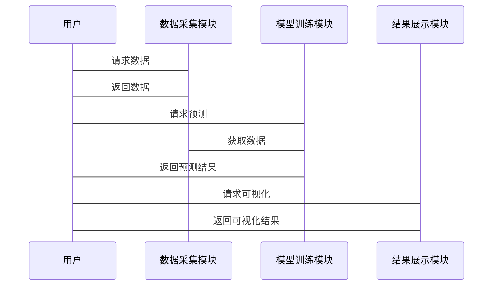

                 


# 大数据驱动的投资决策模型构建

> 关键词：大数据，投资决策，机器学习，金融模型，数据挖掘

> 摘要：随着大数据技术的飞速发展，金融投资领域正在经历一场深刻的变革。传统的投资决策方式逐渐被基于大数据的智能决策模型所取代。本文将详细探讨大数据驱动的投资决策模型的构建过程，涵盖数据收集、算法选择、模型训练、系统设计与实现等多个方面，并结合实际案例进行深入分析，旨在为读者提供一个全面、系统的技术指导。

---

## 第1章: 大数据与投资决策的背景介绍

### 1.1 大数据在金融投资中的重要性

#### 1.1.1 从传统投资到大数据投资的演进

传统投资决策主要依赖于分析师的经验和市场直觉，这种方法在信息量有限的时代具有一定的有效性。然而，随着金融市场数据的爆炸式增长，传统的投资方法逐渐暴露出效率低下、决策滞后等问题。大数据技术的出现，为金融投资带来了新的可能性。

#### 1.1.2 大数据在金融投资中的核心地位

大数据技术能够从海量的非结构化数据（如社交媒体情绪、新闻文本）和结构化数据（如股价、财务报表）中提取有价值的信息，帮助投资者发现潜在的市场趋势和机会。通过大数据分析，投资者可以更全面地评估风险和收益，从而做出更科学的投资决策。

#### 1.1.3 投资决策的新范式

大数据驱动的投资决策不仅仅是技术的革新，更是思维方式的转变。通过整合多源异构数据，利用机器学习算法进行深度分析，投资者能够构建更加精准的预测模型，实现从“经验驱动”到“数据驱动”的转变。

---

### 1.2 投资决策模型的定义与特点

#### 1.2.1 投资决策模型的定义

投资决策模型是指基于大量数据和算法构建的数学模型，用于预测市场走势、评估资产价值、制定投资策略。这些模型能够帮助投资者在复杂多变的市场环境中做出更明智的决策。

#### 1.2.2 投资决策模型的核心特点

- **数据驱动**：依赖于大量数据进行分析和预测。
- **实时性**：能够快速响应市场变化。
- **可解释性**：模型的决策过程需要清晰可解释。
- **动态适应性**：能够根据市场反馈不断优化。

#### 1.2.3 投资决策模型与传统投资决策的区别

传统投资决策主要依赖经验、市场直觉和基本分析，而大数据驱动的投资决策模型则通过算法和数据分析提供更客观、更精确的决策依据。

---

### 1.3 主流投资决策模型简介

#### 1.3.1 线性回归模型

线性回归是一种简单但有效的预测模型，适用于线性关系的数据。其核心思想是通过最小化预测值与实际值之间的平方差，找到最佳拟合直线。

#### 1.3.2 随机森林模型

随机森林是一种基于树的集成算法，通过构建多个决策树并进行投票或平均，能够有效避免过拟合问题，适合处理高维数据。

#### 1.3.3 神经网络模型

神经网络是一种受生物神经网络启发的深度学习模型，能够通过多层非线性变换提取数据特征，适用于复杂模式的识别。

---

### 1.4 大数据驱动的投资决策模型的应用前景

#### 1.4.1 大数据在金融投资中的潜在应用领域

- 股票价格预测
- 风险评估与管理
- 资产配置优化
- 市场情绪分析

#### 1.4.2 企业采用大数据投资决策模型的优势

- 提高投资决策的科学性
- 降低投资风险
- 提升投资效率
- 开拓新的投资机会

#### 1.4.3 大数据投资决策模型应用的挑战与机遇

- 挑战：数据质量、模型过拟合、计算资源需求
- 机遇：技术创新、数据丰富、市场效率提升

---

## 第2章: 大数据驱动的投资决策模型的核心概念与联系

### 2.1 大数据分析的原理

#### 2.1.1 数据清洗与预处理

数据清洗是大数据分析的第一步，主要包括去除缺失值、处理异常值、标准化数据等步骤。预处理的目的是确保数据的完整性和一致性。

#### 2.1.2 数据特征提取

通过特征工程提取与投资决策相关的特征，例如市场情绪、财务指标、技术指标等。特征提取能够提高模型的预测能力。

#### 2.1.3 数据建模与分析

根据业务需求选择合适的算法，构建预测模型，并通过交叉验证等方法评估模型的性能。

---

### 2.2 机器学习在金融投资中的应用

#### 2.2.1 监督学习与非监督学习

- 监督学习：有标签数据的预测，如股票价格预测。
- 非监督学习：无标签数据的聚类分析，如客户分群。

#### 2.2.2 分类与回归算法

- 分类算法：用于分类市场趋势，如牛、熊市预测。
- 回归算法：用于预测具体价格或收益。

#### 2.2.3 聚类分析与异常检测

聚类分析用于发现市场中的相似模式，异常检测用于识别潜在的市场风险。

---

### 2.3 投资决策模型的构建流程

#### 2.3.1 数据收集与整合

从多种数据源（如数据库、API、文本文件）收集数据，并进行整合和清洗。

#### 2.3.2 数据分析与特征工程

通过数据分析提取有用的特征，并进行特征选择，以提高模型的性能。

#### 2.3.3 模型训练与优化

选择合适的算法，进行模型训练，并通过交叉验证优化模型参数。

#### 2.3.4 模型部署与监控

将模型部署到生产环境，并持续监控模型性能，及时进行再训练和优化。

---

## 第3章: 投资决策模型的算法原理讲解

### 3.1 线性回归模型

#### 3.1.1 线性回归的数学模型

$$ y = \beta_0 + \beta_1x + \epsilon $$

其中，$y$ 是目标变量，$x$ 是自变量，$\beta_0$ 和 $\beta_1$ 是回归系数，$\epsilon$ 是误差项。

#### 3.1.2 线性回归的实现步骤

1. 数据清洗与预处理
2. 特征工程
3. 模型训练
4. 模型评估

#### 3.1.3 线性回归的优缺点

- 优点：简单易懂，计算效率高。
- 缺点：只能处理线性关系，对异常值敏感。

---

### 3.2 随机森林模型

#### 3.2.1 随机森林的原理

随机森林是一种集成学习方法，通过随机选取样本和特征构建多棵决策树，并通过投票或平均的方式进行预测。

#### 3.2.2 随机森林的实现步骤

1. 随机选取样本
2. 随机选取特征
3. 构建决策树
4. 集成预测结果

#### 3.2.3 随机森林的优缺点

- 优点：抗过拟合，适合高维数据。
- 缺点：计算复杂度较高。

---

### 3.3 神经网络模型

#### 3.3.1 神经网络的基本结构

神经网络由输入层、隐藏层和输出层组成，通过多层非线性变换实现复杂模式的识别。

#### 3.3.2 神经网络的训练过程

神经网络的训练通常采用反向传播算法，通过梯度下降优化权重参数。

#### 3.3.3 神经网络的优缺点

- 优点：能够处理复杂的非线性关系。
- 缺点：计算资源需求高，模型解释性差。

---

## 第4章: 投资决策模型的系统分析与架构设计

### 4.1 问题场景介绍

本文将构建一个基于大数据的投资决策系统，用于股票价格预测。系统的主要功能包括数据采集、特征提取、模型训练、结果展示等。

---

### 4.2 系统功能设计

#### 4.2.1 领域模型（类图）


---

### 4.3 系统架构设计


---

### 4.4 系统接口设计

系统主要接口包括数据接口、模型接口和用户界面接口。数据接口用于与数据源交互，模型接口用于调用预测模型，用户界面接口用于展示结果。

---

### 4.5 系统交互设计



---

## 第5章: 投资决策模型的项目实战

### 5.1 环境安装

为了运行本文中的代码，读者需要安装以下环境：

- Python 3.6+
- Scikit-learn
- Pandas
- Matplotlib

---

### 5.2 系统核心实现源代码

#### 5.2.1 数据采集模块

```python
import requests
import json

def get_stock_data(symbol):
    url = f"https://api.example.com/stock/{symbol}"
    response = requests.get(url)
    data = json.loads(response.text)
    return data
```

#### 5.2.2 特征提取模块

```python
import pandas as pd

def feature_engineering(data):
    df = pd.DataFrame(data)
    df['Moving_Average'] = df['close'].rolling(10).mean()
    df['Volume_change'] = df['volume'].pct_change()
    return df
```

#### 5.2.3 模型训练模块

```python
from sklearn.ensemble import RandomForestRegressor
from sklearn.metrics import mean_absolute_error

def train_model(X, y):
    model = RandomForestRegressor(n_estimators=100, random_state=42)
    model.fit(X, y)
    return model

def evaluate_model(model, X_test, y_test):
    y_pred = model.predict(X_test)
    print(f"MAE: {mean_absolute_error(y_test, y_pred)}")
```

---

### 5.3 实际案例分析

以股票价格预测为例，假设我们从数据源获取了历史股价数据，并提取了移动平均线和成交量变化率作为特征。通过随机森林模型进行训练，最终得到一个预测模型，预测未来几天的股价走势。

---

## 第6章: 总结与展望

### 6.1 最佳实践 Tips

- 数据预处理是关键，确保数据质量。
- 特征工程能够显著提升模型性能。
- 模型部署后需要持续监控和优化。

### 6.2 小结

本文详细介绍了大数据驱动的投资决策模型的构建过程，从数据采集到模型部署，涵盖了算法选择、系统设计和项目实战等多个方面。通过实际案例分析，读者可以掌握如何利用大数据技术提升投资决策的科学性和效率。

### 6.3 注意事项

- 数据隐私和安全问题需要高度重视。
- 模型的可解释性是实际应用中的重要考量。
- 需要结合具体业务场景选择合适的算法。

### 6.4 拓展阅读

- 《机器学习实战》
- 《大数据分析与挖掘》
- 《金融时间序列分析》

---

## 作者：AI天才研究院 & 禅与计算机程序设计艺术

