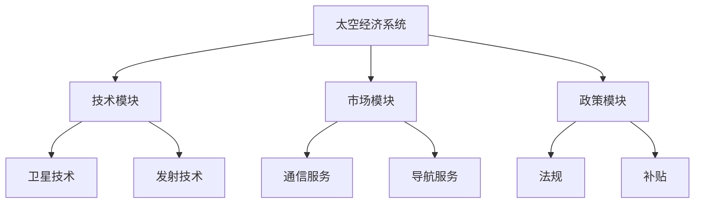

                 


# 太空经济：新兴投资领域的风险与回报

> **关键词**：太空经济, 投资风险, 投资回报, 商业航天, 卫星技术, 深空探索

> **摘要**：太空经济作为一个新兴的投资领域，涉及商业航天、卫星技术、深空探索等多个方面。本文将从背景介绍、核心概念、风险评估、投资策略、系统分析和项目实战等角度，详细探讨太空经济的投资风险与回报。通过分析产业链结构、商业模式创新、价值网络构建等关键因素，结合实际案例，为投资者提供科学的决策支持。

---

## 第一部分：太空经济的背景与核心概念

### 第1章：太空经济的定义与背景

#### 1.1 太空经济的定义与内涵

- **1.1.1 太空经济的定义**
  太空经济是指与太空探索和利用相关的经济活动，涵盖卫星技术、火箭发射、深空探测等领域。

- **1.1.2 太空经济的核心内涵**
  太空经济不仅包括硬件制造，还涉及数据服务、通信、导航等下游应用。

- **1.1.3 太空经济的边界与外延**
  包括政府和私营企业的投资，涉及技术开发、市场应用和国际合作。

#### 1.2 太空经济的历史演变

- **1.2.1 太空探索的起源与发展**
  从早期的政府主导到私营企业的崛起，太空探索的商业化推动了太空经济的发展。

- **1.2.2 太空经济的形成与成熟**
  近年来，随着技术进步和成本下降，太空经济进入快速发展阶段。

- **1.2.3 当前太空经济的主要特征**
  高技术门槛、高风险、高回报，私营企业成为主要驱动力。

#### 1.3 太空经济的主要参与者

- **1.3.1 政府机构的角色**
  提供政策支持、资金补贴，推动技术研发。

- **1.3.2 私营企业的崛起**
  特斯拉、SpaceX等企业的参与推动了太空经济的商业化。

- **1.3.3 国际合作与竞争**
  美国、欧洲、中国等国家和地区在太空经济中展开竞争与合作。

#### 1.4 太空经济的投资现状

- **1.4.1 全球太空经济的投资趋势**
  投资额持续增长，预计未来几年年增长率超过10%。

- **1.4.2 主要国家的太空经济政策**
  美国通过《商业航天发射法》，中国推动“航天强国”战略。

- **1.4.3 私人资本的进入与退出**
  私人资本通过风险投资、并购等方式进入太空经济领域。

---

### 第2章：太空经济的核心概念与联系

#### 2.1 太空经济的核心概念

- **2.1.1 太空资源的定义与分类**
  包括轨道资源、卫星数据、深空资源等。

- **2.1.2 太空技术的创新与应用**
  包括 reusable rockets, satellite constellations等技术。

- **2.1.3 太空经济的产业链结构**
  包括上游（制造）、中游（发射）、下游（应用）。

#### 2.2 太空经济的核心要素

- **2.2.1 技术要素**
  包括发射技术、卫星技术、地面设备等。

- **2.2.2 市场要素**
  包括通信、导航、遥感等市场需求。

- **2.2.3 政策要素**
  包括法律法规、政策支持等。

#### 2.3 太空经济的系统结构

- **2.3.1 太空经济的系统构成**
  包括技术、市场、政策等子系统。

- **2.3.2 各要素之间的关系**
  技术驱动市场，政策影响市场进入壁垒。

- **2.3.3 太空经济的生态系统**
  包括政府、企业、科研机构等多方参与者。

---

### 第3章：太空经济的风险与回报分析

#### 3.1 太空经济的风险来源

- **3.1.1 技术风险**
  技术失败可能导致投资失败。

- **3.1.2 市场风险**
  市场需求不确定，可能导致投资失败。

- **3.1.3 政策风险**
  政策变化可能影响投资收益。

#### 3.2 太空经济的回报机制

- **3.2.1 投资回报的来源**
  包括技术转让、市场收益、资产增值等。

- **3.2.2 投资回报的周期**
  通常较长，可能需要数年甚至更长时间。

- **3.2.3 投资回报的不确定性**
  高风险高回报，回报波动大。

#### 3.3 太空经济的风险评估模型

- **3.3.1 风险评估的步骤**
  1. 确定风险因素；2. 评估各因素的影响程度；3. 综合评估整体风险。

- **3.3.2 风险评估的指标体系**
  包括技术可行性、市场潜力、政策环境等指标。

- **3.3.3 风险评估的数学模型**
  使用层次分析法（AHP）进行综合评估。

---

### 第4章：太空经济的投资策略与案例

#### 4.1 投资策略

- **4.1.1 风险分散策略**
  投资多个项目以分散风险。

- **4.1.2 技术驱动策略**
  投资技术创新能力强的企业。

- **4.1.3 政策导向策略**
  关注政策支持的领域进行投资。

#### 4.2 投资案例分析

- **4.2.1 火星探测项目**
  投资回报可能来自技术和数据应用。

- **4.2.2 卫星通信企业**
  投资回报可能来自通信服务的市场扩展。

- **4.2.3 空间资源开发**
  投资回报可能来自资源利用的商业化。

#### 4.3 投资经验总结

- **4.3.1 成功案例的经验**
  技术创新和市场定位是关键。

- **4.3.2 失败案例的教训**
  技术失败或市场需求不足可能导致投资失败。

---

## 第五部分：总结与展望

### 第5章：太空经济的未来趋势

#### 5.1 未来趋势分析

- 技术进步推动太空经济快速发展。

- 深空探测和资源利用成为新的增长点。

- 国际合作与竞争将更加激烈。

#### 5.2 投资机会展望

- 卫星技术的应用扩展。

- 深空探测的技术突破。

- 新型商业模式的出现。

---

## 第六部分：附录

### 附录A：风险评估模型代码

```python
import numpy as np
from sklearn.metrics import pairwise_distances

# 示例数据：各风险因素的权重
weights = [0.4, 0.3, 0.3]

# 计算综合风险评分
def calculate_risk(weights, factors):
    normalized_weights = weights / sum(weights)
    risk_scores = np.dot(factors, normalized_weights)
    return risk_scores

# 示例因素矩阵
factors = np.array([
    [0.8, 0.6, 0.5],
    [0.7, 0.7, 0.6],
    [0.6, 0.8, 0.7]
])

risk_scores = calculate_risk(weights, factors)
print("综合风险评分：", risk_scores)
```

### 附录B：系统架构图



---

## 作者

**作者：AI天才研究院/AI Genius Institute & 禅与计算机程序设计艺术 /Zen And The Art of Computer Programming**

