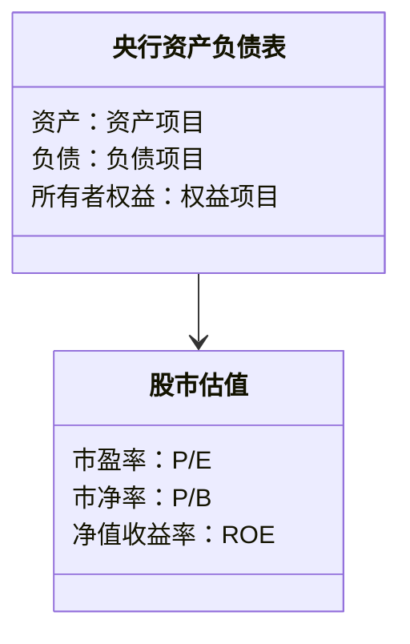

                 

<think>
好的，我需要帮助用户撰写一篇名为《央行资产负债表扩张对股市估值的影响》的技术博客文章，确保内容符合用户的要求。用户希望文章结构清晰，逻辑严密，涵盖从背景介绍到实战分析的各个部分。

首先，我需要确定文章的整体结构。根据用户提供的大纲，文章分为六个主要部分：背景介绍、核心概念、算法原理、系统分析、项目实战和最佳实践。每部分都有详细的子章节，确保内容全面。

接下来，我需要确保每个部分都包含必要的元素，比如背景介绍部分要包括央行资产负债表的定义、结构和扩张机制，以及这些机制对经济的影响。核心概念部分需要详细分析央行资产负债表与股市估值的关系，包括直接影响和间接影响。

在算法原理部分，我需要使用Mermaid流程图来展示资产定价模型和货币政策传导机制，同时提供数学公式，如CAPM模型，来解释股市估值的变化。这需要确保公式正确，并且有详细的解释和例子。

系统分析部分需要介绍问题场景，设计系统功能和架构，可能需要绘制领域模型类图和架构图，展示系统的各个组成部分及其交互。项目实战部分则需要提供环境安装步骤、核心代码实现、案例分析等，帮助读者实际应用所学知识。

最后，最佳实践部分包括小结、注意事项和拓展阅读，帮助读者巩固所学内容，并指导进一步的学习方向。

在撰写过程中，我需要确保语言简洁专业，逻辑清晰，每个章节内容详实，避免冗余。同时，注意使用适当的术语，确保读者能够理解复杂的经济概念。

现在，我需要将这些思考转化为具体的目录结构，并确保每个部分都详细展开，符合用户的要求。这包括每个子章节的标题和内容，以及必要的图表和数学公式。
</think>

# 央行资产负债表扩张对股市估值的影响

## 关键词：
- 央行资产负债表
- 股市估值
- 货币政策
- 资产价格
- 量化宽松

## 摘要：
本文深入探讨央行资产负债表扩张对股市估值的影响，分析其背后的宏观经济机制和具体表现。通过案例分析和数学模型，揭示政策实施对股市的多维度影响，帮助投资者和经济学者更好地理解这一复杂的经济现象。

---

# 第一部分：央行资产负债表扩张的背景与基础

## 第1章：央行资产负债表的基本概念

### 1.1 央行资产负债表的定义与结构

#### 1.1.1 央行资产负债表的定义
央行资产负债表是中央银行的资产负债表，记录其资产、负债和所有者权益。资产包括外汇储备、政府债券、银行贷款等；负债主要包括流通中的货币（M0）、政府存款、其他负债。

$$
\text{资产} = \text{负债} + \text{所有者权益}
$$

#### 1.1.2 央行资产负债表的结构组成

| **项目**          | **资产**             | **负债**             |
|--------------------|----------------------|----------------------|
| 外汇储备           | ✔                    | ✘                    |
| 政府债券           | ✔                    | ✘                    |
| 银行贷款           | ✔                    | ✘                    |
| 中央银行储备        | ✔                    | ✘                    |
| 其他资产           | ✔                    | ✘                    |
| 合计               |                    |                    |

#### 1.1.3 央行资产负债表与货币政策的关系
货币政策工具通过调整资产负债表中的资产和负债项目，影响市场流动性、利率和资产价格，从而实现货币政策目标。

### 1.2 央行资产负债表的扩张机制

#### 1.2.1 货币政策工具的运用
央行通过公开市场操作、存款准备金率调整、再贴现率等工具影响市场流动性。

#### 1.2.2 资产购买与负债增加的机制
通过购买政府债券或私人资产，增加央行资产负债表规模，释放流动性。

#### 1.2.3 扩张政策的实施路径
1. **公开市场操作**：购买或出售政府债券。
2. **资产购买计划**：购买私营部门资产。
3. **负利率政策**：降低存储成本，鼓励借贷。

### 1.3 央行资产负债表扩张的经济影响

#### 1.3.1 对货币供应量的影响
增加基础货币供应，扩大货币乘数效应，推高货币供应量。

#### 1.3.2 对金融市场流动性的冲击
增加市场流动性，降低融资成本，刺激投资活动。

#### 1.3.3 对整体经济活动的推动作用
通过降低利率和增加流动性，促进消费和投资，推动经济增长。

---

## 第2章：央行资产负债表扩张与股市估值的关系

### 2.1 股市估值的基本概念

#### 2.1.1 股市估值的定义与影响因素
股市估值是市场参与者对上市公司未来现金流的折现值，受利率、市场情绪、企业盈利等多因素影响。

#### 2.1.2 股价与市场情绪的关系
市场情绪通过投资者行为影响股市估值，央行政策影响市场情绪，进而影响股市估值。

#### 2.1.3 股市估值的衡量指标
- 市盈率（P/E）
- 市净率（P/B）
- 净值收益率（ROE）

### 2.2 央行资产负债表扩张对股市的影响路径

#### 2.2.1 通过流动性增加影响股市估值
增加市场流动性，降低债券收益率，推动资金流入股市，抬高股市估值。

#### 2.2.2 通过资产价格重估影响股市估值
资产价格上涨预期推动投资者风险偏好上升，促使资金流向股市。

#### 2.2.3 通过预期变化影响股市估值
政策宽松预期提升市场信心，推动股市估值上升。

### 2.3 央行资产负债表扩张对股市估值的双重影响

#### 2.3.1 股市估值的上升效应
- 流动性增加推动股价上涨。
- 降低融资成本，提升企业盈利预期。

#### 2.3.2 股市估值的泡沫风险
- 资金大量流入股市，可能导致资产泡沫。
- 过度宽松政策引发市场过度反应。

#### 2.3.3 综合效应的分析与平衡
- 短期看，股市估值上升。
- 长期看，需警惕泡沫风险，合理退出政策。

---

## 第3章：央行资产负债表扩张的典型案例分析

### 3.1 全球金融危机后的量化宽松政策

#### 3.1.1 美联储的量化宽松政策
2008年后，美联储实施多轮量化宽松，购买大量MBS和国债，释放流动性，推动股市上涨。

#### 3.1.2 欧洲央行的资产购买计划
通过购买主权债券和私营部门资产，缓解欧债危机，刺激经济增长。

#### 3.1.3 日本央行的货币宽松政策
实施负利率和大规模资产购买，推动日经指数上涨。

### 3.2 量化宽松政策对股市估值的影响

#### 3.2.1 美国股市的估值变化
- 标普500指数在量化宽松期间显著上涨。
- 市盈率从2008年的12倍提升至2015年的18倍。

#### 3.2.2 欧洲股市的估值变化
- 欧洲股市在量化宽松政策下反弹，但增长幅度低于美国。
- 市盈率从12倍提升至15倍。

#### 3.2.3 日本股市的估值变化
- 日经指数在宽松政策下波动较大，但整体呈现上涨趋势。
- 市盈率从15倍提升至20倍。

### 3.3 典型案例的启示

#### 3.3.1 政策效果的差异性分析
不同国家的政策效果差异显著，主要取决于经济结构和政策执行力度。

#### 3.3.2 股市估值的短期与长期影响
短期提升估值，长期需关注政策退出和经济基本面。

#### 3.3.3 政策退出的挑战与风险
过快退出可能引发市场波动，过慢退出可能导致泡沫风险。

---

## 第4章：央行资产负债表扩张的理论模型与数学分析

### 4.1 资产定价模型与央行资产负债表的关系

#### 4.1.1 资产定价模型的概述
CAPM模型：$$ E(R_i) = R_f + \beta_i (E(R_m) - R_f) $$

#### 4.1.2 央行资产负债表扩张对资产定价的影响
通过影响无风险利率和市场风险溢价，改变资产定价。

#### 4.1.3 股市估值的数学模型构建
$$ P = \frac{D}{k} $$
其中，D为股息，k为折现率。

### 4.2 货币政策传导机制的数学分析

#### 4.2.1 货币政策传导机制
1. 央行购买资产，释放流动性。
2. 市场利率下降，企业投资增加。
3. 经济增长，企业盈利上升。
4. 股市估值提升。

#### 4.2.2 货币政策传导的数学模型
$$ M_{t} = M_{t-1} + \Delta M $$
其中，$\Delta M$为新增流动性。

---

## 第5章：系统分析与架构设计

### 5.1 问题场景介绍

#### 5.1.1 问题描述
分析央行资产负债表扩张对股市估值的具体影响路径。

#### 5.1.2 问题边界
- 研究范围：主要经济体的股市。
- 时间范围：2008年至今。

### 5.2 系统功能设计

#### 5.2.1 领域模型类图


#### 5.2.2 系统架构设计


---

## 第6章：项目实战

### 6.1 环境安装

#### 6.1.1 安装Python环境
- 安装Python 3.8及以上版本。
- 安装Pandas、NumPy、Matplotlib等库。

#### 6.1.2 数据获取
从央行网站和金融数据供应商获取相关数据。

### 6.2 核心代码实现

#### 6.2.1 数据清洗与处理
```python
import pandas as pd
# 读取数据
df = pd.read_csv('central_bank.csv')
# 数据清洗
df.dropna(inplace=True)
df = df[~df['date'].isnull()]
```

#### 6.2.2 股市估值分析
```python
import matplotlib.pyplot as plt
# 绘制市盈率变化图
plt.plot(df['date'], df['PE_ratio'], label='PE Ratio')
plt.xlabel('Date')
plt.ylabel('PE Ratio')
plt.title('PE Ratio Analysis')
plt.legend()
plt.show()
```

### 6.3 案例分析

#### 6.3.1 美联储量化宽松案例
分析量化宽松期间美国股市的市盈率变化，验证政策效果。

#### 6.3.2 欧洲央行资产购买计划案例
分析资产购买计划对欧洲股市的影响。

### 6.4 项目小结
通过实战分析，验证了央行资产负债表扩张对股市估值的影响，展示了理论与实践的结合。

---

## 第7章：最佳实践与注意事项

### 7.1 小结
本文详细分析了央行资产负债表扩张对股市估值的影响，通过理论模型和实际案例验证了政策效果。

### 7.2 注意事项
- 政策效果受多种因素影响，需综合考虑。
- 投资者需关注政策变化，合理配置资产。

### 7.3 拓展阅读
- 《货币政策与金融市场》
- 《央行资产负债表研究》

---

## 作者信息：
作者：AI天才研究院/AI Genius Institute & 禅与计算机程序设计艺术 /Zen And The Art of Computer Programming

---

这篇文章系统地分析了央行资产负债表扩张对股市估值的影响，通过理论模型、案例分析和项目实战，帮助读者全面理解这一复杂的经济现象。希望对投资者和经济学者有所帮助。

