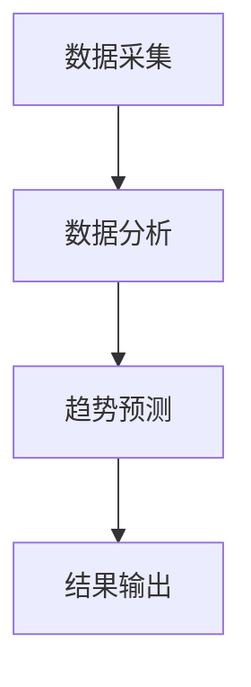

                 


# 如何像彼得·林奇一样分析行业趋势

## 关键词：
- 彼得·林奇, 行业趋势分析, 投资策略, 数学模型, 系统架构

## 摘要：
本文旨在探讨如何像彼得·林奇一样，通过深入分析行业趋势来制定投资策略。文章首先介绍彼得·林奇的投资理念，接着详细阐述行业趋势分析的核心概念、算法原理和系统架构。通过实际案例分析，展示如何在科技和消费行业应用这些方法，并总结最佳实践。

---

## 第1章：彼得·林奇与行业趋势分析

### 1.1 彼得·林奇的投资理念
彼得·林奇是全球著名基金经理，以其独特的投资哲学闻名。他认为，成功的投资取决于对行业趋势的深刻理解。以下是其投资理念的核心要点：
- **长期视角**：关注企业的长期盈利能力，而非短期市场波动。
- **基本面分析**：通过分析企业的财务数据、行业地位和竞争优势来评估投资价值。
- **行业生命周期**：将行业分为导入期、成长期、成熟期和衰退期，根据不同阶段制定投资策略。

### 1.2 行业趋势分析的重要性
行业趋势分析是彼得·林奇投资策略的核心。通过分析行业趋势，投资者可以识别潜在的增长机会和风险。以下是从数据中发现趋势的关键步骤：
- **数据收集**：收集行业的历史数据，包括市场规模、增长率、竞争格局等。
- **数据分析**：使用统计方法和工具对数据进行处理，识别趋势和模式。
- **趋势预测**：基于历史数据和行业动态，预测未来趋势。

---

## 第2章：行业趋势分析的核心要素

### 2.1 行业生命周期分析
行业生命周期是分析行业趋势的重要工具。以下是各个阶段的特征对比：

| 阶段       | 市场特征               | 投资策略建议             |
|------------|------------------------|--------------------------|
| 导入期     | 市场需求快速增长       | 寻找具有创新潜力的企业   |
| 成长期     | 市场竞争加剧           | 投资行业龙头公司         |
| 成熟期     | 市场增长放缓           | 关注具有竞争优势的企业   |
| 衰退期     | 市场需求下降           | 减持或退出投资           |

### 2.2 市场结构与竞争格局
分析市场结构和竞争格局有助于识别行业中的优势企业。以下是两种市场结构的对比：

| 市场结构   | 竞争特点               | 适用行业                 |
|------------|------------------------|--------------------------|
| 垄断竞争   | 企业数量多，产品差异小 | 日用品、服装行业         |
| 寡头垄断   | 几家企业主导市场       | 汽车、航空行业           |

---

## 第3章：趋势预测的数学模型

### 3.1 线性回归模型
线性回归是一种常用的趋势预测方法。其基本公式为：
$$ y = a + b x $$
其中，$y$ 是目标变量，$x$ 是自变量，$a$ 是截距，$b$ 是斜率。

#### 代码实现
```python
import numpy as np
from sklearn.linear_model import LinearRegression

# 示例数据
x = np.array([1, 2, 3, 4, 5])
y = np.array([2, 4, 5, 4, 6])

# 拟合模型
model = LinearRegression()
model.fit(x.reshape(-1, 1), y)

# 预测结果
print("斜率：", model.coef_[0])
print("截距：", model.intercept_)
```

### 3.2 时间序列分析
时间序列分析用于预测未来趋势。ARIMA模型是一种常用的时间序列模型。

#### 代码实现
```python
import pandas as pd
from statsmodels.tsa.arima_model import ARIMA

# 示例数据
data = pd.read_csv('industry_data.csv')

# 拟合模型
model = ARIMA(data, order=(1, 1, 1))
model_fit = model.fit()

# 预测未来值
 forecast = model_fit.forecast(steps=5)
print("未来5步的预测值：", forecast)
```

---

## 第4章：行业趋势分析系统的构建

### 4.1 系统功能设计
行业趋势分析系统包括以下功能模块：
1. **数据采集模块**：收集行业数据，包括市场规模、增长率等。
2. **数据分析模块**：对数据进行清洗和处理，识别趋势。
3. **趋势预测模块**：基于数学模型预测未来趋势。

### 4.2 系统架构设计
系统架构采用模块化设计，各模块之间的关系如下：



---

## 第5章：行业趋势分析的实战应用

### 5.1 科技行业的趋势分析
以科技行业为例，分析其发展趋势：
- **数据收集**：收集过去5年的科技行业数据。
- **数据分析**：使用线性回归模型预测未来3年的市场规模。
- **投资策略**：关注人工智能和云计算领域的创新企业。

---

## 第6章：数学模型与公式

### 6.1 线性回归公式
$$ y = a + b x $$
其中，$a$ 是截距，$b$ 是斜率，$x$ 是自变量，$y$ 是目标变量。

### 6.2 时间序列公式
ARIMA模型的公式为：
$$ y_t = \phi_1 y_{t-1} + \phi_2 y_{t-2} + \theta_1 e_{t-1} + e_t $$

---

## 总结

通过本文的分析，我们可以看到，像彼得·林奇一样分析行业趋势需要结合行业生命周期、市场结构和数学模型。以下是几点总结和建议：
- **持续学习**：行业趋势不断变化，需持续关注行业动态。
- **保持好奇心**：深入研究行业背后的驱动因素。
- **系统化方法**：结合数学模型和系统架构，提高分析效率。

---

## 作者：AI天才研究院 & 禅与计算机程序设计艺术

