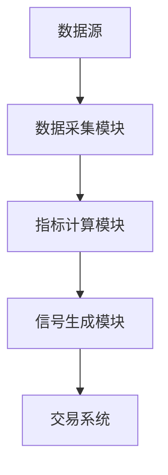

                 

# 如何利用技术分析辅助特价股票选择

> 关键词：技术分析、股票投资、特价股票、技术指标、交易策略、风险管理

> 摘要：技术分析是一种通过分析历史价格数据来预测未来股票价格走势的方法，广泛应用于股票投资中。本文将详细介绍技术分析的基本原理、常用技术指标、交易策略制定、技术分析系统构建、风险管理以及实际案例分析，帮助投资者利用技术分析辅助选择特价股票。

---

# 正文

## 第1章: 技术分析的基本概念

### 1.1 技术分析的定义与背景

#### 1.1.1 什么是技术分析
技术分析是一种通过分析股票的历史价格数据（如K线图、成交量等）来预测未来价格走势的方法。其核心假设是价格反映所有信息，且价格走势具有延续性。

#### 1.1.2 技术分析在股票投资中的作用
- 帮助投资者识别价格趋势和潜在交易机会。
- 通过技术指标和图表形态提供买卖信号。
- 帮助投资者制定交易策略和风险管理计划。

#### 1.1.3 技术分析与基本面分析的区别
| 技术分析 | 基本面分析 |
|----------|------------|
| 基于价格和成交量数据 | 基于公司基本面数据（如财务报表） |
| 关注短期价格波动 | 关注长期价值 |
| 适用于高频交易 | 适用于长期投资 |

---

### 1.2 技术分析的核心理论

#### 1.2.1 道氏理论
道氏理论是技术分析的基石，认为价格走势反映市场情绪，且价格波动分为主要趋势、次要趋势和短暂趋势。

#### 1.2.2 技术分析的三大假设
1. 市场行为反映所有信息。
2. 价格走势具有延续性。
3. 历史模式会重复。

#### 1.2.3 技术分析的适用范围与局限性
- 适用范围：短期价格预测、交易机会识别。
- 局限性：无法预测突发新闻事件的影响、忽略公司基本面因素。

---

## 第2章: 技术分析的核心工具与方法

### 2.1 K线图的解读

#### 2.1.1 K线图的基本构成
- 开盘价、收盘价、最高价、最低价。

#### 2.1.2 单根K线的含义
- 阳线：收盘价高于开盘价，表示买方力量占优。
- 阴线：收盘价低于开盘价，表示卖方力量占优。

#### 2.1.3 K线组合形态分析
- 吞噬线：一根大阳线吞噬小阴线，表示趋势反转。
- 十字星：开盘价和收盘价相近，表示市场犹豫。

### 2.2 均线与趋势线

#### 2.2.1 均线的计算方法
- 简单移动平均线（SMA）：将过去n天的价格数据求平均。
- 加权移动平均线（WMA）：赋予近期价格更高权重。

#### 2.2.2 均线的类型与作用
- 短期均线（如5日均线）：用于捕捉短期趋势。
- 长期均线（如50日均线）：用于捕捉长期趋势。

#### 2.2.3 趋势线的画法与应用
- 画法：将价格波动的高点或低点连线，形成趋势线。
- 应用：判断价格是否偏离趋势线，作为买卖信号。

### 2.3 技术指标入门

#### 2.3.1 技术指标的分类
- 超买超卖指标（如RSI）。
- 动量指标（如MACD）。
- 市场广度指标（如成交额）。

#### 2.3.2 技术指标的基本计算公式
- RSI公式：$$RSI = \frac{\text{上涨幅度}}{\text{上涨幅度} + \text{下跌幅度}} \times 100$$

---

## 第3章: 技术分析在股票投资中的实际应用

### 3.1 技术分析在选股中的应用

#### 3.1.1 如何利用技术分析筛选潜在股票
- 策略一：寻找均线多头排列的股票。
- 策略二：寻找突破前期高点的股票。

#### 3.1.2 技术分析在选股中的优缺点
- 优点：快速筛选出具有上涨潜力的股票。
- 缺点：可能忽略公司基本面因素。

### 3.2 技术分析在交易决策中的应用

#### 3.2.1 如何利用技术分析制定交易策略
- 确定交易目标：短线交易或长线投资。
- 选择合适的入市点：如均线交叉、突破颈线位。
- 设置止损和止盈点。

#### 3.2.2 技术分析在交易中的常见误区
- 过度依赖技术指标：忽略市场情绪和突发事件。
- 过度频繁交易：增加交易成本。

---

## 第4章: 技术分析系统的构建与优化

### 4.1 系统架构设计

#### 4.1.1 系统功能模块
- 数据采集模块：获取股票价格和成交量数据。
- 指标计算模块：计算技术指标并生成信号。
- 信号生成模块：根据指标结果生成买卖信号。

#### 4.1.2 系统架构图

---

## 第5章: 风险管理与交易心理

### 5.1 风险管理的重要性

#### 5.1.1 风险管理的基本原则
- 设置止损：限制最大亏损。
- 分批建仓：分散风险。

#### 5.1.2 风险管理的策略
- 固定比例：每笔交易的风险不超过总资金的2%。
- 动态调整：根据市场变化调整止损点。

### 5.2 交易心理的控制

#### 5.2.1 避免贪婪与恐惧
- 不要盲目追涨杀跌。
- 遵循交易计划。

#### 5.2.2 保持耐心与纪律
- 不要急于获利，耐心等待最佳入场点。

---

## 第6章: 技术分析的未来发展趋势

### 6.1 人工智能在技术分析中的应用

#### 6.1.1 机器学习的应用
- 利用算法识别价格模式。
- 预测价格走势。

#### 6.1.2 自然语言处理的应用
- 分析新闻和社交媒体情绪。

### 6.2 技术分析与其他分析方法的结合

#### 6.2.1 技术分析与基本面分析的结合
- 利用技术分析筛选潜在股票，再通过基本面分析确认。

#### 6.2.2 技术分析与量化投资的结合
- 利用算法交易系统自动执行交易。

---

# 作者

**作者：AI天才研究院/AI Genius Institute & 禅与计算机程序设计艺术 /Zen And The Art of Computer Programming**

---

通过本文，读者可以系统地了解技术分析的基本原理和实际应用，掌握如何利用技术分析辅助选择特价股票。希望本文能够为投资者提供有价值的参考和指导。

