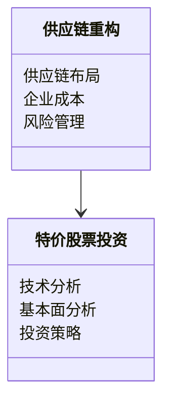
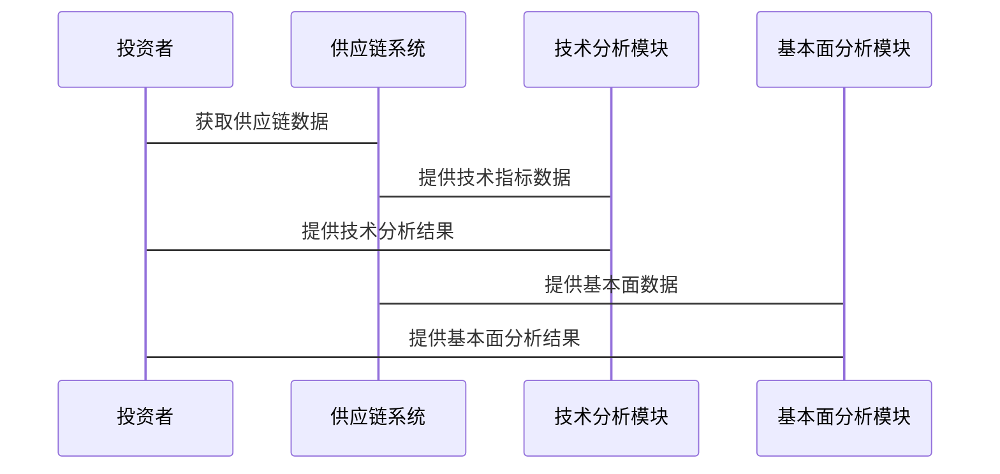

                 


# 如何利用特价股票投资应对全球供应链重构

## 关键词：供应链重构，特价股票，投资策略，风险管理，系统架构

## 摘要：  
随着全球供应链的重构，企业面临着前所未有的挑战和机遇。本文将深入探讨供应链重构对企业的影响，分析特价股票投资的潜力，并提供一套系统的投资策略和风险管理方法。通过结合技术分析和基本面分析，本文旨在帮助投资者在供应链重构的背景下，利用特价股票实现稳健的投资回报。

---

## 第1章：全球供应链重构的背景

### 1.1 供应链重构的驱动因素

#### 1.1.1 全球化与地缘政治的影响  
全球化进程的放缓和地缘政治冲突（如中美贸易摩擦）对全球供应链产生了深远影响，企业开始寻求更加灵活和多元化的供应链布局。

#### 1.1.2 技术进步与产业变革  
技术进步（如自动化生产和智能制造）推动了供应链的优化，但也带来了新的挑战，如技术依赖和数据安全问题。

#### 1.1.3 疫情对供应链的冲击  
新冠疫情暴露了全球供应链的脆弱性，许多企业因供应链中断而面临生产停滞的风险。

### 1.2 供应链重构的核心问题

#### 1.2.1 供应链断裂的风险  
供应链中断可能导致企业生产停滞、库存积压或原材料短缺，从而影响企业的经营稳定性。

#### 1.2.2 企业运营的不确定性  
供应链重构使得企业的运营环境更加复杂，企业需要具备更强的应变能力和风险管理能力。

#### 1.2.3 全球化与本地化的平衡  
企业需要在全球化与本地化之间找到平衡，以应对供应链重构带来的挑战。

---

## 第2章：供应链重构对企业的影响

### 2.1 供应链重构对企业成本的影响

#### 2.1.1 生产成本的变化  
供应链重构可能导致生产成本的上升或下降，具体取决于企业调整供应链的方式。

#### 2.1.2 物流成本的增加  
供应链中断可能导致物流成本增加，企业需要重新优化物流网络。

#### 2.1.3 供应链中断的风险  
供应链中断可能导致生产停滞，进而影响企业的收入和利润。

### 2.2 供应链重构对企业战略的影响

#### 2.2.1 供应链布局的调整  
企业需要重新评估和调整供应链布局，以应对供应链重构带来的挑战。

#### 2.2.2 多元化供应链的构建  
企业需要构建多元化供应链，以降低供应链中断的风险。

#### 2.2.3 企业风险管理的强化  
企业需要强化风险管理能力，以应对供应链重构带来的不确定性。

---

## 第3章：特价股票的定义与特点

### 3.1 特价股票的定义

#### 3.1.1 特价股票的定义  
特价股票是指价格相对较低的股票，通常具有较高的波动性和潜在的高回报率。

#### 3.1.2 特价股票的分类  
特价股票可以分为周期性股票、成长型股票和价值型股票等。

### 3.2 特价股票的特点

#### 3.2.1 价格波动性  
特价股票的价格波动较大，具有较高的风险和潜在回报。

#### 3.2.2 市场流动性  
特价股票的市场流动性较低，可能影响其交易的便捷性。

#### 3.2.3 投资风险  
特价股票的投资风险较高，需要投资者具备较强的风险承受能力。

---

## 第4章：特价股票与供应链重构的关系

### 4.1 特价股票在供应链重构中的作用

#### 4.1.1 特价股票作为投资工具  
投资者可以通过投资特价股票，利用供应链重构带来的市场机会，实现资本增值。

#### 4.1.2 特价股票在供应链调整中的机会  
供应链重构可能导致某些企业股票价格下跌，但同时也可能带来投资机会。

### 4.2 供应链重构对特价股票市场的影响

#### 4.2.1 供应链中断带来的投资机会  
供应链中断可能导致某些企业的股票价格下跌，为投资者提供了抄底的机会。

#### 4.2.2 供应链调整对市场的影响  
供应链调整可能导致市场整体波动性增加，投资者需要关注市场趋势。

---

## 第5章：特价股票投资策略

### 5.1 特价股票投资的基本策略

#### 5.1.1 长期投资与短期交易  
投资者可以根据自身的风险偏好，选择长期投资或短期交易策略。

#### 5.1.2 风险控制与仓位管理  
投资者需要合理控制风险，避免过度集中投资，以降低整体风险。

### 5.2 供应链重构背景下的投资策略

#### 5.2.1 选择具有供应链优势的企业  
投资者应选择那些具有强大供应链管理能力的企业，以降低投资风险。

#### 5.2.2 投资供应链多元化的企业  
投资者应关注那些构建多元化供应链的企业，以应对供应链中断的风险。

#### 5.2.3 风险对冲策略  
投资者可以通过分散投资、使用衍生工具等方式进行风险对冲。

---

## 第6章：技术分析与基本面分析

### 6.1 技术分析在特价股票投资中的应用

#### 6.1.1 K线图分析  
通过分析股票的价格走势，投资者可以识别出潜在的趋势和买卖信号。

#### 6.1.2 移动平均线与趋势线  
移动平均线可以帮助投资者判断价格趋势，趋势线则用于确认价格支撑位和阻力位。

#### 6.1.3 技术指标的应用  
常用的技术指标包括RSI（相对强弱指数）、MACD（移动平均收敛散度）等，可以帮助投资者做出买卖决策。

### 6.2 基本面分析在特价股票投资中的应用

#### 6.2.1 财务状况分析  
投资者需要关注企业的财务状况，包括利润表、资产负债表和现金流等。

#### 6.2.2 行业地位分析  
投资者应评估企业在行业中的地位，包括市场份额、竞争优势等。

#### 6.2.3 管理团队分析  
企业的管理团队能力也是影响股票价格的重要因素。

---

## 第7章：供应链重构的系统分析

### 7.1 系统功能设计

#### 7.1.1 领域模型图  


### 7.2 系统架构设计

#### 7.2.1 架构图  
```mermaid
rectangle 供应链重构系统 {
    需求分析模块
    供应链布局模块
    风险管理模块
    投资策略模块
}
```

### 7.3 系统接口设计

#### 7.3.1 接口设计  
供应链重构系统通过API接口与其他系统进行数据交互，包括数据采集、分析和决策支持。

### 7.4 系统交互设计

#### 7.4.1 序列图  


---

## 第8章：项目实战

### 8.1 环境安装

#### 8.1.1 技术环境  
投资者需要安装数据分析工具（如Python、Pandas、Matplotlib）和技术分析工具（如TradingView、MetaTrader）。

### 8.2 系统核心实现源代码

#### 8.2.1 数据处理代码  
```python
import pandas as pd
import numpy as np

def process_data(data):
    data['SMA_20'] = data['Close'].rolling(20).mean()
    data['SMA_50'] = data['Close'].rolling(50).mean()
    data['RSI'] = (100 * (data['Close'] - data['Close'].shift(1)).apply(lambda x: (x.rolling(14).mean() / (data['Close'].std()) + 1))) 
    return data

if __name__ == "__main__":
    data = pd.read_csv('stock_data.csv')
    processed_data = process_data(data)
    print(processed_data.head())
```

---

## 第9章：总结与展望

### 9.1 总结

供应链重构给企业带来了巨大的挑战，但也为投资者提供了利用特价股票进行投资的机会。通过技术分析和基本面分析，投资者可以在供应链重构的背景下，制定有效的投资策略，实现稳健的投资回报。

### 9.2 展望

随着技术的进步和市场的变化，供应链重构将继续影响全球经济。投资者需要不断学习和适应新的市场环境，以抓住更多的投资机会。

---

## 作者：AI天才研究院/AI Genius Institute & 禅与计算机程序设计艺术 /Zen And The Art of Computer Programming

---

这篇文章系统地分析了如何利用特价股票投资应对全球供应链重构，结合了技术分析、基本面分析和系统架构设计，为投资者提供了实用的投资策略和风险管理方法。

