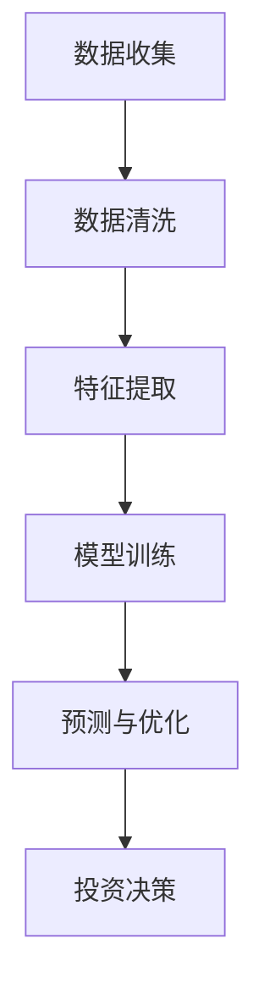

                 


# 如何利用特价股票投资应对全球经济不确定性

> 关键词：特价股票投资、全球经济不确定性、投资策略、风险管理、算法原理

> 摘要：本文详细探讨了如何利用特价股票投资应对全球经济不确定性。通过分析特价股票的基本概念、投资原理、算法设计以及实际操作策略，为投资者提供一套系统化的投资方法，帮助他们在经济波动中抓住机会，实现稳健收益。

---

## 第一部分：背景介绍

### 第1章：全球经济不确定性与投资背景

#### 1.1 当前全球经济面临的挑战

全球经济正面临前所未有的不确定性，包括地缘政治冲突、通货膨胀、经济衰退风险以及新冠疫情的长期影响。这些因素导致市场波动加剧，投资者需要寻找新的投资策略以应对挑战。

#### 1.2 经济不确定性对投资的影响

经济不确定性增加了市场的波动性和不可预测性，传统投资方式可能无法应对这些变化。投资者需要寻找更具灵活性和风险分散的投资工具。

#### 1.3 特价股票投资的兴起

特价股票作为一种新兴的投资工具，因其低门槛、高潜在回报等特点，逐渐受到投资者的关注。本文将深入探讨如何利用特价股票应对全球经济不确定性。

---

## 第二部分：核心概念与原理

### 第2章：特价股票投资的基本概念

#### 2.1 特价股票的定义与特点

- **定义**：特价股票是指价格相对较低，但具有增长潜力的股票。
- **特点**：低价格、高增长潜力、高波动性。

#### 2.2 特价股票的投资逻辑

- **价值发现**：通过分析公司基本面，寻找被市场低估的股票。
- **短期波动**：利用市场波动，捕捉短期价格变化带来的收益。

#### 2.3 特价股票与传统股票的区别

| 特性       | 特价股票         | 传统股票         |
|------------|------------------|------------------|
| 价格       | 通常较低         | 价格较高         |
| 波动性      | 较高             | 较低             |
| 投资门槛    | 低               | 高               |
| 收益潜力    | 高               | 中等             |

### 第3章：特价股票与宏观经济的关系

#### 3.1 宏观经济指标对投资的影响

- **GDP增长率**：经济增长放缓可能导致股票价格下跌。
- **通货膨胀率**：高通胀可能推高股价，但也可能引发政策干预。
- **利率变化**：低利率环境通常有利于股市表现。

#### 3.2 特价股票在经济周期中的表现

- **经济衰退期**：特价股票可能因公司基本面恶化而下跌。
- **复苏期**：特价股票可能因公司基本面改善而上涨。

---

## 第三部分：算法原理与实现

### 第4章：特价股票投资的算法设计

#### 4.1 算法概述

- **目标**：通过算法筛选潜在的特价股票，预测其价格走势。
- **步骤**：数据收集 → 数据清洗 → 特征提取 → 模型训练 → 预测与优化。

#### 4.2 算法流程图



#### 4.3 算法实现

以下是基于机器学习的特价股票预测算法的Python代码示例：

```python
import pandas as pd
import numpy as np
from sklearn.model import LinearRegression

# 数据收集与清洗
data = pd.read_csv('stock_data.csv')
data = data.dropna()

# 特征提取
features = ['PE_ratio', 'PB_ratio', 'ROE']
target = 'stock_price'

X = data[features]
y = data[target]

# 模型训练
model = LinearRegression()
model.fit(X, y)

# 预测
new_data = pd.DataFrame({
    'PE_ratio': [15],
    'PB_ratio': [2],
    'ROE': [10]
})
predicted_price = model.predict(new_data)
print(predicted_price)
```

---

## 第四部分：系统分析与设计

### 第5章：系统架构设计

#### 5.1 系统功能模块

- **数据收集模块**：收集股票数据。
- **数据分析模块**：对数据进行清洗和分析。
- **模型训练模块**：训练预测模型。
- **投资决策模块**：根据模型结果做出投资决策。

#### 5.2 系统架构图


---

## 第五部分：项目实战

### 第6章：实际案例分析

#### 6.1 环境安装

安装必要的Python库：

```bash
pip install pandas numpy scikit-learn
```

#### 6.2 核心代码实现

```python
from sklearn.metrics import accuracy_score
from sklearn.ensemble import RandomForestClassifier

# 数据加载
data = pd.read_csv('stock_data.csv')

# 特征选择
features = ['PE_ratio', 'PB_ratio', 'ROE']
target = 'buy_signal'

X = data[features]
y = data[target]

# 模型训练
model = RandomForestClassifier()
model.fit(X, y)

# 预测
new_data = pd.DataFrame({
    'PE_ratio': [15],
    'PB_ratio': [2],
    'ROE': [10]
})
predicted_signal = model.predict(new_data)
print(predicted_signal)
```

#### 6.3 案例分析

假设我们选择了一家PE_ratio为15，PB_ratio为2，ROE为10%的公司，模型预测其股票价格将上涨。根据模型结果，投资者可以决定是否买入该股票。

---

## 第六部分：总结与注意事项

### 第7章：总结与小结

#### 7.1 总结

通过利用特价股票投资，投资者可以在全球经济不确定性中寻找机会，实现资产增值。本文详细介绍了特价股票的基本概念、算法设计和实际操作策略，为投资者提供了系统化的投资方法。

#### 7.2 注意事项

- **风险控制**：投资者应合理分散投资，避免过度集中在单一股票。
- **持续学习**：全球经济环境复杂多变，投资者需要不断学习和调整策略。
- **专业建议**：投资有风险，建议在专业顾问的指导下进行。

---

## 作者

作者：AI天才研究院 & 禅与计算机程序设计艺术

---

通过以上结构，本文系统地介绍了如何利用特价股票投资应对全球经济不确定性，从理论到实践，为投资者提供了详尽的指导和实用的策略。

