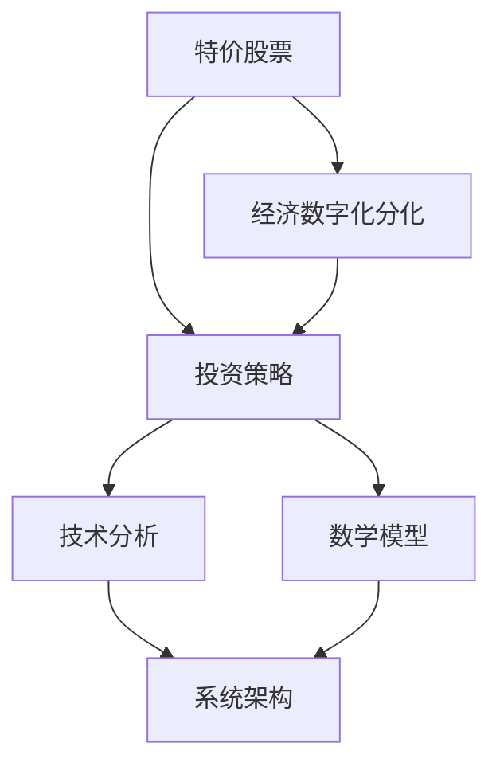

                 


# 如何利用特价股票投资应对全球经济数字化分化

> 关键词：特价股票，投资策略，经济数字化，数学模型，系统架构，项目实战

> 摘要：本文将探讨如何利用特价股票投资应对全球经济数字化分化。通过对全球经济数字化分化的现状与趋势的分析，结合特价股票的特点与投资策略的基本原理，详细阐述技术分析、数学模型和系统架构的应用，最后通过项目实战和最佳实践提供具体的投资策略和操作指南。

---

## 第一部分: 全球经济数字化分化与特价股票投资背景

### 第1章: 全球经济数字化的现状与趋势

#### 1.1 全球经济数字化的现状

数字化经济的核心特征包括数据驱动、智能化决策、自动化运营和全球化的连接。这些特征使得经济活动更加高效和复杂，同时也带来了更多的机会和挑战。

数字化分化的表现形式包括行业间的竞争加剧、技术门槛的提高以及企业运营模式的转变。这些变化导致市场结构的变化，从而影响股票市场的波动。

数字化分化对全球经济的影响主要体现在产业结构的调整、企业竞争力的增强以及全球经济格局的变化。投资者需要理解这些变化，以便制定更有效的投资策略。

#### 1.2 特价股票投资的基本概念

特价股票是指价格相对较低，具有较高增长潜力的股票。其特点包括低估值、高成长性和较高的风险。与普通股票相比，特价股票通常具有更大的波动性和潜在的高回报。

在投资组合中，特价股票的作用是提供高增长的潜力，同时分散风险。投资者需要根据自身的风险承受能力和投资目标选择合适的特价股票。

#### 1.3 投资策略的基本原理

投资策略的分类包括价值投资、成长投资和技术分析。价值投资者寻找被低估的股票，而成长投资者关注高增长潜力的企业。技术分析则通过市场数据和图表来预测股票价格的走势。

制定和调整投资策略需要考虑市场环境、企业基本面和投资者自身的财务状况。长期投资和分散投资是基本的原则，能够帮助投资者降低风险并实现稳健的回报。

#### 1.4 本章小结

本章介绍了全球经济数字化的现状与趋势，分析了特价股票的基本概念和投资策略的基本原理。通过理解这些内容，投资者可以更好地应对数字化分化带来的市场变化。

---

## 第二部分: 特价股票与经济数字化分化的内在联系

### 第2章: 特价股票与经济数字化分化的联系

#### 2.1 特价股票的核心概念

特价股票的市场定位是价格低但具有增长潜力的股票。其定价机制基于企业的基本面和技术分析。风险与收益方面，特价股票通常具有较高的波动性和潜在的高回报。

#### 2.2 经济数字化分化的概念与属性

经济数字化分化的定义是由于技术进步和市场竞争导致的行业间和企业间的分化。其核心特征包括技术驱动、数据依赖和创新导向。数字化分化对行业的影响包括产业结构的调整和企业竞争力的提升。

#### 2.3 投资策略与数字化分化的联系

数字化分化对投资策略的影响体现在行业选择和投资决策中。特价股票在数字化分化中的机会主要在于技术创新和市场扩张。投资策略的数字化转型需要结合技术分析和大数据工具，以提高决策的准确性和效率。

#### 2.4 核心概念关系图



---

## 第三部分: 特价股票投资的算法原理

### 第3章: 技术分析与算法实现

#### 3.1 技术分析的基本原理

技术分析通过研究历史价格数据来预测未来的价格走势。常用的技术指标包括移动平均线（MA）、相对强弱指数（RSI）和MACD等。这些指标可以帮助投资者识别市场趋势和潜在的买卖信号。

#### 3.2 算法实现

```python
import pandas as pd
import numpy as np

def calculate_ma(prices, window=20):
    return prices.rolling(window).mean()

def calculate_rsi(prices, window=14):
    delta = prices.diff()
    up = delta.where(delta > 0, 0)
    down = delta.where(delta < 0, 0)
    rs = up.rolling(window).sum() / down.rolling(window).sum()
    rsi = 100 - (100 - rs.rolling(window).mean())
    return rsi

# 示例数据
data = pd.DataFrame({'prices': [100, 102, 101, 103, 104, 105, 106, 107, 108, 109]})
ma = calculate_ma(data['prices'])
rsi = calculate_rsi(data['prices'])

print("MA:", ma)
print("RSI:", rsi)
```

#### 3.3 数学模型

CAPM模型用于评估股票的预期回报：

$$ E(r_i) = r_f + \beta_i (r_m - r_f) $$

其中，$r_f$ 是无风险利率，$r_m$ 是市场预期回报率，$\beta_i$ 是股票的贝塔系数。

回归分析用于评估股票价格与市场指数的关系：

$$ y = \alpha + \beta x + \epsilon $$

---

## 第四部分: 系统分析与架构设计

### 第4章: 投资系统架构设计

#### 4.1 项目介绍

投资系统的目标是通过技术分析和数学模型实现自动化投资决策。系统功能包括数据采集、分析、策略制定和交易执行。

#### 4.2 系统架构设计


#### 4.3 接口设计与交互流程


---

## 第五部分: 项目实战

### 第5章: 特价股票投资实战

#### 5.1 环境安装

安装必要的Python库，如Pandas、NumPy和Matplotlib。

#### 5.2 核心代码实现

```python
import pandas as pd
import numpy as np
import matplotlib.pyplot as plt

# 示例数据
data = pd.DataFrame({'prices': [100, 102, 101, 103, 104, 105, 106, 107, 108, 109]})

# 计算移动平均线
ma = data['prices'].rolling(5).mean()

# 绘制图表
plt.plot(data['prices'], label='Prices')
plt.plot(ma, label='MA')
plt.xlabel('Time')
plt.ylabel('Price')
plt.legend()
plt.show()
```

#### 5.3 案例分析

分析一家科技公司的股票，使用技术指标和数学模型制定投资策略，并监控交易执行和结果反馈。

#### 5.4 项目小结

通过项目实战，读者可以理解如何将技术分析和数学模型应用于实际投资中，并通过案例分析和结果反馈不断优化投资策略。

---

## 第六部分: 最佳实践与总结

### 第6章: 投资策略的最佳实践

#### 6.1 风险管理

设定止损点和止盈点，避免过度杠杆和集中投资。

#### 6.2 长期投资

选择具有长期增长潜力的企业，避免短期波动的干扰。

#### 6.3 持续学习

关注全球经济趋势和技术进步，不断优化投资策略。

#### 6.4 小结

通过本文的分析和实战，读者可以掌握如何利用特价股票投资应对全球经济数字化分化。关键在于结合技术分析、数学模型和系统架构，制定科学的投资策略，并在实践中不断优化和调整。

---

## 作者信息

作者：AI天才研究院/AI Genius Institute  
联系：[禅与计算机程序设计艺术](https://github.com/Genius-D/zen-of-computer-programming)

