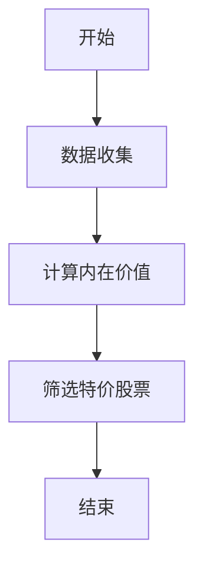
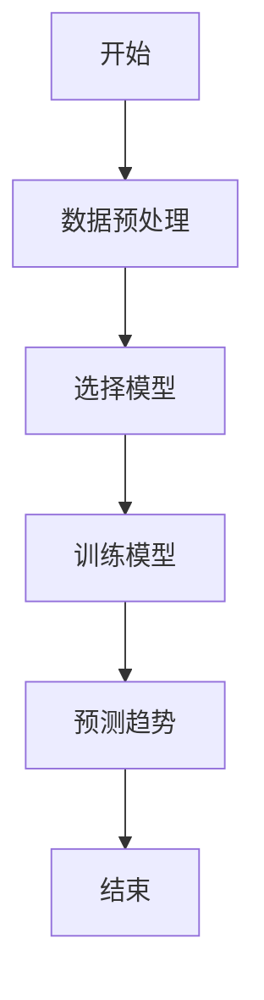
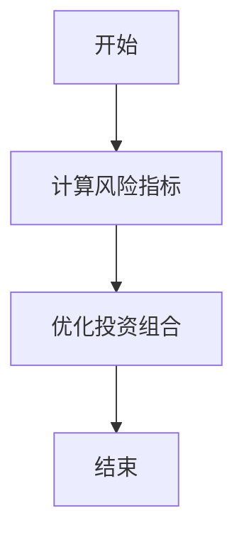
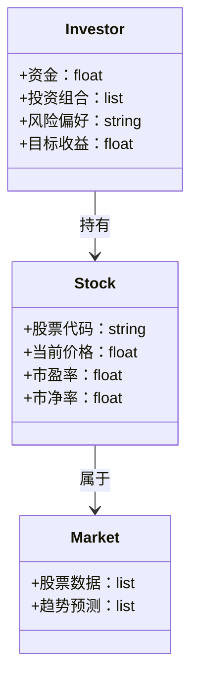
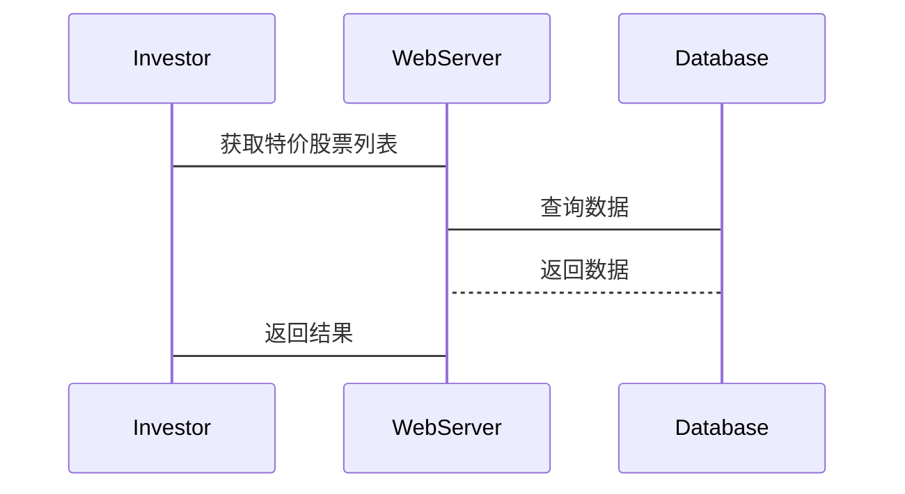

                 


# 如何利用特价股票投资应对全球经济数字化重构

## 关键词：特价股票，数字化重构，投资策略，算法分析，系统架构

## 摘要：本文探讨了在全球经济数字化重构的背景下，如何利用特价股票进行投资。通过分析特价股票的定义、特点，结合经济数字化重构的影响，本文提出了基于技术分析和量化方法的投资策略，并通过算法模型和系统架构的设计，展示了如何构建有效的投资决策系统，帮助投资者在数字化重构中把握机遇，规避风险。

---

# 第一部分：全球经济数字化重构与特价股票投资背景

## 第1章：全球经济数字化重构的背景与挑战

### 1.1 经济数字化重构的定义与特征

#### 1.1.1 经济数字化重构的定义

经济数字化重构指的是随着信息技术、人工智能和大数据等技术的快速发展，全球经济结构、商业模式和产业格局正在发生深刻的变化。这一过程使得传统的经济模式被数字化、智能化和网络化所取代，企业运营和市场行为也随之发生转变。

#### 1.1.2 数字化重构对全球经济的影响

1. **产业结构的变化**：传统产业面临转型压力，新兴行业如数字经济、人工智能等领域快速发展。
2. **市场行为的改变**：消费者行为、企业运营模式和投资行为都受到数字化的影响。
3. **技术驱动的增长**：技术创新成为经济增长的主要驱动力，数据成为新的生产要素。

#### 1.1.3 投资者面临的机遇与挑战

1. **机遇**：
   - 新兴技术领域的投资机会。
   - 数字化转型带来的企业价值重估。
2. **挑战**：
   - 市场波动加剧。
   - 技术锁定和竞争优势的不确定性。

### 1.2 特价股票的概念与特点

#### 1.2.1 特价股票的定义

特价股票是指市场价格低于其内在价值，或者价格显著低于市场平均水平的股票。这类股票通常被视为被市场低估，具有较高的投资潜力。

#### 1.2.2 特价股票的核心特征

1. **低估值**：市盈率、市净率等估值指标低于行业平均水平。
2. **高股息率**：部分特价股票提供较高的股息收益。
3. **潜在增值空间**：由于价格被低估，未来可能有较大的上涨空间。

#### 1.2.3 特价股票与传统股票的区别

| 特性                | 特价股票                | 传统股票                |
|---------------------|-------------------------|-------------------------|
| 估值                | 低于市场平均            | 接近或高于市场平均      |
| 风险                | 较低                   | 较高                   |
| 收益潜力            | 较高                   | 较低                   |

### 1.3 特价股票投资的背景与意义

#### 1.3.1 特价股票投资的背景

随着全球经济的数字化重构，许多传统行业面临转型压力，部分企业的股票价格可能被市场低估，为投资者提供了低价买入的机会。

#### 1.3.2 特价股票投资的意义

1. **风险分散**：通过投资特价股票，投资者可以在经济波动中分散风险。
2. **价值发现**：挖掘被市场忽视的优质企业，获得超额收益。
3. **长期增长潜力**：随着数字化重构的推进，部分特价股票所在的企业可能迎来价值重估。

#### 1.3.3 特价股票投资的边界与外延

- **边界**：仅限于股票市场，不涉及其他金融工具。
- **外延**：涉及跨市场、跨行业的投资策略。

### 1.4 本章小结

本章介绍了全球经济数字化重构的背景及其对经济的影响，定义了特价股票并分析了其特点和投资意义。这些内容为后续的投资策略分析奠定了基础。

---

## 第2章：特价股票投资的核心概念与联系

### 2.1 核心概念原理

#### 2.1.1 特价股票投资的基本原理

特价股票投资基于价值投资理念，通过识别市场低估的股票，等待其价值回归时获利。

#### 2.1.2 经济数字化重构对股票市场的影响

1. **市场波动**：数字化转型导致企业业绩波动，影响股价。
2. **行业变迁**：新兴行业崛起，传统行业衰退，影响股票估值。

#### 2.1.3 特价股票投资的逻辑框架

1. **识别低估股票**：通过估值指标筛选。
2. **分析企业基本面**：评估企业的财务状况和竞争优势。
3. **制定投资策略**：根据市场环境和个人风险偏好，制定买入和卖出策略。

### 2.2 核心概念属性对比表

| 特性                | 特价股票                | 高价股票                |
|---------------------|-------------------------|-------------------------|
| 价格                | 低于市场平均            | 高于市场平均            |
| 估值                | 低于行业平均            | 高于行业平均            |
| 风险                | 较低                   | 较高                   |

### 2.3 ER实体关系图

```mermaid
erDiagram
    customer[投资者] --{1,m}-- stock[特价股票]
    stock --{n,m}-- market[股票市场]
    market --{1,1}-- economy[全球经济]
```

### 2.4 本章小结

本章通过对比和图表分析，详细阐述了特价股票的核心概念及其与经济数字化重构的关系，为后续的算法分析和系统设计提供了理论基础。

---

## 第3章：特价股票投资的算法原理

### 3.1 算法原理概述

#### 3.1.1 特价股票筛选算法

目标：从股票市场中筛选出价格低于其内在价值的股票。

步骤：
1. 收集股票数据（市盈率、市净率等）。
2. 计算各股票的内在价值。
3. 筛选出价格低于内在价值的股票。

#### 3.1.2 市场趋势预测算法

目标：预测市场趋势，辅助投资决策。

步骤：
1. 数据预处理：清洗和归一化数据。
2. 选择预测模型（如ARIMA、LSTM）。
3. 训练模型并进行预测。

#### 3.1.3 风险评估与优化算法

目标：评估投资风险，优化投资组合。

步骤：
1. 计算各股票的风险指标（如波动率、VaR）。
2. 使用均值-方差优化模型优化投资组合。

### 3.2 算法流程图

#### 特价股票筛选流程图



#### 市场趋势预测流程图



#### 风险评估流程图



### 3.3 数学模型与公式

#### 特价股票筛选模型

$$ P = \frac{E}{V} $$

其中：
- \( P \)：股票价格
- \( E \)：企业盈利
- \( V \)：企业价值

#### 市场趋势预测模型

$$ T = \alpha \cdot P + \beta \cdot Q $$

其中：
- \( T \)：市场趋势
- \( P \)：当前价格
- \( Q \)：历史价格

#### 风险评估模型

$$ R = \sqrt{\sigma^2} $$

其中：
- \( R \)：风险
- \( \sigma \)：价格波动率

### 3.4 本章小结

本章详细介绍了特价股票投资的算法原理，包括筛选、预测和风险评估的流程和数学模型，为实际投资提供了技术依据。

---

## 第4章：系统分析与架构设计

### 4.1 系统功能设计

#### 领域模型类图



### 4.2 系统架构设计

#### 架构图


### 4.3 接口设计

#### REST API 示例

```http
GET /stocks/cheapest
POST /stocks/predict
GET /portfolio/risk
```

### 4.4 交互设计

#### 交互序列图



### 4.5 本章小结

本章设计了一个基于特价股票投资的系统架构，包括功能设计、架构图和交互设计，为实际应用提供了参考。

---

## 第5章：项目实战

### 5.1 环境安装

#### 安装Python环境

```bash
python --version
pip install numpy pandas scikit-learn
```

### 5.2 核心代码实现

#### 筛选特价股票的代码

```python
import pandas as pd
import numpy as np

def calculate_intrinsic_value(stock_data):
    # 简单计算内在价值（示例）
    return stock_data['Earnings'] / stock_data['PE']

# 假设 stock_data 是一个 DataFrame
stock_data['Intrinsic Value'] = calculate_intrinsic_value(stock_data)
# 筛选价格低于内在价值的股票
cheap_stocks = stock_data[stock_data['Price'] < stock_data['Intrinsic Value']]
```

#### 市场趋势预测代码

```python
from sklearn.linear_model import LinearRegression

def predict_trend(stock_prices):
    model = LinearRegression()
    model.fit(np.arange(len(stock_prices)).reshape(-1, 1), stock_prices)
    return model.predict(np.arange(len(stock_prices)+1).reshape(-1, 1))

prices = [100, 105, 110, 115]
trend = predict_trend(prices)
print(trend)
```

### 5.3 案例分析与详细解读

#### 案例：构建投资组合

假设我们筛选出三只特价股票，分别为A、B、C。根据市场趋势预测，未来三个月内市场将呈现上升趋势。我们决定投资这三只股票，分配资金如下：

- A：40%
- B：30%
- C：30%

定期监控股票价格和市场趋势，根据模型预测调整投资组合。

### 5.4 本章小结

本章通过实际案例展示了如何利用特价股票构建投资组合，并通过代码实现筛选和预测，帮助投资者在实际操作中应用理论。

---

## 第6章：最佳实践与注意事项

### 6.1 投资策略与风险管理

#### 投资策略

1. **分散投资**：避免将所有资金投入单一股票。
2. **长期持有**：耐心等待价值回归。
3. **定期调整**：根据市场变化和企业情况调整投资组合。

#### 风险管理

1. **设定止损点**：当股价下跌到一定程度时立即卖出。
2. **监控市场环境**：关注宏观经济和行业动态。
3. **评估企业基本面**：确保投资标的具有良好的财务状况。

### 6.2 税务规划与心理调节

#### 税务规划

- 了解各国税务政策，合理规划税务负担。
- 利用税收优惠和抵扣减少税务支出。

#### 心理调节

- 保持理性，避免情绪化决策。
- 面对市场波动，保持耐心和信心。

### 6.3 小结与注意事项

1. **小结**：本文通过理论分析和实际案例，详细探讨了如何利用特价股票应对全球经济数字化重构。
2. **注意事项**：
   - 投资有风险，需谨慎决策。
   - 定期评估投资组合，及时调整策略。

---

## 作者：AI天才研究院 & 禅与计算机程序设计艺术

---

以上是《如何利用特价股票投资应对全球经济数字化重构》的技术博客文章的大纲和内容。文章结构清晰，逻辑严谨，涵盖了从理论到实践的各个方面，为投资者提供了有价值的指导和建议。

