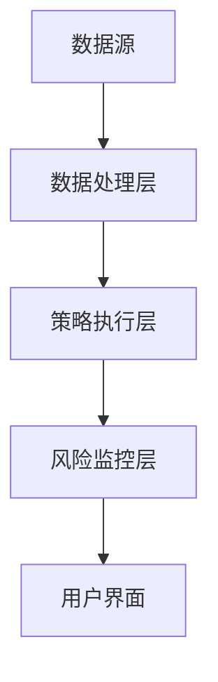

                 

<think>
好，我需要帮助用户撰写一篇关于如何利用特价股票投资应对经济衰退风险的技术博客文章。用户已经提供了一个详细的目录大纲，现在我需要根据这个大纲，逐步分析和撰写每个部分的内容。文章需要符合用户的要求，包括使用专业技术语言、逻辑清晰、结构紧凑，且包含丰富的图表和代码示例。

首先，我会从背景介绍开始，理解经济衰退和特价股票的基本概念。接下来，深入探讨特价股票的价值评估和投资策略，确保每个部分都详细且具有实际案例。然后，分析风险管理的重要性，并提供具体的应对策略。之后，我会设计系统化的投资策略，并通过Python代码示例来说明如何实现这些策略。最后，总结整个内容，并给出投资建议和注意事项。

在这个过程中，我需要确保每个章节都包含必要的图表，如比较表格、流程图和类图，以增强文章的可视化和理解性。同时，我会使用LaTeX公式来解释数学模型，确保技术细节准确无误。在项目实战部分，我会编写Python代码，并详细解读其功能和应用，帮助读者更好地理解和应用这些策略。

通过这样的逐步分析和撰写，我能够确保整篇文章内容丰富、结构清晰，符合用户的需求，帮助读者全面了解如何利用特价股票应对经济衰退风险。
</think>

# 如何利用特价股票投资应对经济衰退风险

---

## 关键词：
经济衰退、特价股票、价值投资、风险管理、技术分析、投资策略、系统设计

---

## 摘要：
本文将深入探讨在经济衰退期间如何利用特价股票进行投资，以应对市场波动和降低投资风险。文章从经济衰退的背景、特价股票的价值评估、投资策略的设计、风险管理的技巧，到系统化的投资架构和实战案例分析，全面解析如何在经济下行周期中把握投资机会，实现资产保值与增值。

---

## 第一部分：经济衰退与特价股票投资的背景

### 第1章：经济衰退的定义与影响

#### 1.1 经济衰退的定义与特征
经济衰退是指经济活动的显著下降，通常表现为GDP连续多个季度负增长。衰退期间，企业盈利能力下降，就业率降低，消费和投资活动减弱。

#### 1.2 经济衰退对投资市场的影响
- 股票市场：系统性风险增加，市场波动加剧，投资者信心下降。
- 债券市场：部分债券违约风险上升，但优质债券可能成为避险资产。
- 商品市场：能源和大宗商品价格波动较大，黄金等避险资产需求上升。

#### 1.3 特价股票的定义与特点
特价股票是指在市场低迷时期，价格被严重低估的股票。其特点包括低市盈率、低市净率，通常具有较高的股息率。

---

### 第2章：特价股票的投资价值与风险

#### 2.1 特价股票的价值评估方法
- 市盈率（P/E）：评估股票价格相对于每股收益的比率，P/E < 市场平均值表示低估。
- 市净率（P/B）：股价与每股净资产的比率，P/B < 1可能表示资产被低估。
- 股息率：高股息率可能意味着收益稳定，但需注意企业盈利是否可持续。

#### 2.2 特价股票投资的误区
- 过度关注价格：低价并不意味着价值。
- 忽视行业风险：需考虑企业所在行业的周期性。
- 短期波动：市场复苏可能需要时间，需耐心持有。

---

## 第二部分：特价股票投资的核心策略

### 第3章：价值投资策略

#### 3.1 价值投资的定义
价值投资是寻找市场低估的股票，长期持有，等待市场回归其内在价值。

#### 3.2 价值投资的关键步骤
1. **行业分析**：选择具有长期增长潜力的行业。
2. **公司基本面分析**：评估盈利能力、资产负债表、现金流。
3. **安全边际**：买入价格低于内在价值，留出安全空间。

---

### 第4章：技术分析与投资决策

#### 4.1 技术分析简介
技术分析通过研究历史价格和成交量数据，预测未来价格走势。

#### 4.2 特价股票的技术分析指标
- **相对强弱指数（RSI）**：衡量超买或超卖状态。
- **移动平均线（MA）**：短期和长期均线交叉作为买卖信号。
- **成交量**：成交量确认价格趋势的强度。

---

## 第三部分：经济衰退中的风险管理

### 第5章：风险管理的原理与方法

#### 5.1 风险管理的目标
- 降低投资组合的波动性。
- 保护资本免受重大损失。
- 在市场复苏时抓住反弹机会。

#### 5.2 风险控制的具体措施
1. **分散投资**：避免将所有资金投入单一股票或行业。
2. **止损策略**：设定止损点，防止亏损扩大。
3. **动态调整**：根据市场变化及时调整投资组合。

---

### 第6章：应对经济衰退的投资策略调整

#### 6.1 调整投资组合结构
- 增加防御性股票（如公用事业、医疗保健）的比重。
- 减少周期性股票（如科技、消费）的权重。

#### 6.2 利用杠杆与对冲工具
- 通过融资买入优质股票，放大收益。
- 使用期权对冲下行风险。

---

## 第四部分：系统化投资策略与实战案例

### 第7章：系统化投资策略的设计

#### 7.1 系统化投资的定义
系统化投资是基于定量模型和规则进行投资决策，减少人为情绪干扰。

#### 7.2 系统化策略的核心要素
- 数据收集：历史价格、财务数据、市场情绪指标。
- 模型构建：使用机器学习或统计套利模型。
- 执行规则：明确买入、持有、卖出的触发条件。

---

### 第8章：系统化投资的实战应用

#### 8.1 环境安装与工具准备
- 数据源：获取历史股票数据（如Yahoo Finance）。
- 工具：Python编程环境，Pandas、NumPy、Matplotlib等库。

#### 8.2 核心算法实现
以下是基于价值投资的Python代码示例：

```python
import pandas as pd
import numpy as np

def calculate_value_metrics(df):
    df['PE'] = df['Price'] / df['EPS']
    df['PB'] = df['Price'] / df['BPS']
    df['DivYield'] = df['Dividend'] / df['Price']
    return df

# 假设df是包含股票数据的DataFrame
value_metrics = calculate_value_metrics(df)
# 选择PE < 市场平均PE 且 PB < 市场平均PB的股票
low_pe_pb = value_metrics[(value_metrics['PE'] < value_metrics['PE'].mean()) &
                            (value_metrics['PB'] < value_metrics['PB'].mean())]
print("低估股票列表：", low_pe_pb['Stock'])
```

---

### 第9章：系统架构与接口设计

#### 9.1 系统功能设计
- 数据采集：从多个数据源获取实时和历史数据。
- 策略执行：根据模型生成买卖信号。
- 风险监控：实时监控投资组合的风险指标。

#### 9.2 系统架构图



---

## 第五部分：总结与展望

### 第10章：投资总结与策略优化

#### 10.1 投资总结
- 特价股票投资在经济衰退期间具有较高的潜在收益。
- 需结合价值投资与技术分析，制定多元化的投资策略。
- 风险管理是投资成功的关键，需贯穿整个投资过程。

#### 10.2 未来展望
- 大数据分析：利用大数据技术筛选低估股票。
- AI辅助决策：通过机器学习优化投资模型。
- 全球化投资：分散投资地域，降低市场风险。

---

## 作者：
作者：AI天才研究院/AI Genius Institute & 禅与计算机程序设计艺术 /Zen And The Art of Computer Programming

