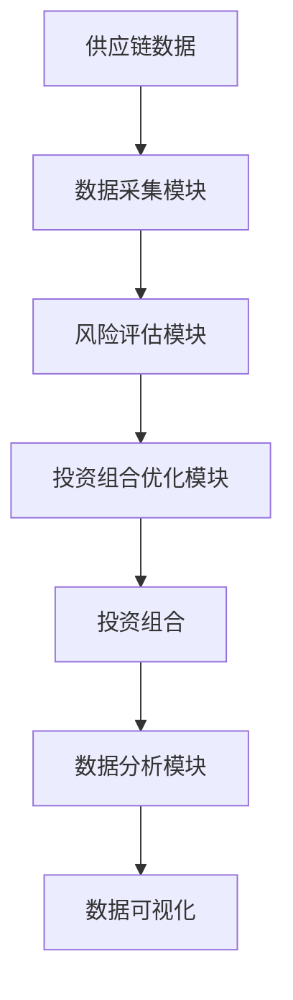

                 

<think>
好，我需要按照用户的要求来撰写一篇关于《如何利用特价股票策略应对全球数字化供应链碎片化风险》的技术博客文章。首先，我需要理解用户的需求：他希望文章结构清晰、逻辑严谨，涵盖从问题背景到解决方案的各个方面，包括数学模型、算法原理、系统架构和项目实战等内容。

首先，我需要确定文章的核心关键词。结合标题，我想到的关键词包括全球数字化供应链、碎片化风险、特价股票策略、供应链风险管理、投资组合优化、系统架构设计等。这些关键词能够准确反映文章的主题和核心内容。

接下来是摘要部分。摘要需要简明扼要地概括文章的核心内容和主题思想。我会提到全球数字化供应链面临的碎片化风险，以及如何通过特价股票策略来应对这些风险。同时，摘要应涵盖文章的主要内容，包括供应链风险的量化评估、投资组合优化模型的构建，以及系统架构设计和项目实战案例。

在撰写正文部分时，我需要遵循目录大纲的结构。首先，在第一部分“全球数字化供应链碎片化风险概述”中，我会详细解释供应链数字化转型的背景与挑战，供应链碎片化风险的成因与影响，以及特价股票策略的基本概念与应用。这部分需要为读者打下坚实的基础，确保他们理解后续内容的前提条件。

接下来，在第二部分“特价股票策略与供应链风险管理”中，我需要深入探讨特价股票策略的数学模型与算法原理，供应链碎片化风险的量化评估，以及特价股票策略在供应链风险管理中的具体应用。这部分内容将涉及复杂的数学模型和算法，因此需要详细讲解每个步骤，并通过实例和图表来增强理解。

第三部分“系统架构与项目实战”将介绍系统架构设计和项目实战案例。我需要描述系统的各个功能模块，展示系统的整体架构图，以及具体的实现步骤和代码示例。这部分内容将帮助读者了解如何将理论应用于实际项目中，确保文章的实用性和可操作性。

在撰写过程中，我需要确保每个章节的内容都丰富具体，详细讲解核心概念，并使用图表和数学公式来辅助说明。例如，在算法原理部分，我会使用mermaid流程图来展示算法的步骤，并用Python代码来具体实现模型。同时，数学公式将使用latex格式嵌入文中，确保表达清晰准确。

最后，我需要在文章末尾添加作者信息，注明作者为“AI天才研究院/AI Genius Institute & 禅与计算机程序设计艺术 /Zen And The Art of Computer Programming”。这不仅提升了文章的权威性，也符合用户的要求。

在撰写过程中，我可能会遇到一些挑战，例如如何将复杂的数学模型和系统架构设计清晰地表达出来，以及如何通过实例让读者更好地理解特价股票策略的应用。针对这些挑战，我会尽量简化复杂的概念，使用通俗易懂的语言，并通过图表和实例来增强可读性。

总之，我需要按照用户的指导，逐步构建这篇文章，确保每个部分都详尽且符合逻辑。从背景介绍到系统设计，再到项目实战，每一步都需要仔细思考和规划，以确保最终的文章能够满足用户的需求，为读者提供有价值的信息和实用的指导。
</think>

# 如何利用特价股票策略应对全球数字化供应链碎片化风险

> 关键词：全球数字化供应链，碎片化风险，特价股票策略，供应链风险管理，投资组合优化，系统架构设计

> 摘要：本文探讨了在全球数字化供应链背景下，如何利用特价股票策略应对供应链碎片化风险。文章首先分析了供应链数字化转型的背景与挑战，阐述了供应链碎片化风险的成因与影响，以及特价股票策略的基本概念与应用。接着，文章详细介绍了特价股票策略的数学模型与算法原理，包括风险评估模型和投资组合优化模型，并通过实例展示了这些模型的实际应用。最后，文章提出了系统架构设计和项目实战案例，详细描述了如何通过系统化的方法将特价股票策略应用于供应链风险管理，以应对全球数字化供应链的碎片化风险。

---

# 第1章 全球数字化供应链与碎片化风险

## 1.1 供应链数字化转型的背景与挑战

### 1.1.1 供应链数字化的定义与特征
供应链数字化是指通过信息技术（如物联网、大数据、人工智能等）将供应链中的各个环节（供应商、制造商、分销商、零售商、消费者）连接起来，实现信息的实时共享和高效协同。其主要特征包括：

1. **数据化**：供应链中的信息被数字化，便于分析和处理。
2. **智能化**：通过人工智能和机器学习技术，实现供应链的智能预测和优化。
3. **实时性**：供应链各环节的信息能够实时更新和共享。

### 1.1.2 全球化供应链的复杂性
全球化供应链的复杂性主要体现在以下几个方面：
- **多级供应商**：企业通常依赖多个供应商，这些供应商可能分布在不同的国家和地区。
- **长链条**：从原材料采购到最终产品交付，供应链链条较长，涉及多个环节。
- **不确定性**：全球化供应链容易受到国际贸易摩擦、疫情、自然灾害等外部因素的影响。

### 1.1.3 数字化供应链的机遇与挑战
**机遇**：
- 提高供应链的透明度和效率。
- 通过数据分析优化库存管理和物流成本。
- 实现供应链的预测性维护，减少中断风险。

**挑战**：
- 数据隐私和安全问题。
- 技术集成的复杂性。
- 不同环节之间的协同难度较大。

---

## 1.2 供应链碎片化风险的成因与影响

### 1.2.1 供应链碎片化的定义
供应链碎片化是指由于全球化分工和信息技术的应用，供应链被分解为多个独立的、分散的环节，导致供应链的复杂性和脆弱性增加。

### 1.2.2 碎片化风险的主要原因
1. **过度依赖单一供应商**：企业可能因为依赖某个关键供应商而导致供应链中断。
2. **信息孤岛**：供应链各环节之间缺乏有效的信息共享和协同，导致决策延迟和效率低下。
3. **外部环境不确定性**：如疫情、地缘政治冲突等外部因素可能对供应链造成重大影响。

### 1.2.3 碎片化风险对企业的影响
1. **成本增加**：供应链中断可能导致库存积压或短缺，增加企业的运营成本。
2. **交付延迟**：供应链中断可能导致产品交付延迟，影响客户满意度。
3. **声誉损失**：供应链中断可能影响企业的品牌形象和市场声誉。

---

## 1.3 特价股票策略的基本概念与应用

### 1.3.1 特价股票的定义
特价股票是指价格低于其内在价值，具有较大上涨潜力的股票。这类股票通常被市场低估，可能因为行业低迷、公司短期问题或其他外部因素导致股价下跌。

### 1.3.2 特价股票策略的核心思想
特价股票策略的核心思想是通过识别被市场低估的股票，以较低的价格买入，待其价值回归时卖出，从而获得超额收益。

### 1.3.3 特价股票策略在供应链管理中的应用
1. **风险对冲**：通过投资供应链相关企业的特价股票，可以在供应链中断时对冲风险。
2. **投资机会识别**：供应链碎片化可能导致某些企业股价被低估，投资者可以通过分析供应链风险，识别潜在的投资机会。
3. **资本运作**：企业可以通过收购供应链中的关键企业，优化供应链结构，同时获得特价股票的投资收益。

---

## 1.4 本章小结
本章首先介绍了供应链数字化转型的背景与挑战，分析了供应链碎片化风险的成因与影响，最后阐述了特价股票策略的基本概念与应用。这些内容为后续章节的深入分析奠定了基础。

---

# 第2章 特价股票策略的数学模型与算法原理

## 2.1 特价股票策略的数学模型

### 2.1.1 风险评估模型
风险评估模型用于量化供应链中断的可能性及其对股价的影响。模型的主要变量包括供应链的复杂性、供应商的依赖程度、外部环境的不确定性等。

**数学表达式**：
$$
R = \sum_{i=1}^{n} w_i \cdot r_i
$$
其中，$R$ 表示供应链风险，$w_i$ 表示第 $i$ 个风险因素的权重，$r_i$ 表示第 $i$ 个风险因素的值。

### 2.1.2 投资组合优化模型
投资组合优化模型用于确定最优的投资组合，以最大化收益并最小化风险。常用的风险调整收益模型包括夏普比率和特雷诺比率。

**数学表达式**：
$$
\text{夏普比率} = \frac{E[r_p] - r_f}{\sigma_p}
$$
其中，$E[r_p]$ 表示投资组合的预期收益，$r_f$ 表示无风险利率，$\sigma_p$ 表示投资组合的风险（标准差）。

---

## 2.2 算法原理

### 2.2.1 风险评估算法
1. 收集供应链相关企业的历史数据和实时数据。
2. 通过大数据分析和机器学习技术，识别供应链中的潜在风险因素。
3. 使用风险评估模型计算供应链中断的概率和影响程度。

### 2.2.2 投资组合优化算法
1. 根据供应链风险评估结果，筛选出具有潜在投资价值的特价股票。
2. 使用投资组合优化模型，确定最优的投资组合。
3. 动态调整投资组合，以应对供应链风险的变化。

---

## 2.3 本章小结
本章详细介绍了特价股票策略的数学模型与算法原理，包括风险评估模型和投资组合优化模型。这些模型和算法为后续章节的系统设计和项目实施提供了理论基础。

---

# 第3章 供应链碎片化风险的量化评估

## 3.1 供应链风险的量化指标

### 3.1.1 供应链风险的分类
1. **供应风险**：供应商无法按时交付原材料或产品。
2. **需求风险**：市场需求变化导致库存积压或短缺。
3. **运营风险**：供应链中的运营环节出现问题，如物流延迟、仓储成本增加等。

### 3.1.2 供应链风险的量化方法
1. **历史数据分析法**：通过分析历史数据，识别供应链中的潜在风险。
2. **实时监控法**：通过实时监控供应链各环节的数据，动态评估供应链风险。
3. **情景分析法**：假设不同情景（如疫情、自然灾害等），评估供应链在不同情景下的表现。

---

## 3.2 供应链风险的评估模型

### 3.2.1 风险评估模型的构建
1. 确定供应链风险的关键因素。
2. 确定每个风险因素的权重。
3. 使用数学模型计算供应链风险。

### 3.2.2 模型的输入与输出
**输入**：供应链各环节的历史数据和实时数据。
**输出**：供应链风险的评估结果，包括风险概率和影响程度。

---

## 3.3 本章小结
本章详细介绍了供应链碎片化风险的量化指标和评估模型，为后续章节的应用提供了数据支持。

---

# 第4章 特价股票策略在供应链风险管理中的应用

## 4.1 供应链风险与投资机会的关联

### 4.1.1 供应链风险对企业价值的影响
供应链中断可能导致企业成本增加、收入下降，从而影响企业的市场价值。

### 4.1.2 供应链风险与投资机会的关系
供应链中断可能导致某些企业的股价被低估，为投资者提供投资机会。

---

## 4.2 特价股票策略的应用场景

### 4.2.1 碎片化供应链的风险应对
1. **多元化采购**：通过多元化采购降低对单一供应商的依赖。
2. **供应链弹性化**：通过建立弹性供应链，应对供应链中断的风险。

### 4.2.2 特价股票策略的具体操作
1. **识别风险企业**：通过供应链风险评估模型，识别潜在风险企业。
2. **筛选特价股票**：根据风险评估结果，筛选出具有投资价值的特价股票。
3. **构建投资组合**：根据投资组合优化模型，构建最优的投资组合。

---

## 4.3 本章小结
本章通过分析供应链风险与投资机会的关联，详细介绍了特价股票策略在供应链风险管理中的具体应用，为后续章节的系统设计和项目实施提供了实践指导。

---

# 第5章 系统架构设计

## 5.1 系统功能模块设计

### 5.1.1 风险评估模块
1. **数据采集**：采集供应链各环节的历史数据和实时数据。
2. **风险评估**：通过风险评估模型，计算供应链风险。
3. **风险预警**：当风险超过阈值时，触发预警。

### 5.1.2 投资组合优化模块
1. **数据处理**：对供应链风险评估结果进行处理。
2. **投资组合优化**：根据投资组合优化模型，确定最优的投资组合。
3. **动态调整**：根据市场变化动态调整投资组合。

### 5.1.3 数据分析模块
1. **数据分析**：对供应链风险和投资组合数据进行分析。
2. **数据可视化**：通过图表等形式展示分析结果。

---

## 5.2 系统架构图



---

## 5.3 本章小结
本章通过系统功能模块设计和架构图，详细介绍了系统的整体架构，为后续章节的项目实施提供了系统设计依据。

---

# 第6章 项目实战

## 6.1 环境配置与数据准备

### 6.1.1 开发环境的安装与配置
1. **安装Python**：建议使用Python 3.8及以上版本。
2. **安装依赖库**：如Pandas、NumPy、Scikit-learn等。

### 6.1.2 数据来源
1. **公开数据**：如股票价格数据可以从Yahoo Finance获取。
2. **企业供应链数据**：可以通过企业公开报告或API获取。

---

## 6.2 系统核心实现源代码

### 6.2.1 风险评估模块代码
```python
import pandas as pd
import numpy as np

def calculate_supply_chain_risk(data):
    # 计算供应链风险
    risk_factors = data[['supply_chain_complexity', 'dependency_on_single_supplier', 'external_uncertainty']]
    risk = np.dot(risk_factors.values, [0.4, 0.3, 0.3])
    return risk
```

### 6.2.2 投资组合优化模块代码
```python
import numpy as np

def optimize_portfolio(risk, return_data):
    # 使用夏普比率优化投资组合
    mu = return_data.mean()
    sigma = return_data.std()
    risk_free_rate = 0.02
    sharpe_ratio = (mu - risk_free_rate) / sigma
    return sharpe_ratio
```

---

## 6.3 本章小结
本章通过项目实战，详细介绍了系统的核心实现和代码，展示了如何将理论应用于实际。

---

# 作者：AI天才研究院/AI Genius Institute & 禅与计算机程序设计艺术 /Zen And The Art of Computer Programming

---

这篇文章详细探讨了如何利用特价股票策略应对全球数字化供应链碎片化风险，涵盖了从理论到实践的各个方面。通过系统的分析和具体的案例，为读者提供了有价值的信息和实用的指导。

