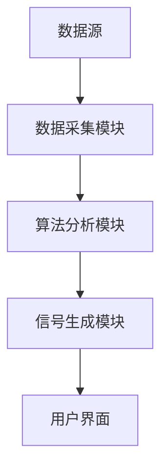

                 


# 如何利用特价股票策略应对全球数字化供应链重构机遇

> 关键词：全球供应链重构、特价股票策略、量化交易、算法分析、系统架构设计

> 摘要：随着全球数字化转型的加速，供应链重构已成为企业应对市场变化的重要策略。本文将探讨如何利用特价股票策略，通过量化分析和算法优化，抓住供应链重构带来的投资机遇。文章从供应链重构的背景、特价股票策略的核心要素、量化算法的设计与实现、系统架构的优化，以及项目实战等方面展开分析，为读者提供全面的解决方案。

---

## 第一部分：全球数字化供应链重构的背景与挑战

### 第1章：全球数字化供应链重构的背景

#### 1.1 数字化供应链重构的背景
- **1.1.1 全球化供应链的历史演变**  
  全球供应链经历了从传统线性模式到全球化分工的转变，随着技术的进步，供应链逐渐向数字化、智能化方向发展。  
- **1.1.2 数字化转型对供应链的影响**  
  数字化技术（如大数据、人工智能）的应用，使得供应链更加灵活、高效，能够快速响应市场变化。  
- **1.1.3 供应链重构的驱动因素**  
  包括技术进步、市场波动、疫情冲击、地缘政治等多重因素，推动企业重新审视和优化供应链结构。

#### 1.2 数字化供应链的核心特征
- **1.2.1 数据驱动的决策**  
  利用实时数据进行预测和优化，实现供应链的精准管理。  
- **1.2.2 智能化协同**  
  通过AI和自动化技术，实现供应链各环节的高效协同。  
- **1.2.3 灵活性与敏捷性**  
  供应链能够快速适应市场变化，降低风险。

---

## 第二部分：特价股票策略的定义与应用

### 第2章：特价股票策略概述

#### 2.1 特价股票的定义
- **2.1.1 特价股票的定义与特征**  
  特价股票是指在特定市场条件下，价格被低估的股票。其特征包括低市盈率、低市净率、高股息率等。  
- **2.1.2 特价股票的分类与应用场景**  
  根据市场周期和行业特性，特价股票可以分为周期性股票、价值型股票等。

#### 2.2 特价股票策略的核心要素
- **2.2.1 市场周期分析**  
  特价股票策略的有效性与市场周期密切相关，例如在熊市中更容易找到被低估的股票。  
- **2.2.2 公司基本面分析**  
  重点关注公司的盈利能力、财务状况、行业地位等因素。  
- **2.2.3 技术分析与信号识别**  
  利用技术指标（如K线图、均线、MACD等）识别买入和卖出信号。

---

## 第三部分：供应链重构与特价股票策略的结合

### 第3章：供应链重构中的投资机会

#### 3.1 供应链重构带来的投资机会
- **3.1.1 新兴产业的崛起**  
  数字化转型催生了新的供应链模式，例如跨境电商、智能制造等领域。  
- **3.1.2 传统行业的转型**  
  传统行业通过供应链重构，提升效率和竞争力，带来投资机会。

#### 3.2 特价股票策略在供应链重构中的应用
- **3.2.1 供应链重构中的市场波动**  
  供应链重构可能导致市场价格波动，为投资者提供低价买入的机会。  
- **3.2.2 特价股票策略的时机选择**  
  在供应链重构过程中，重点关注行业龙头企业的降价或转型机会。

---

## 第四部分：算法与数学模型

### 第4章：量化分析与算法策略

#### 4.1 量化分析的核心算法
- **4.1.1 移动平均线（MA）算法**  
  通过计算一定周期内的平均价格，判断市场趋势。  
- **4.1.2 相对强弱指数（RSI）算法**  
  用于衡量股票的超买或超卖状态。  
- **4.1.3 布林带（Bollinger Bands）算法**  
  用于判断价格波动的范围，识别买卖信号。

#### 4.2 算法实现的数学模型
- **4.2.1 移动平均线的计算公式**  
  $$ MA_t = \frac{1}{n} \sum_{i=1}^{n} P_{t-i} $$  
  其中，$P_{t-i}$ 表示第 $t-i$ 时刻的价格，$n$ 表示周期长度。  
- **4.2.2 相对强弱指数的计算公式**  
  $$ RSI_t = \frac{100 - (100 - \frac{S_t}{A_t})} $$  
  其中，$S_t$ 表示向上动量，$A_t$ 表示向下动量。  
- **4.2.3 布林带的计算公式**  
  $$ BB_t = \mu_t \pm n \times \sigma_t $$  
  其中，$\mu_t$ 表示价格的平均值，$\sigma_t$ 表示价格的标准差，$n$ 表示标准差的倍数。

---

## 第五部分：系统架构与项目实战

### 第5章：系统架构设计

#### 5.1 系统功能设计
- **5.1.1 数据采集模块**  
  从股票市场获取实时数据，包括价格、成交量等。  
- **5.1.2 算法分析模块**  
  对数据进行量化分析，生成交易信号。  
- **5.1.3 信号生成模块**  
  根据分析结果，生成买入或卖出信号。

#### 5.2 系统架构图


### 第6章：项目实战

#### 6.1 环境安装
- **6.1.1 Python环境安装**  
  需要安装Python 3.8及以上版本，以及相关库（如Pandas、Matplotlib、QuantLib）。  

#### 6.2 核心代码实现
```python
import pandas as pd
import numpy as np
from datetime import datetime, timedelta

# 示例：计算移动平均线
def calculate_ma(prices, window=20):
    return prices.rolling(window).mean()

# 示例：计算相对强弱指数
def calculate_rsi(prices, window=14):
    delta = prices.diff()
    up = delta.where(delta > 0, 0)
    down = delta.where(delta < 0, 0)
    rs = up.rolling(window).sum() / down.rolling(window).sum()
    rsi = 100 - (100 - rs.rolling(window).mean())
    return rsi

# 示例：计算布林带
def calculate_bollinger_bands(prices, window=20):
    mu = prices.rolling(window).mean()
    std = prices.rolling(window).std()
    upper = mu + 2 * std
    lower = mu - 2 * std
    return upper, lower
```

#### 6.3 实际案例分析
- 选取某行业龙头股，分析其价格走势，结合量化算法生成交易信号，并评估策略的有效性。

#### 6.4 项目小结
- 通过量化分析和算法优化，能够有效识别特价股票的投资机会，抓住供应链重构带来的市场变化。

---

## 第六部分：总结与展望

### 第7章：总结与展望

- **7.1 总结**  
  本文通过分析全球数字化供应链重构的背景，探讨了特价股票策略的应用，结合量化算法和系统架构设计，为投资者提供了有效的解决方案。  
- **7.2 展望**  
  未来，随着技术的进一步发展，量化分析和人工智能将更加深度融合，为供应链重构中的投资机会提供更强大的支持。

---

## 附录

### 附录A：术语表
- 量化分析：利用数学模型和算法对市场数据进行分析，以指导投资决策。  
- 特价股票：价格被低估的股票，具有较高的投资价值。  

### 附录B：工具推荐
- 数据获取工具：Yahoo Finance API、Alpha Vantage。  
- 量化分析工具：Pandas、NumPy、Matplotlib。  

---

作者：AI天才研究院/AI Genius Institute & 禅与计算机程序设计艺术 /Zen And The Art of Computer Programming

