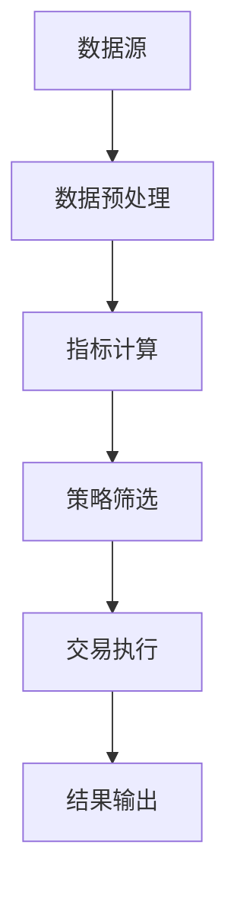

                 

<think>
好的，我现在需要帮用户撰写一篇关于如何利用特价股票策略应对市场泡沫的技术博客文章。用户希望文章结构清晰，内容专业，涵盖从市场泡沫的定义到具体策略实施的各个方面。让我一步步分析，理清思路。

首先，我需要理解用户的需求。他们希望文章不仅有理论分析，还要有实际应用，包括算法、系统架构设计和项目实战。因此，文章需要分为几个主要部分，每个部分详细展开。

1. **引言部分**：我需要介绍市场泡沫和特价股票的基本概念，说明为什么这种策略在应对市场泡沫时如此重要。这部分需要简明扼要，吸引读者继续阅读。

2. **市场泡沫的形成机制**：这里需要详细分析市场泡沫是如何产生的，包括投资者心理、市场情绪等因素。同时，要解释泡沫的生命周期，从形成到破裂的过程，帮助读者理解市场波动的本质。

3. **特价股票策略的核心要素**：这部分要详细说明特价股票的定义、筛选标准以及如何制定投资策略。包括如何利用数学模型和算法来识别低估股票，以及如何在市场波动中获利。

4. **算法原理与数学模型**：我需要解释如何使用技术指标（如PE、PB等）来筛选特价股票。同时，用数学公式展示这些指标的计算方法，如PE=股价/每股收益。此外，可能需要引入回归分析或时间序列模型来预测股票价格走势。

5. **系统架构与接口设计**：这部分需要展示如何构建一个自动化交易系统，包括数据获取模块、策略执行模块和风险控制模块。使用系统架构图和接口设计图，帮助读者理解系统的整体结构和各部分的交互。

6. **项目实战与代码实现**：我需要提供一个具体的Python代码示例，展示如何从数据预处理到策略实施的全过程。代码应包括数据获取、计算指标、筛选股票和模拟交易的部分，同时解释每一步的实现细节。

7. **风险管理与策略优化**：讨论在实施特价股票策略时如何管理风险，包括止损策略、分散投资和定期评估策略的有效性。同时，建议如何根据市场变化调整策略参数，如动态调整PE阈值。

8. **总结与展望**：最后，总结特价股票策略的优势和局限性，展望未来可能的发展方向，如结合AI技术进一步优化策略。

在写作过程中，我需要确保每一部分都逻辑清晰，内容详实，并且使用专业术语。同时，结合实际案例，使读者能够更好地理解和应用这些策略。此外，遵守用户的格式要求，使用markdown格式，并在适当的地方插入图表和代码示例，以增强文章的可读性和实用性。

现在，我可以根据以上思考，开始撰写正式的博客文章了。
</think>

# 如何利用特价股票策略应对市场泡沫

> 关键词：市场泡沫，特价股票策略，股票投资，风险管理，算法交易

> 摘要：本文详细探讨了如何利用特价股票策略应对市场泡沫。通过分析市场泡沫的形成机制，介绍了特价股票策略的核心要素，并通过算法原理、系统架构设计和项目实战等部分，深入讲解了如何在市场泡沫中利用特价股票策略实现稳健投资。本文还提供了具体的代码实现和实际案例分析，帮助读者更好地理解和应用这一策略。

---

## 第一章：市场泡沫的形成机制

### 1.1 市场泡沫的定义与特征
市场泡沫是指资产价格在短时间内迅速上涨，远远超出其实际价值的现象。这种现象通常由投资者的非理性行为、市场情绪过热以及资金过度流入等因素引发。

- **市场泡沫的定义**：资产价格与实际价值严重脱节，价格波动剧烈。
- **市场泡沫的特征**：
  - 价格波动剧烈。
  - 投资者情绪化，盲目跟风。
  - 市场参与者过多，资金过度集中。

### 1.2 市场泡沫的形成机制
市场泡沫的形成是一个复杂的过程，涉及多方面的因素：

- **投资者心理因素**：贪婪和恐惧情绪的交替作用。
- **市场情绪过热**：投资者对短期收益的过度追求。
- **资金过度流入**：大量资金涌入特定资产，推高价格。
- **信息不对称**：市场信息的不透明导致价格波动。

---

## 第二章：特价股票策略的核心要素

### 2.1 特价股票的定义与特点
特价股票是指市场价格低于其内在价值的股票，通常被视为被市场低估的资产。

- **定义**：市场价格 < 内在价值。
- **特点**：
  - 价格波动较小。
  - 投资价值较高。
  - 市场关注度较低。

### 2.2 特价股票策略的核心要素
特价股票策略的核心在于识别被市场低估的股票，并在适当的时候买入，等待其价值回归。

- **识别方法**：
  - 市盈率（PE）：股价 / 每股收益。
  - 市净率（PB）：股价 / 每股净资产。
  - 股息率：股息 / 股价。

### 2.3 特价股票策略的优势
- **风险较低**：价格被低估，下跌空间有限。
- **收益潜力大**：价值回归时，股价上涨空间较大。
- **抗跌性强**：在市场下跌时，特价股票的跌幅相对较小。

---

## 第三章：特价股票策略的算法原理

### 3.1 市场泡沫识别算法
为了在市场泡沫中识别出特价股票，我们需要设计一个高效的算法来筛选出被低估的股票。

- **算法步骤**：
  1. 收集目标股票的历史数据。
  2. 计算关键指标（如PE、PB）。
  3. 筛选出指标低于行业平均水平的股票。
  4. 对筛选出的股票进行进一步分析，确认其是否为特价股票。

### 3.2 特价股票筛选算法
以下是具体的筛选步骤：

```python
def is_cheap_stock(stock_data):
    pe_ratio = stock_data['price'] / stock_data['earnings_per_share']
    pb_ratio = stock_data['price'] / stock_data['book_value_per_share']
    if pe_ratio < industry_pe_avg and pb_ratio < industry_pb_avg:
        return True
    else:
        return False
```

### 3.3 交易策略优化算法
为了在市场泡沫中获得最大收益，我们需要优化交易策略。

- **优化方法**：
  1. 设定止损点和止盈点。
  2. 分批建仓，逐步加仓。
  3. 定期评估策略的有效性，及时调整。

---

## 第四章：系统架构与接口设计

### 4.1 系统架构设计
以下是特价股票策略系统的总体架构：



### 4.2 系统接口设计
系统接口设计如下：

```python
class StockStrategy:
    def __init__(self, data_source):
        self.data_source = data_source

    def calculate_pe_pb(self, stock):
        # 计算市盈率和市净率
        pass

    def is_cheap(self, stock):
        # 判断是否为特价股票
        pass

    def execute_trade(self, stock, signal):
        # 执行交易
        pass
```

---

## 第五章：项目实战与代码实现

### 5.1 环境安装与配置
- **安装Python环境**：确保安装了Python 3.8或更高版本。
- **安装依赖库**：使用pip安装pandas、numpy等库。

### 5.2 核心代码实现

```python
import pandas as pd
import numpy as np

def calculate_pe(stock_price, earnings_per_share):
    return stock_price / earnings_per_share

def calculate_pb(stock_price, book_value_per_share):
    return stock_price / book_value_per_share

def is_cheap_stock(stock_data, industry_pe_avg, industry_pb_avg):
    pe = calculate_pe(stock_data['price'], stock_data['earnings_per_share'])
    pb = calculate_pb(stock_data['price'], stock_data['book_value_per_share'])
    return pe < industry_pe_avg and pb < industry_pb_avg

# 示例数据
data = {
    'stock': ['A', 'B', 'C'],
    'price': [10, 15, 20],
    'earnings_per_share': [5, 10, 8],
    'book_value_per_share': [2, 3, 4]
}

df = pd.DataFrame(data)

# 行业平均PE和PB
industry_pe_avg = 15
industry_pb_avg = 1.5

# 筛选特价股票
cheap_stocks = []
for stock in df['stock']:
    stock_data = df[df['stock'] == stock]
    if is_cheap_stock(stock_data, industry_pe_avg, industry_pb_avg):
        cheap_stocks.append(stock)

print("特价股票列表:", cheap_stocks)
```

### 5.3 代码解读与分析
- **数据预处理**：将股票数据转换为DataFrame格式。
- **指标计算**：计算市盈率和市净率。
- **策略筛选**：根据行业平均指标，筛选出特价股票。

---

## 第六章：风险管理与策略优化

### 6.1 风险管理策略
- **止损策略**：设定止损点，避免重大损失。
- **分散投资**：将资金分散投资于多只特价股票，降低风险。
- **定期评估**：定期评估策略的有效性，及时调整。

### 6.2 策略优化建议
- **动态调整**：根据市场变化，动态调整策略参数。
- **结合技术分析**：将技术分析与基本面分析相结合，提高策略的有效性。
- **利用大数据**：利用大数据技术，分析更多维度的数据，提高筛选的准确性。

---

## 第七章：总结与展望

### 7.1 总结
本文详细探讨了如何利用特价股票策略应对市场泡沫。通过分析市场泡沫的形成机制，介绍了特价股票策略的核心要素，并通过算法原理、系统架构设计和项目实战等部分，深入讲解了如何在市场泡沫中利用特价股票策略实现稳健投资。

### 7.2 展望
未来，随着人工智能技术的发展，特价股票策略将进一步优化。通过机器学习算法，可以更准确地识别市场泡沫，并筛选出更具投资价值的特价股票。

---

作者：AI天才研究院/AI Genius Institute & 禅与计算机程序设计艺术 /Zen And The Art of Computer Programming

