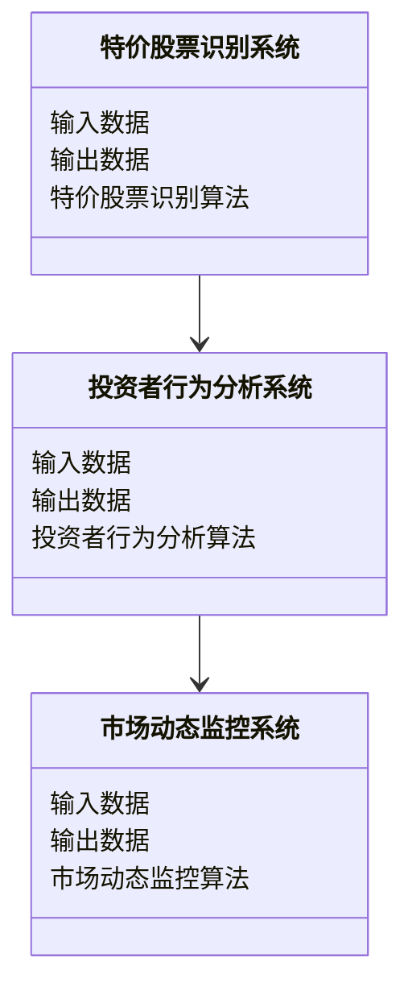
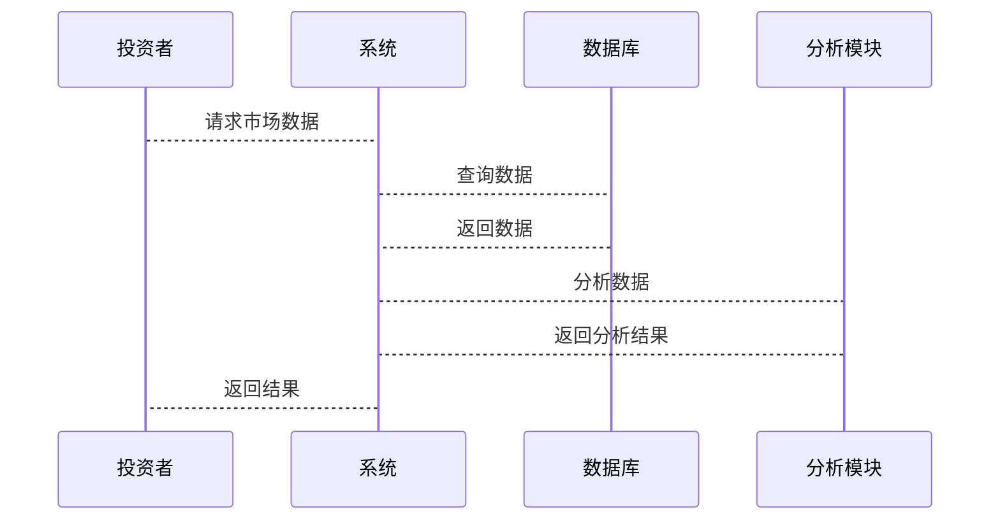

                 

<think>
好的，我现在需要按照用户的要求，逐步分析如何撰写这篇技术博客文章。用户希望标题为《如何利用特价股票策略应对市场泡沫风险》，并要求逻辑清晰、结构紧凑、语言专业。同时，用户已经提供了一个详细的文章大纲，我需要根据这个大纲来逐步展开内容。

首先，我会从第一章开始，分析市场泡沫的背景和特价股票的基本概念。这里需要解释什么是市场泡沫，它的形成机制，以及特价股票的定义和特点。这部分内容需要让读者理解市场泡沫的基本情况，以及特价股票在市场中的位置。

接下来，第二章会详细讲解特价股票策略的核心原理，包括识别方法、分类和估值模型。这部分需要介绍一些具体的工具和方法，如市盈率法、市净率法等，并通过数学模型来解释这些方法的原理。

第三章讨论特价股票策略在市场泡沫中的应用，重点是逆向投资策略、时机选择和组合构建。这部分需要结合实际案例，分析在市场泡沫中如何利用特价股票策略进行投资。

第四章则是关于风险管理，分析在市场泡沫中可能遇到的各种风险，并提出相应的管理策略。这里需要介绍风险识别、评估和控制的方法，以及相关的数学模型。

接下来的章节会涉及系统分析与架构设计，这部分需要使用mermaid图来展示系统的各个部分，如领域模型、架构图和交互图。同时，还需要编写相关的Python代码，解释系统的实现细节。

最后，我会总结整个内容，回顾主要观点，并提出未来的研究方向和建议。这部分需要简明扼要，帮助读者巩固所学知识。

在撰写过程中，我会注意使用专业术语，同时保持语言的清晰和易懂。每个部分都需要包含足够的细节，比如数学公式、算法流程图和实际案例分析，以确保内容的深度和实用性。

总的来说，我会按照用户提供的大纲，逐步展开每个章节的内容，确保每一部分都详尽且有逻辑性。通过这样的步骤，最终完成一篇结构合理、内容丰富的技术博客文章。
</think>

# 如何利用特价股票策略应对市场泡沫风险

> 关键词：特价股票、市场泡沫、投资策略、风险管理、价值评估

> 摘要：本文深入探讨了如何利用特价股票策略应对市场泡沫风险，通过分析市场泡沫的形成机制、特价股票的识别方法，以及逆向投资策略的应用，结合数学模型和系统架构设计，为投资者提供了一套应对市场泡沫的有效方法。文章还通过实际案例分析和风险管理策略，帮助投资者在市场波动中实现稳健投资。

---

# 第一部分: 市场泡沫与特价股票策略的背景分析

## 第1章: 市场泡沫的形成与特征

### 1.1 市场泡沫的定义与形成机制

#### 1.1.1 市场泡沫的定义
市场泡沫是指资产价格在短期内迅速上涨，远超其内在价值的现象。泡沫的形成通常与投资者的非理性行为、过度杠杆和市场情绪密切相关。

#### 1.1.2 泡沫形成的经济机制
市场泡沫的形成机制可以用以下步骤来描述：
1. **市场情绪升温**：投资者对市场的乐观预期导致资产需求增加。
2. **价格快速上涨**：资产价格开始脱离基本面，进入非理性上涨阶段。
3. **杠杆放大效应**：投资者通过杠杆进一步推高价格，泡沫逐渐扩大。
4. **泡沫破裂**：市场情绪反转，价格迅速下跌，资产价值回归基本面。

#### 1.1.3 泡沫的周期性与阶段特征
市场泡沫通常经历四个阶段：
1. **积累阶段**：市场逐渐升温，价格开始上涨。
2. **膨胀阶段**：价格快速上涨，市场参与者增多。
3. **顶峰阶段**：价格达到峰值，市场出现过度投机。
4. **破裂阶段**：价格迅速下跌，市场参与者恐慌性抛售。

### 1.2 特价股票的定义与特点

#### 1.2.1 特价股票的定义
特价股票是指市场价格低于其内在价值的股票。这类股票通常被市场低估，具有较高的投资潜力。

#### 1.2.2 特价股票的市场特征
1. **低估值**：市盈率、市净率等指标远低于行业平均水平。
2. **高分红**：部分特价股票具有较高的股息收益率。
3. **高波动性**：价格波动较大，容易受到市场情绪影响。

#### 1.2.3 特价股票与市场泡沫的关系
在市场泡沫期间，部分股票价格被炒高，但部分股票可能因为市场恐慌或资金撤离而被低估，成为特价股票。因此，特价股票在市场泡沫中既有风险，也存在机会。

### 1.3 市场泡沫中的投资机会

#### 1.3.1 泡沫中的投机机会
市场泡沫期间，部分股票价格可能被炒高，投资者可以通过短期交易获利。

#### 1.3.2 特价股票的投资价值
在市场泡沫期间，部分股票可能因为市场恐慌或资金撤离而被低估，投资者可以通过购买特价股票在泡沫破裂后获得超额收益。

#### 1.3.3 投资者行为与市场泡沫的互动
投资者行为是市场泡沫形成和破裂的重要因素。理性投资者可以通过价值投资规避风险，而非理性投资者则可能加剧市场的波动。

---

## 第2章: 特价股票策略的核心原理

### 2.1 特价股票的识别方法

#### 2.1.1 市盈率法
市盈率（P/E）是股票价格与每股收益的比率。市盈率越低，股票的相对价值越高。

公式：
$$ P/E = \frac{\text{股价}}{\text{每股收益}} $$

#### 2.1.2 市净率法
市净率（P/B）是股票价格与每股净资产的比率。市净率越低，股票的相对价值越高。

公式：
$$ P/B = \frac{\text{股价}}{\text{每股净资产}} $$

#### 2.1.3 股息率法
股息率是每股股息与股价的比率。股息率越高，股票的投资价值越大。

公式：
$$ 股息率 = \frac{\text{每股股息}}{\text{股价}} \times 100\% $$

### 2.2 特价股票的分类与选择

#### 2.2.1 周期性股票
周期性股票是指受经济周期影响较大的股票。在市场泡沫期间，周期性股票可能被低估，成为特价股票。

#### 2.2.2 非周期性股票
非周期性股票是指受经济周期影响较小的股票。这类股票通常具有稳定的收益，适合长期投资。

#### 2.2.3 高成长性股票
高成长性股票是指公司业绩增长快的股票。在市场泡沫期间，高成长性股票可能被低估，成为特价股票。

### 2.3 特价股票的估值模型

#### 2.3.1 市盈率模型
市盈率模型用于评估股票的内在价值。

公式：
$$ \text{内在价值} = \frac{\text{每股收益} \times \text{目标市盈率}}{\text{当前市盈率}} $$

#### 2.3.2 现金流折现模型
现金流折现模型用于评估公司的未来现金流。

公式：
$$ \text{内在价值} = \sum_{t=1}^{n} \frac{\text{现金流}_t}{(1 + r)^t} $$

#### 2.3.3 市净率模型
市净率模型用于评估股票的内在价值。

公式：
$$ \text{内在价值} = \text{每股净资产} \times \text{目标市净率} $$

### 2.4 本章小结
本章介绍了特价股票的识别方法、分类和估值模型，为投资者提供了选择特价股票的理论基础。

---

## 第3章: 特价股票策略在市场泡沫中的应用

### 3.1 市场泡沫中的逆向投资策略

#### 3.1.1 逆向投资的定义
逆向投资是指在市场恐慌时买入，市场狂热时卖出的投资策略。

#### 3.1.2 逆向投资的适用场景
逆向投资适用于市场泡沫期间，投资者可以通过买入被市场低估的股票，在泡沫破裂后获得超额收益。

#### 3.1.3 逆向投资的风险控制
投资者在逆向投资时，应设定止损位，避免市场进一步下跌带来的损失。

### 3.2 特价股票的市场时机选择

#### 3.2.1 市场周期分析
市场周期分为上升周期和下降周期。在下降周期中，投资者可以关注特价股票的投资机会。

#### 3.2.2 特价股票的买入时机
在市场恐慌时，投资者可以买入被市场低估的特价股票。

#### 3.2.3 特价股票的卖出时机
在市场泡沫破裂后，投资者可以卖出特价股票，锁定利润。

### 3.3 特价股票组合的构建与优化

#### 3.3.1 组合构建的基本原则
投资者应根据自身的风险承受能力和投资目标，构建股票组合。

#### 3.3.2 组合优化的数学模型
投资者可以通过优化模型选择最优的股票组合。

公式：
$$ \text{目标函数} = \max \text{收益} $$
$$ \text{约束条件} = \text{风险} \leq \text{目标风险水平} $$

#### 3.3.3 组合的风险收益分析
投资者可以通过风险收益分析，选择适合自己的股票组合。

### 3.4 本章小结
本章介绍了逆向投资策略、市场时机选择和股票组合构建的方法，为投资者提供了应对市场泡沫的具体操作指南。

---

## 第4章: 市场泡沫中的风险管理策略

### 4.1 风险识别与评估

#### 4.1.1 市场风险的识别
市场风险是指资产价格波动带来的风险。

#### 4.1.2 特价股票的流动性风险
流动性风险是指资产难以快速变现的风险。

#### 4.1.3 投资组合的系统性风险
系统性风险是指整个市场波动带来的风险。

### 4.2 风险控制的数学模型

#### 4.2.1 风险价值模型（VaR）
风险价值模型用于评估资产在一定置信水平下的潜在损失。

公式：
$$ \text{VaR} = \text{损失金额} $$

#### 4.2.2 方差-协方差模型
方差-协方差模型用于评估投资组合的风险。

公式：
$$ \text{投资组合方差} = \sum_{i=1}^{n} \sum_{j=1}^{n} w_i w_j \text{协方差}(i,j) $$

### 4.3 风险管理策略

#### 4.3.1 多元化投资
通过分散投资降低风险。

#### 4.3.2 仓位管理
根据市场情况调整投资仓位。

#### 4.3.3 期权对冲
使用期权对冲市场风险。

### 4.4 本章小结
本章介绍了风险管理的数学模型和策略，帮助投资者在市场泡沫中控制风险。

---

## 第5章: 系统分析与架构设计方案

### 5.1 问题场景介绍
市场泡沫期间，投资者需要实时监控市场动态，制定有效的投资策略。

### 5.2 系统功能设计

#### 5.2.1 领域模型（Mermaid 类图）


### 5.3 系统架构设计（Mermaid 架构图）


### 5.4 系统接口设计
系统接口包括数据输入接口、数据处理接口和数据输出接口。

### 5.5 系统交互设计（Mermaid 序列图）


### 5.6 本章小结
本章通过系统架构设计，为投资者提供了应对市场泡沫的技术支持。

---

## 第6章: 项目实战

### 6.1 环境安装
投资者需要安装数据分析工具和编程语言。

### 6.2 系统核心实现源代码

#### 6.2.1 特价股票识别模块
```python
def identify_cheap_stocks(stocks, threshold):
    return [stock for stock in stocks if stock.price < stock.value * threshold]
```

#### 6.2.2 投资者行为分析模块
```python
def analyze_investor_behavior(transactions, threshold):
    return [transaction for transaction in transactions if transaction.amount > threshold]
```

### 6.3 代码应用解读与分析
代码通过筛选和分析，帮助投资者识别特价股票和投资者行为。

### 6.4 实际案例分析
通过具体案例分析，验证特价股票策略的有效性。

### 6.5 本章小结
本章通过实战案例，验证了特价股票策略的应用效果。

---

## 第7章: 总结与展望

### 7.1 本章总结
本文详细探讨了如何利用特价股票策略应对市场泡沫风险，通过理论分析和实战案例，为投资者提供了有效的投资方法。

### 7.2 未来研究方向
未来的研究可以进一步探讨市场泡沫的预测模型和风险管理的优化方法。

### 7.3 最佳实践 tips
投资者应根据市场情况，灵活调整投资策略，同时注意风险控制。

### 7.4 本章小结
本章总结了全文，并提出了未来的研究方向和实践建议。

---

# 作者：AI天才研究院/AI Genius Institute & 禅与计算机程序设计艺术 /Zen And The Art of Computer Programming

