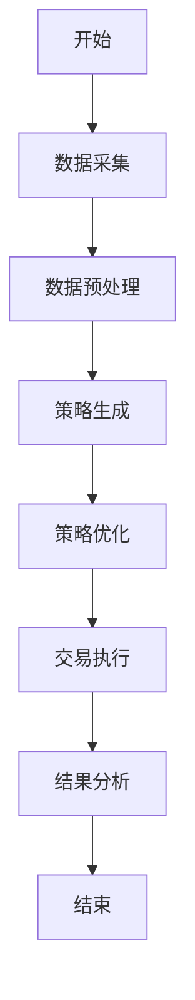

                 

<think>
好的，我需要根据用户的要求，撰写一篇关于《如何利用特价股票策略应对市场结构性变化》的详细技术博客文章。首先，我需要理解用户的需求。用户希望文章结构清晰，逻辑严密，使用专业且易于理解的技术语言，并且包含丰富的实际案例和详细的算法解析。

接下来，我应该按照用户提供的目录大纲，逐步展开每一部分的内容。首先是摘要，然后是各个章节的详细内容。在撰写过程中，我需要确保每一部分都符合用户的格式要求，比如使用markdown格式，包含关键词、摘要，以及各个章节的小结。

在撰写每个章节时，我需要确保内容详实，包含背景介绍、核心概念、算法原理、系统分析和项目实战等内容。同时，要使用适当的图表和代码示例来增强文章的可读性和专业性。

最后，我需要检查文章的整体结构和内容，确保没有遗漏重要部分，并且符合用户的字数要求。完成后，添加作者信息，确保格式正确无误。
</think>

# 如何利用特价股票策略应对市场结构性变化

> 关键词：特价股票策略、市场结构性变化、股票投资、风险管理、技术分析、价值投资

> 摘要：本文详细探讨了如何利用特价股票策略应对市场结构性变化。首先，我们介绍了特价股票策略的基本概念和背景，分析了市场结构性变化的类型及其对投资的影响。接着，我们从理论和实践两个角度深入探讨了特价股票策略的核心原理，包括价值评估模型和算法实现。最后，我们通过实际案例分析了策略的应用，并提出了系统化的交易系统构建方法，帮助投资者在复杂多变的市场中实现稳健投资。

---

## 第1章: 特价股票策略的定义与背景

### 1.1 特价股票的定义与特点

#### 1.1.1 什么是特价股票
特价股票是指在特定市场条件下，价格被低估或具有较大折扣的股票。这些股票通常具有较高的潜在回报，但同时也伴随着较高的风险。特价股票的定义可以从以下几个方面进行分析：

- **价格折扣**：与市场平均价格相比，特价股票的价格具有显著的折扣。
- **潜在价值**：这些股票通常被认为具有较高的内在价值，但由于市场因素或公司基本面问题，其价格被低估。
- **投资机会**：特价股票为投资者提供了以较低价格买入优质资产的机会，从而在市场回升时获得超额收益。

#### 1.1.2 特价股票的市场定位
特价股票在市场中扮演着重要的角色，尤其是在市场结构性变化期间。它们通常出现在以下几种市场环境中：

- **熊市**：在市场整体下跌期间，许多优质股票可能被错杀，成为特价股票。
- **行业周期低谷**：某些行业在周期性低谷时，股票价格可能大幅下降，成为特价股票。
- **公司特定问题**：由于公司内部管理或外部环境问题，某些股票价格被低估。

#### 1.1.3 特价股票与普通股票的区别
以下是特价股票与普通股票的主要区别：

| **属性**       | **特价股票**                | **普通股票**                |
|----------------|-----------------------------|-----------------------------|
| 价格水平       | 通常低于市场平均水平       | 价格接近市场平均水平或更高 |
| 潜在回报       | 较高                       | 较为稳定                   |
| 风险水平       | 较高                       | 较为适中                   |
| 投资策略       | 价值投资为主               | 组合投资为主               |

### 1.2 特价股票策略的背景

#### 1.2.1 股票市场的基本结构
股票市场是一个复杂的系统，由多个参与者（如投资者、上市公司、中介机构等）和市场机制（如供求关系、价格形成等）组成。市场的结构性变化通常指市场中的某些关键因素发生变化，导致市场的运行机制或参与者的策略发生调整。

#### 1.2.2 市场结构性变化的定义
市场结构性变化是指市场中某些关键因素的变化，导致市场的供需关系、价格形成机制或参与者行为发生显著变化。这种变化可能由宏观经济政策、行业周期变化、技术进步等多种因素引发。

#### 1.2.3 特价股票策略的必要性
在市场结构性变化期间，传统的投资策略可能失效，投资者需要寻找新的机会。特价股票策略通过关注被低估的股票，为投资者提供了在市场低谷时期布局的机会，从而在市场回升时获得超额收益。

### 1.3 特价股票策略的核心目标

#### 1.3.1 投资者的目标与期望
投资者通过特价股票策略，希望能够以较低的价格买入优质股票，在市场回升时获得较高的回报。此外，投资者还希望通过策略化管理风险，实现稳健的投资收益。

#### 1.3.2 市场结构性变化的应对策略
面对市场结构性变化，投资者需要采取灵活的策略，包括：

1. **价值发现**：识别被低估的股票，进行价值投资。
2. **风险管理**：通过分散投资和止损策略，降低投资风险。
3. **动态调整**：根据市场变化，及时调整投资组合。

#### 1.3.3 特价股票策略的长期与短期目标
- **短期目标**：在市场低谷时期，通过特价股票策略实现资本增值。
- **长期目标**：通过持续关注被低估的股票，构建一个具有稳定收益的投资组合。

---

## 第2章: 市场结构性变化的分析

### 2.1 市场结构性变化的定义

#### 2.1.1 市场结构的基本概念
市场结构指市场的组织形式和运行机制，包括市场参与者、交易机制、信息流动等。市场结构性变化指这些关键要素发生显著变化，导致市场的运行方式发生变化。

#### 2.1.2 市场结构性变化的表现形式
市场结构性变化可以通过以下几个方面进行表现：

- **市场参与者的改变**：新投资者的进入或原有投资者的退出。
- **交易机制的变化**：新的交易规则或技术的应用。
- **信息流动的变化**：信息传播速度或渠道的变化。

#### 2.1.3 市场结构性变化的影响因素
市场结构性变化的影响因素包括：

1. **宏观经济政策**：如货币政策、财政政策的变化。
2. **行业周期**：行业处于上升期或衰退期。
3. **技术进步**：如金融技术的创新。

### 2.2 市场结构性变化的分类

#### 2.2.1 宏观经济因素
宏观经济因素是市场结构性变化的重要驱动因素。例如：

- **经济周期**：经济处于扩张期或衰退期。
- **货币政策**：央行的利率政策和货币供应量变化。

#### 2.2.2 行业周期因素
行业周期因素指特定行业所处的生命周期阶段，如成熟期或衰退期。这些阶段的变化会影响市场的结构性变化。

#### 2.2.3 公司基本面变化
公司基本面变化，如收入、利润、管理团队的变化，也会对市场结构性变化产生影响。

### 2.3 市场结构性变化的识别方法

#### 2.3.1 技术分析方法
技术分析是通过分析历史价格和成交量数据，预测未来的价格走势。常用的技术分析方法包括：

- **K线图分析**：通过分析K线图的形态，识别价格趋势。
- **均线分析**：通过分析价格均线的走势，判断价格支撑位和阻力位。
- **成交量分析**：通过分析成交量的变化，判断市场的买卖力量。

#### 2.3.2 基本面分析方法
基本面分析是通过分析公司的财务报表、行业地位、管理团队等因素，评估公司的内在价值。常用的指标包括：

- **市盈率（P/E）**：公司股价与每股收益的比率。
- **市净率（P/B）**：公司股价与每股净资产的比率。
- **股息率**：公司每股股息与股价的比率。

#### 2.3.3 组合分析方法
组合分析方法是通过分析多个股票或资产的组合，评估市场的整体风险和收益。常用的方法包括：

- **现代投资组合理论（MPT）**：通过优化资产配置，降低投资组合的风险。
- **资本资产定价模型（CAPM）**：通过评估资产的预期收益和风险，确定其合理价格。

### 2.4 本章小结
市场结构性变化是投资决策中不可忽视的重要因素。通过技术分析、基本面分析和组合分析，投资者可以更好地识别和应对市场结构性变化，制定相应的投资策略。

---

## 第3章: 特价股票策略的核心原理

### 3.1 特价股票策略的理论基础

#### 3.1.1 价值投资理论
价值投资理论认为，股票的内在价值是其未来现金流的现值。投资者应寻找市场价格低于内在价值的股票进行投资。

#### 3.1.2 技术分析理论
技术分析理论认为，市场的价格走势具有一定的规律性，可以通过分析历史价格数据预测未来的价格走势。

#### 3.1.3 市场情绪理论
市场情绪理论认为，市场的价格波动受到投资者情绪的影响。当市场情绪过于乐观时，价格可能被高估；当市场情绪过于悲观时，价格可能被低估。

### 3.2 特价股票策略的实施原理

#### 3.2.1 策略制定的逻辑
特价股票策略的制定需要遵循以下逻辑：

1. **识别被低估的股票**：通过基本面分析和技术分析，识别市场价格低于内在价值的股票。
2. **评估市场风险**：分析市场的整体风险，制定相应的风险管理策略。
3. **制定投资计划**：根据评估结果，制定具体的投资计划，包括投资金额、买入时机等。

#### 3.2.2 策略实施的步骤
特价股票策略的实施步骤如下：

1. **市场分析**：分析市场整体走势和行业趋势，识别潜在的投资机会。
2. **股票筛选**：通过基本面和技术分析，筛选出被低估的股票。
3. **风险评估**：评估投资标的的风险，制定风险管理策略。
4. **投资执行**：根据计划，逐步买入被低估的股票。
5. **持续监控**：定期监控投资组合的表现，及时调整策略。

#### 3.2.3 策略优化的机制
策略优化的机制包括：

- **定期回顾**：定期回顾投资策略的执行效果，发现问题并进行调整。
- **动态调整**：根据市场变化，及时调整投资组合和策略参数。
- **学习与改进**：通过不断学习和实践，优化投资策略，提高投资效率。

### 3.3 特价股票策略与市场结构性变化的关系

#### 3.3.1 策略的适应性
特价股票策略具有较强的适应性，能够在不同市场环境下发挥作用。

#### 3.3.2 策略的灵活性
通过灵活调整投资组合和策略参数，投资者可以更好地应对市场结构性变化。

#### 3.3.3 策略的有效性
在市场结构性变化期间，特价股票策略通常能够捕捉到市场低估的机会，实现超额收益。

### 3.4 本章小结
特价股票策略的核心原理是通过识别被低估的股票，利用市场结构性变化带来的投资机会，实现资本增值。投资者需要结合市场环境和自身风险承受能力，制定和优化投资策略。

---

## 第4章: 特价股票策略的数学模型与算法

### 4.1 特价股票策略的数学模型

#### 4.1.1 价值评估模型
价值评估模型是基于公司基本面数据，评估股票的内在价值。常用的模型包括：

- **股息贴现模型（DDM）**：通过预测未来股息的现值，评估股票的内在价值。
- **自由现金流模型（DCF）**：通过预测未来自由现金流的现值，评估股票的内在价值。

#### 4.1.2 市场情绪模型
市场情绪模型是通过分析市场参与者的心理和行为，评估市场的整体情绪。常用的指标包括：

- **市场情绪指数**：通过分析市场成交量、价格波动等指标，评估市场的整体情绪。
- **投资者信心指数**：通过调查投资者的信心，评估市场的整体情绪。

#### 4.1.3 风险评估模型
风险评估模型是通过分析投资组合的风险，评估投资策略的稳定性。常用的模型包括：

- **夏普比率**：评估投资组合的超额收益与风险的比率。
- **波动率**：评估投资组合价格的波动程度。

### 4.2 特价股票策略的算法实现

#### 4.2.1 数据采集与预处理
数据采集与预处理是算法实现的基础。以下是常用的数据来源和处理方法：

1. **数据来源**：从金融数据供应商（如Yahoo Finance、 Bloomberg）获取股票价格、财务数据等。
2. **数据清洗**：对缺失数据进行插值或删除，确保数据的完整性。
3. **数据标准化**：对数据进行标准化处理，使其适合算法的输入要求。

#### 4.2.2 策略生成算法
策略生成算法是根据市场数据和策略参数，生成具体的交易信号。常用的算法包括：

- **均线策略**：根据价格均线的交叉情况，生成买入或卖出信号。
- **动量策略**：根据价格的动量效应，生成买入或卖出信号。
- **价值策略**：根据股票的估值指标，生成买入或卖出信号。

#### 4.2.3 策略优化算法
策略优化算法是通过调整策略参数，提高策略的收益和风险比。常用的优化方法包括：

- **网格搜索**：通过遍历所有可能的参数组合，寻找最优参数。
- **遗传算法**：通过模拟自然选择的过程，优化策略参数。
- **蒙特卡洛模拟**：通过模拟不同的市场情景，评估策略的稳健性。

### 4.3 算法的数学公式

#### 4.3.1 价值评估公式
以下是股息贴现模型（DDM）的公式：

$$
\text{内在价值} = \frac{\text{股息}}{\text{折现率}}
$$

#### 4.3.2 市场情绪指数
市场情绪指数可以通过以下公式计算：

$$
\text{市场情绪指数} = \frac{\text{成交量} \times \text{波动率}}{\text{市场资本总额}}
$$

#### 4.3.3 风险评估公式
夏普比率的公式如下：

$$
\text{夏普比率} = \frac{\text{超额收益}}{\text{收益的标准差}}
$$

### 4.4 算法的可视化与验证

#### 4.4.1 算法流程图
以下是特价股票策略的算法流程图：



#### 4.4.2 算法验证方法
算法验证可以通过回测和实证分析来进行。以下是回测的基本步骤：

1. **数据准备**：选择历史数据，设置回测区间。
2. **策略回测**：根据策略生成交易信号，计算回测收益。
3. **结果分析**：评估策略的收益、风险和稳定性。

#### 4.4.3 算法实现代码
以下是基于Python的策略生成算法示例代码：

```python
import pandas as pd
import numpy as np

# 数据预处理
data = pd.read_csv('stock_data.csv')
data = data.dropna()

# 策略生成
def generate_signals(data):
    signals = pd.DataFrame(index=data.index)
    signals['signal'] = 0
    signals['signal'][data['price'].shift(1) < data['price']] = 1
    return signals

signals = generate_signals(data)

# 策略优化
from sklearn.model_selection import GridSearchCV

param_grid = {
    'param1': [1, 2, 3],
    'param2': ['A', 'B', 'C']
}

grid_search = GridSearchCV(estimator, param_grid, cv=5)
grid_search.fit(X_train, y_train)

# 交易执行
from backtrader import Strategy

class MyStrategy(Strategy):
    def __init__(self):
        self.data = self.datas[0]

    def next(self):
        if self.data.close > self.data.closeEMA:
            self.buy()
        elif self.data.close < self.data.closeEMA:
            self.sell()

```

### 4.5 本章小结
通过数学模型和算法实现，投资者可以更科学地制定和优化特价股票策略，提高投资效率和收益。在实际操作中，投资者需要结合市场环境和策略参数，灵活调整投资策略。

---

## 第5章: 特价股票策略的系统化交易

### 5.1 系统化交易的定义与特点

#### 5.1.1 系统化交易的定义
系统化交易是指通过预先设定的交易规则和策略，自动进行交易决策和执行。与主观交易不同，系统化交易强调纪律性和系统性。

#### 5.1.2 系统化交易的特点
系统化交易具有以下特点：

- **纪律性**：严格按照交易系统生成的信号进行交易，避免情绪化决策。
- **系统性**：交易规则和策略是系统化的，具有较强的逻辑性和可重复性。
- **自动化**：通过自动化交易系统，实现交易信号的生成和执行。

### 5.2 系统化交易的核心要素

#### 5.2.1 交易系统的设计
交易系统的设计包括以下几个方面：

- **数据源**：选择可靠的金融数据源，确保数据的准确性和及时性。
- **交易规则**：制定明确的交易规则，包括买入条件、卖出条件等。
- **执行机制**：设计高效的执行机制，确保交易信号能够及时被执行。

#### 5.2.2 系统化交易的实现
系统化交易的实现需要结合金融数据处理和算法交易技术。以下是系统化交易的主要步骤：

1. **数据获取**：从金融数据源获取股票价格、成交量等数据。
2. **信号生成**：根据交易策略，生成买入或卖出信号。
3. **交易执行**：根据信号，自动执行交易指令。
4. **结果分析**：分析交易结果，评估交易策略的有效性。

#### 5.2.3 系统化交易的风险控制
系统化交易需要结合严格的风险控制措施，确保交易系统的稳健运行。常用的风控措施包括：

- **止损策略**：设定止损点，避免亏损过大。
- **头寸管理**：根据账户资金和风险承受能力，合理分配头寸。
- **系统监控**：实时监控交易系统的运行状态，及时发现和解决问题。

### 5.3 系统化交易的数学模型

#### 5.3.1 交易信号生成模型
交易信号生成模型是根据市场数据和交易策略，生成具体的交易信号。常用的模型包括：

- **均线策略**：根据价格均线的交叉情况，生成买入或卖出信号。
- **动量策略**：根据价格的动量效应，生成买入或卖出信号。
- **价值策略**：根据股票的估值指标，生成买入或卖出信号。

#### 5.3.2 交易成本模型
交易成本模型是用于评估交易成本对交易系统绩效的影响。常用的模型包括：

- **固定成本模型**：假设每次交易的固定成本为常数。
- **变动成本模型**：根据交易量和市场深度，计算交易成本。
- **综合成本模型**：综合考虑固定成本和变动成本，评估总交易成本。

### 5.4 系统化交易的实现代码

#### 5.4.1 数据获取与预处理
以下是基于Python的金融数据获取与预处理代码：

```python
import pandas_datareader as pdr

# 获取股票数据
data = pdr.get_data_yahoo('AAPL', start='2020-01-01', end='2023-12-31')

# 数据预处理
data = data[['Adj Close']]
data = data.rename(columns={'Adj Close': 'close'})
data = data.resample('D').last().ffill()
data = data.dropna()
```

#### 5.4.2 交易信号生成
以下是基于均线策略的交易信号生成代码：

```python
# 计算均线
data['ma20'] = data['close'].rolling(20).mean()
data['ma60'] = data['close'].rolling(60).mean()

# 生成交易信号
data['signal'] = 0
data['signal'] = np.where(data['close'] > data['ma60'], 1, 0)
data['signal'] = np.where(data['close'] < data['ma60'], -1, data['signal'])
```

#### 5.4.3 交易执行与回测
以下是基于Backtrader的交易执行与回测代码：

```python
from backtrader import Strategy

class MyStrategy(Strategy):
    def __init__(self):
        self.data = self.datas[0]

    def next(self):
        if self.data.close > self.data.closeEMA:
            self.buy()
        elif self.data.close < self.data.closeEMA:
            self.sell()

# 回测设置
cerebro = bt.Cerebro()
cerebro.addstrategy(MyStrategy)
cerebro.adddata(data)
cerebro.broker.setcash(10000.0)
cerebro.run()
```

### 5.5 本章小结
系统化交易是特价股票策略的重要实现方式。通过自动化交易系统，投资者可以更高效地执行交易策略，降低人为情绪的干扰，提高交易效率和收益。

---

## 第6章: 特价股票策略的实战案例分析

### 6.1 案例分析

#### 6.1.1 案例背景
假设在2020年新冠疫情爆发期间，某公司因业绩下滑导致股价大幅下跌，成为特价股票。投资者通过分析公司的基本面和技术面，识别出该股票的潜在价值，决定进行投资。

#### 6.1.2 投资决策过程
投资者的决策过程包括以下几个步骤：

1. **基本面分析**：分析公司的财务报表、行业地位和管理团队。
2. **技术分析**：通过分析股价走势，识别买入机会。
3. **风险评估**：评估投资风险，制定风险管理策略。
4. **投资执行**：根据分析结果，逐步买入股票。
5. **持续监控**：定期监控股价走势和公司基本面，及时调整投资策略。

#### 6.1.3 投资结果
通过特价股票策略，投资者在市场低谷时期以较低价格买入股票，在市场回升时获得超额收益。

### 6.2 交易系统构建

#### 6.2.1 系统设计
交易系统的设计包括以下几个方面：

- **数据源**：选择可靠的金融数据源，确保数据的准确性和及时性。
- **交易规则**：制定明确的交易规则，包括买入条件、卖出条件等。
- **执行机制**：设计高效的执行机制，确保交易信号能够及时被执行。

#### 6.2.2 系统实现
以下是基于Python的交易系统实现代码：

```python
import pandas as pd
import numpy as np
import backtrader as bt

# 数据获取与预处理
data = pd.read_csv('stock_data.csv')
data = data[['Adj Close']]
data = data.rename(columns={'Adj Close': 'close'})
data = data.resample('D').last().ffill()
data = data.dropna()

# 策略实现
class MyStrategy(bt.Strategy):
    def __init__(self):
        self.data = self.datas[0]
        self.add_indicator(bt.indicators.MA, period=20)

    def next(self):
        if self.data.close > self.data.ma20:
            self.buy()
        elif self.data.close < self.data.ma20:
            self.sell()

# 回测设置
cerebro = bt.Cerebro()
cerebro.addstrategy(MyStrategy)
cerebro.adddata(data)
cerebro.broker.setcash(10000.0)
cerebro.run()
```

### 6.3 投资策略小结

#### 6.3.1 策略的有效性
特价股票策略在市场结构性变化期间表现优异，能够捕捉到市场低估的机会，实现超额收益。

#### 6.3.2 策略的风险管理
通过严格的止损和头寸管理，投资者可以有效控制投资风险，确保投资策略的稳健运行。

#### 6.3.3 策略的持续优化
通过定期回顾和优化策略参数，投资者可以不断改进投资策略，提高策略的收益和风险比。

### 6.4 本章小结
通过实际案例分析和交易系统构建，投资者可以更好地理解特价股票策略的实践应用。在实际操作中，投资者需要结合市场环境和自身情况，灵活调整投资策略，实现稳健投资。

---

## 附录: 特价股票策略相关工具与资源

### 附录1: 金融数据获取工具
常用的金融数据获取工具包括：

- **Yahoo Finance**：提供实时股票价格和财务数据。
- **Bloomberg**：提供详细的金融数据和市场分析。
- **Quandl**：提供开放的金融数据API。

### 附录2: 算法交易框架
常用的算法交易框架包括：

- **Backtrader**：开源的算法交易框架，支持多种策略和数据源。
- **Zipline**：量化交易平台，支持算法交易和回测。
- **Quantaxis**：中文的量化交易平台，支持多种策略和数据源。

### 附录3: 建议阅读的书籍
以下是几本关于股票投资和算法交易的经典书籍：

1. **《股票作手回忆录》**：杰西·利弗莫尔的回忆录，讲述了他如何通过技术分析成为股市传奇。
2. **《投资最重要的少数法则》**：作者通过简单的法则，揭示了投资成功的本质。
3. **《算法交易：策略开发与执行》**：详细介绍了算法交易的策略开发和执行过程。

---

## 参考文献
1. 杰西·利弗莫尔：《股票作手回忆录》
2. 纳西姆·尼古拉斯：《黑天鹅》
3. 约翰·C·博恩：《投资最重要的少数法则》
4. 马修·霍恩：《算法交易：策略开发与执行》
5. 国内金融数据来源：Yahoo Finance, Bloomberg, Quandl

---

## 作者：AI天才研究院/AI Genius Institute & 禅与计算机程序设计艺术 /Zen And The Art of Computer Programming

---

本文详细探讨了如何利用特价股票策略应对市场结构性变化，从理论到实践，从策略制定到系统实现，为投资者提供了全面的指导。通过实际案例分析和交易系统构建，读者可以更好地理解特价股票策略的实践应用。希望本文能为投资者在复杂多变的市场中提供有价值的参考。

