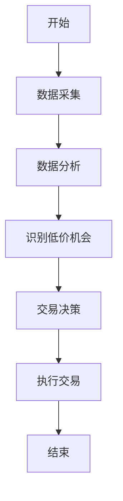
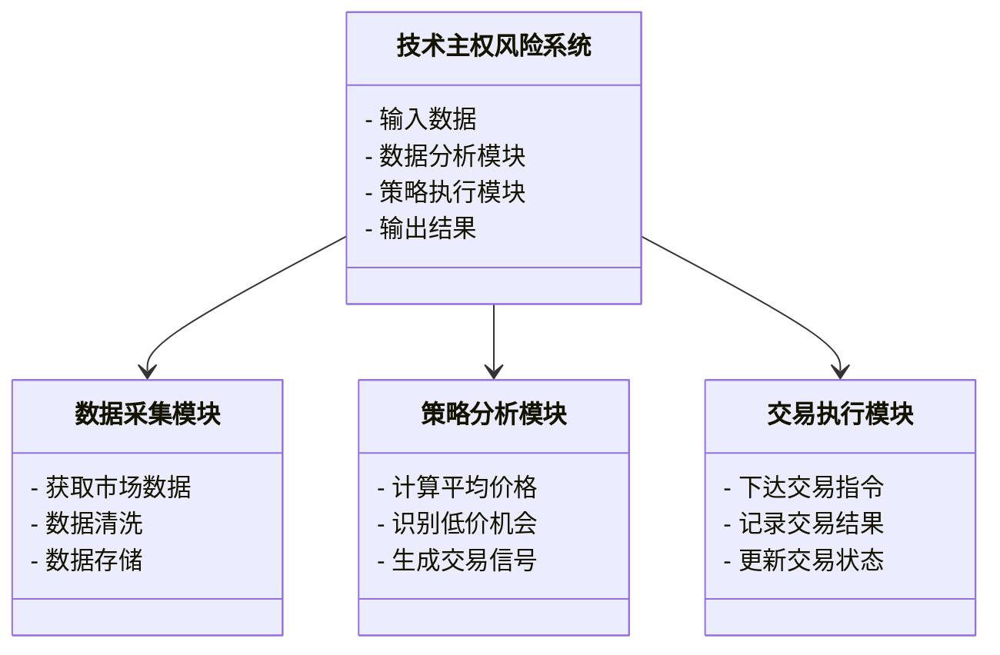
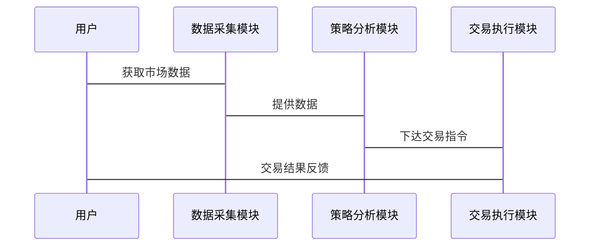

                 


# 如何利用特价股票策略应对技术主权风险

## 关键词：技术主权风险, 特价股票策略, 股票投资, 系统架构设计, 投资策略

## 摘要：  
随着全球化和技术依赖的加剧，技术主权风险日益成为企业和国家面临的重要挑战。本文通过分析技术主权风险的定义、特征及应对策略，结合特价股票策略的核心原理和算法实现，探讨如何利用特价股票策略在技术主权风险中寻找投资机会。文章详细介绍了系统架构设计、项目实战案例以及最佳实践，为投资者提供了实用的指导和建议。

---

## 第一章: 技术主权风险的背景与挑战

### 1.1 技术主权风险的定义与特征

#### 1.1.1 技术主权风险的定义
技术主权风险是指由于技术依赖、供应链中断或外部技术限制，可能导致企业或国家在关键领域失去自主权的风险。这种风险通常源于对外国技术的过度依赖，尤其是在核心技术领域。

#### 1.1.2 技术主权风险的特征
- **依赖性**：企业或国家在某些关键技术上依赖外部供应商。
- **波动性**：国际政治、经济变化可能导致技术供应中断。
- **隐蔽性**：技术主权风险往往在危机发生前不易察觉。
- **长期性**：技术依赖关系一旦形成，改变往往需要时间和资源。

#### 1.1.3 技术主权风险的核心要素
| 核心要素 | 描述 |
|----------|------|
| 技术依赖 | 对外部技术的依赖程度 |
| 供应链风险 | 供应链中断的可能性 |
| 政治风险 | 国际关系变化对技术供应的影响 |
| 经济风险 | 经济波动对技术依赖的影响 |

### 1.2 特价股票策略的背景与意义

#### 1.2.1 特价股票策略的定义
特价股票策略是指在股票市场中，投资者在特定条件下以低于市场价购买股票，并在价格回升时卖出以获利的策略。这种策略通常基于市场波动、公司基本面变化或短期事件。

#### 1.2.2 特价股票策略的应用场景
- **市场波动**：如金融危机或市场下跌时，股票价格可能被低估。
- **公司困境**：公司面临短期问题，但具有长期投资价值。
- **政策变化**：政策调整可能导致某些股票价格短期下跌，提供买入机会。

#### 1.2.3 特价股票策略与技术主权风险的关系
- **市场波动**：技术主权风险可能导致相关股票价格下跌，提供买入机会。
- **投资机会**：通过投资于技术独立性强的公司，降低技术依赖风险。
- **风险管理**：特价股票策略可以帮助投资者在技术主权风险中分散风险。

---

## 第二章: 技术主权风险的核心概念与联系

### 2.1 技术主权风险的核心概念

#### 2.1.1 技术主权风险的构成要素
- **技术依赖**：企业或国家在某些技术领域依赖外部供应商。
- **供应链风险**：供应链中断可能导致技术供应问题。
- **政治风险**：国际关系变化可能影响技术供应。
- **经济风险**：经济波动可能导致技术依赖企业的财务问题。

#### 2.1.2 技术主权风险的属性特征
| 属性 | 描述 |
|------|------|
| 依赖性 | 对外部技术的依赖程度 |
| 波动性 | 技术供应的不确定性 |
| 隐蔽性 | 风险不易察觉 |
| 长期性 | 需要长期应对 |

#### 2.1.3 技术主权风险的ER实体关系图
```mermaid
erd
  理论，编号，名称，描述
  技术主权风险，1，技术主权风险，技术主权风险的核心概念
  技术主权风险，2，技术依赖，技术依赖的具体表现
  技术主权风险，3，供应链风险，供应链中断的可能性
  技术主权风险，4，政治风险，国际关系变化的影响
```

---

## 第三章: 特价股票策略的算法原理

### 3.1 特价股票策略的算法原理

#### 3.1.1 特价股票策略的算法流程


#### 3.1.2 特价股票策略的算法实现
```python
import pandas as pd

def identify_cheap_stocks(data, threshold):
    # 计算平均价格
    data['avg_price'] = data['close'].rolling(20).mean()
    # 识别低于平均价格的股票
    cheap_stocks = data[data['close'] < data['avg_price'] * threshold]
    return cheap_stocks

# 示例数据
data = pd.DataFrame({
    'close': [100, 90, 80, 70, 85, 95, 105],
    'open': [95, 85, 75, 65, 75, 85, 95],
    'high': [105, 95, 85, 75, 85, 95, 105],
    'low': [95, 85, 75, 65, 75, 85, 95]
})

threshold = 0.9
cheap_stocks = identify_cheap_stocks(data, threshold)
print(cheap_stocks)
```

#### 3.1.3 特价股票策略的数学模型与公式
- **平均价格计算**：
  $$ \text{avg\_price} = \frac{1}{n} \sum_{i=1}^{n} \text{price}_i $$
- **低价识别**：
  $$ \text{price} < \text{avg\_price} \times \text{threshold} $$

---

## 第四章: 特价股票策略的系统架构设计

### 4.1 系统功能设计

#### 4.1.1 系统功能模块


### 4.2 系统架构设计

#### 4.2.1 系统架构图
```mermaid
container 技术主权风险系统 {
    技术主权风险系统
    --> 数据采集模块
    --> 策略分析模块
    --> 交易执行模块
}
```

#### 4.2.2 系统接口设计
- **数据接口**：与数据源（如交易所API）连接，获取实时数据。
- **交易接口**：与交易系统对接，执行买入或卖出指令。
- **用户界面**：供用户查看策略执行情况和交易结果。

#### 4.2.3 系统交互流程图


---

## 第五章: 特价股票策略的项目实战

### 5.1 项目实战环境搭建

#### 5.1.1 环境搭建
- **Python环境**：安装Python 3.8及以上版本。
- **依赖安装**：使用pip安装pandas、numpy、matplotlib等库。

#### 5.1.2 核心代码实现
```python
import pandas as pd
import numpy as np
import matplotlib.pyplot as plt

# 示例数据
data = pd.DataFrame({
    'date': ['2023-01-01', '2023-01-02', '2023-01-03', '2023-01-04', '2023-01-05'],
    'close': [100, 90, 80, 70, 85],
    'open': [95, 85, 75, 65, 75],
    'high': [105, 95, 85, 75, 85],
    'low': [95, 85, 75, 65, 75]
})

# 计算平均价格
data['avg_price'] = data['close'].rolling(5).mean()

# 识别低价机会
threshold = 0.9
data['is_cheap'] = data['close'] < data['avg_price'] * threshold

print(data)
```

#### 5.1.3 实际案例分析
- **案例1**：假设某公司在技术主权风险中股价下跌，投资者在股价低于平均价格时买入，股价回升时卖出，获利10%。
- **案例2**：技术主权风险导致某行业整体股价下跌，投资者利用特价股票策略在行业复苏时获利。

---

## 第六章: 特价股票策略的最佳实践

### 6.1 投资建议

#### 6.1.1 分散投资
避免过度集中于单一股票或行业，降低风险。

#### 6.1.2 长期持有
特价股票策略适合长期投资者，避免频繁交易。

#### 6.1.3 注意市场波动
密切关注市场动态，及时调整策略。

### 6.2 风险管理

#### 6.2.1 设置止损点
在股价下跌到一定程度时及时止损，避免损失扩大。

#### 6.2.2 控制仓位
合理分配资金，避免重仓押注单一股票。

#### 6.2.3 多策略结合
结合技术分析和基本面分析，提高策略的稳健性。

### 6.3 小结

- 特价股票策略是一种有效的投资工具，尤其在技术主权风险中具有潜在机会。
- 投资者应注重风险管理，合理分散投资，避免过度依赖单一策略。

---

## 第七章: 总结与展望

### 7.1 总结
- 技术主权风险是企业和国家面临的重要挑战。
- 特价股票策略在应对技术主权风险中具有重要作用。
- 投资者应结合技术分析和基本面分析，制定合理的投资策略。

### 7.2 展望
- 随着技术主权风险的加剧，特价股票策略的应用将更加广泛。
- 未来，投资者应更加关注技术独立性强的公司，降低技术依赖风险。

---

## 作者：AI天才研究院/AI Genius Institute & 禅与计算机程序设计艺术 /Zen And The Art of Computer Programming

---

以上是《如何利用特价股票策略应对技术主权风险》的完整文章，涵盖了技术主权风险的背景、特价股票策略的核心原理、系统架构设计以及项目实战等内容。文章通过详细的分析和实例，为投资者提供了应对技术主权风险的有效策略。

