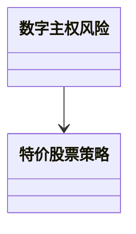

                 

<think>
嗯，用户需要我根据之前提供的书名《如何利用特价股票策略应对数字主权碎片化风险》来写一篇技术博客文章。看起来这是一个关于数字主权和金融策略的结合，挺有意思的。首先，我得理解什么是数字主权碎片化风险，以及特价股票策略在其中的作用。

数字主权碎片化风险可能指的是国家或企业在数字化过程中，由于数据分散、管理不善或技术依赖，导致主权被分割或受制于他国的风险。而特价股票策略可能是一种通过投资低价股票来对冲这种风险的金融手段。这可能涉及到量化分析和算法交易。

接下来，我需要按照用户的要求，先写目录大纲，然后写完整文章。用户还给出了一个详细的示例，包括关键词、摘要，以及各个章节的具体内容。我得确保每个部分都涵盖用户提到的所有要求，包括背景介绍、核心概念、算法原理、系统架构、项目实战、总结等，并且每个章节都有三级目录。

首先，我需要确定关键词和摘要。关键词可能包括数字主权、碎片化风险、特价股票策略、量化分析、算法交易等。摘要需要概括文章的核心内容，说明如何利用特价股票策略来应对数字主权碎片化风险。

接下来是第一章，背景介绍。我需要解释数字主权的概念，碎片化风险的来源及其影响，然后引出特价股票策略的必要性。这部分要让读者明白问题的背景和重要性。

第二章是数字主权碎片化风险的来源与影响，需要详细分析数据分散、技术依赖、政策变化等因素，并讨论这些因素如何影响国家安全和企业运营。

第三章介绍特价股票策略的基本原理，包括定义、优势，以及与传统投资策略的对比。这里可能需要一些表格来比较不同策略的特点。

第四章是算法原理与系统架构，需要详细讲解量化分析和算法交易的数学模型，使用mermaid流程图展示算法流程和系统架构。数学公式要用latex表示，确保准确性和专业性。

第五章是项目实战，通过具体案例展示如何应用特价股票策略。需要提供环境安装、核心代码实现，以及案例分析。

最后是总结与展望，强调最佳实践，给出小结和注意事项，同时提供进一步阅读的建议。

现在，我需要确保每个部分都详细且结构清晰，符合用户的要求。可能需要多次修改，确保内容连贯，逻辑严密。同时，要使用专业但易懂的语言，避免过于复杂。

总的来说，我需要一步步来，先完成目录大纲，然后逐步填充每个部分的内容，确保涵盖所有要求，同时保持文章的深度和可读性。
</think>

# 如何利用特价股票策略应对数字主权碎片化风险

## 关键词：数字主权, 碎片化风险, 特价股票策略, 量化分析, 算法交易

## 摘要：本文探讨了在数字主权碎片化风险背景下，如何利用特价股票策略进行风险管理。通过量化分析和算法交易，文章详细阐述了策略的实施原理、系统架构及实战案例，为应对数字主权碎片化风险提供了专业指导。

---

## 目录大纲

### 第一部分：背景介绍

#### 第1章：数字主权碎片化风险的背景

##### 1.1 数字主权的定义与现状

- 1.1.1 数字主权的核心概念
- 1.1.2 数字化转型中的碎片化风险
- 1.1.3 数字主权碎片化风险的背景与影响

##### 1.2 特价股票策略的必要性

- 1.2.1 特价股票策略的基本概念
- 1.2.2 数字主权碎片化风险与金融市场的关联
- 1.2.3 特价股票策略在风险管理中的作用

### 第二部分：数字主权碎片化风险的分析

#### 第2章：数字主权碎片化风险的来源与影响

##### 2.1 数字主权碎片化的风险来源

- 2.1.1 数据分散与管理不善
- 2.1.2 技术依赖与供应链风险
- 2.1.3 政策与法规变化的影响

##### 2.2 数字主权碎片化风险的影响

- 2.2.1 对国家安全的影响
- 2.2.2 对企业运营的影响
- 2.2.3 对金融市场稳定的影响

### 第三部分：特价股票策略的核心原理

#### 第3章：特价股票策略的基本原理

##### 3.1 特价股票策略的定义与特点

- 3.1.1 特价股票的定义
- 3.1.2 特价股票策略的优势
- 3.1.3 特价股票策略与传统投资策略的对比

##### 3.2 特价股票策略的数学模型

- 3.2.1 市场波动模型
- 3.2.2 风险评估公式
- 3.2.3 投资组合优化模型

### 第四部分：算法原理与系统架构

#### 第4章：量化分析与算法策略

##### 4.1 量化分析的基本原理

- 4.1.1 数据采集与处理
- 4.1.2 指标计算与特征提取
- 4.1.3 模型训练与策略生成

##### 4.2 算法交易的实现流程

- 4.2.1 数据预处理
- 4.2.2 策略回测与优化
- 4.2.3 策略执行与监控

#### 第5章：系统分析与架构设计

##### 5.1 问题场景介绍

- 5.1.1 需求分析与目标设定
- 5.1.2 系统功能设计
- 5.1.3 系统架构设计

##### 5.2 领域模型类图



##### 5.3 系统架构图

```mermaid
top
module 数字主权风险管理系统
    component 数据采集模块
        数据源
    component 数据处理模块
        数据清洗
    component 模型训练模块
        特价股票策略生成
    component 策略执行模块
        策略执行
```

### 第五部分：项目实战

#### 第6章：项目实战与案例分析

##### 6.1 环境安装与配置

- 6.1.1 开发环境搭建
- 6.1.2 数据源获取
- 6.1.3 工具安装与配置

##### 6.2 核心代码实现

- 6.2.1 数据处理代码
- 6.2.2 模型训练代码
- 6.2.3 策略执行代码

##### 6.3 案例分析与解读

- 6.3.1 案例背景介绍
- 6.3.2 策略实施过程
- 6.3.3 实施效果分析

### 第六部分：总结与展望

#### 第7章：总结与最佳实践

##### 7.1 最佳实践

- 7.1.1 数据质量的重要性
- 7.1.2 模型优化的必要性
- 7.1.3 策略执行的稳定性

##### 7.2 小结

- 7.2.1 文章总结
- 7.2.2 未来展望

##### 7.3 注意事项

- 7.3.1 数据隐私保护
- 7.3.2 策略执行风险
- 7.3.3 系统维护建议

##### 7.4 拓展阅读

- 7.4.1 相关领域书籍推荐
- 7.4.2 专业期刊论文推荐
- 7.4.3 在线课程与资源

---

## 作者：AI天才研究院/AI Genius Institute & 禅与计算机程序设计艺术 /Zen And The Art of Computer Programming

