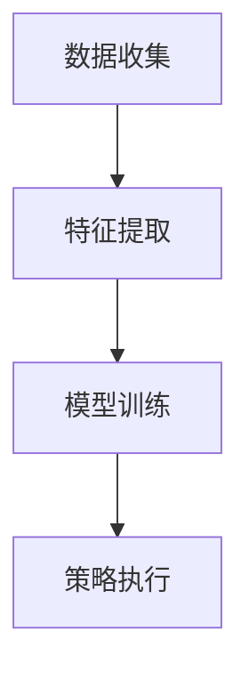
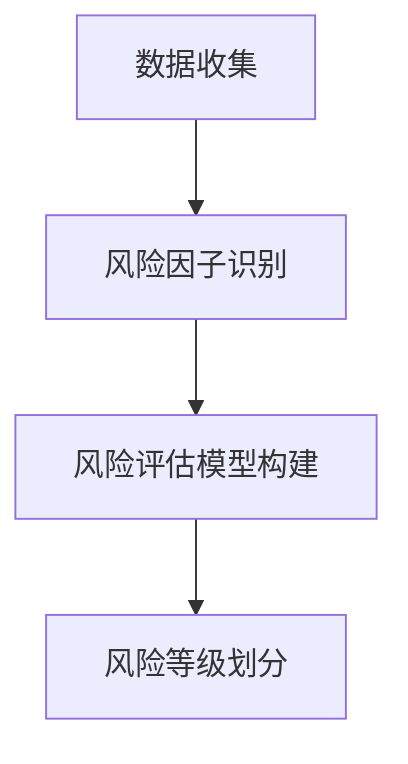
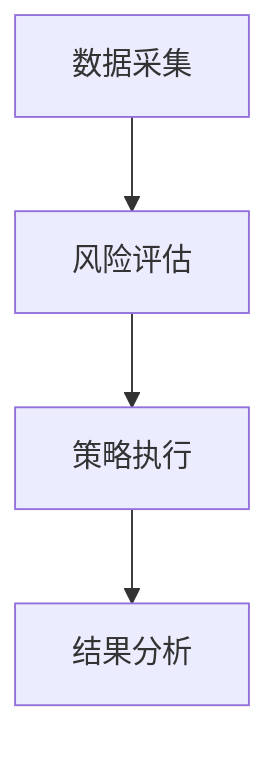
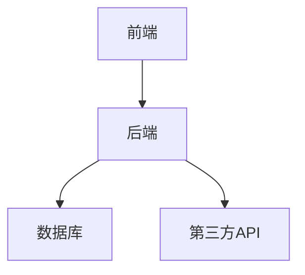
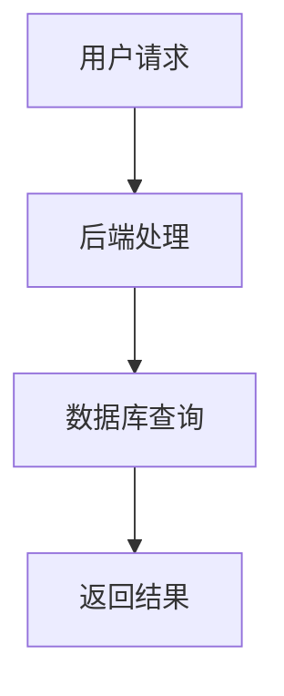

                 


# 如何利用特价股票策略应对数字主权竞争风险

> 关键词：特价股票策略，数字主权，竞争风险，算法设计，系统架构

> 摘要：本文详细探讨了如何利用特价股票策略来应对数字主权竞争风险。通过分析特价股票策略的核心原理、数字主权竞争风险的成因及其相互关系，结合算法设计、系统架构和实际案例，本文为读者提供了一套完整的解决方案，帮助他们在数字主权竞争中利用特价股票策略实现风险管理和收益最大化。

---

## 第一章：背景介绍

### 1.1 特价股票策略的背景与意义

#### 1.1.1 特价股票的定义与特点
- 特价股票的定义
- 特价股票的特点：低估值、高潜力、短期波动性

#### 1.1.2 数字主权竞争风险的背景
- 数字主权的定义
- 数字主权竞争风险的成因
- 数字主权竞争对全球经济的影响

#### 1.1.3 特价股票策略在数字主权竞争中的作用
- 特价股票策略如何帮助应对数字主权竞争风险
- 特价股票策略的优势与局限性

### 1.2 数字主权竞争风险的核心概念

#### 1.2.1 数字主权的定义与内涵
- 数字主权的多维定义
- 数字主权的核心要素：数据主权、技术主权、网络主权

#### 1.2.2 数字主权竞争的风险来源
- 技术垄断风险
- 数据控制风险
- 市场排斥风险

#### 1.2.3 特价股票策略与数字主权竞争的关联
- 特价股票策略如何影响数字主权竞争
- 数字主权竞争如何影响特价股票策略

---

## 第二章：特价股票策略与数字主权竞争风险的核心原理

### 2.1 特价股票策略的原理

#### 2.1.1 市场波动与特价股票机会
- 市场波动的规律
- 特价股票机会的识别方法

#### 2.1.2 技术分析与基本面分析的结合
- 技术分析：K线图、MACD、RSI等指标
- 基本面分析：财务指标、行业趋势

#### 2.1.3 风险控制与收益最大化
- 风险控制策略：止损、止盈
- 收益最大化方法：分散投资、组合优化

### 2.2 数字主权竞争风险的原理

#### 2.2.1 数字主权的竞争机制
- 数字主权的竞争模式
- 数字主权的竞争规则

#### 2.2.2 数字主权风险的传播路径
- 技术依赖引发的风险
- 数据控制引发的风险
- 市场排斥引发的风险

#### 2.2.3 数字主权风险的量化评估
- 数字主权风险的评估指标
- 数字主权风险的量化模型

### 2.3 特价股票策略与数字主权竞争风险的联系

#### 2.3.1 特价股票策略在数字主权竞争中的应用
- 特价股票策略如何降低数字主权风险
- 特价股票策略如何提升市场竞争力

#### 2.3.2 数字主权风险对特价股票策略的影响
- 数字主权风险如何影响股票价格
- 数字主权风险如何影响投资策略

#### 2.3.3 两者的相互作用与协同效应
- 特价股票策略如何缓解数字主权风险
- 数字主权风险如何影响投资机会

---

## 第三章：特价股票策略的算法实现

### 3.1 套利机会识别算法

#### 3.1.1 算法原理
- 算法目标：识别套利机会
- 算法步骤：数据收集、特征提取、模型训练、策略执行

#### 3.1.2 算法流程图（Mermaid）


#### 3.1.3 代码实现与解读
```python
import pandas as pd
import numpy as np
from sklearn.linear_model import LinearRegression

# 数据预处理
data = pd.read_csv('stock_data.csv')
data = data[['price', 'volume', 'open', 'close']]

# 特征提取
X = data[['open', 'close']]
y = data['price']

# 模型训练
model = LinearRegression()
model.fit(X, y)

# 策略执行
predicted_price = model.predict(X)
# 判断套利机会
profit = predicted_price - data['close']
# 筛选利润为正的股票
opportunities = data[profit > 0]
```

### 3.2 数字主权风险评估算法

#### 3.2.1 算法原理
- 算法目标：评估数字主权风险
- 算法步骤：数据收集、风险因子识别、风险评估模型构建、风险等级划分

#### 3.2.2 算法流程图（Mermaid）


---

## 第四章：数学模型与公式详解

### 4.1 特价股票策略的数学模型

#### 4.1.1 市场波动模型
$$ P(t) = a \cdot t + b \cdot \sin(t) $$

#### 4.1.2 套利机会计算公式
$$ \text{套利收益} = \text{卖出价} - \text{买入价} $$

#### 4.1.3 风险收益比计算公式
$$ \text{风险收益比} = \frac{\text{预期收益}}{\text{标准差}} $$

### 4.2 数字主权竞争风险的数学模型

#### 4.2.1 数字主权风险评估模型
$$ R = \alpha \cdot D + \beta \cdot T + \gamma \cdot C $$

#### 4.2.2 数字主权风险传播模型
$$ S(t) = S(t-1) + \delta \cdot R(t) $$

#### 4.2.3 数字主权风险量化公式
$$ \text{风险值} = \sum_{i=1}^{n} w_i \cdot r_i $$

---

## 第五章：系统分析与架构设计

### 5.1 问题场景介绍

#### 5.1.1 数字主权竞争风险的场景描述
- 场景一：技术垄断引发的数字主权风险
- 场景二：数据控制引发的数字主权风险
- 场景三：市场排斥引发的数字主权风险

#### 5.1.2 特价股票策略的应用场景
- 场景一：市场波动下的套利机会
- 场景二：数字主权风险下的投资保护

### 5.2 系统功能设计

#### 5.2.1 系统功能模块划分
- 数据采集模块
- 风险评估模块
- 策略执行模块
- 结果分析模块

#### 5.2.2 系统功能流程图（Mermaid）


### 5.3 系统架构设计

#### 5.3.1 系统架构图（Mermaid）


#### 5.3.2 组件间的交互关系
- 前端与后端交互：用户输入与结果展示
- 后端与数据库交互：数据存储与检索
- 后端与第三方API交互：数据获取与分析

### 5.4 系统接口设计

#### 5.4.1 系统接口定义
- 数据接口：RESTful API
- 风险评估接口：基于JSON的请求与响应

#### 5.4.2 接口交互流程图（Mermaid）


---

## 第六章：项目实战

### 6.1 环境安装

#### 6.1.1 Python环境安装
- 安装Python：3.8及以上版本
- 安装必要的库：pandas、numpy、scikit-learn

#### 6.1.2 数据库安装
- 安装MySQL或MongoDB

### 6.2 系统核心实现源代码

#### 6.2.1 数据采集代码
```python
import requests
import json

response = requests.get('https://api.example.com/stock_data')
data = json.loads(response.text)
print(data)
```

#### 6.2.2 风险评估代码
```python
from sklearn import linear_model

model = linear_model.LinearRegression()
model.fit(X, y)
predicted = model.predict(X)
```

### 6.3 代码应用解读与分析

#### 6.3.1 数据采集模块解读
- 代码功能：从API获取股票数据
- 代码实现：使用requests库发送HTTP请求

#### 6.3.2 风险评估模块解读
- 代码功能：使用线性回归模型评估风险
- 代码实现：数据特征提取与模型训练

### 6.4 实际案例分析

#### 6.4.1 案例一：技术垄断下的套利机会
- 案例背景：技术垄断引发的股价波动
- 案例分析：如何利用特价股票策略进行套利

#### 6.4.2 案例二：数据控制下的投资保护
- 案例背景：数据控制引发的市场风险
- 案例分析：如何利用特价股票策略进行风险控制

### 6.5 经验总结

#### 6.5.1 投资策略总结
- 分散投资，降低风险
- 灵活调整，抓住机会

#### 6.5.2 系统设计总结
- 数据采集与处理的关键性
- 模型选择与优化的重要性

---

## 第七章：总结与展望

### 7.1 最佳实践 tips

#### 7.1.1 投资策略建议
- 关注市场波动，抓住套利机会
- 重视风险控制，保护投资本金

#### 7.1.2 系统设计建议
- 确保数据采集的准确性和实时性
- 优化模型，提升风险评估的准确性

### 7.2 小结

- 特价股票策略的核心作用
- 数字主权竞争风险的应对策略
- 系统设计的关键点与注意事项

### 7.3 注意事项

- 投资有风险，入市需谨慎
- 系统设计需结合实际情况，避免过度复杂化

### 7.4 拓展阅读

- 推荐书籍：《算法交易：量化投资中的数学模型与编程实现》
- 推荐博客：[AI与金融技术博客](https://example.com)

---

## 作者：AI天才研究院/AI Genius Institute & 禅与计算机程序设计艺术 /Zen And The Art of Computer Programming

