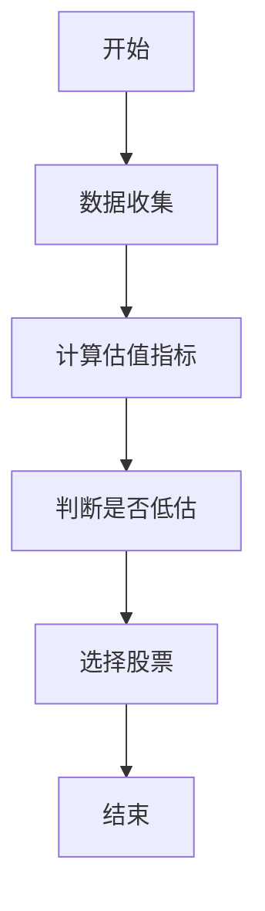
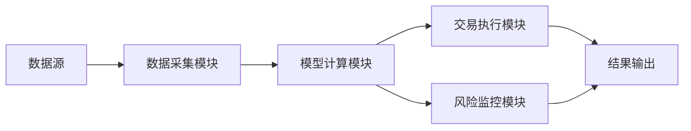
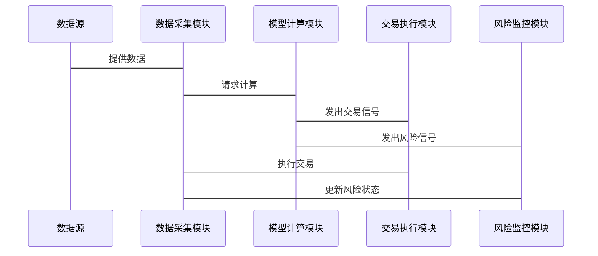

                 


# 如何利用特价股票策略应对数字化去中心化风险

---

## 关键词：
数字化去中心化、风险、特价股票、量化分析、投资策略、风险管理

---

## 摘要：
本文深入探讨了在数字化和去中心化趋势下，如何利用特价股票策略应对市场风险。通过分析数字化去中心化对金融市场的冲击，结合量化分析和风险管理的理论，本文提出了具体的策略优化方法，并通过实际案例和系统设计展示了如何在复杂市场环境中实现稳健投资。

---

# 第一部分: 数字化去中心化风险的背景与挑战

---

## 第1章: 数字化与去中心化风险概述

### 1.1 数字化对金融市场的冲击
#### 1.1.1 数字化对金融市场的冲击
- 数字化技术（如区块链、人工智能）改变了传统金融市场的运作方式。
- 去中心化（Decentralization）降低了对传统金融机构的依赖，提高了市场透明度。
- 数字化带来的高波动性和复杂性增加了市场风险。

#### 1.1.2 去中心化概念的起源与发展
- 去中心化最早源于区块链技术的核心理念。
- 去中心化通过分布式账本和智能合约实现了信任机制的重构。
- 去中心化降低了单点故障风险，但也带来了新的技术挑战。

#### 1.1.3 数字化与去中心化对金融风险的影响
- 数字化使市场参与者更加多元化，增加了市场复杂性。
- 去中心化降低了机构的控制能力，可能导致市场波动性增加。
- 数字化和去中心化共同推动了市场创新，但也带来了新的监管挑战。

### 1.2 特价股票策略的基本概念
#### 1.2.1 什么是特价股票
- 特价股票是指价格被市场低估的股票。
- 特价股票通常具有较高的潜在回报。
- 特价股票策略的核心是发现市场中的估值偏差。

#### 1.2.2 特价股票策略的核心要素
- **估值分析**：通过市盈率、市净率等指标寻找低估股票。
- **市场周期**：在市场低迷时更容易找到特价股票。
- **风险控制**：通过分散投资和止损策略降低风险。

#### 1.2.3 特价股票策略与传统投资策略的区别
- 传统投资策略更注重长期价值，而特价股票策略更注重短期估值偏差。
- 传统策略依赖于机构分析，而特价股票策略更依赖于个人或算法的独立分析。

### 1.3 本章小结
- 本章介绍了数字化和去中心化对金融市场的冲击，以及特价股票策略的基本概念。
- 数字化和去中心化带来了新的市场机会和风险，而特价股票策略为投资者提供了应对市场波动的有效工具。

---

## 第2章: 数字化去中心化风险的成因与影响

### 2.1 数字化去中心化风险的成因
#### 2.1.1 技术层面的去中心化风险
- 分布式系统的技术复杂性可能导致系统故障。
- 智能合约的漏洞可能引发重大风险。
- 去中心化交易所的安全性问题。

#### 2.1.2 市场层面的去中心化风险
- 市场参与者过多可能导致流动性不足。
- 去中心化市场的透明度问题。
- 市场操纵的可能性增加。

#### 2.1.3 机构层面的去中心化风险
- 传统金融机构的转型压力。
- 去中心化对监管机构的挑战。
- 机构内部管理的风险分散化问题。

### 2.2 数字化去中心化风险的影响
#### 2.2.1 对传统金融体系的冲击
- 传统金融机构的市场份额被去中心化平台侵蚀。
- 监管框架需要重新设计以适应去中心化市场。
- 金融生态的重构可能引发系统性风险。

#### 2.2.2 对投资者行为的影响
- 投资者需要掌握更多技术知识以应对去中心化市场。
- 去中心化市场的透明度不足可能导致投资者决策失误。
- 市场波动性增加，投资者需要更强的风险管理能力。

#### 2.2.3 对市场波动性的潜在影响
- 去中心化市场的高频交易可能加剧市场波动。
- 特价股票策略的应用可能在短期内引发市场剧烈波动。
- 去中心化市场的信息不对称可能导致价格失真。

### 2.3 本章小结
- 本章分析了数字化去中心化风险的成因，包括技术、市场和机构层面的问题。
- 数字化去中心化对传统金融体系和投资者行为产生了深远影响，加剧了市场波动性。

---

## 第3章: 特价股票策略的量化分析

### 3.1 量化分析的基本原理
#### 3.1.1 量化分析的概念
- 量化分析是一种基于数学模型的投资方法。
- 通过大量数据和算法寻找市场中的规律和机会。
- 量化分析依赖于高频交易和大数据处理。

#### 3.1.2 量化分析的核心指标
- 市盈率（P/E Ratio）：当前股价与每股收益的比率。
- 市净率（P/B Ratio）：当前股价与每股净资产的比率。
- 股息率（Dividend Yield）：每年派发的股息与股价的比率。

#### 3.1.3 量化分析的步骤与流程
1. 数据收集与处理：获取历史价格、财务数据等。
2. 模型构建：基于统计学和机器学习方法构建预测模型。
3. 信号生成：通过模型生成买入或卖出信号。
4. 风险管理：设置止损和止盈机制。

### 3.2 套利机会的识别与捕捉
#### 3.2.1 套利的基本原理
- 利用同一资产在不同市场中的价格差异进行无风险套利。
- 套利机会通常存在于市场不完全和信息不对称的情况下。

#### 3.2.2 套利机会的识别方法
- 跨市场套利：利用不同市场的价格差异。
- 跨期套利：利用不同时间点的价格差异。
- 跨资产套利：利用相关资产之间的价格差异。

#### 3.2.3 套利策略的实施步骤
1. 数据收集：获取不同市场的实时价格。
2. 模型构建：识别价格差异的算法。
3. 交易执行：自动执行套利交易。
4. 风险控制：监控市场波动和交易成本。

### 3.3 风险管理与控制
#### 3.3.1 风险管理的基本原则
- 风险分散：通过投资多样化降低风险。
- 风险量化：通过数学模型量化风险。
- 风险监控：实时监控市场和交易风险。

#### 3.3.2 风险控制的具体措施
- 设置止损点：当亏损达到一定比例时立即卖出。
- 限制杠杆：避免过度杠杆化。
- 定期评估：定期评估和调整投资组合。

#### 3.3.3 风险与收益的平衡
- 风险与收益是投资的核心问题。
- 特价股票策略需要在风险可控的前提下追求收益最大化。

### 3.4 本章小结
- 本章详细介绍了量化分析的基本原理和套利机会的识别方法。
- 强调了风险管理在特价股票策略中的重要性，提出了具体的风险控制措施。

---

## 第4章: 数字化去中心化风险下的策略优化

### 4.1 数字化去中心化风险下的策略调整
#### 4.1.1 策略调整的必要性
- 数字化去中心化带来了新的市场机会和风险。
- 特价股票策略需要适应新的市场环境。

#### 4.1.2 策略调整的具体方法
- 结合去中心化市场的特点优化模型。
- 调整风险控制参数以应对新的市场波动。
- 利用去中心化市场的透明度提高数据分析能力。

#### 4.1.3 策略调整的实施步骤
1. 重新评估市场环境：分析去中心化市场的特点。
2. 优化模型参数：调整量化分析模型。
3. 实施动态风险管理：根据市场变化实时调整策略。

### 4.2 基于大数据的策略优化
#### 4.2.1 大数据在策略优化中的作用
- 大数据可以提供更全面的市场信息。
- 通过大数据分析可以发现新的市场规律。
- 大数据可以帮助识别潜在的套利机会。

#### 4.2.2 大数据分析的具体方法
- 数据挖掘：利用机器学习算法发现数据中的规律。
- 数据可视化：通过图表展示数据特征。
- 数据建模：构建预测模型进行市场分析。

#### 4.2.3 大数据在风险管理中的应用
- 实时监控市场波动。
- 预测市场趋势。
- 评估投资组合风险。

### 4.3 本章小结
- 本章探讨了在数字化去中心化风险下如何优化特价股票策略。
- 强调了大数据在策略优化和风险管理中的重要性。

---

## 第5章: 特价股票策略的数学模型与算法实现

### 5.1 数学模型的构建
#### 5.1.1 基于均值回归的模型
- 假设市场具有均值回归特性。
- 通过计算股票的偏离度寻找低估股票。

#### 5.1.2 基于动量策略的模型
- 动量策略假设市场具有动量效应。
- 通过计算动量指标寻找趋势性机会。

#### 5.1.3 基于机器学习的模型
- 使用神经网络预测市场走势。
- 通过聚类分析识别市场中的相似资产。

### 5.2 算法实现
#### 5.2.1 Python代码实现
```python
import pandas as pd
import numpy as np

# 示例代码：基于均值回归的策略
def calculate_valuation(ticker):
    # 获取股票数据
    data = pd.read_csv(f'data/{ticker}.csv')
    # 计算市盈率
    pe = data['price'] / data['eps']
    # 计算市净率
    pb = data['price'] / data['book_value']
    # 返回估值指标
    return {'pe': pe.mean(), 'pb': pb.mean()}

# 寻找低估股票
def find_dirt_cocks():
    undervalued = []
    for ticker in tickers:
        valuation = calculate_valuation(ticker)
        if valuation['pe'] < market_pe and valuation['pb'] < market_pb:
            undervalued.append(ticker)
    return undervalued
```

#### 5.2.2 算法流程图


### 5.3 数学公式
- 市盈率公式：
  $$ \text{市盈率} = \frac{\text{股价}}{\text{每股收益}} $$
- 市净率公式：
  $$ \text{市净率} = \frac{\text{股价}}{\text{每股净资产}} $$
- 均值回归模型：
  $$ \text{偏离度} = \frac{\text{当前股价}}{\text{历史平均股价}} $$

### 5.4 本章小结
- 本章详细介绍了特价股票策略的数学模型和算法实现。
- 提供了基于Python的代码示例和算法流程图，帮助读者理解策略的具体实现。

---

## 第6章: 系统架构与风险管理

### 6.1 系统架构设计
#### 6.1.1 系统功能模块
- 数据采集模块：实时采集股票数据。
- 模型计算模块：计算估值指标。
- 交易执行模块：根据信号执行交易。
- 风险监控模块：实时监控市场风险。

#### 6.1.2 系统架构图


#### 6.1.3 系统交互流程


### 6.2 风险管理与控制
#### 6.2.1 风险监控机制
- 实时监控市场波动。
- 设置止损和止盈点。
- 监控交易执行情况。

#### 6.2.2 风险控制措施
- 分散投资：避免过度集中。
- 限制杠杆：控制投资风险。
- 定期评估：根据市场变化调整策略。

#### 6.2.3 风险与收益的平衡
- 在风险可控的前提下追求收益最大化。
- 定期评估风险控制措施的有效性。

### 6.3 本章小结
- 本章详细介绍了系统的架构设计和风险管理机制。
- 强调了系统化管理在应对数字化去中心化风险中的重要性。

---

## 第7章: 项目实战与案例分析

### 7.1 项目实战
#### 7.1.1 环境安装
- 安装Python和必要的库（如Pandas、NumPy、Matplotlib）。
- 安装量化交易框架（如Backtrader、Zipline）。

#### 7.1.2 核心实现
- 数据采集与处理。
- 模型构建与优化。
- 交易信号生成与执行。

#### 7.1.3 代码实现
```python
import backtrader as bt

class MyStrategy(bt.Strategy):
    def __init__(self):
        self.data = self.datas[0]
        self.add_observer(bt.observers.BuySignal())

    def next(self):
        if self.data.close > self.data.close.mean():
            self.buy()
        else:
            self.sell()

# 初始化策略
cerebro = bt.Cerebro()
cerebro.addstrategy(MyStrategy)
cerebro.run()
```

#### 7.1.4 应用解读
- 数据采集：从多个来源获取股票数据。
- 模型优化：通过回测优化策略参数。
- 交易执行：根据模型信号自动执行交易。

### 7.2 案例分析
#### 7.2.1 案例背景
- 假设一个去中心化交易所上线了新的股票。
- 利用特价股票策略进行投资。

#### 7.2.2 实施步骤
1. 数据采集：获取该股票的历史数据。
2. 模型构建：计算市盈率和市净率。
3. 信号生成：识别低估股票。
4. 交易执行：根据信号进行买卖操作。

#### 7.2.3 案例分析
- 通过模型识别出某股票的市盈率低于市场平均水平。
- 执行买入操作。
- 在股价回升后卖出，获得收益。

### 7.3 本章小结
- 本章通过项目实战和案例分析展示了特价股票策略的具体应用。
- 强调了量化分析和系统化管理在实际投资中的重要性。

---

## 第8章: 最佳实践与总结

### 8.1 最佳实践
#### 8.1.1 风险管理
- 设置合理的止损和止盈点。
- 分散投资，避免过度集中。
- 定期评估和调整投资组合。

#### 8.1.2 心理因素
- 控制贪婪和恐惧情绪。
- 保持理性和纪律性。
- 避免过度自信。

#### 8.1.3 长期策略
- 确定长期投资目标。
- 保持策略的灵活性。
- 定期回顾和优化策略。

### 8.2 本章总结
- 本文深入探讨了如何利用特价股票策略应对数字化去中心化风险。
- 提供了具体的策略优化方法和系统设计思路。
- 强调了风险管理在投资中的重要性。

---

## 作者：AI天才研究院/AI Genius Institute & 禅与计算机程序设计艺术 /Zen And The Art of Computer Programming

---

本文通过系统的分析和具体的案例，展示了如何在数字化和去中心化背景下利用特价股票策略进行风险管理。希望本文能为投资者提供有价值的参考和启示。

