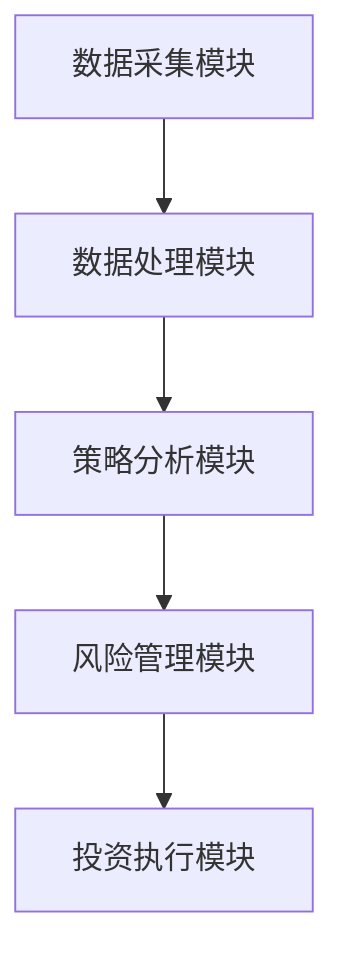

                 

<think>
好，我现在需要帮用户写一篇关于《如何利用特价股票策略应对经济衰退》的技术博客。用户要求非常详细，包括目录结构、内容格式、关键词、摘要等等。我得先理清用户的具体需求，确保完全理解后再开始撰写。

首先，用户希望文章结构清晰，逻辑紧凑，技术语言专业，同时要有深度和见解。这意味着我需要从经济衰退的背景开始，逐步引入特价股票的概念，然后详细分析策略、算法、系统架构，最后通过实战案例来验证。

接下来，用户特别提到要使用mermaid图和数学公式，这在技术博客中很常见，但需要确保正确嵌入。我得在适当的地方插入图表和公式，帮助读者更好地理解内容。

另外，用户要求每个小节都要详细，涵盖背景、核心概念、算法原理、系统架构、项目实战、最佳实践等部分。这意味着我需要为每个部分分配足够的篇幅，确保内容充实。

在写作过程中，我需要确保语言专业且易懂，避免过于复杂的术语，同时保持技术深度。可能需要多次检查，确保逻辑连贯，结构合理。

最后，用户希望文章末尾有作者信息，以及一些注意事项和扩展阅读建议，这部分需要整理好，确保读者在阅读后有所收获，并能找到进一步学习的资源。

总之，我会一步步按照用户的要求，从标题到摘要，再到各个章节的详细内容，确保每个部分都符合要求，最终完成一篇高质量的技术博客。
</think>

# 如何利用特价股票策略应对经济衰退

> 关键词：特价股票，经济衰退，投资策略，风险管理，股票分析

> 摘要：在经济衰退期间，投资者需要采取有效的策略来保护和增加投资收益。特价股票策略作为一种有效的投资工具，在经济低迷时期展现出了独特的优势。本文将从经济衰退的背景出发，详细分析特价股票的定义、策略实施步骤、数学建模方法，并结合实际案例，探讨如何利用特价股票策略应对经济衰退。通过本文的讲解，读者将能够掌握特价股票策略的核心概念、分析方法和实际操作技巧。

---

## 第一部分: 经济衰退与特价股票策略的基础知识

### 第1章: 经济衰退的定义与影响

#### 1.1 经济衰退的定义与特征
经济衰退是指经济活动的显著下降，通常表现为GDP的持续减少、失业率上升和消费者信心下降。经济衰退对个人和企业的影响是多方面的，包括投资收益下降、就业机会减少等。

#### 1.2 经济衰退对企业与个人的影响
在经济衰退期间，企业可能面临销售额下降、利润减少的问题，而个人则可能面临收入减少、资产贬值的风险。这些因素都对投资决策产生重要影响。

#### 1.3 经济衰退中的投资机会与风险
尽管经济衰退带来了许多不确定性，但也为投资者提供了低价买入优质资产的机会。特价股票策略正是在这种背景下应运而生，帮助投资者在经济低迷时期寻找潜在的高收益投资机会。

### 第2章: 特价股票的定义与特点

#### 2.1 特价股票的定义
特价股票是指在市场中价格远低于其内在价值的股票。通常情况下，这些股票可能因为市场情绪、行业波动或公司特定问题而被低估。

#### 2.2 特价股票的分类与特点
特价股票可以分为以下几类：
- **价值型股票**：市盈率、市净率等估值指标低于行业平均水平。
- **成长型股票**：尽管当前表现不佳，但具备较高的成长潜力。
- **周期性股票**：在经济周期波动中表现尤为显著的股票。

#### 2.3 特价股票与普通股票的区别
特价股票的核心区别在于其价格与内在价值的不匹配。普通股票的价格通常反映了市场情绪，而特价股票则可能因为市场低估而价格被压制。

### 第3章: 特价股票策略的核心概念

#### 3.1 特价股票策略的背景
在经济衰退期间，市场情绪往往低迷，投资者倾向于抛售股票，导致股价短期大幅下跌。这种市场环境为低价买入优质资产提供了机会。

#### 3.2 特价股票策略的核心要素
- **市场分析**：通过技术分析和基本面分析判断市场趋势。
- **选股标准**：选择市盈率低、市净率低、股息率高的股票。
- **风险控制**：通过分散投资和止损策略降低风险。

---

## 第二部分: 特价股票策略的分析与实施

### 第4章: 特价股票的分析方法

#### 4.1 基本面分析
基本面分析是评估股票价值的重要方法，包括对公司财务状况、行业地位和竞争优势的分析。

##### 4.1.1 财务指标分析
- **市盈率（P/E）**：股价与每股收益的比率。
- **市净率（P/B）**：股价与每股净资产的比率。
- **股息率**：每年派发的股息与股价的比率。

##### 4.1.2 估值方法
通过比较股票的市盈率和市净率与行业平均水平，判断股票是否被低估。

#### 4.2 技术分析
技术分析通过研究股票价格和成交量的变化，预测未来的价格走势。

##### 4.2.1 K线图分析
- **趋势线**：价格走势的支撑线和阻力线。
- **形态分析**：如头肩顶、双底等形态。

##### 4.2.2 均线与成交量分析
- **均线**：短期均线和长期均线的交叉点往往预示着价格趋势的变化。
- **成交量**：成交量的增加通常预示着价格的波动。

---

### 第5章: 特价股票策略的实施步骤

#### 5.1 确定投资目标
- **投资目标**：明确投资的时间跨度和收益目标。
- **风险承受能力**：评估自身对风险的承受能力，制定相应的投资策略。

#### 5.2 选股策略
##### 5.2.1 市场底部识别
通过技术分析和基本面分析，识别市场的底部区域，选择被低估的股票。

##### 5.2.2 估值修复机会
寻找那些估值低于行业平均水平，具备潜在回升空间的股票。

##### 5.2.3 行业轮动策略
根据经济周期的变化，选择在衰退期中具备防御性的行业，如公用事业、医疗保健等。

#### 5.3 投资组合管理
##### 5.3.1 投资组合的构建
通过分散投资，降低单一股票的风险，同时提高整体收益。

##### 5.3.2 动态调整与优化
根据市场变化和公司业绩，定期调整投资组合，优化收益和风险比。

##### 5.3.3 风险控制与止损策略
设定止损点，避免单次投资的重大损失。

---

## 第三部分: 特价股票策略的实战应用

### 第6章: 特价股票策略的系统架构

#### 6.1 系统功能设计
- **数据采集与处理**：收集历史价格、财务数据等信息。
- **策略分析与执行**：通过算法分析股票价值，生成买卖信号。
- **风险管理与监控**：实时监控投资组合的表现，及时调整策略。

#### 6.2 系统架构设计
##### 6.2.1 系统架构图


##### 6.2.2 实体关系图


---

### 第7章: 特价股票策略的数学建模

#### 7.1 估值模型
##### 7.1.1 市盈率模型
$$ P = \frac{P/E}{Earnings Per Share} $$

##### 7.1.2 市净率模型
$$ P = \frac{P/B}{Book Value Per Share} $$

#### 7.2 投资组合优化模型
##### 7.2.1 马科维茨均值-方差模型
$$ \text{Minimize } \sigma^2 \text{ subject to } E(r) \geq \mu $$

##### 7.2.2 风险调整后的收益模型
$$ \text{Sharpe Ratio} = \frac{E(r - r_f)}{\sigma} $$

---

### 第8章: 项目实战

#### 8.1 环境安装
- **工具安装**：安装Python、Pandas、Matplotlib等工具。
- **数据源获取**：获取历史股票数据和财务数据。

#### 8.2 核心实现代码
```python
import pandas as pd
import numpy as np
import matplotlib.pyplot as plt

# 示例代码：计算市盈率和市净率
data = pd.read_csv('stock_data.csv')
data['PE'] = data['Price'] / data['Earnings Per Share']
data['PB'] = data['Price'] / data['Book Value Per Share']
data.head()
```

#### 8.3 实际案例分析
以2008年金融危机为例，分析如何通过特价股票策略在市场底部区域买入，获得超额收益。

---

## 第四部分: 总结与展望

### 第9章: 总结与展望

#### 9.1 总结
特价股票策略作为一种有效的投资工具，在经济衰退期间能够帮助投资者降低风险，抓住市场机会。通过基本面分析、技术分析和投资组合管理，投资者可以更好地应对市场波动。

#### 9.2 未来展望
随着技术的进步，人工智能和大数据分析将在特价股票策略中发挥越来越重要的作用。未来的研究可以进一步探索机器学习在股票预测中的应用，以及如何利用多因子模型优化投资组合。

---

## 作者：AI天才研究院 & 禅与计算机程序设计艺术

