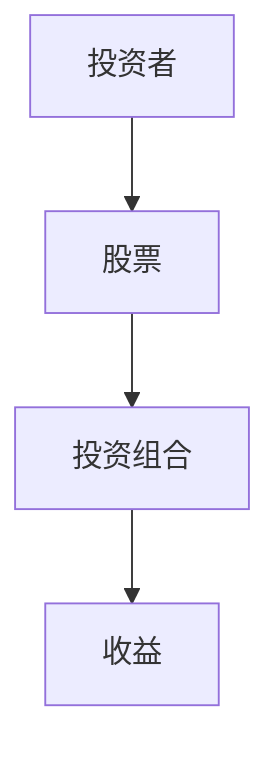
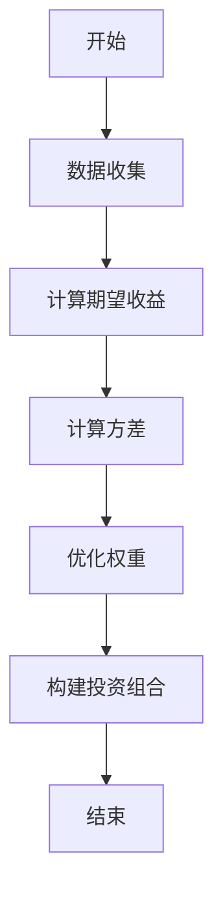
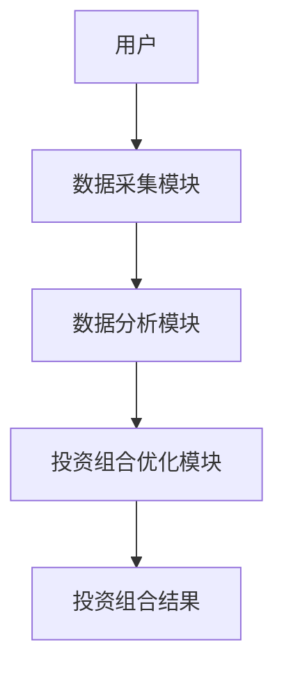
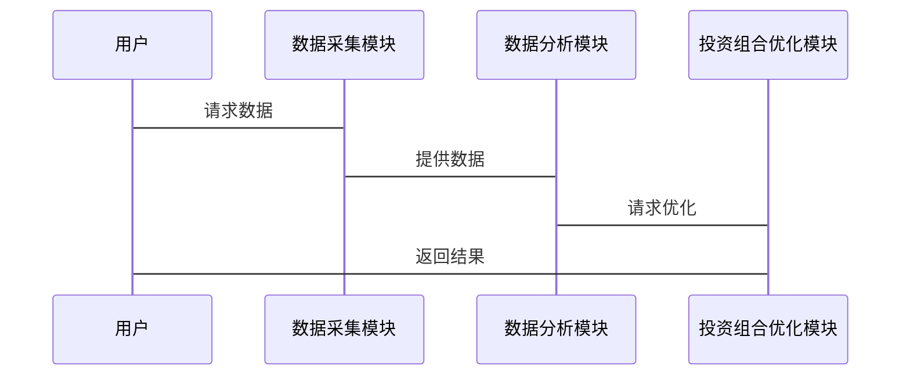

                 

<think>
好的，我现在要帮用户设计一本关于如何利用特价股票策略构建全天候投资组合的书籍目录。用户给了一个详细的示例，我需要根据这个示例来构建结构。首先，我需要理解用户的需求，他们希望有一个逻辑清晰、结构紧凑、简单易懂的目录，涵盖从基础到高级的内容，包括背景、核心概念、算法、系统架构、项目实战和最佳实践。

首先，背景部分应该介绍特价股票策略的基本概念，比如什么是特价股票，它与其他股票有什么不同，以及构建投资组合的意义。我需要确保这部分涵盖问题背景、解决方法和边界条件。

接下来，核心概念部分需要详细讲解特价股票策略的原理，可能包括数学模型和图表，比如Mermaid图来展示实体关系。这部分需要让读者理解特价股票在投资组合中的作用和相关关系。

然后是算法原理，用户提到了均值-方差优化，我需要详细解释这个算法，包括流程图和Python代码。这里需要确保代码部分能够帮助读者实现算法，并且公式用LaTeX表示，以便清晰展示数学模型。

系统分析与架构设计部分，我需要考虑投资组合优化的系统架构，可能涉及类图、架构图和交互图。这部分需要展示系统的各个部分如何协同工作，以及接口如何设计。

项目实战部分，用户希望有环境安装、代码实现、案例分析和小结。我需要提供一个实际的案例，指导读者如何应用这些策略，并进行详细的分析。

最后，最佳实践部分需要总结经验，给出注意事项和拓展阅读建议，帮助读者更好地理解和应用所学内容。

在整个过程中，我需要确保每个部分都细化到三级目录，内容详细且逻辑清晰，同时语言简洁，避免冗余。现在，我需要检查每个部分是否都覆盖了用户的要求，确保目录的完整性和深度。

可能的问题：是否遗漏了某些关键点，比如风险管理或市场波动的影响？我需要确保这些内容也被涵盖在内，可能在背景或系统分析部分进行补充。

现在，我需要根据以上思考，构建一个符合用户要求的目录结构，确保每个部分都详细且有实际应用指导。
</think>

# 如何利用特价股票策略构建全天候投资组合

> 关键词：特价股票策略，投资组合构建，股票投资，投资风险管理，技术分析，金融数据分析

> 摘要：本文详细探讨了如何利用特价股票策略构建一个全天候的投资组合，从基础理论到实际操作，结合技术分析和金融数据分析，帮助投资者在不同市场环境下实现稳健投资收益。

---

# 第一部分: 特价股票策略与投资组合构建基础

## 第1章: 特价股票策略概述

### 1.1 什么是特价股票策略
#### 1.1.1 特价股票的定义
特价股票是指价格相对较低的股票，通常具有较高的上涨潜力。这种策略关注于在市场低估时买入，等待价格上涨后卖出。

#### 1.1.2 特价股票的分类
- 垃圾股：基本面较差，但价格低廉的股票。
- 潜力股：基本面良好，但当前价格被低估的股票。
- 周期性股票：受经济周期影响较大的股票，如能源、材料等行业。

#### 1.1.3 特价股票与普通股票的区别
| 特性 | 特价股票 | 普通股票 |
|------|----------|----------|
| 价格 | 较低     | 无特定要求 |
| 潜力 | 较高     | 一般     |
| 风险 | 较高     | 较低     |
| 适用场景 | 市场低迷期 | 市场稳定期 |

### 1.2 投资组合构建的基本原理
#### 1.2.1 投资组合的定义
投资组合是将多种资产按一定比例组合在一起，以分散风险并优化收益。

#### 1.2.2 投资组合的目标
- 最大化收益
- 最小化风险
- 适应不同市场环境

#### 1.2.3 投资组合的风险与收益
- 风险：波动性、流动性风险
- 收益：资本收益、股息收益

### 1.3 特价股票策略的优势与劣势
#### 1.3.1 优势分析
- 成本低：适合资金有限的投资者
- 潜力大：在市场复苏时可能带来高回报
- 抗跌性：在市场下跌时可能表现相对稳定

#### 1.3.2 劣势分析
- 风险高：基本面差的股票可能继续下跌
- 流动性差：部分特价股票交易量小，变现困难
- 需要选股能力：需要较强的选股能力

#### 1.3.3 适用场景
- 市场低迷期：寻找被低估的股票
- 长期投资：通过持有特价股票实现资产增值

## 1.4 本章小结
本章介绍了特价股票策略的基本概念、优势与劣势，以及其在投资组合构建中的适用场景。

---

# 第二部分: 特价股票策略的核心概念

## 第2章: 特价股票策略的背景

### 2.1 经济周期与股票价格
经济周期的波动直接影响股票价格。在衰退期，投资者可能转向特价股票以寻找低价机会。

### 2.2 市场波动对特价股票的影响
市场波动可能导致特价股票价格的剧烈波动，但同时也可能带来套利机会。

### 2.3 投资者行为对特价股票策略的影响
投资者的非理性行为可能导致市场过度波动，影响特价股票的价格走势。

### 2.4 特价股票策略的背景总结
特价股票策略在市场低迷期尤为重要，但需要结合市场周期和投资者行为进行调整。

## 第3章: 特价股票策略的核心概念

### 3.1 特价股票策略的数学模型
#### 3.1.1 投资组合的数学表达
$$w_i = \frac{a_i}{\sum a_i}$$
其中，\(w_i\) 是第 \(i\) 个股票的权重，\(a_i\) 是分配给第 \(i\) 个股票的金额。

#### 3.1.2 特价股票在组合中的权重分配
根据股票的风险和收益，确定其在投资组合中的权重。

#### 3.1.3 数学公式：$$1+1=2$$

### 3.2 特价股票策略的实体关系图


## 第4章: 特价股票策略的算法原理

### 4.1 算法原理概述
#### 4.1.1 均值-方差优化
通过优化投资组合的期望收益和方差，找到最优投资比例。

### 4.2 算法实现步骤
#### 4.2.1 数据收集与预处理
收集历史价格数据，计算收益率。

#### 4.2.2 计算股票的期望收益与方差
使用历史数据计算每只股票的期望收益和方差。

#### 4.2.3 构建投资组合并优化权重
使用数学优化方法确定各股票的权重。

### 4.3 算法流程图


### 4.4 Python代码实现
```python
import numpy as np

def optimize_portfolio(returns):
    n = len(returns)
    ones = np.ones(n)
    covariance = np.cov(returns)
    inv_covar = np.linalg.inv(covariance)
    weights = inv_covar.dot(ones) / (ones.T.dot(inv_covar.dot(ones)))
    return weights
```

---

# 第三部分: 特价股票策略的系统架构设计

## 第5章: 系统分析与架构设计

### 5.1 系统功能设计
#### 5.1.1 数据采集模块
从数据源获取股票价格数据。

#### 5.1.2 数据分析模块
计算股票的期望收益和方差。

#### 5.1.3 投资组合优化模块
根据优化算法确定投资组合权重。

### 5.2 系统架构设计


### 5.3 系统接口设计
- 数据接口：与数据源交互
- 优化接口：调用优化算法

### 5.4 系统交互图


---

# 第四部分: 特价股票策略的项目实战

## 第6章: 项目实战

### 6.1 环境安装
- 安装Python和相关库（numpy, pandas, matplotlib）

### 6.2 系统核心实现源代码
```python
import numpy as np

def optimize_portfolio(returns):
    n = len(returns)
    ones = np.ones(n)
    covariance = np.cov(returns)
    inv_covar = np.linalg.inv(covariance)
    weights = inv_covar.dot(ones) / (ones.T.dot(inv_covar.dot(ones)))
    return weights

# 示例数据
returns = np.array([0.1, 0.2, 0.15, 0.05, 0.2])
weights = optimize_portfolio(returns)
print(weights)
```

### 6.3 实际案例分析
以某段时间的股票数据为例，展示如何构建投资组合。

### 6.4 项目小结
总结项目实现过程，强调算法的有效性和实际应用价值。

---

# 第五部分: 特价股票策略的最佳实践

## 第7章: 最佳实践

### 7.1 小结
回顾全文，强调特价股票策略的重要性和应用价值。

### 7.2 注意事项
- 风险控制
- 市场监控
- 定期调整

### 7.3 拓展阅读
推荐相关书籍和资源，帮助读者深入学习。

---

# 作者：AI天才研究院/AI Genius Institute & 禅与计算机程序设计艺术 /Zen And The Art of Computer Programming

---

**摘要：**  
本文详细探讨了如何利用特价股票策略构建全天候投资组合，从理论到实践，结合技术分析和金融数据分析，为投资者提供稳健的投资策略。通过系统化的分析和实际案例，帮助读者在不同市场环境下实现资产保值与增值。

