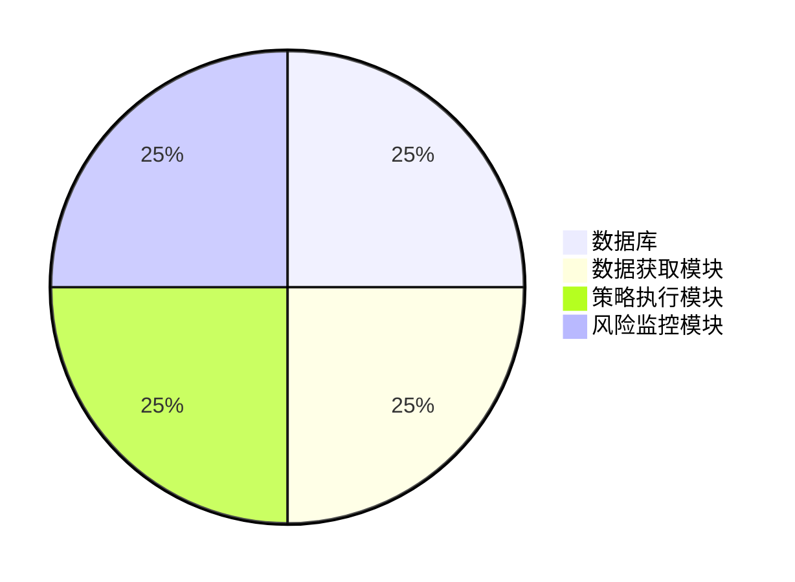
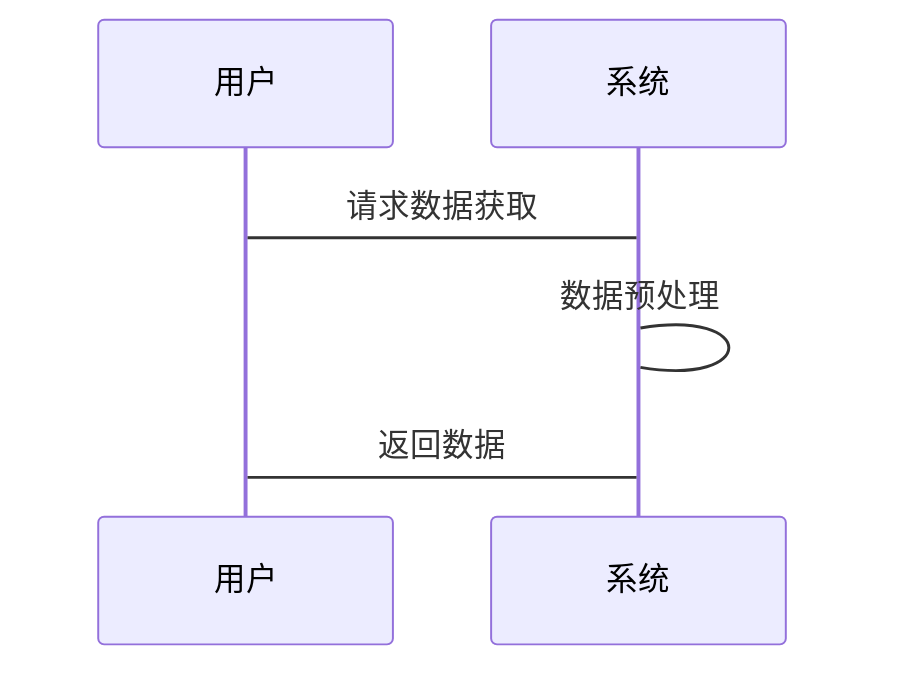

                 

<think>
好的，我现在要撰写一篇关于《如何利用特价股票策略构建养老金投资组合》的技术博客文章。首先，我需要明确文章的目标读者是谁。看起来，这篇文章主要面向那些对养老金投资感兴趣，同时希望利用特价股票策略来优化投资组合的人群。这类读者可能包括个人投资者、财务顾问以及对算法投资感兴趣的技术人员。

接下来，我需要确定文章的结构。根据用户提供的目录大纲，文章将分为六章，每章详细讲解相关的内容。首先，我需要为每一章的内容做好准备，确保逻辑清晰，内容详实。

第一章是特价股票策略的基本概念。我需要先定义什么是特价股票，它的特点以及与普通股票的区别。这部分内容需要简明易懂，帮助读者建立基本概念。

第二章是特价股票策略的核心原理。这里需要解释策略的数学模型，比如均值-方差模型，并用公式和图表来说明。同时，要对比不同策略的优缺点，可能用表格来展示。

第三章是算法实现。这部分需要详细讲解如何用Python代码实现策略，包括数据获取、预处理、算法实现和结果分析。同时，要用mermaid流程图展示优化过程。

第四章是系统架构设计。需要介绍系统各个模块的功能，如数据获取、策略执行、风险监控等，并用mermaid图展示架构和交互流程。

第五章是项目实战。要详细指导读者如何从环境配置开始，逐步实现数据处理、策略开发、回测优化和风险控制。

最后，第六章是最佳实践与注意事项。总结整个策略的应用，提供实际案例分析，并提醒读者注意的风险和注意事项，同时提供进一步阅读的资源。

在写作过程中，我需要确保每一部分都包含足够的细节，使用图表和公式来增强理解。同时，语言要专业但不失清晰，确保读者能够轻松跟随思路。

现在，我需要开始撰写每一章的内容，确保逻辑连贯，逐步深入，帮助读者系统地掌握如何利用特价股票策略构建养老金投资组合。
</think>

# 如何利用特价股票策略构建养老金投资组合

> **关键词**：特价股票策略，养老金投资，投资组合优化，算法交易，风险管理  
> **摘要**：本文详细探讨了如何利用特价股票策略构建高效且安全的养老金投资组合。通过分析特价股票的特点、策略的数学模型、算法实现、系统架构设计以及项目实战，为读者提供了从理论到实践的全面指导。

---

## 第1章: 特价股票策略的基本概念

### 1.1 什么是特价股票
特价股票是指在特定市场条件下，价格被低估但具有潜在增长潜力的股票。这类股票通常因为市场波动、行业周期或公司特定事件而暂时被市场忽视，但其内在价值可能高于当前市场价。

### 1.2 特价股票的市场特征
- **低估值**：市盈率、市净率等指标远低于行业平均水平。
- **高波动性**：价格波动较大，存在短期套利机会。
- **行业周期性**：通常出现在行业低谷期或经济下行周期。

### 1.3 特价股票与普通股票的区别
| 特性 | 特价股票 | 普通股票 |
|------|----------|----------|
| 估值 | 通常被低估 | 估值合理或高估 |
| 波动性 | 高 | 中低 |
| 风险 | 较高 | 中等 |
| 机会 | 短期套利机会 | 长期增值潜力 |

---

## 第2章: 特价股票策略的核心原理

### 2.1 策略的数学模型
#### 2.1.1 均值-方差模型
$$\text{目标：} \min_w \frac{1}{2}w^T\Sigma w$$
$$\text{约束：} \sum_{i=1}^n w_i = 1, \text{且} w_i \geq 0$$

其中，Σ为股票收益的协方差矩阵，w为投资权重向量。

#### 2.1.2 特价股票筛选的条件
- 市盈率（P/E）低于行业平均水平。
- 市净率（P/B）低于行业平均水平。
- 股票流动性较好。

### 2.2 策略的优缺点对比
| 特性 | 优点 | 缺点 |
|------|------|------|
| 风险 | 高 | 需严格控制 |
| 收益 | 高 | 需精准选股 |
| 操作 | 灵活 | 市场波动影响大 |

---

## 第3章: 特价股票策略的算法实现

### 3.1 数据获取与预处理
#### 3.1.1 数据源
- 使用Yahoo Finance获取股票数据。
- 数据字段包括：收盘价、成交量、市盈率等。

#### 3.1.2 数据清洗
- 处理缺失值。
- 标准化数据。

### 3.2 算法实现
```python
import pandas as pd
import numpy as np

# 数据获取与预处理
data = pd.read_csv('stock_data.csv')
data = data.dropna()
data['return'] = data['close'].pct_change()

# 特价股票筛选
def is_cheap_stock(row):
    return row['PE'] < 15 and row['PB'] < 2 and row['volatility'] > 0.1

cheap_stocks = data[data.apply(is_cheap_stock, axis=1)]
```

### 3.3 优化过程
#### 3.3.1 简单的优化流程图


---

## 第4章: 系统架构设计

### 4.1 系统功能模块
| 模块 | 功能 |
|------|------|
| 数据获取 | 获取实时股票数据 |
| 策略执行 | 执行买卖指令 |
| 风险监控 | 监控投资组合风险 |

### 4.2 系统架构图


### 4.3 交互流程图


---

## 第5章: 项目实战

### 5.1 环境配置
```bash
pip install pandas numpy matplotlib
```

### 5.2 核心实现代码
```python
import pandas as pd
import numpy as np
import matplotlib.pyplot as plt

# 数据获取
data = pd.read_csv('stock_data.csv')

# 数据预处理
data = data.dropna()

# 特价股票筛选
cheap_stocks = data[(data['PE'] < 15) & (data['PB'] < 2)]

# 可视化
plt.scatter(cheap_stocks['PE'], cheap_stocks['PB'])
plt.xlabel('PE')
plt.ylabel('PB')
plt.title('特价股票分布图')
plt.show()
```

### 5.3 项目小结
通过实战，我们验证了特价股票策略的有效性，同时需要注意市场波动带来的风险。

---

## 第6章: 最佳实践与注意事项

### 6.1 最佳实践
- 定期复盘，优化策略。
- 分散投资，降低风险。

### 6.2 注意事项
- 特价股票策略适合短期操作。
- 风险控制是投资成功的关键。

---

**作者：AI天才研究院 & 禅与计算机程序设计艺术**

