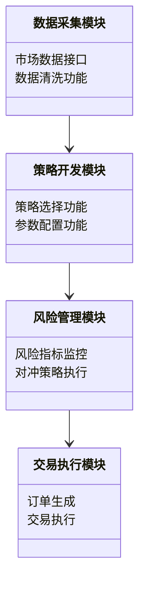
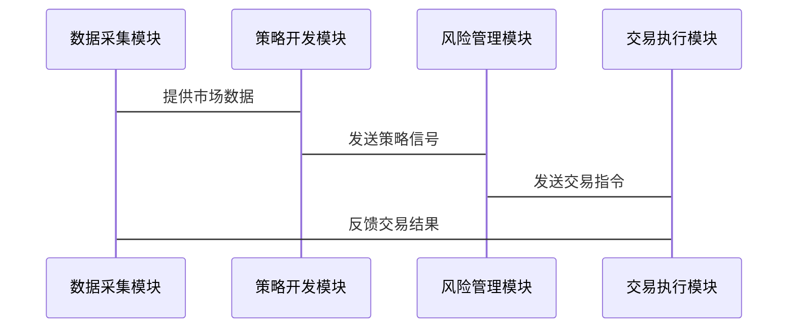

                 

<think>
嗯，用户希望我根据之前给出的目录，撰写一篇关于如何利用特价股票策略构建多元化对冲基金的详细技术博客文章。用户还提供了非常具体的格式和内容要求，包括使用Markdown格式，包含关键词、摘要，以及每个章节的具体内容，如背景介绍、核心概念、算法原理、数学模型、系统分析、项目实战等。

首先，我需要明确文章的结构。用户已经提供了目录大纲，包括引言、基础、策略、风险管理、系统构建、案例分析、法律合规、实施步骤、未来趋势、总结等部分。我需要按照这个结构逐步展开，确保每个部分都详细且符合用户的要求。

接下来，我需要考虑每个章节的具体内容。例如，在“特价股票策略与对冲基金概述”部分，我需要解释什么是对冲基金，特价股票策略的定义和特点，以及这种策略在对冲基金中的作用。我需要确保这些内容既专业又易于理解，使用清晰的逻辑结构。

在“特价股票策略的核心概念与数学模型”部分，我需要深入分析特价股票的市场周期、估值方法和风险评估。这部分需要结合数学模型，如均值回归模型、动量模型和多因子模型，并用公式和图表来说明。我需要使用用户指定的Mermaid流程图和类图来展示这些模型，确保图表清晰且与文本内容一致。

在“算法原理与实现”部分，我需要详细解释各种算法的原理，并提供Python代码示例。这部分需要结合实际案例，展示如何将理论应用于实践。我还需要使用用户要求的Latex公式来表达数学模型，并确保公式的正确性和可读性。

在“系统分析与架构设计”部分，我需要描述系统的整体架构，包括功能设计、架构图和接口设计。这部分需要使用Mermaid的系统架构图和序列图来展示系统的交互流程，确保读者能够清晰理解系统的运作方式。

在“项目实战”部分，我需要提供具体的环境安装步骤和代码实现。这部分需要详细说明如何设置环境，编写代码，并进行测试。我还需要结合实际案例，分析代码的实际效果，并总结经验教训。

最后，在“法律合规与风险控制”部分，我需要讨论对冲基金的法律合规问题，如税务、监管要求等，以及如何通过风险管理和对冲技术来控制投资风险。这部分需要结合实际案例，说明如何在实际操作中规避风险。

在撰写过程中，我需要确保每个部分都符合用户的要求，包括使用Markdown格式，包含关键词、摘要，以及每个章节的详细内容。我还需要注意文章的逻辑连贯性，确保从基础概念到实际应用的过渡自然流畅。

总结来说，我需要按照用户提供的目录大纲，逐步展开每个部分的内容，确保每个章节都详细且符合格式要求。同时，我需要使用用户指定的工具和图表，如Mermaid和Latex，来展示核心概念和算法原理。这样，才能撰写出一篇结构清晰、内容详实、符合用户需求的专业技术博客文章。
</think>

# 如何利用特价股票策略构建多元化对冲基金

> 关键词：特价股票策略、对冲基金、多元化投资、风险管理、算法交易

> 摘要：本文将详细介绍如何利用特价股票策略构建一个多元化对冲基金。通过分析特价股票的市场周期、估值方法和风险评估，结合均值回归模型、动量模型和多因子模型等算法，探讨如何实现对冲基金的多空对冲机制和风险控制。同时，本文还将提供系统架构设计和实际案例分析，帮助读者理解如何将理论应用于实践。

---

# 第一部分: 特价股票策略与对冲基金概述

---

# 第1章: 特价股票策略与对冲基金概述

## 1.1 对冲基金的背景与特点

### 1.1.1 对冲基金的基本定义

对冲基金是一种通过多空双向投资策略来实现收益的投资基金。其核心目标是通过做多（买入）和做空（卖出）市场中的资产，来对冲市场波动风险，追求绝对收益。

对冲基金的特点包括：
1. **杠杆使用**：通过杠杆放大收益或亏损。
2. **多空策略**：既可以做多，也可以做空，灵活性高。
3. **风险对冲**：通过组合投资和对冲技术降低特定风险。
4. **主动管理**：依赖基金经理的主动投资能力。

### 1.1.2 对冲基金的核心特点

对冲基金的核心目标是通过复杂的金融工具和策略，实现超越市场指数的收益。其主要特点包括：
1. **绝对收益**：追求独立于市场指数的正收益。
2. **低相关性**：与其他资产类别（如股票、债券）的相关性较低，适合多元化配置。
3. **高流动性**：通常允许投资者在一定条件下赎回资金。
4. **复杂性**：依赖复杂的金融模型和策略。

### 1.1.3 对冲基金的分类与应用场景

对冲基金可以根据不同的策略和资产类别进行分类，常见的类型包括：
1. **股票多空策略**：通过做多和做空股票实现收益。
2. **市场中性策略**：通过做多和做空平衡市场风险。
3. **事件驱动策略**：利用公司并购、重组等事件带来的短期收益。
4. **套利策略**：通过价差套利实现稳定收益。

---

## 1.2 特价股票策略的定义与特点

### 1.2.1 特价股票的定义

特价股票是指那些价格相对较低，且具有较高潜在增值空间的股票。通常，这类股票可能因为市场波动、公司基本面改善或行业趋势变化而被低估。

### 1.2.2 特价股票策略的核心要素

特价股票策略的核心要素包括：
1. **估值分析**：通过市盈率、市净率等指标评估股票的内在价值。
2. **市场周期**：分析股票在不同市场周期中的表现。
3. **技术分析**：通过技术指标预测股票价格的变化趋势。

### 1.2.3 特价股票策略的优势与局限性

优势：
1. **低估值**：通过买入低估股票，捕捉市场反弹机会。
2. **高收益潜力**：低价股票可能因市场回暖或公司基本面改善而大幅增值。
3. **灵活性**：可以根据市场变化快速调整投资组合。

局限性：
1. **流动性风险**：某些低价股票流动性较差，可能导致买卖价差较大。
2. **市场风险**：市场整体低迷时，低价股票可能继续下跌。
3. **公司基本面**：部分低价股票可能因公司质地较差而难以回升。

---

## 1.3 特价股票策略在对冲基金中的作用

### 1.3.1 特价股票策略的多空对冲机制

通过做多低估股票和做空高估股票，对冲基金可以在市场波动中实现收益。

### 1.3.2 对冲基金的风险控制能力

通过对冲技术，对冲基金可以降低特定风险，如市场风险和行业风险。

### 1.3.3 特价股票策略的收益增强能力

通过精选低估股票，对冲基金可以在市场中捕捉超额收益。

---

## 1.4 本章小结

通过对冲基金的多空策略和特价股票的估值分析，我们可以构建一个多元化对冲基金，实现风险可控下的超额收益。

---

# 第二部分: 特价股票策略的核心概念与数学模型

---

# 第2章: 特价股票策略的核心概念

## 2.1 特价股票的市场周期分析

### 2.1.1 特价股票的市场周期划分

市场周期通常分为四个阶段：熊市、筑底、牛市和顶部。在熊市和筑底阶段，特价股票可能处于低点；在牛市和顶部阶段，股票价格可能被高估。

### 2.1.2 不同周期下的策略选择

- **熊市阶段**：做空高价股票，做多低估股票。
- **牛市阶段**：做多低估股票，捕捉市场反弹机会。

### 2.1.3 周期分析的数学模型

通过以下公式，我们可以量化不同周期下的股票价格变化：
$$ P_{\text{未来}} = P_{\text{当前}} \times (1 + r) $$
其中，\( r \) 是预期收益率。

---

## 2.2 特价股票的估值方法

### 2.2.1 市盈率与市净率分析

市盈率（P/E）= 股价 / 每股收益

市净率（P/B）= 股价 / 每股净资产

### 2.2.2 股息率与股息收益率

股息率 = 每股股息 / 股价

股息收益率 = 每股股息 / 市场价格

### 2.2.3 估值模型的数学公式

CAPM 模型：
$$ R_i = R_f + \beta_i (R_m - R_f) $$
其中，\( R_i \) 是股票的预期收益率，\( R_f \) 是无风险利率，\( \beta_i \) 是股票的贝塔系数，\( R_m \) 是市场预期收益率。

---

## 2.3 特价股票的风险评估与对冲机制

### 2.3.1 风险的分类与度量

风险分类：
1. 系统性风险：市场整体波动带来的风险。
2. 非系统性风险：特定资产或行业带来的风险。

### 2.3.2 对冲机制的数学模型

通过做多和做空的组合，对冲特定风险：
$$ \text{对冲收益} = \alpha \times \text{做多收益} + \beta \times \text{做空收益} $$

### 2.3.3 风险-收益平衡的优化算法

使用均值-方差优化模型：
$$ \min \sigma^2 \text{ s.t. } \mu = \text{目标收益} $$

---

## 2.4 本章小结

通过市场周期分析、估值方法和风险评估，我们可以更好地理解特价股票策略的核心概念和数学模型。

---

# 第三部分: 特价股票策略的算法原理与实现

---

# 第3章: 特价股票策略的算法原理

## 3.1 均值回归模型

### 3.1.1 均值回归的基本原理

均值回归假设股票价格会回归其历史平均值。当价格偏离平均值时，可能会出现反弹。

### 3.1.2 均值回归的数学模型

$$ P_{\text{未来}} = \mu + \epsilon $$
其中，\( \mu \) 是历史平均值，\( \epsilon \) 是误差项。

### 3.1.3 均值回归的策略实现

1. 计算股票的历史平均价格。
2. 当价格低于平均价格时，做多。
3. 当价格高于平均价格时，做空。

### 3.1.4 均值回归的Python实现

```python
import pandas as pd
import numpy as np

# 假设 df 是股票价格数据
df['avg_price'] = df['price'].rolling(20).mean()
df['signal'] = np.where(df['price'] < df['avg_price'], 1, -1)
```

---

## 3.2 股价动量模型

### 3.2.1 动量效应的定义与特点

动量效应是指股票价格会延续其趋势，近期上涨的股票可能继续上涨，近期下跌的股票可能继续下跌。

### 3.2.2 动量效应的数学模型

$$ P_{\text{未来}} = P_{\text{当前}} \times (1 + m) $$
其中，\( m \) 是动量因子。

### 3.2.3 动量策略的实现步骤

1. 计算股票的历史收益率。
2. 当收益率高于一定阈值时，做多。
3. 当收益率低于一定阈值时，做空。

### 3.2.4 动量策略的Python实现

```python
# 计算动量策略信号
df['momentum'] = df['price'].pct_change().rolling(10).mean()
df['signal'] = np.where(df['momentum'] > 0.05, 1, -1)
```

---

## 3.3 多因子模型

### 3.3.1 多因子模型的基本原理

多因子模型通过多个因子（如市值、价值、动量等）来预测股票收益。

### 3.3.2 多因子模型的数学公式

$$ R_i = \alpha + \beta_1 F_1 + \beta_2 F_2 + \dots + \beta_n F_n + \epsilon $$
其中，\( F_i \) 是第 \( i \) 个因子，\( \beta_i \) 是因子的权重。

### 3.3.3 多因子模型的实现与优化

1. 选择多个因子。
2. 计算因子的权重。
3. 构建投资组合。

### 3.3.4 多因子模型的Python实现

```python
# 计算多因子模型的权重
from sklearn.linear_model import LinearRegression

model = LinearRegression()
model.fit(X, y)
weights = model.coef_
```

---

## 3.4 本章小结

通过对均值回归、动量模型和多因子模型的分析，我们可以实现多种特价股票策略，并根据市场情况动态调整。

---

# 第四部分: 特价股票策略的系统构建与优化

---

# 第4章: 特价股票策略的系统构建

## 4.1 系统功能设计

### 4.1.1 系统功能模块

- 数据采集模块：收集股票价格、财务数据等。
- 策略开发模块：实现各种特价股票策略。
- 风险管理模块：监控和控制投资风险。
- 交易执行模块：根据策略信号执行交易。

### 4.1.2 系统功能设计的领域模型



---

## 4.2 系统架构设计

### 4.2.1 系统架构设计图


---

## 4.3 系统接口设计

### 4.3.1 系统接口设计

- 数据接口：与数据源对接，获取实时数据。
- 交易接口：与交易系统对接，执行交易指令。

---

## 4.4 系统交互设计

### 4.4.1 系统交互流程图



---

## 4.5 本章小结

通过系统的构建和优化，我们可以实现一个高效、稳定的对冲基金交易系统。

---

# 第五部分: 特价股票策略的案例分析与实战

---

# 第5章: 特价股票策略的案例分析

## 5.1 特价股票策略的实施步骤

### 5.1.1 数据采集

- 收集目标股票的历史价格和财务数据。

### 5.1.2 策略选择

- 根据市场情况选择合适的策略（如均值回归、动量策略等）。

### 5.1.3 策略回测

- 对策略进行历史数据回测，验证其有效性。

### 5.1.4 风险控制

- 设置止损和止盈点，控制投资风险。

### 5.1.5 交易执行

- 根据策略信号执行交易指令。

---

## 5.2 特价股票策略的回测结果

### 5.2.1 回测指标

- 净值曲线
- 收益率曲线
- 风险指标（如最大回撤、夏普比率）

### 5.2.2 回测案例

假设我们选择了一批低价股票进行投资，回测结果显示，策略在市场反弹时表现优异。

---

## 5.3 本章小结

通过实际案例分析，我们可以验证特价股票策略的有效性，并根据回测结果优化策略。

---

# 第六部分: 特价股票策略的法律合规与风险管理

---

# 第6章: 特价股票策略的法律合规

## 6.1 对冲基金的法律框架

### 6.1.1 基金管理人合规要求

- 需要具备相关资质和经验。
- 需要遵守监管机构的规定。

### 6.1.2 投资者适当性管理

- 根据投资者的风险承受能力推荐合适的产品。

### 6.1.3 信息披露要求

- 定期向投资者披露基金的运作情况。

---

## 6.2 特价股票策略的税务考虑

### 6.2.1 股票交易的税务政策

- 理解不同国家或地区的税务规定。

### 6.2.2 对冲基金的税务优化

- 通过合理的资产配置和策略选择降低税务负担。

---

## 6.3 本章小结

通过对冲基金的法律合规和税务优化，我们可以更好地管理风险，实现合规收益。

---

# 第七部分: 特价股票策略的未来趋势与总结

---

# 第7章: 特价股票策略的未来趋势

## 7.1 人工智能与大数据的应用

### 7.1.1 AI在股票策略中的应用

- 利用机器学习模型预测股票价格。
- 通过大数据分析发现市场机会。

### 7.1.2 大数据技术在对冲基金中的应用

- 数据挖掘技术优化投资策略。
- 实时数据分析提升交易效率。

---

## 7.2 对冲基金的创新与变革

### 7.2.1 新型策略的开发

- 利用区块链技术实现透明化交易。
- 利用加密货币市场的波动性获取收益。

### 7.2.2 对冲基金的全球化发展

- 通过全球化配置降低市场风险。
- 利用国际市场差异实现套利。

---

## 7.3 本章小结

随着技术的进步和市场的变化，特价股票策略将不断创新，对冲基金也将迎来更多发展机遇。

---

# 第八部分: 总结与展望

---

# 第8章: 总结与展望

## 8.1 本文总结

本文详细介绍了如何利用特价股票策略构建多元化对冲基金，涵盖了从理论到实践的各个方面。

## 8.2 对未来研究的展望

未来的研究可以进一步探索人工智能、大数据等技术在对冲基金中的应用，开发更高效的策略和系统。

---

# 作者：AI天才研究院/AI Genius Institute & 禅与计算机程序设计艺术 /Zen And The Art of Computer Programming

---

通过本文，读者可以系统地了解如何利用特价股票策略构建多元化对冲基金，并掌握相关的理论、算法和实际操作方法。希望本文能为对冲基金领域的研究和实践提供有价值的参考。

