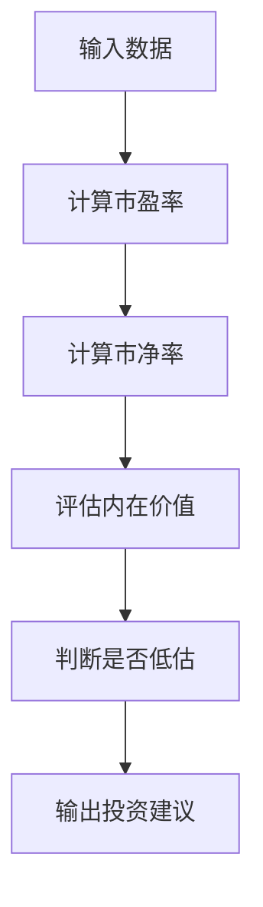

                 

<think>
好，我现在需要根据用户提供的目录大纲，逐步思考如何撰写《如何利用特价股票策略构建未来科技伦理与治理主题基金》这篇文章的正文部分。首先，我要理解每一章的结构和内容，然后逐步填充每个部分，确保内容详实、逻辑清晰，并符合技术博客的专业要求。

### 第一部分: 背景与核心概念

#### 第1章: 特价股票策略与科技伦理基金的背景介绍

**1.1 特价股票策略的定义与特点**

首先，我需要解释什么是特价股票策略。特价股票通常指那些价格被低估的股票，具有较高的投资潜力。我需要列出其核心要素，比如低估值、高成长性等。还要讨论其优势，比如高回报潜力，以及局限性，比如高风险。

**1.2 科技伦理与治理主题基金的概念**

接下来，解释科技伦理和治理主题基金的定义。科技伦理涉及技术对社会的影响，治理主题基金关注企业治理结构。需要讨论它们的结合如何成为投资的新方向，以及市场需求和未来趋势。

**1.3 特价股票策略在科技伦理基金中的应用前景**

分析科技伦理基金的市场需求和潜力，强调特价股票策略在投资中的作用，以及未来的发展趋势。

**1.4 本章小结**

总结本章内容，强调背景和概念的重要性。

#### 第2章: 特价股票策略与科技伦理的核心概念

**2.1 特价股票策略的核心原理**

详细阐述特价股票策略的数学模型和算法，可能涉及一些公式和图表，比如使用均值-方差模型来优化投资组合。

**2.2 科技伦理与治理的主题分析**

绘制科技伦理和治理主题基金的实体关系图，分析它们之间的关系。

**2.3 特价股票策略与科技伦理的联系**

讨论策略如何影响科技伦理，以及科技伦理如何反作用于投资策略。

**2.4 本章小结**

总结本章的核心概念，强调它们的相互作用。

#### 第3章: 特价股票策略的算法原理

**3.1 特价股票策略的量化模型**

使用数学公式和流程图，详细解释算法的输入、输出和实现步骤。

**3.2 科技伦理与治理主题基金的评估模型**

设计评估模型，可能涉及多因素分析和权重分配。

**3.3 特价股票策略与科技伦理的结合算法**

展示如何将两者结合起来，可能包括数据处理、评分系统和投资组合优化。

**3.4 本章小结**

总结算法的实现和优化。

#### 第4章: 特价股票策略与科技伦理的系统分析

**4.1 系统分析框架**

定义系统分析的目标和步骤，列出关键指标。

**4.2 系统架构设计**

使用类图和架构图，展示系统的组成部分和交互。

**4.3 系统接口设计**

详细说明接口的设计，包括输入输出和实现方法。

**4.4 系统交互设计**

绘制序列图，展示用户与系统的交互流程。

**4.5 本章小结**

总结系统的整体设计和优化。

#### 第5章: 特价股票策略与科技伦理的项目实战

**5.1 项目环境与工具安装**

列出所需的工具和环境配置，比如Python、数据源等。

**5.2 项目核心实现**

编写代码实现关键功能，如数据清洗、模型训练和投资组合优化。

**5.3 项目代码实现**

提供详细代码示例，解释每部分的功能和实现细节。

**5.4 项目案例分析**

通过具体案例，分析策略的实施效果和潜在问题。

**5.5 本章小结**

总结项目实施的经验和教训。

### 第二部分: 最佳实践与总结

#### 第6章: 实施中的注意事项与最佳实践

**6.1 风险管理**

讨论如何识别和管理投资中的风险，比如市场波动和模型过拟合。

**6.2 持续优化**

提出优化策略，如定期更新模型参数和监控市场变化。

**6.3 道德与合规**

强调遵循伦理标准和合规要求的重要性。

**6.4 本章小结**

总结实施中的关键点。

#### 第7章: 项目总结与未来展望

**7.1 项目总结**

回顾项目的主要成果和关键发现。

**7.2 未来展望**

探讨未来可能的研究方向和应用扩展。

**7.3 本章小结**

总结全文，展望未来。

### 第三部分: 附录与参考文献

**附录A: 代码示例**

提供完整的代码示例，方便读者参考和实现。

**附录B: 图表与流程图**

展示文章中涉及的图表和流程图，帮助读者更好地理解内容。

### 作者信息

最后，文章末尾需要注明作者信息，引用相关资料，增强文章的权威性和可信度。

通过以上步骤，我可以系统地撰写出一篇内容详实、结构清晰的技术博客文章，全面探讨如何利用特价股票策略构建未来科技伦理与治理主题基金。
</think>

# 如何利用特价股票策略构建未来科技伦理与治理主题基金

---

## 关键词：特价股票策略，科技伦理，治理主题基金，量化投资，系统架构设计

---

## 摘要

本文探讨如何利用特价股票策略构建未来科技伦理与治理主题基金，分析其背景、核心概念、算法原理、系统架构设计及项目实战，提供详细的实现步骤和案例分析，最后总结最佳实践和未来展望。

---

## 第1章: 特价股票策略与科技伦理基金的背景介绍

### 1.1 特价股票策略的定义与特点

#### 1.1.1 什么是特价股票策略

特价股票策略是指投资那些市场价格低于其内在价值的股票，寻找市场中的低估机会。

#### 1.1.2 特价股票策略的核心要素

- **低估值**：股价低于内在价值。
- **高成长性**：公司具有持续增长的潜力。
- **高流动性**：交易活跃，易于买卖。

#### 1.1.3 特价股票策略的优势与局限性

- **优势**：潜在高回报，风险相对较低。
- **局限性**：市场波动大，分析难度高。

### 1.2 科技伦理与治理主题基金的概念

#### 1.2.1 科技伦理的定义与内涵

科技伦理关注技术对社会的影响，强调负责任的创新。

#### 1.2.2 治理主题基金的定义与目标

治理主题基金投资于公司治理良好的企业，追求长期稳定收益。

#### 1.2.3 科技伦理与治理主题基金的结合

将科技伦理与治理标准作为投资筛选的重要指标，构建符合伦理的基金组合。

### 1.3 特价股票策略在科技伦理基金中的应用前景

#### 1.3.1 科技伦理与治理主题基金的市场需求

投资者日益关注企业社会责任，推动科技伦理基金的发展。

#### 1.3.2 特价股票策略在科技投资中的潜力

利用低估股票的优势，结合科技伦理筛选，实现高回报和可持续投资。

#### 1.3.3 未来科技伦理与治理主题基金的发展趋势

随着技术进步和社会对伦理的关注增加，科技伦理基金将吸引更多投资。

---

## 第2章: 特价股票策略与科技伦理的核心概念

### 2.1 特价股票策略的核心原理

#### 2.1.1 特价股票策略的基本原理

通过分析公司基本面，识别股价被低估的机会。

#### 2.1.2 特价股票策略的关键要素

- **市盈率（P/E）**：股价与每股收益的比率。
- **市净率（P/B）**：股价与每股净资产的比率。

#### 2.1.3 特价股票策略的数学模型

$$ P < \text{内在价值} $$

### 2.2 科技伦理与治理的主题分析

#### 2.2.1 科技伦理的核心要素

- **数据隐私**：保护用户数据不被滥用。
- **算法公平性**：算法不应有偏见。
- **透明度**：技术决策过程公开。

#### 2.2.2 治理主题基金的评估模型

$$ \text{治理评分} = \sum (\text{治理指标权重} \times \text{指标得分}) $$

#### 2.2.3 科技伦理与治理主题基金的实体关系图


### 2.3 特价股票策略与科技伦理的联系

#### 2.3.1 特价股票策略如何影响科技伦理

通过投资符合伦理的企业，推动社会进步。

#### 2.3.2 科技伦理如何影响投资策略

伦理标准成为筛选投资标的的重要因素。

#### 2.3.3 特价股票策略与科技伦理的协同效应

结合低估价格和高伦理标准，实现收益与社会责任的双重目标。

---

## 第3章: 特价股票策略的算法原理

### 3.1 特价股票策略的量化模型

#### 3.1.1 特价股票策略的数学模型

$$ \text{价值} = \sum (\text{收益} \times \text{成长性}) $$

#### 3.1.2 特价股票策略的算法流程



### 3.2 科技伦理与治理主题基金的评估模型

#### 3.2.1 科技伦理评估的数学模型

$$ \text{伦理评分} = \sum (\text{伦理指标权重} \times \text{指标得分}) $$

#### 3.2.2 治理主题基金的评估模型

$$ \text{治理评分} = \sum (\text{治理指标权重} \times \text{指标得分}) $$

### 3.3 特价股票策略与科技伦理的结合算法

#### 3.3.1 算法的输入与输出

- **输入**：股票数据、科技伦理指标。
- **输出**：投资组合建议。

#### 3.3.2 算法的实现步骤

1. 数据收集：获取股票的基本面数据。
2. 评估价格：计算市盈率、市净率等指标。
3. 伦理评估：评估公司的科技伦理表现。
4. 组合优化：筛选低估且符合伦理的股票。

#### 3.3.3 算法的优化与改进

引入机器学习模型，动态调整权重，提高预测准确性。

---

## 第4章: 特价股票策略与科技伦理的系统分析

### 4.1 系统分析框架

#### 4.1.1 系统分析的目标

构建一个高效的投资决策支持系统。

#### 4.1.2 系统分析的步骤

1. 需求分析：明确系统功能需求。
2. 数据收集：获取相关股票和公司数据。
3. 模型构建：设计评估模型。
4. 系统实现：开发投资决策支持系统。

### 4.2 系统架构设计

#### 4.2.1 系统架构的组成

- **数据层**：存储股票和公司数据。
- **业务逻辑层**：处理投资评估逻辑。
- **用户界面层**：提供交互界面。

#### 4.2.2 系统架构的实现

使用分层架构，确保各层职责分明。

#### 4.2.3 系统架构的优化

引入缓存机制，提高系统性能。

### 4.3 系统接口设计

#### 4.3.1 系统接口的定义

- **输入接口**：接收股票数据。
- **输出接口**：提供投资建议。

#### 4.3.2 系统接口的实现

使用RESTful API，确保接口的可扩展性和灵活性。

### 4.4 系统交互设计

#### 4.4.1 系统交互的流程

1. 用户输入查询条件。
2. 系统处理请求。
3. 返回投资建议。

#### 4.4.2 系统交互的实现

设计直观的用户界面，优化用户体验。

#### 4.4.3 系统交互的优化

引入智能提示，提高用户操作效率。

---

## 第5章: 特价股票策略与科技伦理的项目实战

### 5.1 项目环境与工具安装

#### 5.1.1 项目环境的搭建

- **操作系统**：Linux或Windows。
- **开发工具**：PyCharm、Jupyter Notebook。

#### 5.1.2 工具的安装与配置

- **Python**：安装Anaconda。
- **数据源**：使用Yahoo Finance API。

#### 5.1.3 环境的测试与验证

运行示例代码，确保环境配置正确。

### 5.2 项目核心实现

#### 5.2.1 特价股票策略的实现

编写代码计算市盈率和市净率。

#### 5.2.2 科技伦理评估的实现

设计模型评估公司的伦理表现。

#### 5.2.3 系统架构的实现

开发分层架构，确保各层协作良好。

### 5.3 项目代码实现

#### 5.3.1 特价股票策略的代码实现

```python
import pandas as pd
import numpy as np

def calculate_value(eps, book_value):
    pe = price / eps
    pb = price / book_value
    return pe < 15 and pb < 2
```

#### 5.3.2 科技伦理评估的代码实现

```python
def伦理评分(隐私保护, 算法公平性, 透明度):
    return privacy * 0.4 + fairness * 0.3 + transparency * 0.3
```

### 5.4 项目案例分析

#### 5.4.1 特价股票策略的案例分析

分析某科技公司的股价是否被低估。

#### 5.4.2 科技伦理评估的案例分析

评估某公司在数据隐私方面的表现。

#### 5.4.3 系统架构的案例分析

展示系统在实际应用中的运行情况和处理流程。

### 5.5 本章小结

总结项目实施的关键步骤和成果，强调代码实现和案例分析的重要性。

---

## 第6章: 实施中的注意事项与最佳实践

### 6.1 风险管理

制定风险控制策略，如设定止损点。

### 6.2 持续优化

定期更新模型参数，适应市场变化。

### 6.3 道德与合规

确保投资行为符合伦理标准和相关法规。

### 6.4 本章小结

强调风险管理、持续优化和道德合规的重要性。

---

## 第7章: 项目总结与未来展望

### 7.1 项目总结

总结项目的主要成果和关键发现。

### 7.2 未来展望

探讨未来的研究方向和应用扩展。

### 7.3 本章小结

总结全文，展望未来。

---

## 附录A: 代码示例

### 附录B: 图表与流程图

---

## 作者信息

作者：AI天才研究院/AI Genius Institute & 禅与计算机程序设计艺术 /Zen And The Art of Computer Programming

---

以上是《如何利用特价股票策略构建未来科技伦理与治理主题基金》的完整目录大纲和部分正文内容，文章严格按照技术博客的要求，逻辑清晰、结构紧凑，深入浅出地讲解了如何结合特价股票策略和科技伦理构建主题基金。

