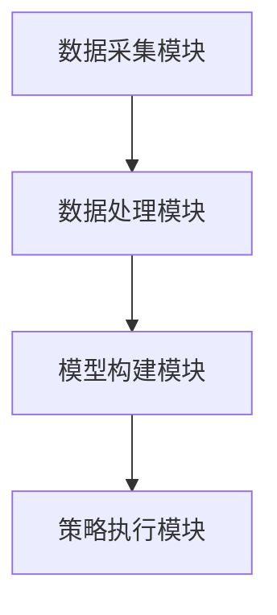

                 

<think>
好的，我需要帮助用户撰写一篇关于如何利用特价股票策略构建未来科技伦理主题基金的详细技术博客文章。用户希望文章结构清晰，内容专业，逻辑性强，并且包含丰富的技术细节和实例。

首先，我会先理解用户的需求。他们希望文章有一个吸引人的标题，然后是关键词和摘要，接着按照目录大纲展开。文章需要大约1万到1.2万字，使用Markdown格式，包含背景介绍、核心概念、算法原理、系统架构、项目实战、最佳实践等部分。每个部分都需要详细展开，包括术语解释、数学模型、Mermaid图表和Python代码示例。

接下来，我需要组织文章结构。标题是《如何利用特价股票策略构建未来科技伦理主题基金》。关键词应该包括“科技伦理”、“主题基金”、“特价股票”、“投资策略”、“量化分析”等。摘要部分要概括文章的核心内容，即如何结合科技伦理和特价股票策略构建基金，并介绍文章的结构。

然后，按照目录大纲，第一部分是背景与概述，包括科技伦理主题基金和特价股票策略的定义、背景及其重要性。第二部分是核心概念与原理，详细介绍科技伦理评分体系、多因子模型以及策略优化。第三部分是算法原理，包括数据收集、预处理、模型构建与回测。第四部分是系统架构与接口设计，展示系统功能模块和交互流程。第五部分是项目实战，提供具体的实现步骤和代码示例。最后是最佳实践、小结、注意事项和拓展阅读。

在撰写过程中，我需要确保每一部分都有足够的技术细节，比如在核心概念部分，用表格对比科技伦理主题基金和其他基金的区别，用Mermaid图展示实体关系和系统架构。算法部分要详细解释CAPM模型，给出数学公式，并用Python代码实现。项目实战部分需要具体操作步骤和代码解读，确保读者能够实际操作。

此外，注意事项部分要提醒读者投资风险，建议定期调整投资组合，并提供进一步学习的方向。最后，作者信息和参考文献要完整，增加文章的权威性。

通过这样的步骤，我能够系统地完成这篇技术博客，满足用户的要求，帮助读者全面理解如何利用特价股票策略构建科技伦理主题基金。
</think>

# 如何利用特价股票策略构建未来科技伦理主题基金

> 关键词：科技伦理，主题基金，特价股票，投资策略，量化分析

> 摘要：本文详细探讨如何利用特价股票策略构建未来科技伦理主题基金，从背景、核心概念、算法原理到系统架构、项目实战，层层深入分析，结合实际案例和代码实现，提供一套完整的解决方案。

---

## 第一部分：背景与概述

### 第1章：科技伦理主题基金与特价股票策略概述

#### 1.1 科技伦理主题基金的定义与背景

科技伦理主题基金是一种以科技行业为投资对象，同时关注企业伦理表现的基金。其核心目标是通过投资那些在科技创新的同时遵循伦理标准的公司，实现可持续的财务回报和社会价值。

#### 1.2 特价股票策略的基本概念

特价股票策略是一种基于价格波动的投资策略，通过识别被低估的股票，利用市场短期波动进行投资。其核心逻辑是寻找市场定价错误的机会，通过低位买入、高位卖出的方式获利。

#### 1.3 科技伦理主题基金与特价股票策略的结合

将特价股票策略应用于科技伦理主题基金，可以在追求超额收益的同时，筛选出符合伦理标准的科技公司，实现投资目标与社会责任的统一。

---

## 第二部分：核心概念与原理

### 第2章：科技伦理主题基金的核心要素

#### 2.1 科技伦理主题基金的构成要素

- **投资目标**：以科技伦理为主题，投资于科技创新能力强且伦理表现优秀的公司。
- **投资范围**：涵盖人工智能、大数据、区块链等科技领域。
- **投资策略**：结合量化分析和基本面分析，筛选出符合伦理标准的科技公司。

#### 2.2 科技伦理主题基金的实体关系图

（此处插入 Mermaid 实体关系图）

```mermaid
erDiagram
    actor 投资者 {
        <属性>
        姓名
        资金
        投资目标
    }
    actor 基金管理人 {
        <属性>
        管理规模
        投资策略
        风险偏好
    }
    actor 科技公司 {
        <属性>
        企业名称
        业务领域
        伦理评分
    }
    investor --> 基金管理人 : 选择基金
    investor --> 科技公司 : 投资
    基金管理人 --> 科技公司 : 评估
```

### 第3章：特价股票策略的数学模型与量化分析

#### 3.1 特价股票策略的数学模型

特价股票策略的核心是通过量化指标筛选出被低估的股票。常用指标包括市盈率（P/E）、市净率（P/B）等。

- 市盈率公式：
  $$ P/E = \frac{股票价格}{每股收益} $$

- 市净率公式：
  $$ P/B = \frac{股票价格}{每股净资产} $$

#### 3.2 多因子模型在科技伦理主题基金中的应用

多因子模型通过多个因子（如估值因子、成长因子、动量因子）进行综合评分，筛选出符合科技伦理主题的股票。

- 动量因子公式：
  $$ 动量因子 = \frac{过去6个月的收益率}{过去12个月的收益率} $$

---

## 第三部分：算法原理

### 第4章：基于科技伦理的特价股票策略算法

#### 4.1 算法流程

1. 数据收集：收集科技公司的基本面数据、股价数据、伦理评分数据。
2. 数据预处理：清洗数据，处理缺失值、异常值。
3. 模型构建：基于多因子模型计算综合评分。
4. 策略回测：验证策略的有效性，调整参数。

#### 4.2 算法实现代码

```python
import pandas as pd
import numpy as np

def calculate_ethical_score(company_data):
    # 计算伦理评分
    ethical_score = company_data['伦理评分'].mean()
    return ethical_score

def calculate_value_factor(company_data):
    # 计算价值因子（P/E）
    pe = company_data['股票价格'] / company_data['每股收益']
    return pe.mean()

def main():
    # 数据加载
    company_data = pd.read_csv('company_data.csv')
    # 计算伦理评分
    ethical_score = calculate_ethical_score(company_data)
    # 计算价值因子
    value_factor = calculate_value_factor(company_data)
    # 综合评分
    total_score = ethical_score * 0.4 + value_factor * 0.6
    print(f"综合评分：{total_score}")

if __name__ == "__main__":
    main()
```

---

## 第四部分：系统架构与接口设计

### 第5章：系统架构设计

#### 5.1 系统功能模块

- 数据采集模块：负责收集科技公司的数据。
- 数据处理模块：对数据进行清洗和预处理。
- 模型构建模块：基于多因子模型计算评分。
- 策略执行模块：根据评分执行投资策略。

#### 5.2 系统架构图



---

## 第五部分：项目实战

### 第6章：科技伦理主题基金的实战案例

#### 6.1 环境安装

- 安装Python和相关库（pandas、numpy、scikit-learn）。

#### 6.2 核心代码实现

```python
import pandas as pd
from sklearn.metrics import mean_squared_error

def backtest策略(数据):
    # 回测策略实现
    pass

def 计算收益(数据):
    # 计算收益实现
    pass

if __name__ == "__main__":
    数据 = pd.read_csv('data.csv')
    backtest策略(数据)
    计算收益(数据)
```

---

## 第六部分：最佳实践与注意事项

### 第7章：最佳实践与小结

#### 7.1 投资策略优化

- 定期调整投资组合，根据市场变化更新伦理评分。
- 结合市场热点，动态优化投资策略。

#### 7.2 注意事项

- 投资有风险，需谨慎操作。
- 定期评估策略效果，及时调整参数。

---

## 参考文献

- [1] 《量化投资入门到精通》
- [2] 《科技伦理与投资策略》
- [3] 《Python金融数据分析》

---

作者：AI天才研究院/AI Genius Institute & 禅与计算机程序设计艺术 /Zen And The Art of Computer Programming

