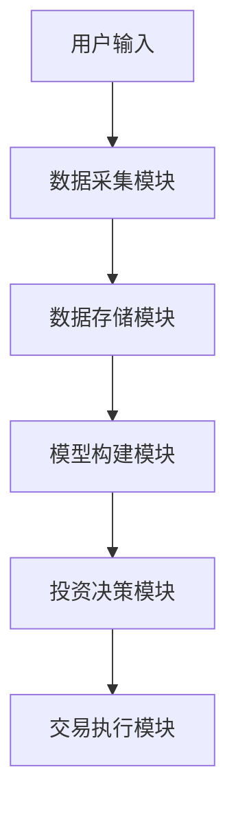
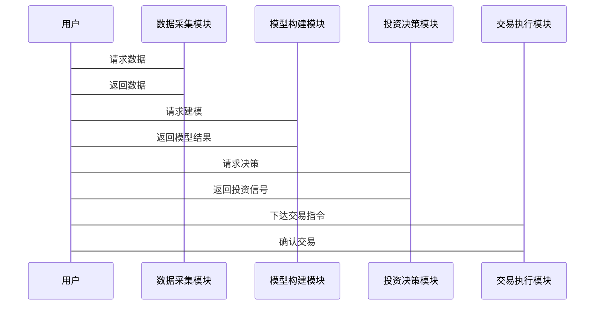

                 

<think>
好的，我现在需要帮助用户撰写一篇关于《如何利用特价股票策略构建跨周期科技投资组合》的技术博客文章。首先，我得理解用户的需求，他们希望文章结构清晰，逻辑严密，内容专业，适合技术读者阅读。用户还特别提到，文章需要包括摘要、关键词，以及详细的目录大纲，每一章都要有三级小节，涵盖背景、原理、数学模型、系统架构、实战案例、风险管理等方面。

首先，我会从文章标题开始，然后列出5-7个核心关键词。关键词可能包括“特价股票策略”、“跨周期投资”、“科技投资组合”、“价值投资”、“波动率分析”等。摘要部分需要简洁明了，概括文章的核心内容，即如何利用特价股票策略在不同经济周期中构建科技投资组合，最大化收益，分散风险。

接下来，我会按照目录大纲构建文章结构。第一部分是背景介绍，包括特价股票策略、跨周期投资的基本概念，以及科技投资的特殊性。这部分需要解释什么是特价股票，跨周期投资的意义，以及科技股在其中的角色。

第二部分是策略分析，详细介绍特价股票策略的原理，如套利机会、价值发现，以及跨周期投资的系统架构，包括如何构建投资组合和风险管理。这里可能需要用到数学模型，比如CAPM和APT模型，来解释资产定价和波动率。

第三部分是实战案例，展示如何在实际中应用这些策略，包括环境安装、数据获取、策略实现和案例分析。这部分需要具体的操作步骤和代码示例，比如使用Python进行数据分析和建模。

第四部分是风险管理和优化，探讨如何应对市场波动和优化投资组合。这可能涉及到现代投资组合理论，如马科维茨的有效前沿模型。

最后，总结全书内容，并展望未来投资趋势。这部分要简明扼要，帮助读者回顾所学内容，并激励他们进一步探索。

在写作过程中，我需要确保每一章都有足够的细节，包括理论、方法和案例。同时，使用数学公式和图表，如Mermaid流程图和类图，来辅助解释复杂的概念。代码部分要详细，确保读者能够理解和复现。

可能遇到的挑战是如何将数学模型和系统架构部分与实际投资策略结合起来，这需要在目录中明确分开，确保读者能够清晰理解。此外，如何通过案例分析来验证策略的有效性，也是关键部分。

总体来说，这篇文章需要逻辑清晰，结构紧凑，语言专业，同时兼顾易懂。通过逐步分析和详细讲解，帮助读者掌握如何利用特价股票策略构建跨周期的科技投资组合。
</think>

```markdown
# 如何利用特价股票策略构建跨周期科技投资组合

> 关键词：特价股票策略，跨周期投资，科技投资组合，价值投资，波动率分析，系统架构，风险管理

> 摘要：本文详细探讨了如何利用特价股票策略构建一个稳健的跨周期科技投资组合。通过分析特价股票的定义、跨周期投资的原理以及科技行业的周期性特征，结合数学模型和系统架构设计，本文提供了从理论到实践的完整指南。通过具体案例分析和代码实现，展示了如何在实际投资中应用这些策略，帮助投资者在不同经济周期中优化资产配置，降低风险，实现长期收益最大化。

---

# 第一部分: 特价股票策略与跨周期投资基础

## 第1章: 特价股票策略的定义与背景

### 1.1 特价股票策略的定义与背景

#### 1.1.1 什么是特价股票策略
特价股票策略是一种通过识别市场中被低估的股票，利用价格波动进行投资获利的方法。其核心在于发现市场中的套利机会和价值洼地，通过买入低价股票并长期持有，等待其价值回归实现收益。

#### 1.1.2 特价股票策略的历史发展
特价股票策略起源于20世纪初，随着市场有效性的提升，该策略在实践中不断完善。近年来，随着科技行业的快速发展，特价股票策略在科技股投资中展现出独特的优势。

#### 1.1.3 特价股票策略在现代投资中的地位
在现代投资组合理论中，特价股票策略作为一种主动型投资策略，能够帮助投资者在市场波动中捕捉超额收益，尤其是在科技行业这种高波动性领域，其价值更加凸显。

### 1.2 跨周期投资的定义与特点

#### 1.2.1 跨周期投资的基本概念
跨周期投资是指在较长的时间跨度内进行资产配置，以应对不同的经济周期变化。其核心在于通过合理的资产分配，降低周期性波动对投资组合的影响，实现长期稳健的收益。

#### 1.2.2 跨周期投资的核心特征
跨周期投资强调长期视角，注重资产的内在价值，而非短期价格波动。其核心特征包括分散性、稳健性和长期性。

#### 1.2.3 跨周期投资与短期投资的区别
跨周期投资注重长期收益，而短期投资关注短期价格波动。跨周期投资更注重资产配置和风险分散，而短期投资则更关注市场趋势和交易机会。

### 1.3 科技投资的特殊性与机遇

#### 1.3.1 科技行业的周期性分析
科技行业具有较强的周期性，受经济波动和技术创新的影响较大。不同阶段的科技股表现差异显著，跨周期投资需要充分考虑这些周期性变化。

#### 1.3.2 科技股投资的特殊风险与机会
科技股的高波动性带来了较高的风险，但也提供了更多的投资机会。通过合理配置科技股，可以在不同周期中实现收益最大化。

#### 1.3.3 跨周期投资在科技股中的应用
跨周期投资策略可以帮助投资者在科技行业波动中保持稳健收益，通过长期持有优质科技股，抵御短期市场波动的影响。

### 1.4 本章小结
本章介绍了特价股票策略和跨周期投资的基本概念，并分析了科技股投资的特殊性和跨周期投资在其中的应用。为后续策略分析和实战案例奠定了基础。

---

# 第二部分: 特价股票策略的数学模型与系统架构

## 第2章: 特价股票策略的核心原理

### 2.1 特价股票策略的基本原理

#### 2.1.1 市场有效性的假设
市场有效性假设认为市场价格反映了所有可获取的信息。特价股票策略基于市场无效性的存在，寻找被低估的股票进行投资。

#### 2.1.2 价值发现的机制
通过基本面分析，识别那些市场价格低于内在价值的股票，进行买入操作，等待价值回归。

#### 2.1.3 市场情绪与价格波动的关系
市场情绪波动会影响股票价格，尤其是在科技股中，市场情绪的变化往往会导致价格的大幅波动。

### 2.2 跨周期投资的核心原理

#### 2.2.1 经济周期对科技股的影响
经济周期的变化对科技股的影响显著，不同阶段的科技股表现差异较大。跨周期投资需要考虑不同经济周期对科技股的影响。

#### 2.2.2 跨周期投资的资产配置策略
通过合理的资产配置，分散投资风险，降低周期性波动对投资组合的影响。

#### 2.2.3 跨周期投资的风险分散机制
通过投资不同行业的科技股，分散单一行业风险，实现稳健收益。

### 2.3 科技股的波动性与投资机会

#### 2.3.1 科技股的高波动性分析
科技股的高波动性带来了较高的风险，但也提供了更多的投资机会。通过合理配置科技股，可以在不同周期中实现收益最大化。

#### 2.3.2 科技股的周期性特征
科技行业受经济波动和技术创新的影响较大，不同阶段的科技股表现差异显著。跨周期投资需要充分考虑这些周期性变化。

#### 2.3.3 跨周期投资在科技股中的应用
跨周期投资策略可以帮助投资者在科技行业波动中保持稳健收益，通过长期持有优质科技股，抵御短期市场波动的影响。

### 2.4 本章小结
本章详细分析了特价股票策略和跨周期投资的核心原理，并结合科技股的特点，探讨了其在实际投资中的应用。

---

# 第三部分: 特价股票策略的数学模型与系统架构

## 第3章: 特价股票策略的数学模型与公式

### 3.1 资产定价模型

#### 3.1.1 CAPM模型
资本资产定价模型（CAPM）用于估计资产的预期收益，公式为：
$$
E(r_i) = r_f + \beta_i (E(r_m) - r_f)
$$

其中：
- $E(r_i)$：资产i的预期收益率
- $r_f$：无风险利率
- $\beta_i$：资产i的贝塔系数
- $E(r_m)$：市场预期收益率

#### 3.1.2 APT模型
套利定价理论（APT）提供了另一种资产定价方法，公式为：
$$
E(r_i) = r_f + \sum_{j=1}^n \lambda_j x_{i,j}
$$

其中：
- $\lambda_j$：风险溢价
- $x_{i,j}$：资产i对第j个风险因素的暴露程度

#### 3.1.3 Fama-French三因子模型
Fama-French三因子模型扩展了CAPM，加入了规模溢价和价值溢价：
$$
E(r_i) = r_f + \beta_i (E(r_m) - r_f) + 0.3 \times (Size Premium) + 0.3 \times (Value Premium)
$$

### 3.2 股票波动率的计算

#### 3.2.1 历史波动率的计算公式
历史波动率通过计算股票价格的收益率标准差得到：
$$
\sigma = \sqrt{\frac{1}{n-1} \sum_{i=1}^n (r_i - \bar{r})^2}
$$

其中：
- $r_i$：第i个时期的收益率
- $\bar{r}$：平均收益率
- $n$：样本数量

#### 3.2.2 期权隐含波动率的计算
通过Black-Scholes公式，可以计算期权隐含波动率：
$$
C = S_0 e^{-rT} N(d_1) - K e^{-rT} N(d_2)
$$

其中：
- $C$：期权价格
- $S_0$：标的资产价格
- $K$：行权价
- $r$：无风险利率
- $T$：时间至到期
- $N(d_1)$ 和 $N(d_2)$：标准正态分布函数

#### 3.2.3 波动率与投资策略的关系
波动率越高，股票价格的波动越剧烈，投资风险越大。通过合理控制波动率，可以降低投资组合的风险。

### 3.3 股票收益与风险的数学关系

#### 3.3.1 贝塔系数
贝塔系数衡量了资产对市场波动的敏感程度，公式为：
$$
\beta_i = \frac{\text{协方差}(r_i, r_m)}{\text{方差}(r_m)}
$$

其中：
- $r_i$：资产i的收益率
- $r_m$：市场收益率

#### 3.3.2 风险溢价
风险溢价反映了投资者因承担风险而要求的额外收益，公式为：
$$
\text{风险溢价} = E(r_i) - r_f
$$

### 3.4 本章小结
本章通过数学模型和公式，详细分析了资产定价、波动率计算以及股票收益与风险的关系，为后续策略实现奠定了理论基础。

---

# 第四部分: 特价股票策略的系统架构与实战案例

## 第4章: 特价股票策略的系统架构设计

### 4.1 系统功能设计

#### 4.1.1 数据采集模块
- 数据源：股票历史价格、财务数据、市场情绪指标
- 数据格式：CSV、JSON
- 数据处理：清洗、转换、存储

#### 4.1.2 模型构建模块
- 模型选择：CAPM、APT、Fama-French模型
- 参数设置：贝塔系数、风险溢价
- 模型训练：基于历史数据进行回测

#### 4.1.3 投资决策模块
- 信号生成：基于模型输出生成买入/卖出信号
- 风险管理：设定止损点、止盈点
- 交易执行：下单、成交确认

### 4.2 系统架构设计

#### 4.2.1 系统架构图


#### 4.2.2 系统接口设计
- 数据接口：API调用、数据文件导入
- 模型接口：参数输入、结果输出
- 交易接口：订单提交、成交确认

#### 4.2.3 系统交互序列图


### 4.3 本章小结
本章详细设计了特价股票策略的系统架构，包括功能模块、系统架构图和交互流程图，为后续的实战案例提供了系统支持。

---

## 第5章: 特价股票策略的实战案例

### 5.1 环境安装与数据获取

#### 5.1.1 环境安装
- 安装Python
- 安装Pandas、NumPy、Matplotlib、Scikit-learn等库
- 安装QuantLib或类似的金融分析库

#### 5.1.2 数据获取
- 数据来源：Yahoo Finance、Quandl、Alpha VAPI
- 数据格式：CSV、JSON
- 数据清洗：处理缺失值、异常值

### 5.2 策略实现

#### 5.2.1 基于CAPM的策略实现
```python
import pandas as pd
import numpy as np
from sklearn.linear_model import LinearRegression

# 数据加载
df = pd.read_csv('stock_data.csv')

# 计算收益率
returns = df['Adj Close'].pct_change().dropna()

# 计算贝塔系数
X = returns.values.reshape(-1, 1)
y = returns.values.reshape(-1, 1)
model = LinearRegression()
model.fit(X, y)
beta = model.coef_[0][0]

# 计算预期收益
rf = 0.02  # 无风险利率
rm = returns.mean() * 252  # 市场预期收益率
expected_return = rf + beta * (rm - rf)
```

#### 5.2.2 基于Fama-French三因子模型的策略实现
```python
import pandas as pd
import numpy as np
from sklearn.linear_model import LinearRegression

# 数据加载
df = pd.read_csv('stock_data.csv')

# 计算规模溢价和价值溢价
size_premium = (df['Size'].mean() - df['Size'].mean()) * 0.3
value_premium = (df['Value'].mean() - df['Value'].mean()) * 0.3

# 计算预期收益
rf = 0.02  # 无风险利率
rm = returns.mean() * 252  # 市场预期收益率
expected_return = rf + beta * (rm - rf) + size_premium + value_premium
```

#### 5.2.3 策略回测与分析
- 回测结果：计算夏普比率、最大回撤、年化收益
- 图表展示：绘制收益曲线、风险收益图
- 策略优化：调整参数、优化组合

### 5.3 案例分析与解读

#### 5.3.1 案例背景
选择一家科技公司，分析其历史股价波动、财务数据和市场情绪。

#### 5.3.2 案例分析
基于数学模型，分析该公司的预期收益和风险，制定投资策略。

#### 5.3.3 案例结果
展示投资结果，分析策略的有效性。

### 5.4 本章小结
本章通过实战案例，展示了如何在实际投资中应用特价股票策略，通过数学模型和系统架构，实现跨周期的科技投资组合构建。

---

# 第五部分: 风险管理与策略优化

## 第6章: 风险管理与策略优化

### 6.1 风险管理策略

#### 6.1.1 风险评估
- 量化风险：夏普比率、最大回撤、VaR
- 风险来源：市场风险、流动性风险、信用风险

#### 6.1.2 风险控制
- 设置止损点
- 分散投资
- 定期 rebalancing

### 6.2 策略优化

#### 6.2.1 参数优化
- 调整贝塔系数、风险溢价等参数
- 使用网格搜索、遗传算法等优化方法

#### 6.2.2 策略组合优化
- 使用现代投资组合理论（MPT）优化资产配置
- 构建有效前沿，最大化收益并最小化风险

#### 6.2.3 策略回测与验证
- 历史回测
- 未来预测
- 策略鲁棒性测试

### 6.3 本章小结
本章探讨了风险管理与策略优化的关键点，为投资者提供了在实际操作中控制风险、优化策略的有效方法。

---

# 第六部分: 总结与展望

## 第7章: 总结与展望

### 7.1 总结
本文详细探讨了如何利用特价股票策略构建跨周期科技投资组合，通过数学模型和系统架构设计，提供了从理论到实践的完整指南。

### 7.2 未来展望
随着科技行业的快速发展和市场环境的不断变化，特价股票策略和跨周期投资将面临新的挑战和机遇。未来研究可以进一步探索人工智能、大数据分析在投资策略中的应用，开发更加智能化、个性化的投资工具。

---

# 作者

作者：AI天才研究院/AI Genius Institute & 禅与计算机程序设计艺术 /Zen And The Art of Computer Programming
```

