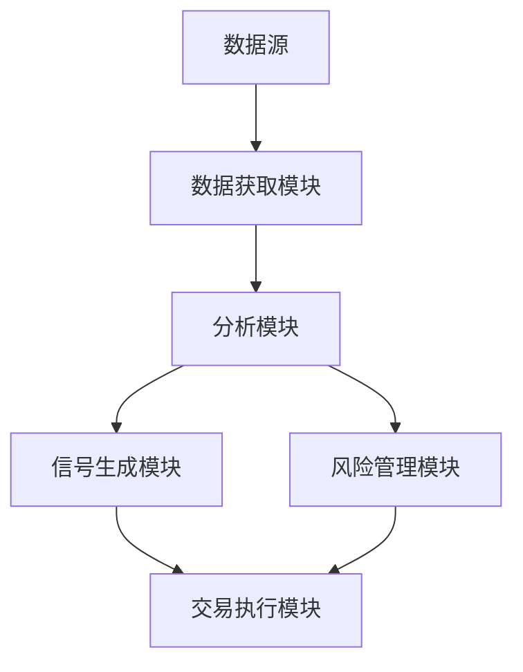

                 


# 如何利用特价股票策略构建长期价值投资组合

---

## 关键词：
- 特价股票策略
- 价值投资
- 股票投资组合
- 长期投资
- 市场分析

---

## 摘要：
本文将详细介绍如何利用特价股票策略构建长期价值投资组合。通过分析特价股票的特征、价值投资的核心理念、市场分析方法以及投资组合的构建策略，我们将逐步揭示如何在市场波动中捕捉低估股票，实现长期价值增长。文章结合理论与实践，从背景介绍到算法实现，从系统设计到项目实战，全面解析特价股票策略的核心要点。

---

# 第一部分：特价股票策略的背景与核心概念

## 第1章：特价股票策略的背景与定义

### 1.1 特价股票的定义与特征
#### 1.1.1 特价股票的定义
特价股票通常指那些市场价格低于其内在价值的股票。这类股票可能因为市场情绪、短期波动或公司基本面暂时不佳而被低估，但具备长期增值的潜力。

#### 1.1.2 特价股票的特征
- **低市盈率（P/E）**：市盈率低于行业平均水平，表明股票价格相对于盈利能力被低估。
- **低市净率（P/B）**：市净率低于1，表明股价低于公司账面价值。
- **高股息率**：部分特价股票提供较高的股息回报，吸引价值投资者。

#### 1.1.3 特价股票与普通股票的区别
| 特性 | 特价股票 | 普通股票 |
|------|----------|----------|
| 市盈率 | 低于行业平均 | 接近或高于行业平均 |
| 市净率 | 低于1 | 通常高于1 |
| 股息率 | 较高 | 一般或较低 |
| 市场情绪 | 常被忽视或低估 | 受市场关注或高估 |

### 1.2 特价股票策略的背景与现状
#### 1.2.1 特价股票策略的起源与发展
价值投资理念的鼻祖本杰明·格雷厄姆（Benjamin Graham）曾强调投资于低于内在价值的股票，这为特价股票策略奠定了理论基础。近年来，随着市场波动加剧，投资者 increasingly转向特价股票策略以寻求长期稳定收益。

#### 1.2.2 当前市场中的特价股票策略应用现状
- **机构投资者**：部分机构通过大数据分析筛选低估股票。
- **个人投资者**：越来越多的散户开始关注特价股票，尤其是通过网络平台和金融工具进行自主分析。

#### 1.2.3 特价股票策略的优劣势分析
- **优势**：
  - 低估值股票具备较高的增值潜力。
  - 抗跌性较强，在市场波动中风险较低。
- **劣势**：
  - 需要较长的时间周期才能显现价值。
  - 部分股票可能因基本面恶化而进一步下跌。

## 第2章：价值投资与特价股票策略的关系

### 2.1 价值投资的核心理念
#### 2.1.1 价值投资的定义与核心原则
价值投资是一种投资策略，强调以低于内在价值的价格购买优质资产。其核心原则包括：
- **安全边际**：买入价格低于内在价值。
- **长期视角**：关注企业的长期盈利能力。
- **分散投资**：降低单一股票的风险。

#### 2.1.2 价值投资与特价股票策略的联系
- 价值投资注重内在价值，而特价股票策略关注市场价格低于内在价值的情况。
- 两者都强调长期视角，追求稳定的增值。

#### 2.1.3 价值投资中的特价股票策略应用
- **筛选标准**：通过市盈率、市净率等指标筛选低估股票。
- **组合构建**：将特价股票与其他优质资产结合，构建多元化投资组合。

### 2.2 长期投资与短期波动的平衡
#### 2.2.1 长期投资视角下的特价股票策略
- 长期投资者不因短期波动而改变策略，而是关注企业的长期价值。
- 通过持有低估股票，等待市场重新估值。

#### 2.2.2 短期市场波动对特价股票策略的影响
- 短期波动可能导致特价股票价格进一步下跌，但也可能带来买入机会。
- 投资者需在波动中保持冷静，避免情绪化决策。

#### 2.2.3 如何在长期与短期之间找到平衡
- 设定合理的买入和卖出策略。
- 定期复盘和调整投资组合。

---

# 第二部分：特价股票策略的核心概念与分析

## 第3章：特价股票的特征与分类

### 3.1 特价股票的特征分析
#### 3.1.1 低市盈率（P/E）股票
- **定义**：市盈率低于行业平均水平。
- **优势**：估值较低，具备增值潜力。
- **劣势**：部分公司可能面临盈利能力下降的风险。

#### 3.1.2 低市净率（P/B）股票
- **定义**：市净率低于1。
- **优势**：股价远低于账面价值，具备较高的安全边际。
- **劣势**：部分公司可能资产质量不佳。

#### 3.1.3 高股息率股票
- **定义**：股息率高于行业平均水平。
- **优势**：稳定的现金流回报。
- **劣势**：部分公司可能通过高股息吸引投资者，但实际盈利能力有限。

### 3.2 特价股票的分类与对比
#### 3.2.1 垃圾股、重组股与绩差股的区分
- **垃圾股**：基本面差，可能退市。
- **重组股**：公司正在重组，可能存在转机。
- **绩差股**：业绩不佳，但未到退市阶段。

#### 3.2.2 不同类型特价股票的优劣势对比
| 类型 | 优势 | 劣势 |
|------|------|------|
| 低市盈率 | 估值低，增值潜力大 | 盈利能力可能下降 |
| 低市净率 | 安全边际高 | 资产质量可能不佳 |
| 高股息率 | 现金流稳定 | 盈利能力可能有限 |

---

## 第4章：特价股票策略的数学模型与算法分析

### 4.1 特价股票筛选的数学模型
#### 4.1.1 市盈率（P/E）计算
$$ P/E = \frac{股价}{每股净利润} $$

#### 4.1.2 市净率（P/B）计算
$$ P/B = \frac{股价}{每股净资产} $$

#### 4.1.3 潜在收益评估
$$ 潜在收益 = \frac{内在价值 - 当前股价}{当前股价} \times 100\% $$

### 4.2 基于机器学习的特价股票筛选算法
#### 4.2.1 算法流程
1. 数据获取：收集股票的市盈率、市净率、股息率等数据。
2. 特征筛选：基于特定指标筛选低估股票。
3. 模型训练：使用历史数据训练分类模型。
4. 信号生成：根据模型输出投资信号。

#### 4.2.2 Python代码实现
```python
import pandas as pd
import numpy as np

# 示例数据
data = {
    '股票代码': ['A', 'B', 'C', 'D'],
    '市盈率': [10, 15, 20, 8],
    '市净率': [1.5, 2.0, 1.0, 1.2],
    '股息率': [5, 3, 4, 6]
}

df = pd.DataFrame(data)

# 筛选条件：市盈率 < 12 且市净率 < 1.5 且股息率 > 4%
selected_stocks = df[(df['市盈率'] < 12) & (df['市净率'] < 1.5) & (df['股息率'] > 4)]
print("符合条件的股票：")
print(selected_stocks)
```

---

## 第5章：系统架构与投资组合优化

### 5.1 投资决策支持系统架构
#### 5.1.1 系统功能模块
1. 数据获取模块：实时获取股票数据。
2. 分析模块：计算市盈率、市净率等指标。
3. 信号生成模块：基于算法生成投资信号。
4. 交易执行模块：根据信号执行交易。
5. 风险管理模块：监控投资组合风险。

#### 5.1.2 系统架构图（Mermaid）


---

## 第6章：项目实战与案例分析

### 6.1 环境安装与配置
#### 6.1.1 安装Python与相关库
- Python：安装最新版本。
- 库：`pandas`, `numpy`, `scikit-learn`, `matplotlib`

### 6.2 核心代码实现
#### 6.2.1 数据获取与清洗
```python
import pandas as pd
import requests
import json

# 获取股票数据
def get_stock_data(ticker):
    url = f"https://api.example.com/stock/{ticker}"
    response = requests.get(url)
    data = json.loads(response.text)
    return data

# 示例数据清洗
data = get_stock_data("AAPL")
df = pd.DataFrame([data])
print(df)
```

#### 6.2.2 策略实现
```python
# 筛选特价股票
def screen_cheap_stocks(df, threshold_pe=15, threshold_pb=1.5):
    return df[(df['PE'] < threshold_pe) & (df['PB'] < threshold_pb)]

selected = screen_cheap_stocks(df)
print("筛选结果：", selected)
```

### 6.3 案例分析与总结
#### 6.3.1 实际案例分析
- 以某只股票为例，分析其市盈率、市净率等指标。
- 计算其潜在收益。

#### 6.3.2 投资组合优化
- 根据筛选结果，构建投资组合。
- 定期复盘和调整。

---

## 第7章：最佳实践与注意事项

### 7.1 风险管理
- 设置止损点。
- 分散投资，降低风险。

### 7.2 心理因素
- 避免情绪化决策。
- 保持耐心，长期持有。

### 7.3 持续学习
- 关注市场动态。
- 定期优化策略。

---

## 结语

通过本文的详细分析，读者可以掌握如何利用特价股票策略构建长期价值投资组合。从背景介绍到算法实现，从系统设计到项目实战，我们全面解析了特价股票策略的核心要点。希望本文能为投资者提供实用的指导，帮助他们在复杂的市场中实现稳健的投资回报。

---

## 作者

**作者：AI天才研究院/AI Genius Institute & 禅与计算机程序设计艺术 /Zen And The Art of Computer Programming**

---

## 版权声明

本文版权归作者所有，转载请注明出处。

