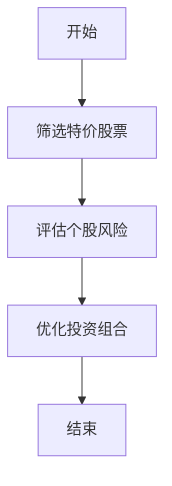
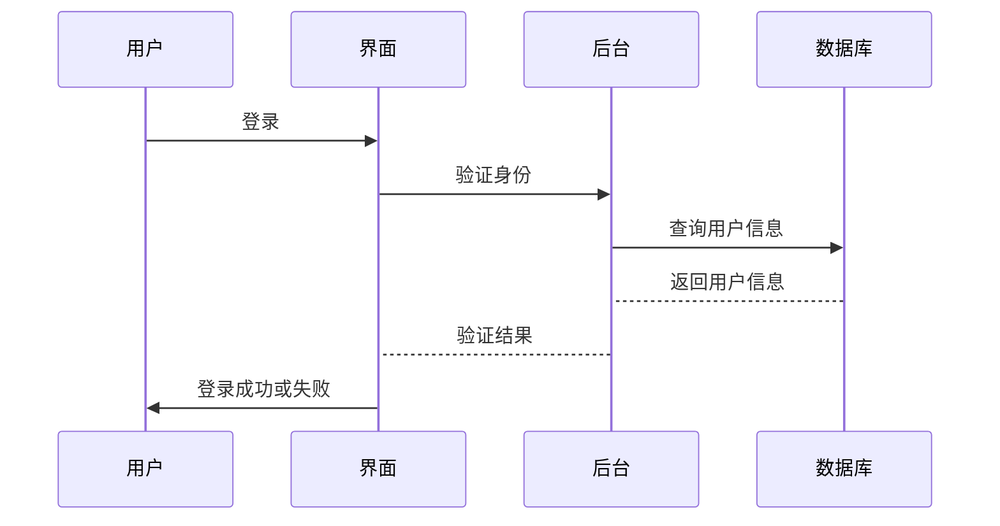

                 


```markdown
# 如何利用特价股票策略构建长期技术主权投资组合

> 关键词：特价股票策略，长期投资，技术主权，投资组合，风险管理

> 摘要：本文详细探讨了如何利用特价股票策略构建一个稳健的长期技术主权投资组合。通过分析特价股票的特性、投资组合构建的核心要素以及相关数学模型，结合系统架构设计和实际案例，为投资者提供从理论到实践的全面指导。

---

## 第一部分: 特价股票策略与长期技术主权投资组合概述

### 第1章: 特价股票策略的背景与概念

#### 1.1 特价股票的定义与特点
##### 1.1.1 什么是特价股票
特价股票是指价格低于其内在价值，通常由于市场暂时性因素或公司特定问题导致价格被低估的股票。这种股票通常具有较高的潜在回报，但伴随着较高的风险。

##### 1.1.2 特价股票的特点
- 价格低估：股票价格远低于其真实价值。
- 市场流动性低：交易量小，买卖价差大。
- 风险较高：可能受到公司基本面或外部市场的影响。

##### 1.1.3 特价股票的分类
- 周期性股票：如能源、材料等行业的股票，价格波动较大。
- 小盘股：市场资本较小，成长空间大。
- 价值股：市盈率、市净率等指标低于行业平均水平。

#### 1.2 长期技术主权投资组合的内涵
##### 1.2.1 投资组合的基本概念
投资组合是指将资金分配到不同资产或股票上的策略，旨在通过多样化降低风险并实现收益最大化。

##### 1.2.2 技术主权投资的定义
技术主权投资是指通过投资于核心技术领域（如人工智能、量子计算等），以确保在技术发展和创新中的主导地位。

##### 1.2.3 长期投资的目标与意义
长期投资的目标是通过持续的资本增值，实现财富的稳步增长。技术主权投资则强调通过投资关键技术创新，提升国家或企业的竞争力。

#### 1.3 特价股票与技术主权投资的关系
##### 1.3.1 特价股票在技术主权投资中的作用
特价股票可能代表那些因市场低估而价格便宜的技术领先企业，通过投资这些股票，可以在技术主权方面获得优势。

##### 1.3.2 特价股票策略的优势与劣势
- 优势：潜在高回报，价格低廉。
- 劣势：高风险，流动性差。

##### 1.3.3 特价股票策略的适用场景
适用于市场低迷期，或技术领先企业因短期问题导致股价被低估的情况。

---

## 第二部分: 特价股票策略的核心概念与联系

### 第2章: 特价股票策略的核心概念

#### 2.1 投资组合构建的核心要素
##### 2.1.1 资产配置
将资金分配到不同资产类别（股票、债券、现金等），以分散风险。

##### 2.1.2 风险管理
通过止损、分散投资等手段，降低投资组合的整体风险。

##### 2.1.3 收益目标
设定合理的收益目标，平衡风险与回报。

#### 2.2 特价股票策略的数学模型
##### 2.2.1 资本资产定价模型（CAPM）
$$ E(r_i) = r_f + \beta_i (E(r_m) - r_f) $$
其中，\( E(r_i) \) 是个股的预期回报率，\( r_f \) 是无风险利率，\( \beta_i \) 是个股的贝塔系数，\( E(r_m) \) 是市场预期回报率。

##### 2.2.2 投资组合理论
通过优化投资组合的夏普比率，实现风险调整后的收益最大化。
$$ 夏普比率 = \frac{E(r_p) - r_f}{\sigma_p} $$
其中，\( E(r_p) \) 是投资组合的预期回报率，\( \sigma_p \) 是投资组合的波动率。

#### 2.3 特价股票策略与技术主权的联系
##### 2.3.1 技术主权投资的核心要素
- 核心技术领域的投资。
- 技术领先企业的识别与评估。

##### 2.3.2 特价股票策略在技术主权投资中的应用
- 通过识别技术领先但股价被低估的企业，进行投资。
- 利用市场低估期，获取低价优质的技术股。

---

## 第三部分: 特价股票策略的算法原理与系统架构

### 第3章: 特价股票策略的算法原理

#### 3.1 算法原理概述
##### 3.1.1 策略筛选
根据特定的筛选标准（如市盈率、市净率等）筛选出特价股票。

##### 3.1.2 风险评估
通过历史波动率、贝塔系数等指标评估个股风险。

##### 3.1.3 组合优化
利用数学模型优化投资组合，平衡风险与收益。

#### 3.2 算法流程图


### 第4章: 投资组合管理系统架构设计

#### 4.1 系统功能设计
##### 4.1.1 用户界面
- 登录/注册
- 选股工具
- 投资组合管理
- 风险评估

##### 4.1.2 后台系统
- 数据库管理
- 算法引擎
- 风险监控

#### 4.2 系统架构图


#### 4.3 系统交互流程图


---

## 第四部分: 项目实战与最佳实践

### 第5章: 项目实战

#### 5.1 环境安装
- 安装Python和相关库（如pandas、numpy）。
- 配置数据源（股票数据API）。

#### 5.2 核心代码实现
```python
import pandas as pd
import numpy as np

def select_cheap_stocks(data, threshold=0.2):
    # 计算市盈率
    data['PE'] = data['Price'] / data['Earnings']
    # 筛选市盈率低于阈值的股票
    cheap_stocks = data[data['PE'] < threshold]
    return cheap_stocks

# 示例数据
data = {
    'Stock': ['A', 'B', 'C'],
    'Price': [50, 30, 40],
    'Earnings': [20, 15, 25]
}
df = pd.DataFrame(data)
result = select_cheap_stocks(df)
print(result)
```

#### 5.3 代码解读
- `select_cheap_stocks`函数：根据市盈率筛选出低估股票。
- 示例数据：展示如何使用函数进行筛选。

#### 5.4 案例分析
- 选取特定行业的特价股票，构建投资组合。
- 定期评估组合表现，调整持仓。

### 第6章: 最佳实践与注意事项

#### 6.1 投资策略的关键点
- 严格筛选标的：确保股票价格确实被低估。
- 分散投资：避免过度集中于单一股票或行业。
- 风险管理：设置止损点，控制仓位。

#### 6.2 小结
通过系统化的策略和严格的筛选，投资者可以利用特价股票构建一个稳健的长期技术主权投资组合。

---

## 第五部分: 总结与展望

### 第7章: 总结与展望

#### 7.1 总结
本文详细探讨了如何利用特价股票策略构建长期技术主权投资组合，从理论分析到系统设计，再到实际案例，为投资者提供了全面的指导。

#### 7.2 展望
未来，随着技术的进步，投资组合管理将更加智能化和自动化。投资者可以利用AI技术进一步优化策略，提升投资效率。

---

## 作者：AI天才研究院/AI Genius Institute & 禅与计算机程序设计艺术 /Zen And The Art of Computer Programming

---

以上是《如何利用特价股票策略构建长期技术主权投资组合》的完整目录和文章内容。希望这篇博客能够为读者提供有价值的见解和实用的指导。
```

