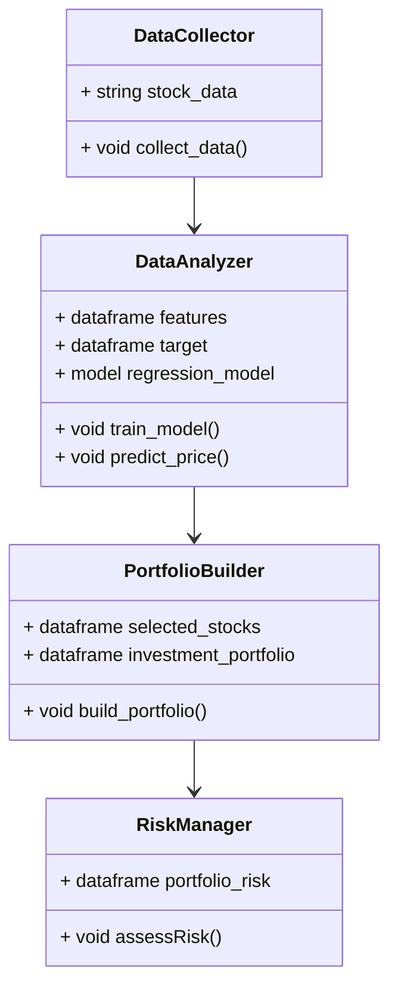
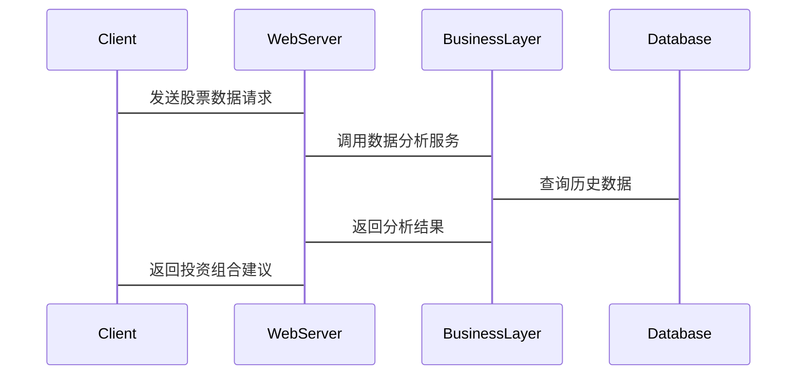

                 


```markdown
# 如何利用特价股票策略构建长期数字主权与隐私保护对冲组合

> 关键词：特价股票策略，数字主权，隐私保护，对冲组合，投资策略，风险管理，技术实现

> 摘要：本文探讨如何利用特价股票策略构建长期数字主权与隐私保护对冲组合，分析特价股票策略的核心原理，数字主权与隐私保护的实现路径，以及如何在投资组合中实现对冲，保护投资者的数字主权和隐私。本文通过详细分析，提出了一种基于数学模型和算法实现的对冲策略，并通过实际案例展示了如何在投资中实现长期数字主权与隐私保护。

---

## 第一章: 特价股票策略的背景与意义

### 1.1 特价股票策略的定义与特点
#### 1.1.1 特价股票的定义
特价股票是指在特定市场条件下，价格低于其内在价值的股票。这些股票通常被市场低估，具有较大的上涨潜力。

#### 1.1.2 特价股票策略的核心特点
- **价值发现**：通过分析公司基本面，识别被市场低估的股票。
- **低风险高回报**：相对于高风险资产，特价股票策略具有较高的风险调整后回报。
- **长期投资**：注重长期持有的投资策略，避免短期市场波动的影响。

#### 1.1.3 特价股票策略在投资中的作用
- **资产配置**：通过特价股票策略，投资者可以优化资产配置，降低整体投资组合的风险。
- **风险对冲**：利用特价股票的低相关性，构建对冲组合，降低市场风险。
- **长期收益**：通过长期持有优质特价股票，实现资本增值。

### 1.2 数字主权与隐私保护的背景
#### 1.2.1 数字主权的定义
数字主权是指国家或个人对其数字资产和数据的自主控制权，包括数据的生成、存储、传输和使用。

#### 1.2.2 隐私保护的重要性
随着数字化的普及，个人和企业的数据被广泛收集和使用，隐私保护成为维护个人权益的重要手段。

#### 1.2.3 数字主权与隐私保护的关联
数字主权的核心是数据的自主控制，而隐私保护是数字主权的重要组成部分。只有确保数据的隐私性，才能真正实现数字主权。

### 1.3 特价股票策略与数字主权的结合
#### 1.3.1 特价股票策略在数字主权中的应用
通过特价股票策略，投资者可以在数字资产领域实现价值发现，同时维护自身的数字主权。

#### 1.3.2 隐私保护在投资中的必要性
在投资过程中，投资者的交易数据和持仓信息需要得到有效保护，以防止信息泄露和滥用。

#### 1.3.3 特价股票策略如何实现长期对冲
通过对冲组合的构建，投资者可以利用特价股票策略降低市场风险，同时实现长期的资本增值。

---

## 第二章: 特价股票策略的核心原理

### 2.1 市场微观结构分析
#### 2.1.1 市场参与者分析
- **机构投资者**：大型基金、保险公司等，对市场有较大影响。
- **散户投资者**：个人投资者，交易行为较为分散。
- **做市商**：提供买卖报价，维持市场流动性。

#### 2.1.2 市场流动性与价格波动
市场流动性影响股票的价格波动，流动性越高，价格波动越小。

#### 2.1.3 套利机会的识别
通过分析市场中的价格差异，识别套利机会，利用价差获利。

### 2.2 特价股票策略的数学模型
#### 2.2.1 风险收益平衡模型
$$ E[r_i] = \alpha_i + \beta_i E[r_m] + \epsilon_i $$
其中，\( E[r_i] \) 是股票 i 的预期收益，\( \alpha_i \) 是特异风险，\( \beta_i \) 是股票的系统性风险系数，\( E[r_m] \) 是市场预期收益，\( \epsilon_i \) 是误差项。

#### 2.2.2 投资组合优化的数学公式
$$ \min_{w} w^T \Sigma w $$
$$ \text{subject to } w^T \mu = \text{target return} $$

#### 2.2.3 特价股票策略的数学推导
通过数学推导，证明特价股票策略在长期中的预期收益高于市场平均水平，同时具有较低的波动性。

### 2.3 数据驱动的特价股票分析
#### 2.3.1 大数据分析在特价股票中的应用
利用大数据分析技术，筛选出具有长期增值潜力的特价股票。

#### 2.3.2 机器学习在特价股票预测中的作用
使用机器学习算法，预测股票价格的变化趋势，识别潜在的特价股票。

#### 2.3.3 数据隐私保护的技术挑战
在数据驱动的分析中，如何保护投资者的隐私，防止数据泄露。

---

## 第三章: 数字主权与隐私保护的实现路径

### 3.1 数字主权的实现技术
#### 3.1.1 分布式账本技术
使用区块链等分布式账本技术，确保数据的安全性和不可篡改性。

#### 3.1.2 零知识证明在隐私保护中的应用
通过零知识证明技术，实现数据的隐私保护，同时验证数据的有效性。

#### 3.1.3 数据加密与匿名化处理
采用加密算法和匿名化处理技术，保护投资者的交易数据和持仓信息。

### 3.2 隐私保护的法律与技术框架
#### 3.2.1 数据隐私保护的法律框架
介绍相关法律法规，如《通用数据保护条例》（GDPR）等，确保数据处理的合法性。

#### 3.2.2 隐私技术的对比分析
对比分析不同隐私保护技术的优缺点，选择最适合的投资策略。

#### 3.2.3 隐私保护的实现方案
提出具体的隐私保护实现方案，包括数据加密、匿名化处理等技术手段。

### 3.3 隐私保护在投资中的应用
#### 3.3.1 隐私保护在投资决策中的作用
通过隐私保护技术，确保投资决策的独立性和安全性。

#### 3.3.2 隐私保护对投资组合的影响
分析隐私保护对投资组合的影响，包括风险、收益等方面。

#### 3.3.3 隐私保护的未来发展趋势
探讨隐私保护技术的未来发展趋势，以及对投资策略的影响。

---

## 第四章: 特价股票策略的算法实现

### 4.1 特价股票策略的算法原理
#### 4.1.1 算法的核心逻辑
- 数据收集：收集股票的基本面数据和市场数据。
- 数据分析：通过大数据分析和机器学习算法，筛选出具有长期增值潜力的特价股票。
- 投资决策：基于分析结果，制定投资策略，构建对冲组合。

#### 4.1.2 算法的输入与输出
- **输入**：股票的基本面数据、市场数据、交易数据。
- **输出**：筛选出的特价股票列表、投资组合建议、风险收益分析报告。

#### 4.1.3 算法的实现步骤
1. 数据清洗：对收集的数据进行预处理，去除异常值和缺失值。
2. 特征提取：提取影响股票价格的关键特征，如市盈率、市净率、股息率等。
3. 模型训练：使用机器学习算法，训练股票价格预测模型。
4. 特价股票筛选：基于模型预测结果，筛选出具有长期增值潜力的特价股票。
5. 投资组合构建：根据筛选结果，构建风险收益平衡的投资组合。

### 4.2 特价股票策略的数学模型
#### 4.2.1 风险收益平衡模型
$$ E[r_i] = \alpha_i + \beta_i E[r_m] + \epsilon_i $$

#### 4.2.2 投资组合优化的数学公式
$$ \min_{w} w^T \Sigma w $$
$$ \text{subject to } w^T \mu = \text{target return} $$

#### 4.2.3 算法的实现代码
```python
import pandas as pd
import numpy as np
from sklearn.linear_model import LinearRegression

# 数据预处理
data = pd.read_csv('stock_data.csv')
data_cleaned = data.dropna()

# 特征提取
features = data_cleaned[['PE', 'PB', 'Dividend_Yield']]
target = data_cleaned['Price']

# 模型训练
model = LinearRegression()
model.fit(features, target)

# 特价股票筛选
predicted_prices = model.predict(features)
selected_stocks = features[(predicted_prices < target).values]
```

---

## 第五章: 系统分析与架构设计

### 5.1 系统功能设计
#### 5.1.1 系统功能模块
- 数据采集模块：采集股票的基本面数据和市场数据。
- 数据分析模块：对数据进行清洗、特征提取和建模分析。
- 投资组合构建模块：基于分析结果，构建投资组合。
- 风险管理模块：对投资组合进行风险评估和管理。

#### 5.1.2 系统功能设计的类图


### 5.2 系统架构设计
#### 5.2.1 系统架构图


#### 5.2.2 系统接口设计
- **数据采集接口**：从外部数据源获取股票数据。
- **数据分析接口**：对数据进行清洗、特征提取和建模。
- **投资组合构建接口**：基于分析结果，构建投资组合。
- **风险管理接口**：对投资组合进行风险评估和管理。

#### 5.2.3 系统交互流程


---

## 第六章: 项目实战与案例分析

### 6.1 项目环境安装
#### 6.1.1 安装Python环境
- 安装Python 3.8及以上版本。
- 安装必要的Python库，如pandas、numpy、scikit-learn等。

#### 6.1.2 数据获取与预处理
- 使用API获取股票数据。
- 数据清洗和特征提取。

### 6.2 系统核心实现
#### 6.2.1 数据分析模块实现
```python
import pandas as pd
import numpy as np
from sklearn.linear_model import LinearRegression

# 数据预处理
data = pd.read_csv('stock_data.csv')
data_cleaned = data.dropna()

# 特征提取
features = data_cleaned[['PE', 'PB', 'Dividend_Yield']]
target = data_cleaned['Price']

# 模型训练
model = LinearRegression()
model.fit(features, target)

# 特价股票筛选
predicted_prices = model.predict(features)
selected_stocks = features[(predicted_prices < target).values]
```

#### 6.2.2 投资组合构建模块实现
```python
import pandas as pd
import numpy as np
from sklearn.linear_model import LinearRegression

# 数据预处理
data = pd.read_csv('stock_data.csv')
data_cleaned = data.dropna()

# 特征提取
features = data_cleaned[['PE', 'PB', 'Dividend_Yield']]
target = data_cleaned['Price']

# 模型训练
model = LinearRegression()
model.fit(features, target)

# 特价股票筛选
predicted_prices = model.predict(features)
selected_stocks = features[(predicted_prices < target).values]

# 投资组合构建
portfolio = selected_stocks.head(10)
portfolio.to_csv('investment_portfolio.csv', index=False)
```

### 6.3 实际案例分析
#### 6.3.1 案例背景
- 选取一定时间段内的股票数据，进行分析和建模。

#### 6.3.2 案例分析
- 使用上述代码，筛选出具有长期增值潜力的特价股票。
- 构建投资组合，进行风险收益分析。

#### 6.3.3 案例总结
- 总结投资策略的有效性，分析对冲组合的表现。

---

## 第七章: 最佳实践、小结与展望

### 7.1 最佳实践
- **数据隐私保护**：在数据处理过程中，确保投资者的隐私不被泄露。
- **模型优化**：定期更新模型，确保其预测能力。
- **风险管理**：建立完善的风险管理体系，降低投资风险。

### 7.2 小结
通过本文的分析，我们可以看到，利用特价股票策略构建长期数字主权与隐私保护对冲组合，是一种有效的投资策略。通过数学模型和算法实现，投资者可以在维护数字主权和隐私的前提下，实现长期的资本增值。

### 7.3 注意事项
- **数据来源**：确保数据来源的可靠性和合法性。
- **模型维护**：定期维护和更新模型，确保其准确性。
- **法律合规**：遵守相关法律法规，确保投资行为的合法性。

### 7.4 拓展阅读
- 推荐阅读《投资学基础》、《区块链技术与应用》等书籍，深入了解相关知识。

---

## 作者信息

作者：AI天才研究院/AI Genius Institute & 禅与计算机程序设计艺术 /Zen And The Art of Computer Programming
```

