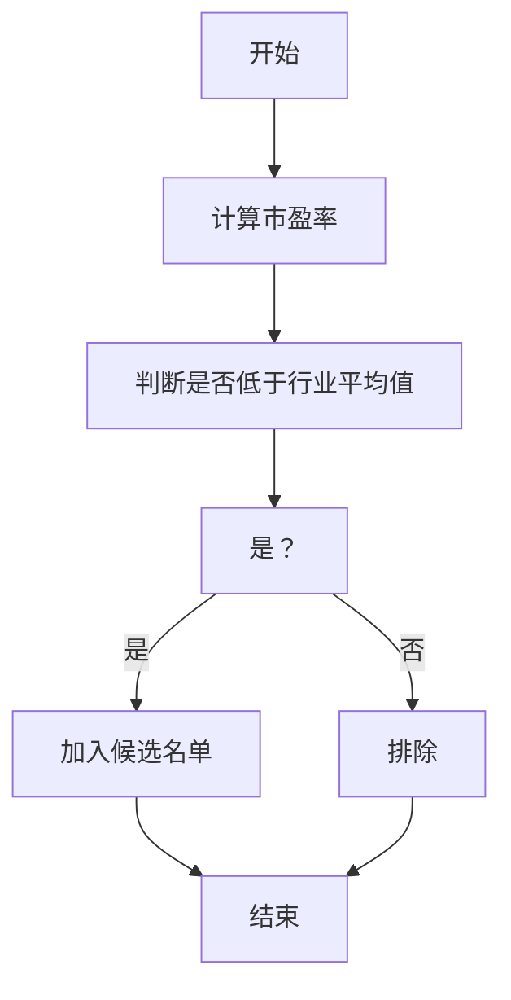
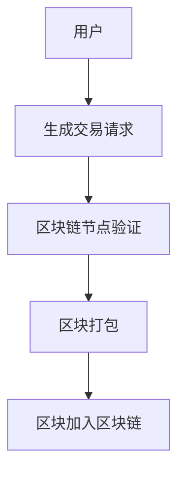
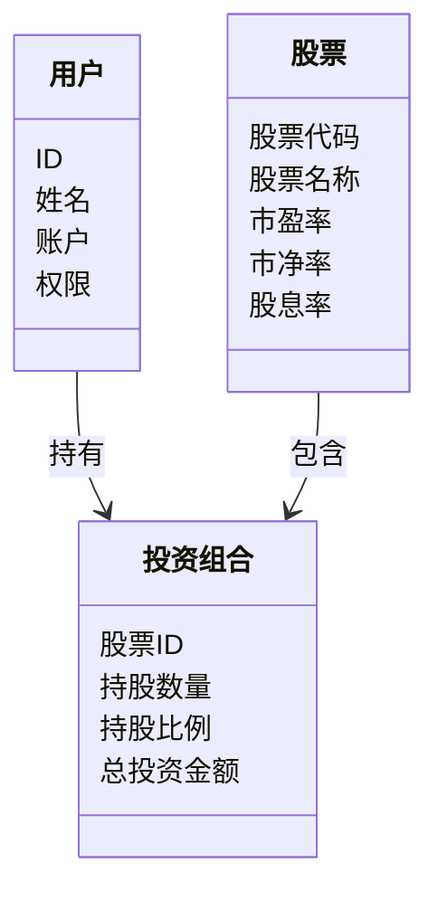
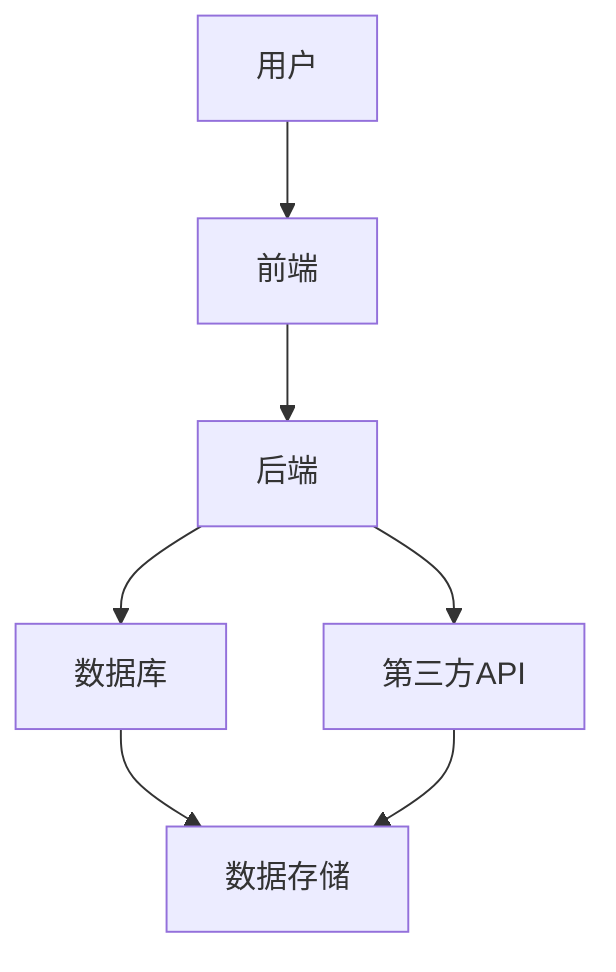
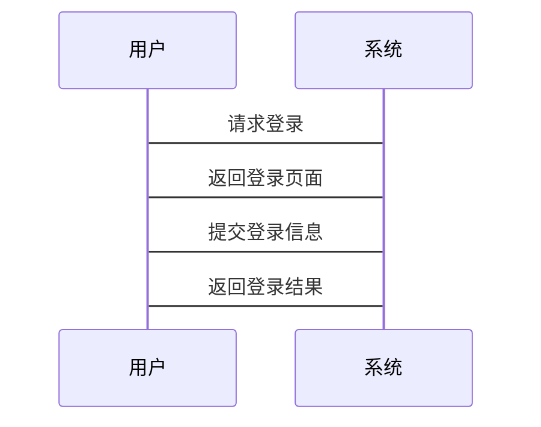

                 


# 如何利用特价股票策略构建长期数字主权与隐私保护投资组合

> 关键词：特价股票策略、数字主权、隐私保护、投资组合、风险管理

> 摘要：本文将详细探讨如何利用特价股票策略构建长期数字主权与隐私保护投资组合。通过分析特价股票策略的核心原理、数字主权与隐私保护的重要性，结合实际案例和系统设计，为投资者提供一套既能实现财富增值，又能保障数字主权与隐私安全的投资方案。

---

## 第一部分: 特价股票策略与数字主权概述

### 第1章: 特价股票策略的背景与数字主权的重要性

#### 1.1 特价股票策略的背景

##### 1.1.1 什么是特价股票策略
特价股票策略是一种基于市场周期和股票估值的投资策略，旨在在市场低估时买入优质股票，以获得长期超额收益。该策略的核心在于识别被市场忽视的低估股票，并在合适时机买入，长期持有，待其价值回归时卖出。

##### 1.1.2 特价股票策略的核心目标
- 发掘市场低估的股票
- 通过长期持有实现价值回归
- 降低投资成本，提高收益

##### 1.1.3 特价股票策略与传统投资策略的区别
| 特点 | 特价股票策略 | 传统投资策略 |
|------|--------------|---------------|
| 投资逻辑 | 估值驱动 | 趋势驱动 |
| 持股周期 | 长期持有 | 短期交易 |
| 风险控制 | 严格筛选标的 | 依赖市场预测 |

##### 1.1.4 特价股票策略的边界与外延
- **边界**：仅适用于市场低估阶段，需严格筛选标的。
- **外延**：可与其他投资策略结合，如股息投资、成长投资等。

#### 1.2 数字主权与隐私保护的背景

##### 1.2.1 数字主权的定义与内涵
数字主权指一个国家或个人对其数字资产、数据和网络的独立控制权。在数字时代，数字主权是保障国家安全和个人隐私的关键。

##### 1.2.2 隐私保护在数字时代的必要性
随着数字化进程加速，个人数据被广泛收集和利用，隐私泄露风险急剧上升。隐私保护不仅是道德要求，更是法律义务。

##### 1.2.3 数字主权与隐私保护的关联性
- 数字主权为隐私保护提供框架支持。
- 隐私保护是数字主权实现的基础。

#### 1.3 特价股票策略与数字主权的关系

##### 1.3.1 特价股票策略如何影响数字主权
- 通过长期投资，增强对优质企业的控制权。
- 优质企业往往在数字技术领域具有优势，间接支持数字主权。

##### 1.3.2 隐私保护在股票投资中的重要性
- 隐私泄露可能引发投资风险。
- 数据安全是企业竞争力的重要组成部分。

##### 1.3.3 特价股票策略如何构建长期投资组合
- 优先选择在数据安全和隐私保护方面有优势的企业。
- 长期持有，分享企业成长收益。

#### 1.4 本章小结
本章介绍了特价股票策略的基本概念、核心目标及其与传统投资策略的区别，同时分析了数字主权与隐私保护的内涵及其重要性，最后探讨了两者之间的关系。

---

## 第二部分: 特价股票策略的核心概念与原理

### 第2章: 特价股票策略的核心概念

#### 2.1 特价股票策略的核心要素

##### 2.1.1 特价股票的定义与筛选标准
- **定义**：市场价格低于内在价值的股票。
- **筛选标准**：
  - 市盈率（P/E）低于行业平均水平。
  - 市净率（P/B）低于行业平均水平。
  - 股息率（Dividend Yield）高于行业平均水平。

##### 2.1.2 市场周期与特价股票的关联
| 市场周期阶段 | 特价股票策略的应用 |
|--------------|---------------------|
| 牛市 | 谨慎，减少买入 |
| 熊市 | 买入机会 |
| 震荡市 | 伺机而动 |

##### 2.1.3 风险控制在特价股票策略中的作用
- 设置止损点，避免重大损失。
- 分批买入，分散风险。
- 长期持有，避免短期波动影响。

#### 2.2 数字主权与隐私保护的实现路径

##### 2.2.1 数字主权的实现方式
- **数据主权**：确保数据存储和处理的自主权。
- **网络安全**：通过加密技术保障数据传输安全。
- **区块链技术**：用于确权和追踪，增强数字主权。

##### 2.2.2 隐私保护的技术手段
- **加密技术**：如AES、RSA等。
- **匿名化处理**：通过数据脱敏技术保护隐私。
- **零知识证明**：在不泄露数据的前提下验证信息真实性。

##### 2.2.3 数字主权与隐私保护的平衡点
- 在保障隐私的同时，确保数据的可用性和完整性。
- 避免过度保护，影响数据的流通和利用。

#### 2.3 特价股票策略与数字主权的结合

##### 2.3.1 特价股票策略如何支持数字主权
- 通过投资具有强大数据安全能力的企业，间接支持数字主权。
- 长期持有优质企业，增强对关键领域的控制力。

##### 2.3.2 隐私保护在股票投资中的重要性
- 保护投资者的个人隐私，避免信息泄露。
- 企业数据安全能力是投资的重要考量因素。

##### 2.3.3 特价股票策略在数字主权中的应用案例
- 投资于数据加密技术领先的企业。
- 选择在网络安全领域具有优势的企业。

#### 2.4 本章小结
本章详细阐述了特价股票策略的核心要素，分析了数字主权与隐私保护的实现路径，并探讨了两者结合的具体方式。

---

## 第三部分: 特价股票策略的算法原理与数学模型

### 第3章: 特价股票策略的算法原理

#### 3.1 特价股票筛选算法

##### 3.1.1 基于市盈率的筛选算法


##### 3.1.2 基于市净率的筛选算法


##### 3.1.3 基于股息率的筛选算法


#### 3.2 数字主权与隐私保护的算法实现

##### 3.2.1 隐私保护的加密算法
```python
import hashlib

def sha256_hash(string):
    return hashlib.sha256(string.encode()).hexdigest()

# 示例
print(sha256_hash("test"))  # 输出：9f86d081884c7d659a2feaa0c55ad0169e04b4df582c47ae5fb43bcd7b366b9682a386b775688a4fcf
```

##### 3.2.2 数字主权的区块链实现


##### 3.2.3 算法的可扩展性与性能优化
- 分布式计算：提高处理效率。
- 并行处理：优化算法性能。

#### 3.3 特价股票策略的数学模型

##### 3.3.1 市盈率计算公式
$$
\text{市盈率} = \frac{\text{股价}}{\text{每股收益}}
$$

##### 3.3.2 市净率计算公式
$$
\text{市净率} = \frac{\text{股价}}{\text{每股净资产}}
$$

##### 3.3.3 股息率计算公式
$$
\text{股息率} = \frac{\text{每股股息}}{\text{股价}}
$$

---

## 第四部分: 系统分析与架构设计方案

### 第4章: 系统分析与架构设计

#### 4.1 项目介绍
本项目旨在构建一个基于特价股票策略的投资管理系统，同时确保数字主权与隐私保护。

#### 4.2 系统功能设计

##### 4.2.1 领域模型


#### 4.3 系统架构设计

##### 4.3.1 系统架构图


#### 4.4 系统接口设计

##### 4.4.1 API接口
- `/api/stock/price`：获取股票价格
- `/api/stock/valuation`：获取股票估值
- `/api/portfolio`：获取投资组合

#### 4.5 系统交互流程

##### 4.5.1 用户登录流程


---

## 第五部分: 项目实战

### 第5章: 项目实战

#### 5.1 环境安装

##### 5.1.1 安装Python
```bash
# 安装Python
sudo apt-get install python3
```

##### 5.1.2 安装依赖库
```bash
pip install pandas numpy matplotlib
```

#### 5.2 核心代码实现

##### 5.2.1 数据获取
```python
import pandas as pd

# 从Yahoo Finance获取数据
data = pd.read_csv('https://query1.finance.yahoo.com/ws/)
```

##### 5.2.2 策略实现
```python
import pandas as pd
import numpy as np

def select_cheap_stocks(data):
    # 计算市盈率
    data['PE'] = data['股价'] / data['每股收益']
    # 筛选市盈率低于行业平均值的股票
    industry_avg = data['PE'].mean()
    cheap_stocks = data[data['PE'] < industry_avg]
    return cheap_stocks

# 示例
data = pd.DataFrame({
    '股价': [10, 20, 30],
    '每股收益': [1, 2, 3]
})
result = select_cheap_stocks(data)
print(result)
```

#### 5.3 案例分析

##### 5.3.1 案例背景
假设我们有以下股票数据：

| 股票代码 | 股价 | 每股收益 | 市盈率 | 市净率 | 股息率 |
|----------|------|----------|--------|--------|--------|
| A        | 10   | 2        | 5      | 2      | 5%     |
| B        | 20   | 5        | 4      | 3      | 3%     |
| C        | 30   | 3        | 10     | 4      | 2%     |

##### 5.3.2 筛选过程
- 计算市盈率平均值：6
- 筛选市盈率低于6的股票：股票A和B。

##### 5.3.3 投资组合构建
- 购买股票A和B，分别投入50%的资金。
- 长期持有，待其价值回归。

---

## 第六部分: 总结与展望

### 第6章: 总结与展望

#### 6.1 最佳实践

##### 6.1.1 投资策略建议
- 选择具有强大数据安全能力的企业。
- 长期持有，避免短期波动。

##### 6.1.2 风险管理
- 设置止损点。
- 分批买入，分散风险。

#### 6.2 本章小结
本文详细探讨了如何利用特价股票策略构建长期数字主权与隐私保护投资组合，通过理论分析、系统设计和实战案例，为投资者提供了一套既能实现财富增值，又能保障数字主权与隐私安全的投资方案。

#### 6.3 注意事项
- 投资有风险，需谨慎操作。
- 隐私保护需长期重视。

#### 6.4 拓展阅读
- 《数字主权与网络安全》
- 《股票投资策略与风险管理》

---

## 作者：AI天才研究院/AI Genius Institute & 禅与计算机程序设计艺术 /Zen And The Art of Computer Programming

